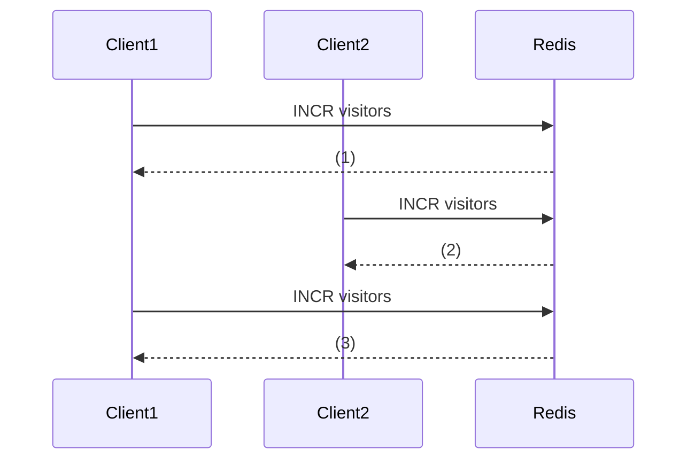

# Redis Counters

## Introduction

Counters are one of the simplest yet most powerful patterns you can implement with Redis. A counter is essentially a numeric value that can be incremented or decremented, allowing you to track various metrics in your application. Redis makes implementing counters incredibly easy with its atomic increment operations, making them perfect for high-concurrency environments.

In this guide, we'll explore how to use Redis counters effectively, common patterns, and real-world applications that can benefit from this simple but powerful concept.

## Basic Counter Operations

Redis provides several commands for working with counters:

- `INCR` - Increment a key by 1
- `DECR` - Decrement a key by 1
- `INCRBY` - Increment a key by a specified amount
- `DECRBY` - Decrement a key by a specified amount
- `INCRBYFLOAT` - Increment a key by a floating-point value

Let's start with some basic examples.

### Simple Increment and Decrement

```javascript
// Initialize a counter (Redis will create it if it doesn't exist)
> SET page_views 0
"OK"

// Increment the counter
> INCR page_views
(integer) 1

// Increment again
> INCR page_views
(integer) 2

// Decrement the counter
> DECR page_views
(integer) 1
```

### Incrementing by a Specific Amount

```javascript
// Increment by 10
> INCRBY page_views 10
(integer) 11

// Decrement by 5
> DECRBY page_views 5
(integer) 6

// Increment by a floating-point value
> INCRBYFLOAT temperature 1.5
"8.0"
```

## Atomicity of Redis Counters

One of the key benefits of Redis counters is their atomicity. Redis guarantees that increment and decrement operations are atomic, meaning they will be completed entirely without interference from other clients.

This is especially important in high-concurrency environments where multiple clients might be trying to update the same counter simultaneously.



Without atomicity, race conditions could occur:

1. Client A reads the value of a counter (let's say it's 10)
2. Client B reads the same value (10)
3. Client A increments it locally and sets it back to 11
4. Client B increments it locally and sets it back to 11 (also)
5. The counter should be 12, but it's only 11!

Redis's atomic operations prevent this scenario by handling the read-modify-write cycle as a single operation that cannot be interrupted.

## Common Counter Patterns

### Page View Tracking

One of the most common uses for Redis counters is tracking page views:

```javascript
// Increment view count for a specific page
> INCR "page_views:homepage"
(integer) 1

// Increment view count for a specific article
> INCR "page_views:article:12345"
(integer) 1
```

### User Activity Tracking

You can track user actions in your application:

```javascript
// Track number of posts by a user
> INCR "user:1000:post_count"
(integer) 1

// Track number of comments
> INCR "user:1000:comment_count"
(integer) 1
```

### Rate Limiting

Counters are perfect for implementing rate limiting:

```javascript
// Track API requests from a user in the last minute
> INCR "rate_limit:user:1000:minute"
(integer) 1

// Set expiration for this counter (auto-reset after 60 seconds)
> EXPIRE "rate_limit:user:1000:minute" 60
(integer) 1
```

## Advanced Counter Techniques

### Counters with Expiration

Setting an expiration on counters is useful for time-based metrics:

```javascript
// Increment daily login counter
> INCR "logins:daily:2023-03-01"
(integer) 1

// Set expiration for 24 hours
> EXPIRE "logins:daily:2023-03-01" 86400
(integer) 1
```

### Atomic Get and Set

Sometimes you need to get the current value while incrementing:

```javascript
// Increment and get the new value in one operation
> INCR "visitor_count"
(integer) 42
```

The returned value is the new value after incrementing.

### Using HyperLogLog for Unique Counters

For counting unique items (like unique visitors), you might want to use Redis HyperLogLog:

```javascript
// Add user to unique visitor count
> PFADD "unique_visitors:2023-03-01" "user:1000"
(integer) 1

// Get the count of unique visitors
> PFCOUNT "unique_visitors:2023-03-01"
(integer) 1
```

## Real-World Applications

### Social Media Metrics

```javascript
// Increment like count on a post
> INCR "post:12345:likes"
(integer) 1

// Increment share count
> INCR "post:12345:shares"
(integer) 1

// Increment comment count
> INCR "post:12345:comments"
(integer) 1
```

### E-commerce Inventory Management

```javascript
// Decrement inventory count when an item is purchased
> DECRBY "inventory:product:54321" 1
(integer) 42

// Check if inventory is below threshold
> GET "inventory:product:54321"
"42"
```

### Leaderboard Implementation

```javascript
// Increment user score
> INCRBY "user:1000:score" 50
(integer) 150

// You can then use ZSET to maintain a sorted leaderboard
> ZADD leaderboard 150 "user:1000"
(integer) 1
```

### API Request Quota Management

```javascript
// Increment user API request count
> INCR "api:user:1000:requests:daily"
(integer) 101

// Check if user has exceeded their daily quota
> GET "api:user:1000:requests:daily"
"101"

// Set expiration to reset at midnight
> EXPIRE "api:user:1000:requests:daily" 43200
(integer) 1
```

## Implementing a Visit Counter for Your Website

Let's create a simple but complete example of implementing a visit counter for your website using Node.js and Redis:

```javascript
const redis = require('redis');
const express = require('express');

const app = express();
const client = redis.createClient();

// Middleware to count visits
app.use(async (req, res, next) => {
  const page = req.path;
  const counterKey = `pageviews:${page}`;
  
  try {
    // Increment the counter
    const count = await client.incr(counterKey);
    
    // Add the count to the request object so we can use it in our route
    req.viewCount = count;
    next();
  } catch (err) {
    console.error('Redis error:', err);
    next();
  }
});

app.get('/', (req, res) => {
  res.send(`Welcome to our homepage! This page has been viewed ${req.viewCount} times.`);
});

app.get('/about', (req, res) => {
  res.send(`About us page. This page has been viewed ${req.viewCount} times.`);
});

app.listen(3000, () => {
  console.log('Server running on port 3000');
});
```

## Best Practices for Redis Counters

1. **Use Descriptive Key Names**: Follow a consistent naming convention (e.g., `object:id:action`).

2. **Set Expiration Times**: For time-based counters, always set an expiration time to avoid accumulating stale data.

3. **Consider Namespace Prefixes**: Use prefixes like `counter:` to easily identify counter keys.

4. **Batch Operations**: For updating multiple counters at once, consider using Redis transactions or pipelining.

5. **Handle Overflows**: Redis can handle 64-bit signed integers, but plan for counter overflow in long-running applications.

6. **Monitor Memory Usage**: Counters are lightweight, but millions of them can add up.

## Summary

Redis counters provide a simple but powerful way to track numeric values in your applications. They're atomic, fast, and versatile, making them perfect for everything from simple page view tracking to complex rate limiting and quota systems.

Key takeaways:

- Redis counters are atomic, preventing race conditions in high-concurrency environments
- Basic operations include `INCR`, `DECR`, `INCRBY`, `DECRBY`, and `INCRBYFLOAT`
- Counters can be combined with expiration times for time-based metrics
- Common use cases include page view tracking, rate limiting, and inventory management
- Proper key naming and memory management are important for scalable counter implementations

## Exercises

1. Implement a simple rate limiter that allows 10 requests per minute per user.
2. Create a daily, weekly, and monthly page view tracking system.
3. Build a simple inventory management system that decrements stock and sends alerts when inventory is low.
4. Implement a leaderboard that tracks and ranks user activity scores.

## Additional Resources

- [Redis Documentation on INCR](https://redis.io/commands/incr)
- [Redis Rate Limiting Patterns](https://redis.com/redis-best-practices/basic-rate-limiting/)
- [Redis in Action](https://redislabs.com/redis-in-action/) (Book) - Has excellent chapters on counters and rate limiting