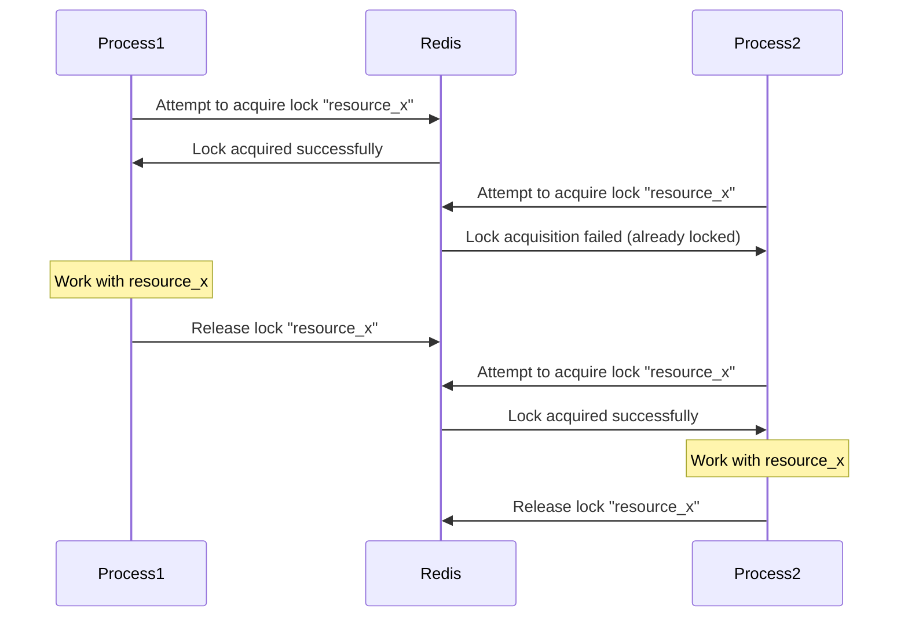

# Redis Distributed Locks

## Introduction

In distributed systems, multiple processes or services often need to access and modify shared resources. Without proper coordination, this can lead to race conditions, data corruption, and inconsistent application states. **Distributed locks** solve this problem by allowing only one process to access a resource at a time.

Redis, with its speed and atomic operations, provides an excellent foundation for implementing distributed locks. In this guide, we'll explore how to create, use, and manage distributed locks in Redis - a fundamental pattern for building reliable distributed applications.

## What is a Distributed Lock?

A distributed lock is a synchronization mechanism that allows only one process in a distributed system to access a shared resource at any given time. Unlike local locks (e.g., mutexes in a single application), distributed locks work across different machines, services, or processes.

Here's a simple visualization of how distributed locks work:



## Basic Redis Distributed Lock

Let's implement a basic distributed lock using Redis commands.

### Acquiring a Lock

To acquire a lock in Redis, we use the `SET` command with the `NX` and `EX` options:

```javascript
// Pseudocode for acquiring a lock
function acquireLock(lockName, lockTimeout) {
  // SET key value NX EX seconds
  // NX: Only set if key doesn't exist
  // EX: Set expiration time in seconds
  return redis.set(lockName, uniqueIdentifier, "NX", "EX", lockTimeout);
}
```

The `uniqueIdentifier` is important - it helps ensure that a process only releases locks it has acquired.

### Releasing a Lock

To release a lock, we need to make sure we only delete the key if we own the lock:

```javascript
// Pseudocode for releasing a lock
function releaseLock(lockName, uniqueIdentifier) {
  // Lua script to ensure atomic operation
  const script = `
    if redis.call("get", KEYS[1]) == ARGV[1] then
      return redis.call("del", KEYS[1])
    else
      return 0
    end
  `;
  
  return redis.eval(script, 1, lockName, uniqueIdentifier);
}
```

Using a Lua script ensures that checking the lock value and deleting it happens atomically.

## Complete Implementation with Node.js

Here's a more complete implementation using Node.js and the `ioredis` library:

```javascript
const Redis = require('ioredis');
const { v4: uuidv4 } = require('uuid');

class RedisLock {
  constructor(options = {}) {
    this.redis = new Redis(options.redisOptions);
    this.lockTimeout = options.lockTimeout || 30; // 30 seconds default
    this.retryDelay = options.retryDelay || 200; // 200ms
    this.retryCount = options.retryCount || 10;
  }

  async acquire(resource) {
    const lockName = `lock:${resource}`;
    const identifier = uuidv4();
    
    let retries = 0;
    
    while (retries < this.retryCount) {
      const acquired = await this.redis.set(
        lockName,
        identifier,
        'NX',
        'EX',
        this.lockTimeout
      );
      
      if (acquired) {
        // Lock acquired successfully
        return {
          success: true,
          identifier
        };
      }
      
      // Wait before retrying
      await new Promise(resolve => setTimeout(resolve, this.retryDelay));
      retries++;
    }
    
    return { success: false };
  }

  async release(resource, identifier) {
    const lockName = `lock:${resource}`;
    
    // Use Lua script for atomic operation
    const script = `
      if redis.call("get", KEYS[1]) == ARGV[1] then
        return redis.call("del", KEYS[1])
      else
        return 0
      end
    `;
    
    const result = await this.redis.eval(script, 1, lockName, identifier);
    return result === 1; // 1 if the lock was released, 0 otherwise
  }
}

module.exports = RedisLock;
```

### Usage Example

Here's how you might use this lock implementation:

```javascript
const RedisLock = require('./redis-lock');

async function processOrder(orderId) {
  const lock = new RedisLock();
  
  // Try to acquire the lock
  const { success, identifier } = await lock.acquire(`order:${orderId}`);
  
  if (!success) {
    console.log(`Could not acquire lock for order ${orderId}`);
    return;
  }
  
  try {
    // Perform operations on the resource
    console.log(`Processing order ${orderId}...`);
    // Process the order...
    await simulateWork(2000); // Simulating work that takes 2 seconds
    console.log(`Order ${orderId} processed successfully`);
  } finally {
    // Always release the lock when done
    await lock.release(`order:${orderId}`, identifier);
    console.log(`Released lock for order ${orderId}`);
  }
}

function simulateWork(ms) {
  return new Promise(resolve => setTimeout(resolve, ms));
}

// Simulate multiple processes trying to process the same order
processOrder('12345');
processOrder('12345');
```

Output:
```
Processing order 12345...
Could not acquire lock for order 12345
Order 12345 processed successfully
Released lock for order 12345
```

## Advanced Patterns

### Lock with Auto-extension (Heartbeat)

One limitation of the basic implementation is that if your operation takes longer than the lock timeout, the lock can expire while you're still working. To solve this, we can implement a "heartbeat" that periodically extends the lock:

```javascript
async function acquireLockWithHeartbeat(resource, timeoutSeconds) {
  const lock = new RedisLock();
  const { success, identifier } = await lock.acquire(resource);
  
  if (!success) return { success: false };
  
  // Set up heartbeat to extend the lock
  const heartbeatInterval = Math.floor(timeoutSeconds * 1000 / 3); // Renew at 1/3 of the timeout
  
  const intervalId = setInterval(async () => {
    const script = `
      if redis.call("get", KEYS[1]) == ARGV[1] then
        return redis.call("expire", KEYS[1], ARGV[2])
      else
        return 0
      end
    `;
    
    await lock.redis.eval(script, 1, `lock:${resource}`, identifier, timeoutSeconds);
  }, heartbeatInterval);
  
  return {
    success: true,
    identifier,
    stop: () => clearInterval(intervalId)
  };
}
```

### Implementing a Redlock Algorithm

For critical applications, the basic Redis lock might not be sufficient if Redis fails. The Redlock algorithm, proposed by Redis creator Salvatore Sanfilippo, provides stronger guarantees by using multiple Redis instances:

```javascript
class RedLock {
  constructor(options = {}) {
    this.redisClients = options.redisClients || [
      new Redis(6379, 'redis-1'),
      new Redis(6379, 'redis-2'),
      new Redis(6379, 'redis-3')
    ];
    this.quorum = Math.floor(this.redisClients.length / 2) + 1;
    this.retryDelay = options.retryDelay || 200;
    this.retryCount = options.retryCount || 3;
    this.lockTimeout = options.lockTimeout || 30000; // 30 seconds in ms
  }

  async acquire(resource) {
    const identifier = uuidv4();
    const lockName = `lock:${resource}`;
    
    for (let attempt = 0; attempt < this.retryCount; attempt++) {
      let successCount = 0;
      const startTime = Date.now();
      
      // Try to acquire the lock on all instances
      const acquirePromises = this.redisClients.map(client => 
        client.set(lockName, identifier, 'NX', 'PX', this.lockTimeout)
          .then(result => result === 'OK' ? 1 : 0)
          .catch(() => 0)
      );
      
      const results = await Promise.all(acquirePromises);
      successCount = results.reduce((sum, result) => sum + result, 0);
      
      const validityTime = this.lockTimeout - (Date.now() - startTime);
      
      if (successCount >= this.quorum && validityTime > 0) {
        return {
          success: true,
          identifier,
          validityTime
        };
      }
      
      // Release the locks we acquired
      await this.release(resource, identifier);
      
      // Wait before retrying
      await new Promise(resolve => setTimeout(resolve, this.retryDelay));
    }
    
    return { success: false };
  }

  async release(resource, identifier) {
    const lockName = `lock:${resource}`;
    const script = `
      if redis.call("get", KEYS[1]) == ARGV[1] then
        return redis.call("del", KEYS[1])
      else
        return 0
      end
    `;
    
    const releasePromises = this.redisClients.map(client => 
      client.eval(script, 1, lockName, identifier)
        .catch(() => 0)
    );
    
    await Promise.all(releasePromises);
  }
}
```

## Real-World Applications

### Example 1: Preventing Duplicate Payment Processing

In a payment system, you might want to ensure that a payment is processed exactly once:

```javascript
async function processPayment(paymentId, amount) {
  const lock = new RedisLock();
  const { success, identifier } = await lock.acquire(`payment:${paymentId}`);
  
  if (!success) {
    console.log(`Payment ${paymentId} is already being processed`);
    return;
  }
  
  try {
    // Check if payment already exists in database
    const existingPayment = await database.findPayment(paymentId);
    
    if (existingPayment) {
      console.log(`Payment ${paymentId} was already processed`);
      return;
    }
    
    // Process the payment with external payment gateway
    await paymentGateway.charge(paymentId, amount);
    
    // Record the payment in our database
    await database.savePayment({
      id: paymentId,
      amount: amount,
      timestamp: new Date()
    });
    
    console.log(`Payment ${paymentId} processed successfully`);
  } finally {
    await lock.release(`payment:${paymentId}`, identifier);
  }
}
```

### Example 2: Distributed Cron Jobs

In a system with multiple instances, you might want only one instance to run a scheduled job:

```javascript
async function runDailyReport() {
  const lock = new RedisLock();
  const { success, identifier } = await lock.acquire('daily-report', 3600); // 1 hour lock
  
  if (!success) {
    console.log('Daily report is already running on another instance');
    return;
  }
  
  try {
    console.log('Generating daily report...');
    // Generate and send the report
    const data = await collectReportData();
    await generateReport(data);
    await emailReport();
    console.log('Daily report completed successfully');
  } catch (error) {
    console.error('Error generating report:', error);
  } finally {
    await lock.release('daily-report', identifier);
  }
}

// Set up cron to run this function daily on all instances
// Only one will actually execute the report logic
```

## Common Pitfalls and Best Practices

### 1. Always Use Timeouts

Always set a reasonable timeout on your locks. If a process crashes before releasing a lock, the timeout ensures the lock will eventually be released.

### 2. Use Unique Identifiers

Always use a unique identifier when acquiring a lock to ensure you only release locks you own.

### 3. Implement Proper Error Handling

Always have a robust error handling strategy and ensure locks are released even if operations fail:

```javascript
async function safeOperation(resource, operation) {
  const lock = new RedisLock();
  let lockAcquired = false;
  let identifier;
  
  try {
    const result = await lock.acquire(resource);
    if (!result.success) {
      console.log(`Could not acquire lock for ${resource}`);
      return;
    }
    
    lockAcquired = true;
    identifier = result.identifier;
    
    // Perform the operation
    await operation();
    
  } catch (error) {
    console.error(`Error during operation on ${resource}:`, error);
    throw error;
  } finally {
    if (lockAcquired) {
      await lock.release(resource, identifier).catch(err => {
        console.error(`Error releasing lock for ${resource}:`, err);
      });
    }
  }
}
```

### 4. Be Aware of Network Partitions

In distributed systems, network partitions can occur. The Redlock algorithm helps mitigate this, but no distributed lock system is perfect. Design your system to handle edge cases.

### 5. Consider Fencing Tokens

To protect against the case where a lock expires but the original holder doesn't know it, consider implementing fencing tokens:

```javascript
async function acquireLockWithFencing(resource) {
  // Get the current token value and increment it
  const token = await redis.incr(`fencing:${resource}`);
  
  const lockResult = await lock.acquire(resource);
  if (!lockResult.success) {
    return { success: false };
  }
  
  return {
    success: true,
    identifier: lockResult.identifier,
    fencingToken: token
  };
}
```

Then, when performing operations that modify state, include the token:

```javascript
function performUpdate(resource, data, fencingToken) {
  // The storage system checks that this token is greater than
  // the last one used for this resource
  storage.writeWithToken(resource, data, fencingToken);
}
```

## Summary

Redis distributed locks provide a powerful mechanism for coordinating access to shared resources in distributed systems. Here's what we've covered:

1. Basic implementation of Redis locks using SET with NX and EX options
2. Proper lock release using Lua scripts for atomicity
3. Advanced patterns like lock auto-extension and the Redlock algorithm
4. Real-world application examples
5. Common pitfalls and best practices

While Redis locks are relatively simple to implement, they require careful consideration of edge cases and failure scenarios. When implemented correctly, they provide a robust foundation for building reliable distributed systems.

## Additional Resources

- [Redis.io Documentation on Distributed Locks](https://redis.io/topics/distlock)
- [Redlock Algorithm](https://redis.io/topics/distlock)
- [Martin Kleppmann's Analysis of Distributed Locks](https://martin.kleppmann.com/2016/02/08/how-to-do-distributed-locking.html)

## Exercises

1. Implement a distributed counter using Redis locks to ensure accurate increments
2. Create a priority-based lock system where certain processes get priority access
3. Implement a "read-write" lock pattern where multiple readers can access a resource but only one writer
4. Extend the basic lock implementation to include deadlock detection
5. Build a distributed rate limiter using Redis locks