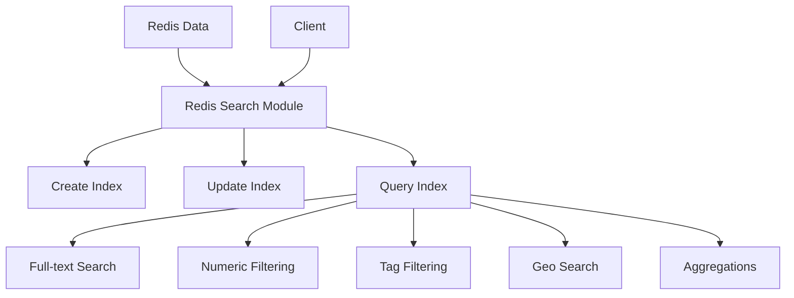

# Redis Search

## Introduction

Redis Search is a powerful module that adds advanced search capabilities to Redis, transforming it from a simple key-value store into a feature-rich search engine. It allows you to create indexes on your Redis data structures and perform complex queries including full-text search, numeric filtering, and geographic queries with incredible speed.

In this guide, you'll learn how to leverage Redis Search to build sophisticated search functionality into your applications while maintaining Redis's signature performance characteristics.

## What is Redis Search?

Redis Search extends Redis by adding:

1. **Secondary indexing** of hashes, JSON, and other Redis data types
2. **Full-text search** capabilities with support for stemming, fuzzy search, and synonyms
3. **Numeric and geo-spatial filtering**
4. **Aggregation** operations similar to SQL GROUP BY statements

Redis Search was originally developed as the RediSearch module and is now integrated directly into Redis Stack, making it easier than ever to use.

## Getting Started with Redis Search

### Prerequisites

To follow along with this tutorial, you'll need:

- Redis Stack installed (version 6.2 or higher)
- A basic understanding of Redis commands
- Redis CLI or RedisInsight GUI client

### Installing Redis Stack

The easiest way to get Redis with the Search module is to use Redis Stack:

For Docker:

```bash
docker run -p 6379:6379 redis/redis-stack
```

For local installation, refer to the [Redis Stack documentation](https://redis.io/docs/stack/).

## Creating Your First Search Index

Let's start by creating a simple index on some product data.

### 1. Adding Product Data

First, let's add some product data as Redis hashes:

```bash
HSET product:1 name "Ergonomic Chair" price 299.99 category "Furniture" description "Comfortable office chair with lumbar support"
HSET product:2 name "Mechanical Keyboard" price 149.99 category "Electronics" description "Clicky mechanical keyboard with RGB lighting"
HSET product:3 name "Wireless Mouse" price 49.99 category "Electronics" description "Ergonomic wireless mouse with long battery life"
HSET product:4 name "Standing Desk" price 499.99 category "Furniture" description "Adjustable height desk for ergonomic work"
```

### 2. Creating a Search Index

Now, let's create an index on these product hashes:

```bash
FT.CREATE idx:products ON HASH PREFIX 1 product: SCHEMA name TEXT SORTABLE price NUMERIC SORTABLE category TAG SORTABLE description TEXT
```

Let's break down this command:

- `FT.CREATE idx:products`: Creates a new index named "idx:products"
- `ON HASH`: Specifies that we're indexing Redis hash data structures
- `PREFIX 1 product:`: Tells Redis Search to index all keys with the prefix "product:"
- `SCHEMA`: Defines the fields and their types:
  - `name TEXT SORTABLE`: The name field is indexed as full-text and can be sorted
  - `price NUMERIC SORTABLE`: The price field is indexed as a number and can be sorted
  - `category TAG SORTABLE`: The category field is indexed as a tag (for exact-match queries)
  - `description TEXT`: The description field is indexed as full-text

### 3. Performing Basic Searches

Now that we have an index, let's perform some searches:

#### Full-text search:

```bash
FT.SEARCH idx:products "ergonomic"
```

Result:
```
1) (integer) 2
2) "product:1"
3) 1) "name"
   2) "Ergonomic Chair"
   3) "price"
   4) "299.99"
   5) "category"
   6) "Furniture"
   7) "description"
   8) "Comfortable office chair with lumbar support"
4) "product:3"
3) 1) "name"
   2) "Wireless Mouse"
   3) "price"
   4) "49.99"
   5) "category"
   6) "Electronics"
   7) "description"
   8) "Ergonomic wireless mouse with long battery life"
```

#### Filtering by price:

```bash
FT.SEARCH idx:products * FILTER price 0 200
```

Result:
```
1) (integer) 2
2) "product:2"
3) 1) "name"
   2) "Mechanical Keyboard"
   3) "price"
   4) "149.99"
   5) "category"
   6) "Electronics"
   7) "description"
   8) "Clicky mechanical keyboard with RGB lighting"
4) "product:3"
3) 1) "name"
   2) "Wireless Mouse"
   3) "price"
   4) "49.99"
   5) "category"
   6) "Electronics"
   7) "description"
   8) "Ergonomic wireless mouse with long battery life"
```

#### Filtering by category:

```bash
FT.SEARCH idx:products "@category:{Electronics}"
```

Result:
```
1) (integer) 2
2) "product:2"
3) 1) "name"
   2) "Mechanical Keyboard"
   3) "price"
   4) "149.99"
   5) "category"
   6) "Electronics"
   7) "description"
   8) "Clicky mechanical keyboard with RGB lighting"
4) "product:3"
3) 1) "name"
   2) "Wireless Mouse"
   3) "price"
   4) "49.99"
   5) "category"
   6) "Electronics"
   7) "description"
   8) "Ergonomic wireless mouse with long battery life"
```

#### Combining filters with full-text search:

```bash
FT.SEARCH idx:products "chair @category:{Furniture}"
```

Result:
```
1) (integer) 1
2) "product:1"
3) 1) "name"
   2) "Ergonomic Chair"
   3) "price"
   4) "299.99"
   5) "category"
   6) "Furniture"
   7) "description"
   8) "Comfortable office chair with lumbar support"
```

## Understanding Redis Search Query Syntax

Redis Search uses a powerful query syntax:

- Simple terms: `chair` finds documents containing "chair"
- Exact phrases: `"office chair"` finds the exact phrase
- Field-specific searches: `@description:ergonomic` searches only in the description field
- Numeric ranges: `@price:[100 200]` finds products with prices between 100 and 200
- Tag filters: `@category:{Electronics}` finds products in the Electronics category
- Boolean operators: `chair -expensive` finds documents with "chair" but not "expensive"
- Optional terms: `desk ~table` finds documents with "desk" and optionally "table"

## Advanced Search Features

### Fuzzy Search

Fuzzy search allows for matching similar terms:

```bash
FT.SEARCH idx:products "%keyoard%"
```

This would match "keyboard" despite the misspelling.

### Stemming

Redis Search automatically applies stemming to match different forms of the same word:

```bash
FT.SEARCH idx:products "adjustable"
```

This can match "adjustable", "adjust", "adjusted", etc.

### Aggregations

Similar to SQL's GROUP BY, you can perform aggregations:

```bash
FT.AGGREGATE idx:products "*" GROUPBY 1 @category REDUCE AVG 1 @price AS avg_price
```

Result:
```
1) (integer) 2
2) 1) "category"
   2) "Electronics"
   3) "avg_price"
   4) "99.99"
3) 1) "category"
   2) "Furniture"
   3) "avg_price"
   4) "399.99"
```

## Real-World Applications

Let's explore some practical applications of Redis Search:

### Product Catalog Search

```javascript
// Node.js example using ioredis
const Redis = require('ioredis');
const redis = new Redis();

async function searchProducts(query, filters = {}) {
  let searchQuery = query || '*';
  
  // Add filters if provided
  if (filters.minPrice && filters.maxPrice) {
    searchQuery += ` @price:[${filters.minPrice} ${filters.maxPrice}]`;
  }
  
  if (filters.category) {
    searchQuery += ` @category:{${filters.category}}`;
  }
  
  // Set sorting if provided
  const sortBy = filters.sortBy || '';
  
  // Execute search
  const results = await redis.call(
    'FT.SEARCH', 
    'idx:products', 
    searchQuery,
    filters.sortBy ? 'SORTBY' : '',
    filters.sortBy || '',
    filters.sortOrder || '',
    'LIMIT',
    filters.offset || 0,
    filters.limit || 10
  );
  
  // Process and return results
  return processSearchResults(results);
}

// Example usage
searchProducts('ergonomic', {
  minPrice: 50,
  maxPrice: 300,
  category: 'Furniture',
  sortBy: 'price',
  sortOrder: 'ASC',
  offset: 0,
  limit: 10
}).then(products => console.log(products));
```

### Autocomplete Suggestions

Redis Search includes a specialized autocomplete feature using a different data structure:

```bash
# Create an autocomplete suggestion dictionary
FT.SUGADD ac:products "Ergonomic Chair" 1.0
FT.SUGADD ac:products "Mechanical Keyboard" 1.0
FT.SUGADD ac:products "Wireless Mouse" 1.0
FT.SUGADD ac:products "Standing Desk" 1.0

# Get suggestions as you type
FT.SUGGET ac:products "mech"
```

Result:
```
1) "Mechanical Keyboard"
```

Implementation in a web application:

```javascript
// Frontend implementation with debounce
let timeout = null;

document.getElementById('search').addEventListener('input', function(e) {
  clearTimeout(timeout);
  const query = e.target.value;
  
  // Debounce to avoid too many requests
  timeout = setTimeout(() => {
    if (query.length >= 2) {
      fetch(`/api/suggestions?q=${encodeURIComponent(query)}`)
        .then(response => response.json())
        .then(suggestions => {
          // Update the suggestions dropdown
          displaySuggestions(suggestions);
        });
    }
  }, 300);
});

// Backend API endpoint
app.get('/api/suggestions', async (req, res) => {
  const query = req.query.q;
  const redis = req.app.get('redis');
  
  const suggestions = await redis.call('FT.SUGGET', 'ac:products', query, 'FUZZY', 'MAX', '5');
  
  res.json(suggestions || []);
});
```

### Activity Feed with Search

Imagine a social media application with an activity feed:

```javascript
// Creating an index for activities
/*
FT.CREATE idx:activities ON HASH PREFIX 1 activity: SCHEMA 
  user_id TAG SORTABLE 
  action TEXT 
  object_id TAG 
  timestamp NUMERIC SORTABLE 
  content TEXT WEIGHT 2.0
*/

// Adding an activity
async function addActivity(userId, action, objectId, content) {
  const timestamp = Date.now();
  const activityId = `activity:${userId}:${timestamp}`;
  
  await redis.hset(activityId, {
    user_id: userId,
    action: action,
    object_id: objectId,
    timestamp: timestamp,
    content: content
  });
  
  return activityId;
}

// Searching activities
async function searchActivities(query, filters = {}) {
  let searchQuery = query || '*';
  
  if (filters.userId) {
    searchQuery += ` @user_id:{${filters.userId}}`;
  }
  
  if (filters.fromTime && filters.toTime) {
    searchQuery += ` @timestamp:[${filters.fromTime} ${filters.toTime}]`;
  }
  
  const results = await redis.call(
    'FT.SEARCH',
    'idx:activities',
    searchQuery,
    'SORTBY',
    'timestamp',
    'DESC',
    'LIMIT',
    filters.offset || 0,
    filters.limit || 20
  );
  
  return processSearchResults(results);
}
```

## Performance Considerations

Redis Search is designed for speed, but there are some considerations:

1. **Index Size**: Indexes consume memory. Monitor memory usage as your dataset grows.
2. **Field Selection**: Only index fields you need to search.
3. **Cardinality**: High-cardinality tag fields can consume more memory.

Here's a simple diagram showing how Redis Search works:



## Monitoring Redis Search

Redis provides commands to inspect index statistics:

```bash
FT.INFO idx:products
```

This returns detailed information about your index, including:
- Number of documents indexed
- Memory usage
- Indexing performance statistics
- Field statistics

## Summary

Redis Search transforms Redis from a simple key-value store into a powerful search engine. Its capabilities include:

- Full-text search with rich query syntax
- Numeric, tag, and geo-spatial filtering
- Fast aggregations
- Support for multiple data types

By integrating search capabilities directly into your Redis database, you eliminate the need for a separate search engine, reduce architectural complexity, and maintain Redis's exceptional performance characteristics.

## Exercises

1. **Basic Search Implementation**:
   - Create an index for a collection of books with fields for title, author, genre, and publication year
   - Implement searches that combine text search with numeric filtering

2. **Autocomplete Feature**:
   - Build a complete autocomplete system for product search
   - Implement prefix-based suggestions with popularity weighting

3. **E-commerce Filters**:
   - Create a product catalog with categorical, numeric, and text-based filters
   - Implement a faceted search system showing counts for each filter option

## Additional Resources

- [Redis Stack Documentation](https://redis.io/docs/stack/)
- [Redis Search Commands Reference](https://redis.io/commands/?group=search)
- [Redis Search Query Syntax](https://redis.io/docs/stack/search/reference/query_syntax/)
- [Redis Search Aggregations](https://redis.io/docs/stack/search/reference/aggregations/)

Remember that Redis Search is constantly evolving, with regular updates adding new features and improving performance. Check the official documentation for the latest capabilities and best practices.