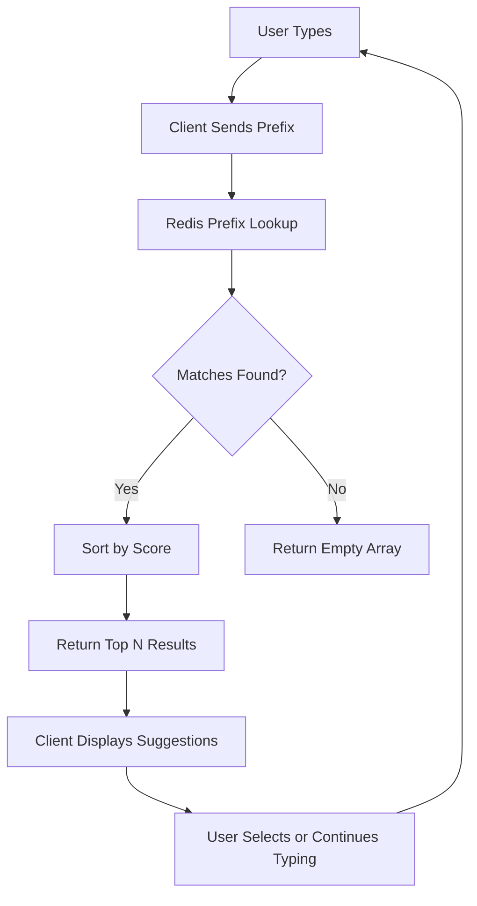

# Redis Autocomplete

## Introduction

Autocomplete is a feature that predicts and suggests words or phrases as users type, enhancing the user experience by reducing typing effort and helping users discover relevant content. Search engines, e-commerce sites, and social media platforms extensively use autocomplete to improve search efficiency and user engagement.

Redis, an in-memory data store, provides excellent data structures and commands that make implementing fast and efficient autocomplete functionality straightforward. In this guide, we'll explore how to build autocomplete systems using Redis, from basic implementations to more advanced patterns.

## Why Redis for Autocomplete?

Redis excels at autocomplete for several reasons:

- **Speed**: Redis operates in-memory, providing sub-millisecond response times essential for real-time suggestions
- **Specialized data structures**: Redis offers Sorted Sets and other structures perfect for prefix matching
- **Scalability**: Redis can handle millions of keys and high concurrent access patterns
- **Simplicity**: Implementing autocomplete requires just a few Redis commands

## Basic Autocomplete with Redis Sorted Sets

The simplest approach to implementing autocomplete with Redis uses Sorted Sets (ZSET). This data structure allows us to store strings and associate them with scores for ranking.

### The Basic Approach

Let's build a simple autocomplete system for a dictionary of programming languages:

```javascript
// Using Node.js with redis client
const redis = require('redis');
const client = redis.createClient();

// Function to add words to our autocomplete system
async function addWordToAutocomplete(word) {
  // Add all prefixes of the word to a sorted set
  for (let i = 1; i <= word.length; i++) {
    const prefix = word.slice(0, i);
    await client.zAdd('autocomplete:prefixes', { score: 0, value: prefix + '*' });
    await client.zAdd('autocomplete:prefixes', { score: 0, value: word });
  }
}

// Add programming languages to our system
async function populateAutocomplete() {
  const languages = ['javascript', 'python', 'java', 'ruby', 'php', 'golang', 'rust', 'typescript'];
  
  for (const language of languages) {
    await addWordToAutocomplete(language);
  }
}

// Search function
async function search(prefix) {
  const results = await client.zRangeByLex(
    'autocomplete:prefixes', 
    `[${prefix}`, 
    `[${prefix}\xff`,
    { LIMIT: { offset: 0, count: 5 } }
  );
  
  // Filter out the prefix markers
  return results.filter(item => !item.endsWith('*'));
}

// Example usage
async function example() {
  await populateAutocomplete();
  
  console.log('Searching for "p":');
  console.log(await search('p'));
  
  console.log('Searching for "ja":');
  console.log(await search('ja'));
}

example();
```

**Output:**
```
Searching for "p":
[ 'php', 'python' ]

Searching for "ja":
[ 'java', 'javascript' ]
```

### How It Works

This implementation works by:

1. Breaking each word into all possible prefixes
2. Storing both the prefixes (marked with `*`) and complete words in a sorted set
3. Using `ZRANGEBYLEX` to find matches for a given prefix
4. Filtering out the prefix markers to return only complete words

While simple, this approach has limitations:

- No ranking of results (all matches have equal weight)
- No handling of typos or fuzzy matching
- Limited scalability for very large datasets

## Weighted Autocomplete with Popularity Scores

Let's enhance our implementation by adding popularity scores to rank suggestions:

```javascript
// Using Node.js with redis client
const redis = require('redis');
const client = redis.createClient();

// Function to add words with score to our autocomplete system
async function addWordToAutocomplete(word, score) {
  // Store the word with its score
  await client.zAdd('autocomplete:words', { score, value: word });
  
  // Store all prefixes pointing to this word
  for (let i = 1; i <= word.length; i++) {
    const prefix = word.slice(0, i);
    await client.zAdd(`autocomplete:prefixes:${prefix}`, { score, value: word });
  }
}

// Add programming languages with popularity scores
async function populateAutocomplete() {
  const languages = [
    { word: 'javascript', score: 100 },
    { word: 'python', score: 95 },
    { word: 'java', score: 80 },
    { word: 'ruby', score: 60 },
    { word: 'php', score: 70 },
    { word: 'golang', score: 65 },
    { word: 'rust', score: 50 },
    { word: 'typescript', score: 85 }
  ];
  
  for (const { word, score } of languages) {
    await addWordToAutocomplete(word, score);
  }
}

// Search function
async function search(prefix, limit = 5) {
  // Get top N matches for the prefix, ordered by score (highest first)
  const results = await client.zRange(
    `autocomplete:prefixes:${prefix}`,
    0,
    limit - 1,
    { REV: true }
  );
  
  return results;
}

// Example usage
async function example() {
  await populateAutocomplete();
  
  console.log('Top results for "p":');
  console.log(await search('p'));
  
  console.log('Top results for "ja":');
  console.log(await search('ja'));
}

example();
```

**Output:**
```
Top results for "p":
[ 'python', 'php' ]

Top results for "ja":
[ 'javascript', 'java' ]
```

### How It Works

This improved implementation:

1. Assigns a score (popularity/relevance) to each word
2. Creates a separate sorted set for each prefix, containing full words as members
3. Uses `ZRANGE` with reverse ordering to get the highest-scored matches first
4. Limits results to the top N matches

The advantages of this approach include:

- Results are ranked by relevance/popularity
- Better performance for large datasets as we're not scanning through all words
- More intuitive data model that's easier to update

## Real-World Example: Product Search Autocomplete

Let's build a practical example for an e-commerce product search:

```javascript
// Using Node.js with redis client
const redis = require('redis');
const client = redis.createClient();

// Model for a product
class Product {
  constructor(id, name, category, price, popularity) {
    this.id = id;
    this.name = name;
    this.category = category;
    this.price = price;
    this.popularity = popularity;
  }
}

// Function to index a product for autocomplete
async function indexProduct(product) {
  // Store the product data as a hash
  await client.hSet(`product:${product.id}`, {
    name: product.name,
    category: product.category,
    price: product.price.toString(),
    popularity: product.popularity.toString()
  });
  
  // Index each word in the product name
  const words = product.name.toLowerCase().split(/\s+/);
  
  for (const word of words) {
    // Skip very short words
    if (word.length < 2) continue;
    
    // Index each prefix of the word
    for (let i = 1; i <= word.length; i++) {
      const prefix = word.slice(0, i);
      await client.zAdd(`autocomplete:products:${prefix}`, { 
        score: product.popularity, 
        value: product.id
      });
    }
  }
}

// Search function
async function searchProducts(prefix, limit = 5) {
  // Get top product IDs matching the prefix
  const productIds = await client.zRange(
    `autocomplete:products:${prefix.toLowerCase()}`,
    0,
    limit - 1,
    { REV: true }
  );
  
  // Get the actual product data
  const products = [];
  
  for (const id of productIds) {
    const productData = await client.hGetAll(`product:${id}`);
    products.push({
      id,
      name: productData.name,
      category: productData.category,
      price: parseFloat(productData.price),
      popularity: parseInt(productData.popularity)
    });
  }
  
  return products;
}

// Example usage
async function example() {
  // Create sample products
  const products = [
    new Product(1, "Smartphone X Pro", "Electronics", 999.99, 95),
    new Product(2, "Smart Watch Ultra", "Electronics", 399.99, 80),
    new Product(3, "Wireless Headphones", "Audio", 199.99, 85),
    new Product(4, "Laptop Pro 16", "Computers", 1999.99, 90),
    new Product(5, "Smart TV 55 inch", "Electronics", 799.99, 75),
    new Product(6, "Wireless Keyboard", "Accessories", 59.99, 65),
    new Product(7, "Smartphone Budget", "Electronics", 299.99, 70),
    new Product(8, "Smart Home Hub", "Smart Home", 129.99, 60)
  ];
  
  // Index all products
  for (const product of products) {
    await indexProduct(product);
  }
  
  // Perform searches
  console.log('Products matching "smart":');
  console.log(await searchProducts('smart'));
  
  console.log('
Products matching "wir":');
  console.log(await searchProducts('wir'));
}

example();
```

**Output:**
```
Products matching "smart":
[
  {
    id: '1',
    name: 'Smartphone X Pro',
    category: 'Electronics',
    price: 999.99,
    popularity: 95
  },
  {
    id: '7',
    name: 'Smartphone Budget',
    category: 'Electronics',
    price: 299.99,
    popularity: 70
  },
  {
    id: '8',
    name: 'Smart Home Hub',
    category: 'Smart Home',
    price: 129.99,
    popularity: 60
  }
]

Products matching "wir":
[
  {
    id: '3',
    name: 'Wireless Headphones',
    category: 'Audio',
    price: 199.99,
    popularity: 85
  },
  {
    id: '6',
    name: 'Wireless Keyboard',
    category: 'Accessories',
    price: 59.99,
    popularity: 65
  }
]
```

### How It Works

This real-world example:

1. Stores complete product information in Redis Hashes
2. Indexes each significant word in the product name
3. Uses product popularity as the sorting score
4. Returns complete product objects rather than just names

## Advanced Techniques for Autocomplete with Redis

### 1. Handling Typos with Levenshtein Distance

For a more forgiving search that handles typos, we can implement fuzzy matching:

```javascript
// Calculate Levenshtein distance between two strings
function levenshteinDistance(str1, str2) {
  const m = str1.length;
  const n = str2.length;
  const dp = Array(m + 1).fill().map(() => Array(n + 1).fill(0));
  
  for (let i = 0; i <= m; i++) dp[i][0] = i;
  for (let j = 0; j <= n; j++) dp[0][j] = j;
  
  for (let i = 1; i <= m; i++) {
    for (let j = 1; j <= n; j++) {
      if (str1[i-1] === str2[j-1]) {
        dp[i][j] = dp[i-1][j-1];
      } else {
        dp[i][j] = Math.min(
          dp[i-1][j-1] + 1, // substitution
          dp[i][j-1] + 1,   // insertion
          dp[i-1][j] + 1    // deletion
        );
      }
    }
  }
  
  return dp[m][n];
}

// Fuzzy search function
async function fuzzySearch(query, maxDistance = 2) {
  // Get all words from our dictionary
  const allWords = await client.zRange('autocomplete:words', 0, -1);
  
  // Find words with Levenshtein distance <= maxDistance
  const matches = [];
  
  for (const word of allWords) {
    const distance = levenshteinDistance(query.toLowerCase(), word.toLowerCase());
    if (distance <= maxDistance) {
      const score = await client.zScore('autocomplete:words', word);
      matches.push({ word, score: parseInt(score), distance });
    }
  }
  
  // Sort by distance first, then by score
  return matches.sort((a, b) => {
    if (a.distance !== b.distance) return a.distance - b.distance;
    return b.score - a.score;
  });
}
```

### 2. Using Redis Modules

Redis modules extend Redis capabilities. For advanced autocomplete, consider using:

- **RediSearch**: Provides full-text search capabilities with prefix matching and fuzzy search
- **RedisGraph**: Useful for implementing typeahead suggestions with complex relationships

Here's a brief example using RediSearch:

```javascript
// Using RediSearch module (requires Redis with RediSearch module installed)
async function setupRediSearch() {
  // Create a search index on our products
  await client.sendCommand([
    'FT.CREATE', 'products_idx', 'ON', 'HASH', 'PREFIX', '1', 'product:',
    'SCHEMA', 'name', 'TEXT', 'SORTABLE', 'category', 'TAG', 'price', 'NUMERIC', 'SORTABLE'
  ]);
}

// Search with RediSearch
async function searchWithRediSearch(prefix) {
  // Perform a prefix search on product names
  const results = await client.sendCommand([
    'FT.SEARCH', 'products_idx', `@name:${prefix}*`, 'LIMIT', '0', '5'
  ]);
  
  // Parse and return results
  const searchResults = [];
  for (let i = 1; i < results.length; i += 2) {
    const id = results[i];
    const data = results[i + 1];
    
    const productData = {};
    for (let j = 0; j < data.length; j += 2) {
      productData[data[j]] = data[j + 1];
    }
    
    searchResults.push({
      id: id.replace('product:', ''),
      ...productData
    });
  }
  
  return searchResults;
}
```

## Memory Optimization for Large-Scale Autocomplete

As your application grows, you may need to optimize memory usage:

### 1. Use Redis Hashes for Compact Storage

```javascript
// Store all prefixes in a single hash rather than multiple keys
async function addCompactWord(word, score) {
  for (let i = 1; i <= word.length; i++) {
    const prefix = word.slice(0, i);
    // Use HINCRBY to increment score if word already exists for this prefix
    await client.hIncrBy(`autocomplete:compact`, `${prefix}:${word}`, score);
  }
}

// Search in compact storage
async function compactSearch(prefix, limit = 5) {
  // Get all hash fields that start with our prefix
  const allFields = await client.hKeys('autocomplete:compact');
  const matchingFields = allFields.filter(field => field.startsWith(`${prefix}:`));
  
  // Get scores for matching fields
  const results = [];
  for (const field of matchingFields) {
    const word = field.split(':')[1];
    const score = await client.hGet('autocomplete:compact', field);
    results.push({ word, score: parseInt(score) });
  }
  
  // Sort by score and return top results
  return results
    .sort((a, b) => b.score - a.score)
    .slice(0, limit)
    .map(item => item.word);
}
```

### 2. Implement Caching for Common Prefixes

```javascript
// Cache results for common prefixes
async function cachedSearch(prefix, limit = 5) {
  const cacheKey = `cache:autocomplete:${prefix}:${limit}`;
  
  // Try to get from cache first
  let cachedResults = await client.get(cacheKey);
  
  if (cachedResults) {
    return JSON.parse(cachedResults);
  }
  
  // If not in cache, perform normal search
  const results = await search(prefix, limit);
  
  // Cache results with expiration (e.g., 10 minutes)
  await client.set(cacheKey, JSON.stringify(results), { EX: 600 });
  
  return results;
}
```

## Visualizing the Autocomplete System



## Performance Considerations

When implementing autocomplete in Redis, keep these performance tips in mind:

1. **Use appropriate data structures**: Sorted sets work well for most autocomplete scenarios
2. **Limit prefix length**: Consider only indexing prefixes up to a certain length (e.g., 20 characters)
3. **Set expiration for cache**: Use TTL for cached results to prevent stale suggestions
4. **Consider pagination**: Return results in batches, especially for mobile clients
5. **Monitor memory usage**: Autocomplete indexes can grow large; use Redis INFO to track memory
6. **Implement debouncing**: On the client side, wait 200-300ms after typing before sending requests

## Summary

Redis provides powerful tools for implementing fast, efficient autocomplete functionality. In this guide, we've covered:

- Basic autocomplete using Redis Sorted Sets
- Weighted autocomplete with popularity scores
- Real-world implementation for product search
- Advanced techniques including fuzzy matching and Redis modules
- Memory optimization strategies
- Performance considerations

Autocomplete is just one of many search-related patterns where Redis excels. By leveraging Redis's in-memory nature and specialized data structures, you can create responsive and intelligent search experiences for your users.

## Additional Resources

- Practice implementing autocomplete for different domains (cities, movie titles)
- Experiment with combining autocomplete with other Redis features like geospatial indexes
- Try implementing multi-language support using language-specific tokenization
- Explore RediSearch for more advanced search capabilities