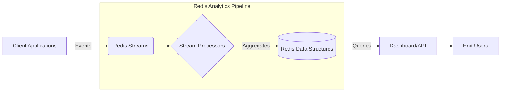

# Redis Real-time Analytics

## Introduction

Real-time analytics is one of the most powerful applications of Redis. Unlike traditional database systems where data analysis often happens in batches with significant delays, Redis enables you to process and analyze data as it arrives. This capability is crucial for applications that need immediate insights like dashboards, monitoring systems, fraud detection, and personalized recommendations.

In this guide, we'll explore how Redis facilitates real-time analytics through its specialized data structures and commands, providing you with practical patterns to implement in your own applications.

## Why Redis for Real-time Analytics?

Redis offers several advantages that make it ideal for real-time analytics:

- **Speed**: With in-memory operations, Redis can process thousands of operations per second
- **Data structures**: Purpose-built structures like Sorted Sets, HyperLogLog, and Streams
- **Pub/Sub mechanism**: Real-time event notifications and data publishing
- **Lua scripting**: Complex atomic operations for sophisticated analytics
- **Time Series module**: Specialized for time-series data (available in Redis Stack)

## Basic Real-time Counters

The simplest form of real-time analytics is counters. Let's implement a page view counter:

```javascript
// Increment the counter for a specific page
async function incrementPageView(pageId) {
  return await redis.incr(`pageviews:${pageId}`);
}

// Get the current count
async function getPageViews(pageId) {
  return await redis.get(`pageviews:${pageId}`);
}

// Example usage:
const views = await incrementPageView('home-page');
console.log(`Home page viewed ${views} times`);
```

**Output:**
```
Home page viewed 42 times
```

For more advanced scenarios, you might want to track time-based metrics, like hourly page views:

```javascript
async function incrementHourlyPageView(pageId) {
  const now = new Date();
  const hourKey = `${now.getFullYear()}:${now.getMonth()}:${now.getDate()}:${now.getHours()}`;
  return await redis.incr(`pageviews:${pageId}:${hourKey}`);
}
```

## Time-Based Analytics with Sorted Sets

Sorted sets are perfect for time-based analytics. Let's create a system to track active users:

```javascript
const redis = require('redis');
const client = redis.createClient();

async function trackUserActivity(userId) {
  const now = Date.now();
  
  // Record in active users sorted set with timestamp score
  await client.zAdd('active_users', {
    score: now,
    value: userId
  });
  
  // Clean up users older than 15 minutes (900000 ms)
  const fifteenMinutesAgo = now - 900000;
  await client.zRemRangeByScore('active_users', 0, fifteenMinutesAgo);
}

async function getActiveUserCount() {
  return await client.zCard('active_users');
}

// Usage
await trackUserActivity('user:1234');
const activeUsers = await getActiveUserCount();
console.log(`Currently active users: ${activeUsers}`);
```

**Output:**
```
Currently active users: 327
```

## Unique Visitor Counting with HyperLogLog

HyperLogLog is a probabilistic data structure perfect for counting unique items with minimal memory usage:

```javascript
async function trackUniqueVisitor(pageId, userId) {
  await client.pFAdd(`unique_visitors:${pageId}`, userId);
}

async function getUniqueVisitorCount(pageId) {
  return await client.pFCount(`unique_visitors:${pageId}`);
}

// Track 1000 different visitors
for (let i = 1; i <= 1000; i++) {
  await trackUniqueVisitor('home-page', `user:${i}`);
}

// Some users visit multiple times (which won't increase the count)
for (let i = 1; i <= 200; i++) {
  await trackUniqueVisitor('home-page', `user:${i}`);
}

const uniqueCount = await getUniqueVisitorCount('home-page');
console.log(`Unique visitors to home page: ${uniqueCount}`);
```

**Output:**
```
Unique visitors to home page: 1000
```

HyperLogLog has a standard error of 0.81%, so the count might not be exactly 1000, but it will be very close while using only a constant amount of memory.

## Real-time Leaderboards with Sorted Sets

Sorted sets excel at maintaining ordered data, perfect for leaderboards:

```javascript
async function updateScore(userId, points) {
  // Increment the user's score
  await client.zIncrBy('leaderboard', points, userId);
}

async function getTopUsers(count) {
  // Get the top users with their scores
  return await client.zRevRangeWithScores('leaderboard', 0, count - 1);
}

async function getUserRank(userId) {
  // Get user's rank (0-based)
  const rank = await client.zRevRank('leaderboard', userId);
  return rank !== null ? rank + 1 : null; // Convert to 1-based ranking
}

// Example usage
await updateScore('user:123', 50);
await updateScore('user:456', 75);
await updateScore('user:789', 60);

const topUsers = await getTopUsers(3);
console.log('Top 3 Users:');
topUsers.forEach((entry, index) => {
  console.log(`${index + 1}. ${entry.value} - ${entry.score} points`);
});

const rank = await getUserRank('user:123');
console.log(`User 123 rank: ${rank}`);
```

**Output:**
```
Top 3 Users:
1. user:456 - 75 points
2. user:789 - 60 points
3. user:123 - 50 points
User 123 rank: 3
```

## Event Analytics with Redis Streams

Redis Streams are ideal for processing event data in real-time:

```javascript
async function logEvent(eventType, eventData) {
  // Add event to stream with auto-generated ID
  const id = await client.xAdd(
    'events',
    '*', // Auto-generate ID
    { type: eventType, ...eventData, timestamp: Date.now() }
  );
  return id;
}

async function processEvents(consumerName, groupName = 'analytics-processors') {
  try {
    // Create consumer group if not exists
    await client.xGroupCreate('events', groupName, '0', { MKSTREAM: true })
      .catch(() => {}); // Ignore error if group already exists
    
    // Read new messages not yet claimed by others
    const messages = await client.xReadGroup(
      groupName, 
      consumerName,
      [{ key: 'events', id: '>' }], // '>' means new messages only
      { COUNT: 10 }
    );
    
    if (messages && messages.length > 0) {
      const events = messages[0].messages;
      
      for (const event of events) {
        const { id, message } = event;
        
        // Process the event
        console.log(`Processing event ${id}: ${JSON.stringify(message)}`);
        
        // After successful processing, acknowledge the message
        await client.xAck('events', groupName, id);
      }
    }
  } catch (error) {
    console.error('Error processing events:', error);
  }
}

// Example usage
await logEvent('page_view', { pageId: 'home', userId: 'user:123' });
await logEvent('button_click', { buttonId: 'signup', userId: 'user:123' });

// In a separate process or interval:
setInterval(() => {
  processEvents('consumer:1').catch(console.error);
}, 1000);
```

**Example Output:**
```
Processing event 1637012345678-0: {"type":"page_view","pageId":"home","userId":"user:123","timestamp":"1637012345678"}
Processing event 1637012345679-0: {"type":"button_click","buttonId":"signup","userId":"user:123","timestamp":"1637012345679"}
```

## Building a Real-time Dashboard

Let's combine these techniques to create a simple real-time dashboard that tracks:
1. Current active users
2. Page views by section
3. Top performing content

```javascript
async function updateDashboardMetrics(event) {
  const pipeline = client.multi();
  
  // 1. Track active user
  if (event.userId) {
    pipeline.zAdd('active_users', { score: Date.now(), value: event.userId });
  }
  
  // 2. Increment page view counter by section
  if (event.type === 'page_view' && event.section) {
    pipeline.incr(`pageviews:${event.section}`);
    pipeline.zIncrBy('popular_sections', 1, event.section);
  }
  
  // 3. Track content popularity
  if (event.contentId) {
    pipeline.zIncrBy('popular_content', 1, event.contentId);
  }
  
  // Execute all commands in a single round-trip
  await pipeline.exec();
}

async function getDashboardData() {
  // Clean up users older than 15 minutes
  const fifteenMinutesAgo = Date.now() - 900000;
  await client.zRemRangeByScore('active_users', 0, fifteenMinutesAgo);
  
  // Get all metrics in parallel
  const [activeUsers, topSections, topContent] = await Promise.all([
    client.zCard('active_users'),
    client.zRevRangeWithScores('popular_sections', 0, 4), // Top 5 sections
    client.zRevRangeWithScores('popular_content', 0, 9) // Top 10 content
  ]);
  
  return {
    activeUserCount: activeUsers,
    topSections,
    topContent
  };
}

// Example of event processing
async function processAnalyticsEvent(event) {
  await updateDashboardMetrics(event);
  // Additional event processing...
}

// Example dashboard data retrieval
async function displayDashboard() {
  const data = await getDashboardData();
  console.log(`Active users: ${data.activeUserCount}`);
  console.log('Top sections:');
  data.topSections.forEach((section, i) => 
    console.log(`  ${i+1}. ${section.value}: ${section.score} views`)
  );
}
```

This pattern enables a real-time dashboard that updates instantly as users interact with your application.

## Time-Series Analytics with Redis TimeSeries

Redis Stack includes a TimeSeries module that's optimized for time-series data. Here's how to use it:

```javascript
// Note: Requires Redis Stack or RedisTimeSeries module
const { createClient } = require('redis');
const client = createClient({
  url: 'redis://localhost:6379'
});

async function recordMetric(metricName, value, labels = {}) {
  // Convert labels object to array format required by TS.ADD
  const labelsArray = Object.entries(labels).flatMap(([k, v]) => [k, v]);
  
  try {
    // Create the time series if it doesn't exist
    await client.sendCommand([
      'TS.CREATE', metricName, 
      'LABELS', ...labelsArray, 
      'RETENTION', 86400000 // 24 hours in milliseconds
    ]).catch(() => {}); // Ignore if series already exists
    
    // Add the data point
    await client.sendCommand([
      'TS.ADD', metricName, '*', value.toString(),
      'LABELS', ...labelsArray
    ]);
  } catch (error) {
    console.error(`Error recording metric ${metricName}:`, error);
  }
}

async function getMetricStats(metricName, fromTime, toTime) {
  // Get min, max, avg for a time period
  const stats = await client.sendCommand([
    'TS.RANGE', metricName, 
    fromTime.toString(), toTime.toString(),
    'AGGREGATION', 'avg', '60000' // 1-minute averages
  ]);
  
  return stats.map(([timestamp, value]) => ({
    timestamp,
    value: parseFloat(value)
  }));
}

// Example usage
await recordMetric('server:cpu', 42.5, { server: 'web-1', region: 'us-east' });

// Get last hour of data
const hourAgo = Date.now() - 3600000;
const stats = await getMetricStats('server:cpu', hourAgo, Date.now());
console.log('CPU Usage (1-min averages):');
stats.forEach(point => {
  const time = new Date(point.timestamp).toLocaleTimeString();
  console.log(`${time}: ${point.value.toFixed(1)}%`);
});
```

## Visualizing Real-time Flow with Mermaid

Here's a diagram showing the typical real-time analytics data flow with Redis:



## Scaling Real-time Analytics

As your application grows, consider these scaling strategies:

1. **Redis Cluster**: Distribute data across multiple Redis nodes
2. **Redis Replica**: Use read replicas for analytics queries to offload the primary
3. **Batch Processing**: Process events in small batches rather than one at a time
4. **Sampling**: For very high-volume data, consider statistical sampling
5. **TTL Management**: Set appropriate expiration times on time-based data

Here's an example of implementing TTL for time-series data:

```javascript
async function incrementHourlyPageViewWithExpiry(pageId) {
  const now = new Date();
  const hour = now.getHours();
  const day = now.getDate();
  const month = now.getMonth() + 1;
  const year = now.getFullYear();
  
  const hourKey = `pageviews:hourly:${year}:${month}:${day}:${hour}:${pageId}`;
  
  const pipeline = client.multi();
  pipeline.incr(hourKey);
  
  // Set TTL: keep hourly data for 48 hours
  pipeline.expire(hourKey, 48 * 60 * 60);
  
  return await pipeline.exec();
}
```

## Summary

Redis provides powerful tools for implementing real-time analytics in your applications:

- **Counters** with Strings and INCR for simple metrics
- **HyperLogLog** for unique visitor counting with minimal memory
- **Sorted Sets** for leaderboards and time-based activity tracking
- **Hashes** for storing detailed metrics
- **Streams** for event processing pipelines
- **TimeSeries** for specialized time-series analytics

By leveraging these data structures along with Redis's speed and versatility, you can build sophisticated real-time analytics systems that scale with your application's needs.

## Additional Resources

- [Redis University: RU202 - Redis Streams](https://university.redis.com/)
- [Redis Time Series Documentation](https://redis.io/docs/stack/timeseries/)
- [RedisInsight](https://redis.io/docs/ui/insight/) - A GUI for visualizing Redis data including analytics

## Exercises

1. Build a real-time visitor counter that shows current visitors on your website
2. Create a heat map of user activity by hour of day and day of week
3. Implement a system to detect unusual traffic patterns by tracking request rates
4. Design a real-time A/B test analytics system that shows conversion rates
5. Build a simple anomaly detection system that alerts when metrics deviate from normal patterns