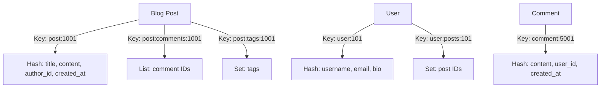

# Redis Python

## Introduction

Redis (Remote Dictionary Server) is a powerful, open-source, in-memory data structure store that can be used as a database, cache, message broker, and more. When combined with Python, it opens up a world of possibilities for building high-performance applications.

In this guide, we'll explore how to integrate Redis with Python applications, allowing you to leverage Redis's speed and versatility in your Python projects. Redis is particularly useful for scenarios requiring fast data access, distributed locking, real-time analytics, and session management.

## Getting Started

### Prerequisites

Before diving into Redis with Python, you'll need:

- Redis server installed and running
- Python 3.6 or later
- Basic knowledge of Python programming

### Installing Redis Python Client

The most popular Redis client for Python is `redis-py`. You can install it using pip:

```bash
pip install redis
```

### Establishing a Connection

Let's start by establishing a connection to a Redis server:

```python
import redis

# Connect to Redis (defaults to localhost:6379)
r = redis.Redis(host='localhost', port=6379, db=0)

# Test the connection
try:
    response = r.ping()
    print(f"Connection successful: {response}")
except redis.ConnectionError:
    print("Connection failed")
```

Output:
```
Connection successful: True
```

## Basic Redis Operations in Python

Redis supports various data structures. Let's explore how to work with them using Python.

### Strings

Strings are the most basic Redis data type:

```python
# Set a string value
r.set('user:name', 'John Doe')

# Get a string value
name = r.get('user:name')
print(name.decode('utf-8'))  # Convert bytes to string

# Set with expiration (5 seconds)
r.setex('session:token', 5, 'abc123')

# Check if key exists
print(r.exists('user:name'))
```

Output:
```
John Doe
1
```

### Lists

Redis lists are linked lists that allow push and pop operations on both sides:

```python
# Create and populate a list
r.lpush('tasks', 'Send email')
r.lpush('tasks', 'Write code')
r.rpush('tasks', 'Deploy application')

# Get list elements
tasks = r.lrange('tasks', 0, -1)
for task in tasks:
    print(task.decode('utf-8'))

# Pop elements from the list
next_task = r.lpop('tasks')
print(f"Next task: {next_task.decode('utf-8')}")
```

Output:
```
Write code
Send email
Deploy application
Next task: Write code
```

### Hashes

Hashes are maps between string fields and string values:

```python
# Store user profile as a hash
r.hset('user:profile:1001', mapping={
    'username': 'johndoe',
    'email': 'john@example.com',
    'age': '30'
})

# Get specific fields
email = r.hget('user:profile:1001', 'email')
print(f"Email: {email.decode('utf-8')}")

# Get all fields and values
profile = r.hgetall('user:profile:1001')
print("User profile:")
for key, value in profile.items():
    print(f"  {key.decode('utf-8')}: {value.decode('utf-8')}")
```

Output:
```
Email: john@example.com
User profile:
  username: johndoe
  email: john@example.com
  age: 30
```

### Sets

Sets are unordered collections of unique strings:

```python
# Add members to a set
r.sadd('tags:article:123', 'python', 'redis', 'database', 'caching')

# Get all members of a set
tags = r.smembers('tags:article:123')
print("Article tags:")
for tag in tags:
    print(f"  {tag.decode('utf-8')}")

# Check if a member exists in a set
has_tag = r.sismember('tags:article:123', 'python')
print(f"Has Python tag: {bool(has_tag)}")
```

Output:
```
Article tags:
  python
  redis
  database
  caching
Has Python tag: True
```

### Sorted Sets

Sorted sets are similar to sets, but each member has an associated score:

```python
# Add members with scores to a sorted set
r.zadd('leaderboard', {
    'player1': 100,
    'player2': 80,
    'player3': 120,
    'player4': 95
})

# Get top 3 players
top_players = r.zrevrange('leaderboard', 0, 2, withscores=True)
print("Top 3 players:")
for player, score in top_players:
    print(f"  {player.decode('utf-8')}: {int(score)}")
```

Output:
```
Top 3 players:
  player3: 120
  player1: 100
  player4: 95
```

## Pipeline and Transactions

### Using Pipeline for Batch Operations

Pipelines allow you to send multiple commands to the server in one go, reducing network overhead:

```python
# Create a pipeline
pipe = r.pipeline()

# Queue multiple commands
pipe.set('key1', 'value1')
pipe.set('key2', 'value2')
pipe.set('key3', 'value3')
pipe.get('key1')
pipe.get('key2')
pipe.get('key3')

# Execute all commands in a single request
results = pipe.execute()
print(results)
```

Output:
```
[True, True, True, b'value1', b'value2', b'value3']
```

### Transactions with MULTI/EXEC

Redis transactions ensure that a series of commands execute as an atomic operation:

```python
# Start a transaction
pipe = r.pipeline(transaction=True)

# Queue commands in the transaction
pipe.set('balance:user1', 500)
pipe.set('balance:user2', 1000)
pipe.decrby('balance:user1', 200)
pipe.incrby('balance:user2', 200)

# Execute the transaction
pipe.execute()

# Check the final balances
print(f"User1 balance: {r.get('balance:user1').decode('utf-8')}")
print(f"User2 balance: {r.get('balance:user2').decode('utf-8')}")
```

Output:
```
User1 balance: 300
User2 balance: 1200
```

## Real-world Applications

Let's look at some practical examples of using Redis with Python.

### Implementing a Rate Limiter

Rate limiting is essential for protecting APIs from abuse:

```python
def is_rate_limited(user_id, limit=10, period=60):
    """
    Check if a user has exceeded the rate limit.
    
    Args:
        user_id: The user's identifier
        limit: Maximum number of requests allowed in the period
        period: Time window in seconds
        
    Returns:
        bool: True if rate limited, False otherwise
    """
    key = f"rate:limit:{user_id}"
    current = r.get(key)
    
    if current is None:
        # First request, set counter to 1 with expiry
        r.setex(key, period, 1)
        return False
    
    count = int(current)
    if count < limit:
        # Increment counter
        r.incr(key)
        return False
    
    # Rate limit exceeded
    return True

# Example usage
user_id = "user123"
for i in range(15):
    if is_rate_limited(user_id, limit=10, period=60):
        print(f"Request {i+1}: Rate limit exceeded!")
    else:
        print(f"Request {i+1}: Processed successfully")
```

Output:
```
Request 1: Processed successfully
Request 2: Processed successfully
...
Request 10: Processed successfully
Request 11: Rate limit exceeded!
...
Request 15: Rate limit exceeded!
```

### Caching Expensive Operations

Redis is perfect for caching to avoid repeated expensive operations:

```python
import time
import json
import hashlib

def get_cached_data(func, args=(), cache_time=300):
    """
    Cache the result of a function call in Redis.
    
    Args:
        func: The function to call
        args: Arguments for the function
        cache_time: Time to keep in cache (seconds)
        
    Returns:
        The result of the function
    """
    # Create a cache key from function name and arguments
    key_parts = [func.__name__] + list(map(str, args))
    cache_key = 'cache:' + hashlib.md5(':'.join(key_parts).encode()).hexdigest()
    
    # Try to get from cache
    cached = r.get(cache_key)
    if cached:
        print("Cache hit!")
        return json.loads(cached)
    
    # If not in cache, call the function
    print("Cache miss. Computing...")
    result = func(*args)
    
    # Store in cache
    r.setex(cache_key, cache_time, json.dumps(result))
    return result

# Example expensive function
def expensive_computation(n):
    """Simulate an expensive computation"""
    time.sleep(2)  # Simulate work
    return {"result": n * n, "computed_at": time.time()}

# First call - will compute
result1 = get_cached_data(expensive_computation, (42,))
print(f"Result: {result1}")

# Second call - will use cache
result2 = get_cached_data(expensive_computation, (42,))
print(f"Result: {result2}")

# Different arguments - will compute
result3 = get_cached_data(expensive_computation, (43,))
print(f"Result: {result3}")
```

Output:
```
Cache miss. Computing...
Result: {'result': 1764, 'computed_at': 1678234567.123}
Cache hit!
Result: {'result': 1764, 'computed_at': 1678234567.123}
Cache miss. Computing...
Result: {'result': 1849, 'computed_at': 1678234569.456}
```

### Session Management

Redis is commonly used for storing session data in web applications:

```python
import uuid
import json
from datetime import datetime

class RedisSession:
    def __init__(self, redis_client, expire=1800):
        self.redis = redis_client
        self.expire = expire  # Session expiration in seconds (30 minutes)
    
    def create_session(self, user_data):
        """Create a new session and return session ID"""
        session_id = str(uuid.uuid4())
        key = f"session:{session_id}"
        
        # Add timestamp to track when session was created
        session_data = {
            **user_data,
            "created_at": datetime.now().isoformat()
        }
        
        # Store session in Redis with expiration
        self.redis.setex(key, self.expire, json.dumps(session_data))
        return session_id
    
    def get_session(self, session_id):
        """Retrieve session data and refresh expiration"""
        key = f"session:{session_id}"
        data = self.redis.get(key)
        
        if data:
            # Refresh expiration time
            self.redis.expire(key, self.expire)
            return json.loads(data)
        return None
    
    def delete_session(self, session_id):
        """Delete a session"""
        key = f"session:{session_id}"
        return self.redis.delete(key)

# Example usage
session_manager = RedisSession(r)

# User logs in
user = {
    "user_id": 12345,
    "username": "johndoe",
    "email": "john@example.com",
    "permissions": ["read", "write"]
}

# Create session
session_id = session_manager.create_session(user)
print(f"Session created: {session_id}")

# Later, retrieve session
session_data = session_manager.get_session(session_id)
print(f"Retrieved session data: {session_data}")

# User logs out
session_manager.delete_session(session_id)
print(f"Session after logout: {session_manager.get_session(session_id)}")
```

Output:
```
Session created: 550e8400-e29b-41d4-a716-446655440000
Retrieved session data: {'user_id': 12345, 'username': 'johndoe', 'email': 'john@example.com', 'permissions': ['read', 'write'], 'created_at': '2023-03-08T14:30:45.123456'}
Session after logout: None
```

## Redis Pub/Sub

Redis provides a Publish/Subscribe messaging system:

```python
import threading
import time

def message_handler(message):
    """Handle incoming messages"""
    if message['type'] == 'message':
        data = message['data'].decode('utf-8')
        channel = message['channel'].decode('utf-8')
        print(f"Received message from {channel}: {data}")

def start_subscriber(channels):
    """Start a Redis subscriber in a separate thread"""
    pubsub = r.pubsub()
    pubsub.subscribe(channels)
    
    # Start listening for messages in a thread
    thread = threading.Thread(target=pubsub.run_in_thread, 
                             args=(message_handler,))
    thread.start()
    return thread, pubsub

# Start subscriber for notifications channel
thread, pubsub = start_subscriber(['notifications'])
print("Subscriber started...")

# Publish some messages
r.publish('notifications', 'System maintenance scheduled')
time.sleep(0.5)  # Give time for message to be processed
r.publish('notifications', 'New feature launched')
time.sleep(0.5)

# Clean up
pubsub.unsubscribe()
thread.join(1)
print("Subscriber stopped")
```

Output:
```
Subscriber started...
Received message from notifications: System maintenance scheduled
Received message from notifications: New feature launched
Subscriber stopped
```

## Redis Connection Pools

For production applications, it's important to use connection pooling:

```python
# Create a connection pool
pool = redis.ConnectionPool(host='localhost', port=6379, db=0, max_connections=10)

# Create Redis client using the pool
r1 = redis.Redis(connection_pool=pool)
r2 = redis.Redis(connection_pool=pool)

# Both clients use the same connection pool
r1.set('pooled_key', 'value1')
value = r2.get('pooled_key')
print(f"Retrieved value using pooled connection: {value.decode('utf-8')}")

# Get pool statistics
print(f"Pool in use connections: {pool.connection_kwargs}")
```

Output:
```
Retrieved value using pooled connection: value1
Pool in use connections: {'host': 'localhost', 'port': 6379, 'db': 0, 'max_connections': 10}
```

## Data Modeling with Redis

Redis requires different design patterns than traditional relational databases. Here's how you might model a simple blog in Redis:



## Error Handling and Best Practices

### Error Handling

Always handle potential Redis exceptions in your code:

```python
try:
    result = r.get('nonexistent_key')
    if result is None:
        print("Key does not exist")
    else:
        print(f"Value: {result.decode('utf-8')}")
except redis.RedisError as e:
    print(f"Redis error occurred: {e}")
except Exception as e:
    print(f"Unexpected error: {e}")
```

### Best Practices

1. **Use meaningful key names**: Follow naming conventions like `object-type:id:field`
2. **Set appropriate TTLs**: Don't keep data forever if it has a natural expiration
3. **Use pipelining** for bulk operations to reduce network overhead
4. **Implement connection pooling** for production applications
5. **Monitor memory usage** as Redis stores everything in memory
6. **Back up your Redis data** regularly using RDB or AOF persistence
7. **Use Redis Cloud or Redis Sentinel** for high availability in production

## Summary

Redis is a versatile in-memory data store that perfectly complements Python applications. In this guide, we've covered:

- Setting up and connecting to Redis from Python
- Working with various Redis data structures (strings, lists, hashes, sets, sorted sets)
- Executing transactions and pipelining for efficient operations
- Real-world applications including rate limiting, caching, and session management
- Publish/Subscribe messaging for event-driven applications
- Connection pooling for production environments
- Basic data modeling principles

Redis and Python together provide a powerful toolkit for building fast, scalable applications with sophisticated caching, real-time features, and efficient data storage.

## Further Learning

### Exercises

1. Build a simple task queue using Redis lists
2. Implement a leaderboard system using sorted sets
3. Create a URL shortener service with Redis as the storage
4. Design a distributed locking mechanism using Redis

### Additional Resources

- [Redis Official Documentation](https://redis.io/documentation)
- [redis-py GitHub Repository](https://github.com/redis/redis-py)
- [Redis University](https://university.redis.com/) - Free online courses
- [Redis Labs Blog](https://redislabs.com/blog/)