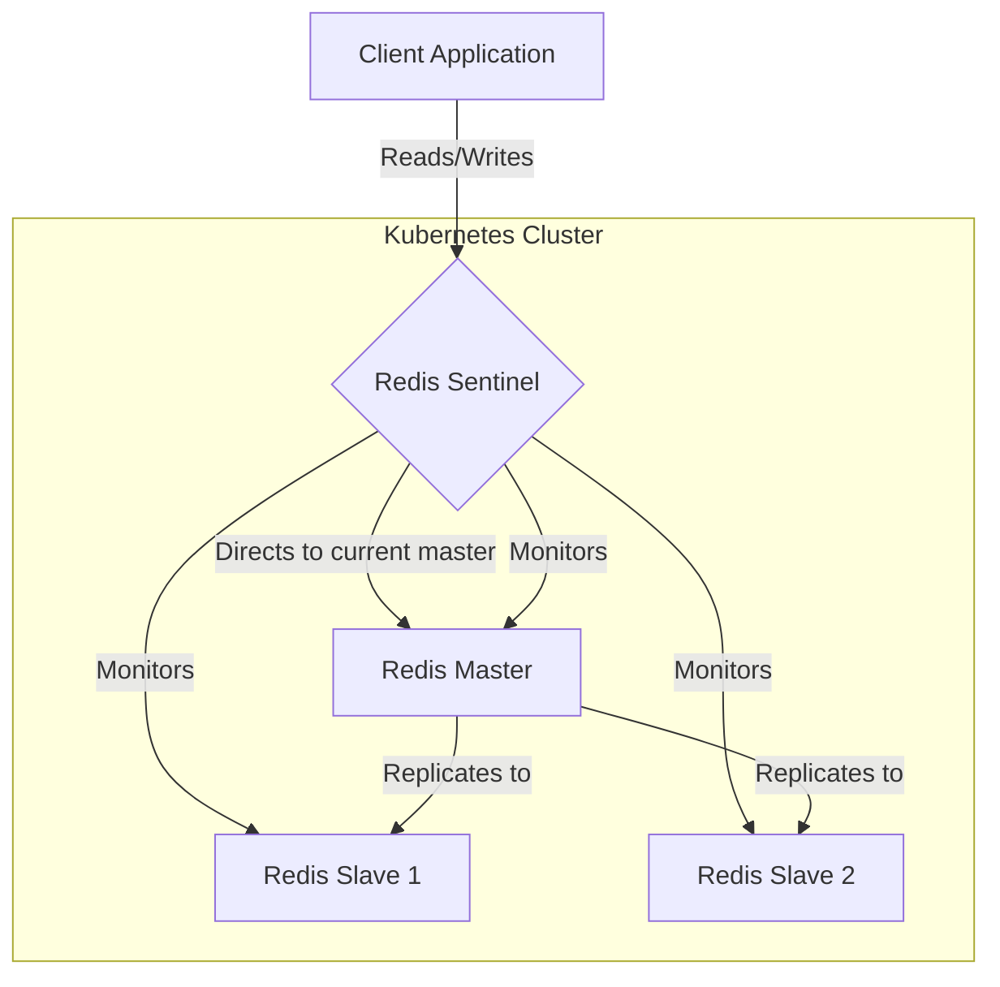
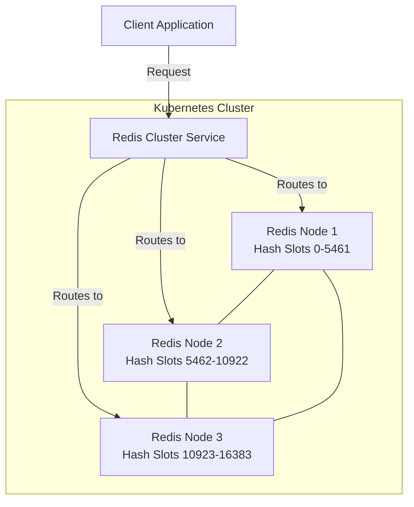

# Redis Kubernetes Integration

## Introduction

Integrating Redis with Kubernetes creates a powerful combination for modern application development. Redis provides lightning-fast in-memory data storage, while Kubernetes offers robust container orchestration capabilities. Together, they enable you to run scalable, resilient Redis deployments in cloud-native environments.

This guide will walk you through the fundamentals of running Redis on Kubernetes, from basic deployments to advanced configurations, helping you leverage this powerful combination in your applications.

## Prerequisites

Before you begin, you should have:

- A working Kubernetes cluster (local like Minikube or cloud-based)
- `kubectl` command-line tool installed and configured
- Basic understanding of Redis concepts
- Basic understanding of Kubernetes concepts (Pods, Deployments, Services)

## Redis Deployment Options in Kubernetes

You can deploy Redis in Kubernetes in several ways:

1. **Single-instance Redis** - Simple and suitable for development
2. **Redis Sentinel** - Provides high availability through master-slave setup with automatic failover
3. **Redis Cluster** - Distributes data across multiple Redis nodes for scalability and reliability

Let's start with the simplest option and gradually move to more complex setups.

## Deploying a Single Redis Instance

### Step 1: Create a Redis Deployment

Create a file named `redis-deployment.yaml`:

```yaml
apiVersion: apps/v1
kind: Deployment
metadata:
  name: redis
  labels:
    app: redis
spec:
  replicas: 1
  selector:
    matchLabels:
      app: redis
  template:
    metadata:
      labels:
        app: redis
    spec:
      containers:
      - name: redis
        image: redis:6.2
        ports:
        - containerPort: 6379
        resources:
          limits:
            cpu: "0.5"
            memory: "512Mi"
          requests:
            cpu: "0.2"
            memory: "256Mi"
```

This YAML defines a simple Redis deployment with one replica.

### Step 2: Apply the Deployment

```bash
kubectl apply -f redis-deployment.yaml
```

Expected output:
```
deployment.apps/redis created
```

### Step 3: Create a Redis Service

Now, let's make Redis accessible within the cluster by creating a Service. Create a file named `redis-service.yaml`:

```yaml
apiVersion: v1
kind: Service
metadata:
  name: redis
spec:
  selector:
    app: redis
  ports:
  - port: 6379
    targetPort: 6379
  type: ClusterIP
```

Apply the service:

```bash
kubectl apply -f redis-service.yaml
```

Expected output:
```
service/redis created
```

### Step 4: Verify the Deployment

Check if your Redis pods are running:

```bash
kubectl get pods -l app=redis
```

Expected output:
```
NAME                    READY   STATUS    RESTARTS   AGE
redis-6b7b68f6c-xvt5k   1/1     Running   0          1m
```

You can connect to Redis to verify it's working:

```bash
kubectl exec -it $(kubectl get pod -l app=redis -o jsonpath='{.items[0].metadata.name}') -- redis-cli
```

Once connected to the Redis CLI, test it with:

```
> PING
PONG
> SET mykey "Hello Redis on Kubernetes"
OK
> GET mykey
"Hello Redis on Kubernetes"
> EXIT
```

## Persistent Storage for Redis

In the deployment above, if the pod restarts, we'll lose all data. Let's add persistence using Kubernetes PersistentVolumeClaims.

### Step 1: Create a PersistentVolumeClaim

Create a file named `redis-pvc.yaml`:

```yaml
apiVersion: v1
kind: PersistentVolumeClaim
metadata:
  name: redis-data
spec:
  accessModes:
    - ReadWriteOnce
  resources:
    requests:
      storage: 1Gi
```

Apply it:

```bash
kubectl apply -f redis-pvc.yaml
```

Expected output:
```
persistentvolumeclaim/redis-data created
```

### Step 2: Update Deployment to Use PVC

Create an updated deployment file `redis-deployment-persistent.yaml`:

```yaml
apiVersion: apps/v1
kind: Deployment
metadata:
  name: redis
  labels:
    app: redis
spec:
  replicas: 1
  selector:
    matchLabels:
      app: redis
  template:
    metadata:
      labels:
        app: redis
    spec:
      containers:
      - name: redis
        image: redis:6.2
        ports:
        - containerPort: 6379
        volumeMounts:
        - name: redis-data
          mountPath: /data
        command:
        - redis-server
        - --appendonly
        - "yes"
        resources:
          limits:
            cpu: "0.5"
            memory: "512Mi"
          requests:
            cpu: "0.2"
            memory: "256Mi"
      volumes:
      - name: redis-data
        persistentVolumeClaim:
          claimName: redis-data
```

Apply the updated deployment:

```bash
kubectl apply -f redis-deployment-persistent.yaml
```

Now, your Redis instance will persist data even if the pod restarts.

## Redis Configuration in Kubernetes

### Using ConfigMap for Redis Configuration

Let's create a custom Redis configuration using ConfigMap:

### Step 1: Create a ConfigMap with Redis Configuration

Create a file named `redis-config.yaml`:

```yaml
apiVersion: v1
kind: ConfigMap
metadata:
  name: redis-config
data:
  redis.conf: |
    appendonly yes
    maxmemory 256mb
    maxmemory-policy allkeys-lru
    requirepass myStrongPassword
```

Apply it:

```bash
kubectl apply -f redis-config.yaml
```

Expected output:
```
configmap/redis-config created
```

### Step 2: Update Deployment to Use ConfigMap

Create a new deployment file `redis-deployment-config.yaml`:

```yaml
apiVersion: apps/v1
kind: Deployment
metadata:
  name: redis
  labels:
    app: redis
spec:
  replicas: 1
  selector:
    matchLabels:
      app: redis
  template:
    metadata:
      labels:
        app: redis
    spec:
      containers:
      - name: redis
        image: redis:6.2
        ports:
        - containerPort: 6379
        volumeMounts:
        - name: redis-data
          mountPath: /data
        - name: redis-config
          mountPath: /usr/local/etc/redis/redis.conf
          subPath: redis.conf
        command:
        - redis-server
        - /usr/local/etc/redis/redis.conf
        resources:
          limits:
            cpu: "0.5"
            memory: "512Mi"
          requests:
            cpu: "0.2"
            memory: "256Mi"
      volumes:
      - name: redis-data
        persistentVolumeClaim:
          claimName: redis-data
      - name: redis-config
        configMap:
          name: redis-config
```

Apply it:

```bash
kubectl apply -f redis-deployment-config.yaml
```

## Redis High Availability with Redis Sentinel

For production environments, you'll want high availability. Redis Sentinel provides automatic failover if the master node goes down.

### Using Stateful Sets for Redis HA

To implement a Redis Sentinel setup in Kubernetes, we'll use StatefulSets which are better suited for stateful applications.

Here's a simplified visualization of a Redis Sentinel architecture:



For brevity, we'll focus on the key concepts rather than providing the complete YAML manifests.

The architecture typically involves:

1. A StatefulSet for Redis master and replicas
2. A separate StatefulSet or Deployment for Sentinel instances
3. Corresponding services for discovery
4. ConfigMaps for configuration

## Using Redis Kubernetes Operators

For production-grade Redis on Kubernetes, consider using a Redis Operator, which automates the deployment and management of Redis clusters.

Popular Redis operators include:

1. **Redis Enterprise Operator** - Offered by Redis Labs
2. **Redis Operator by Spotahome** - An open-source alternative
3. **Redis Operator by OT-CONTAINER-KIT** - Another open-source option

These operators handle:
- Automated deployment and scaling
- Failover and recovery
- Backup and restore
- Configuration management
- Monitoring and alerts

## Connecting Applications to Redis on Kubernetes

To connect your application to Redis running in Kubernetes:

1. Use the Redis service name as the hostname
2. Use the standard Redis port (6379)

### Example in Node.js

```javascript
const redis = require('redis');

// Connect to Redis using the Kubernetes service name
const client = redis.createClient({
  host: 'redis',  // Service name
  port: 6379,
  password: 'myStrongPassword'
});

client.on('error', (err) => {
  console.error('Redis connection error:', err);
});

client.on('connect', () => {
  console.log('Connected to Redis successfully');
  
  // Example operations
  client.set('greeting', 'Hello from Kubernetes!');
  client.get('greeting', (err, reply) => {
    if (err) {
      console.error('Error getting key:', err);
      return;
    }
    console.log('Value for greeting key:', reply);
  });
});
```

### Example in Python

```python
import redis

# Connect to Redis using the Kubernetes service name
r = redis.Redis(
    host='redis',  # Service name
    port=6379,
    password='myStrongPassword',
    decode_responses=True
)

# Test the connection
try:
    r.set('greeting', 'Hello from Kubernetes!')
    value = r.get('greeting')
    print(f"Value for greeting key: {value}")
except redis.exceptions.ConnectionError as e:
    print(f"Redis connection error: {e}")
```

## Redis Monitoring in Kubernetes

Monitoring Redis in Kubernetes is essential for performance optimization and troubleshooting.

### Prometheus and Grafana Setup

To monitor Redis metrics, you can use the Redis Exporter with Prometheus and Grafana:

1. Deploy Redis Exporter as a sidecar container in your Redis pod
2. Configure Prometheus to scrape metrics from the Redis Exporter
3. Set up Grafana dashboards to visualize the metrics

Here's an example deployment with Redis Exporter:

```yaml
apiVersion: apps/v1
kind: Deployment
metadata:
  name: redis
  labels:
    app: redis
spec:
  replicas: 1
  selector:
    matchLabels:
      app: redis
  template:
    metadata:
      labels:
        app: redis
      annotations:
        prometheus.io/scrape: "true"
        prometheus.io/port: "9121"
    spec:
      containers:
      - name: redis
        image: redis:6.2
        ports:
        - containerPort: 6379
        resources:
          limits:
            memory: "512Mi"
            cpu: "0.5"
          requests:
            memory: "256Mi"
            cpu: "0.2"
      - name: redis-exporter
        image: oliver006/redis_exporter:latest
        ports:
        - containerPort: 9121
        env:
        - name: REDIS_ADDR
          value: "localhost:6379"
```

## Scaling Redis in Kubernetes

### Horizontal Scaling with Redis Cluster

For applications requiring high throughput and large datasets, Redis Cluster provides horizontal scaling capabilities by distributing your data across multiple Redis nodes.

The architecture of Redis Cluster looks like this:



Implementing Redis Cluster in Kubernetes typically involves:

1. StatefulSets for Redis nodes
2. A specialized init container to configure the cluster
3. Headless services for stable network identities

## Best Practices for Redis on Kubernetes

1. **Resource Limits**: Always set appropriate CPU and memory limits to prevent Redis from being killed by the Kubernetes OOM killer.

2. **Persistent Storage**: Use persistent storage for any data you can't afford to lose.

3. **Anti-Affinity Rules**: Deploy Redis instances on different nodes to improve availability:

```yaml
spec:
  affinity:
    podAntiAffinity:
      requiredDuringSchedulingIgnoredDuringExecution:
      - labelSelector:
          matchExpressions:
          - key: app
            operator: In
            values:
            - redis
        topologyKey: "kubernetes.io/hostname"
```

4. **Security**: Use Kubernetes Secrets to manage Redis passwords instead of embedding them in ConfigMaps.

5. **Backups**: Implement a regular backup strategy using tools like Redis's RDB snapshots or AOF logs.

6. **Monitoring**: Set up comprehensive monitoring with Prometheus and alerts for critical conditions.

7. **Network Policies**: Use Kubernetes Network Policies to restrict which pods can access your Redis instances.

## Troubleshooting Redis on Kubernetes

Here are some common issues and their solutions:

### Pod Won't Start

Check pod events:

```bash
kubectl describe pod <redis-pod-name>
```

Common issues include:
- Insufficient resources
- PVC binding problems
- Configuration errors

### Redis Connection Issues

If your application can't connect to Redis:

1. Ensure the Redis service is running:
   ```bash
   kubectl get svc redis
   ```

2. Check Redis logs:
   ```bash
   kubectl logs <redis-pod-name>
   ```

3. Test direct connection from another pod:
   ```bash
   kubectl run -it --rm --image=redis:6.2 redis-test -- redis-cli -h redis
   ```

### Performance Issues

If Redis is performing poorly:

1. Check Redis metrics for memory usage, connections, etc.
2. Review your resource allocation
3. Enable slow log to identify slow commands:
   ```
   CONFIG SET slowlog-log-slower-than 10000
   SLOWLOG GET 10
   ```

## Summary

In this guide, you learned how to:

- Deploy a single Redis instance in Kubernetes
- Add persistent storage to your Redis deployment
- Configure Redis using ConfigMaps
- Set up high availability with Redis Sentinel
- Connect your applications to Redis on Kubernetes
- Monitor Redis performance
- Scale Redis horizontally with Redis Cluster
- Apply best practices for production deployments
- Troubleshoot common issues

Redis on Kubernetes provides a robust foundation for building scalable, high-performance applications. By containerizing Redis, you gain all the benefits of Kubernetes orchestration while leveraging Redis's powerful in-memory data structure capabilities.

## Additional Resources

To deepen your understanding of Redis and Kubernetes integration:

1. Explore the official Redis documentation
2. Consider using Redis Operators for production environments
3. Study the Redis Cluster specification for advanced scaling scenarios

## Exercises

1. Deploy a Redis instance with persistent storage and connect to it from a simple web application.
2. Set up a Redis Sentinel cluster with one master and two replicas.
3. Configure Redis with memory limits and implement a proper eviction policy.
4. Set up Prometheus and Grafana monitoring for your Redis instance.
5. Implement a Redis Cluster with three nodes and test how data is distributed.