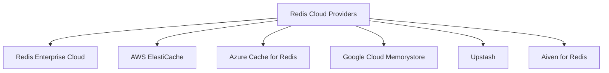

# Redis Cloud Services

## Introduction

Redis Cloud Services provide managed Redis database deployments that allow developers to use Redis without having to worry about the operational complexities of running and scaling a Redis instance. Redis (Remote Dictionary Server) itself is an open-source, in-memory data structure store that can be used as a database, cache, message broker, and streaming engine.

When you're building applications that require fast data access, session management, real-time analytics, or other features where performance is crucial, Redis Cloud offerings can significantly simplify your development and operations work.

## Why Use Redis Cloud Services?

While you could set up and manage Redis servers yourself, cloud services offer several advantages:

- **Zero maintenance**: The provider handles updates, patches, and infrastructure management
- **High availability**: Built-in replication, failover, and backups
- **Elastic scaling**: Automatically scale resources as your needs change
- **Geographic distribution**: Deploy across multiple regions for lower latency
- **Monitoring and metrics**: Built-in tools to track performance
- **Cost efficiency**: Pay only for what you use

## Popular Redis Cloud Providers

Several providers offer managed Redis services:



Let's explore the most common options and how to get started with them.

## Redis Enterprise Cloud

Redis Enterprise Cloud is the official managed service provided by Redis Inc. (the company behind Redis).

### Key Features

- Built and supported by Redis Inc.
- Available on AWS, Google Cloud, and Microsoft Azure
- Offers Redis modules like RedisJSON, RediSearch, RedisGraph, etc.
- Multiple subscription plans including a free tier

### Getting Started with Redis Enterprise Cloud

1. **Sign up for an account**:
   Visit [Redis Enterprise Cloud](https://redis.com/redis-enterprise-cloud) and create a free account.

2. **Create a subscription**:
   Select your preferred cloud provider, region, and plan.

3. **Create a database**:
   Configure your Redis database with the desired memory size, modules, and other settings.

4. **Connect to your database**:
   Once created, you'll receive connection details:

```javascript
// Example connection in Node.js using ioredis
const Redis = require('ioredis');

const redis = new Redis({
  host: 'redis-12345.c67890.us-east-1-1.ec2.cloud.redislabs.com',
  port: 12345,
  password: 'your_password_here'
});

// Test the connection
async function testConnection() {
  await redis.set('hello', 'world');
  const value = await redis.get('hello');
  console.log(value); // Output: world
}

testConnection().catch(console.error);
```

## AWS ElastiCache for Redis

Amazon's managed Redis service, fully integrated with the AWS ecosystem.

### Key Features

- Seamless integration with other AWS services
- Multi-AZ with automatic failover
- Encryption at rest and in transit
- Scaling capabilities with Redis Cluster

### Setup Process

1. **Sign in to the AWS Console**:
   Navigate to the ElastiCache service.

2. **Create a Redis cluster**:
   Choose Redis as the engine type and select your configuration options.

3. **Configure security groups**:
   Allow traffic on the Redis port (default 6379) from your application servers.

4. **Create the cluster**:
   AWS will provision the necessary resources.

5. **Connect to your cluster**:

```python
# Example connection in Python using redis-py
import redis

r = redis.Redis(
    host='my-redis-cluster.abcdef.0001.use1.cache.amazonaws.com',
    port=6379,
    decode_responses=True
)

# Testing the connection
r.set('key', 'value')
print(r.get('key'))  # Output: value
```

## Azure Cache for Redis

Microsoft's managed Redis service integrated with the Azure platform.

### Setup Process

1. **Sign in to the Azure Portal**:
   Search for "Azure Cache for Redis" and select the service.

2. **Create a new cache**:
   Configure settings like resource group, location, pricing tier.

3. **Access keys**:
   After creation, get your access keys from the portal.

4. **Connect to your Redis cache**:

```csharp
// Example connection in C#
using StackExchange.Redis;

// Connection string from Azure Portal
string connectionString = "your-azure-redis.redis.cache.windows.net:6380,password=YourAccessKey,ssl=True,abortConnect=False";
ConnectionMultiplexer redis = ConnectionMultiplexer.Connect(connectionString);
IDatabase db = redis.GetDatabase();

// Test the connection
db.StringSet("test", "Connected to Azure Redis!");
Console.WriteLine(db.StringGet("test"));  // Output: Connected to Azure Redis!
```

## Common Redis Cloud Operations

Let's explore some common operations you'll perform with Redis Cloud services:

### Data Storage and Retrieval

Redis supports various data structures. Here are examples of basic operations:

```javascript
// String operations
await redis.set('user:1:name', 'John');
const name = await redis.get('user:1:name');

// List operations
await redis.lpush('recentUsers', 'user:1', 'user:2');
const users = await redis.lrange('recentUsers', 0, -1);

// Hash operations
await redis.hset('user:1', 'name', 'John', 'email', 'john@example.com');
const userInfo = await redis.hgetall('user:1');
```

### Implementing a Simple Cache

One of the most common use cases for Redis is caching:

```javascript
async function getDataWithCache(key, dateFetchingFunction) {
  // Try to get data from Redis first
  const cachedData = await redis.get(key);
  
  if (cachedData) {
    return JSON.parse(cachedData);
  }
  
  // If not in cache, fetch the data from the original source
  const freshData = await dateFetchingFunction();
  
  // Store in cache for 10 minutes (600 seconds)
  await redis.set(key, JSON.stringify(freshData), 'EX', 600);
  
  return freshData;
}

// Example usage
const userData = await getDataWithCache('user:profile:1', () => {
  return database.query('SELECT * FROM users WHERE id = 1');
});
```

### Rate Limiting Implementation

Redis is excellent for implementing rate limiting:

```javascript
async function isRateLimited(userId, limit = 10, windowInSeconds = 60) {
  const key = `rate-limit:${userId}`;
  
  // Use Redis to increment counter for this user
  const count = await redis.incr(key);
  
  // Set expiry on first request
  if (count === 1) {
    await redis.expire(key, windowInSeconds);
  }
  
  // Check if user has exceeded the limit
  return count > limit;
}

// Usage in an Express middleware
app.use(async (req, res, next) => {
  const userId = req.user.id;
  
  if (await isRateLimited(userId)) {
    return res.status(429).send('Too many requests');
  }
  
  next();
});
```

## Real-World Application: Session Store

Let's implement a practical example of using Redis Cloud as a session store for a web application:

```javascript
// Example using Express.js with connect-redis
const express = require('express');
const session = require('express-session');
const Redis = require('ioredis');
const RedisStore = require('connect-redis').default;

const app = express();

// Initialize Redis client
const redisClient = new Redis({
  host: 'your-redis-host.cloud.redislabs.com',
  port: 12345,
  password: 'your_password'
});

// Configure session middleware
app.use(session({
  store: new RedisStore({ client: redisClient }),
  secret: 'your_session_secret',
  resave: false,
  saveUninitialized: false,
  cookie: { 
    secure: process.env.NODE_ENV === 'production',
    maxAge: 86400000 // 1 day in milliseconds
  }
}));

// Usage in routes
app.get('/login', (req, res) => {
  // Set session data
  req.session.userId = 123;
  req.session.username = 'johndoe';
  res.send('Logged in');
});

app.get('/profile', (req, res) => {
  // Access session data
  if (!req.session.userId) {
    return res.status(401).send('Not logged in');
  }
  
  res.send(`Hello, ${req.session.username}!`);
});

app.listen(3000, () => {
  console.log('Server running on port 3000');
});
```

## Monitoring and Management

Most Redis Cloud providers offer built-in monitoring dashboards to track:

- Memory usage
- CPU utilization
- Connected clients
- Operation statistics
- Throughput and latency

These metrics help you:
1. Identify performance bottlenecks
2. Determine when to scale
3. Debug issues when they arise

## Best Practices for Redis Cloud

When working with Redis Cloud services, follow these best practices:

1. **Use appropriate data structures**: Choose the right Redis data type for your needs.
2. **Set TTL (Time to Live)**: Configure expiration for cache entries to manage memory.
3. **Monitor memory usage**: Redis is an in-memory database, so keep an eye on usage.
4. **Use pipelining**: Batch commands together when possible for better performance.
5. **Consider connection pooling**: Reuse connections to reduce overhead.
6. **Back up your data**: Configure regular backups for data persistence.
7. **Implement proper error handling**: Handle Redis connection failures gracefully.

## Advanced Features

Most Redis Cloud services also offer advanced features worth exploring:

### Redis Modules

Redis modules extend Redis functionality:

- **RedisJSON**: Native JSON support
- **RediSearch**: Full-text search capabilities
- **RedisTimeSeries**: Time-series data support
- **RedisGraph**: Graph database capabilities
- **RedisAI**: Machine learning model serving

### Redis Streams

Redis 5.0 introduced Streams, a new data type for append-only collections:

```javascript
// Producer: Add entries to a stream
await redis.xadd('mystream', '*', 'field1', 'value1', 'field2', 'value2');

// Consumer: Read from a stream
const messages = await redis.xread('COUNT', 2, 'STREAMS', 'mystream', '0');
```

### Redis Pub/Sub

Implement real-time messaging systems:

```javascript
// In one service (publisher)
await redis.publish('notifications', JSON.stringify({
  type: 'new_message',
  userId: 123,
  message: 'Hello World'
}));

// In another service (subscriber)
const subscriber = redis.duplicate();
await subscriber.subscribe('notifications');
subscriber.on('message', (channel, message) => {
  const data = JSON.parse(message);
  console.log(`Received ${data.type} notification for user ${data.userId}`);
});
```

## Summary

Redis Cloud Services provide a powerful, managed solution for incorporating Redis into your applications without operational overhead. By leveraging these services, you can:

- Implement high-performance caching
- Build real-time features like leaderboards, chat, and notifications
- Create session stores for web applications
- Develop rate limiting and throttling mechanisms
- Build job queues and message brokers

Regardless of which provider you choose, Redis Cloud Services make it easy to integrate Redis's powerful capabilities into your applications while focusing on building features rather than managing infrastructure.

## Further Learning Resources

To continue your Redis journey, explore these topics:

1. Redis data structures in depth (Strings, Lists, Sets, Hashes, Sorted Sets)
2. Redis transactions and Lua scripting
3. Redis persistence options
4. Redis Cluster for horizontal scaling
5. Redis security best practices

## Practice Exercises

1. Create a free tier Redis Cloud instance and connect to it from your application
2. Implement a leaderboard using Redis Sorted Sets
3. Build a simple job queue with Redis Lists
4. Create a rate limiter for your API endpoints
5. Implement a real-time chat feature using Redis Pub/Sub