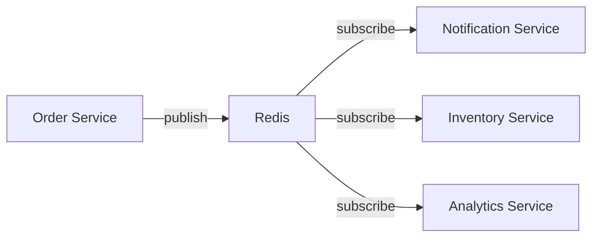
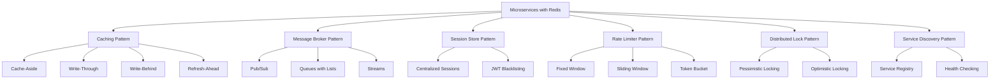

# Redis Microservices

## Introduction

Microservices architecture has become a popular approach for building complex applications by breaking them down into smaller, independently deployable services. While this architecture offers many benefits like scalability and flexibility, it also introduces challenges in service communication, data consistency, and performance.

Redis, an in-memory data structure store, can play a crucial role in addressing these challenges. In this tutorial, we'll explore how Redis can be integrated into microservices architecture to enhance performance, enable efficient service communication, and build robust distributed systems.

## What are Microservices?

Before diving into Redis integration, let's quickly understand what microservices are:

Microservices architecture is an approach to building applications as a collection of small, autonomous services that:
- Are organized around business capabilities
- Can be developed, deployed, and scaled independently
- Communicate through well-defined APIs
- Have their own data storage

## Why Redis in Microservices?

Redis offers several features that make it an excellent fit for microservices:

1. **In-memory performance**: Redis provides ultra-fast operations by storing data in memory
2. **Versatile data structures**: Strings, hashes, lists, sets, sorted sets, streams, and more
3. **Pub/Sub messaging**: Enables asynchronous communication between services
4. **Distributed features**: Support for clustering, replication, and partitioning
5. **Low operational overhead**: Simple to set up and maintain

Let's explore the key ways Redis can be integrated into a microservices architecture.

## 1. Distributed Caching with Redis

Caching is one of the most common uses of Redis in microservices architecture. By storing frequently accessed data in Redis, you can reduce database load and improve response times.

### Example: Implementing a Product Cache

```javascript
const express = require('express');
const redis = require('redis');
const { promisify } = require('util');

const app = express();
const redisClient = redis.createClient({
  host: 'redis-server',
  port: 6379
});

// Promisify Redis commands
const getAsync = promisify(redisClient.get).bind(redisClient);
const setAsync = promisify(redisClient.set).bind(redisClient);

// Function to fetch product from database (simulated)
async function getProductFromDB(productId) {
  console.log(`Fetching product ${productId} from database...`);
  // In a real app, this would be a database query
  return {
    id: productId,
    name: `Product ${productId}`,
    price: Math.floor(Math.random() * 100) + 1,
    description: `Description for product ${productId}`
  };
}

// API endpoint with Redis caching
app.get('/api/products/:id', async (req, res) => {
  const productId = req.params.id;
  const cacheKey = `product:${productId}`;
  
  try {
    // Try to get product from cache
    const cachedProduct = await getAsync(cacheKey);
    
    if (cachedProduct) {
      console.log(`Cache hit for product ${productId}`);
      return res.json(JSON.parse(cachedProduct));
    }
    
    // If not in cache, get from database
    console.log(`Cache miss for product ${productId}`);
    const product = await getProductFromDB(productId);
    
    // Store in cache for future requests (expire after 1 hour)
    await setAsync(cacheKey, JSON.stringify(product), 'EX', 3600);
    
    return res.json(product);
  } catch (error) {
    console.error('Error:', error);
    res.status(500).json({ error: 'Internal server error' });
  }
});

const PORT = process.env.PORT || 3000;
app.listen(PORT, () => {
  console.log(`Service running on port ${PORT}`);
});
```

In this example:
1. We create a Redis client connected to a Redis server
2. When a product is requested, we first check if it's in the Redis cache
3. If found (cache hit), we return it immediately
4. If not found (cache miss), we fetch it from the database and store it in Redis
5. We set an expiration time of 1 hour to ensure data doesn't become stale

### Cache Patterns in Microservices

Redis caching in microservices typically follows one of these patterns:

1. **Cache-Aside (Lazy Loading)**: Services check the cache first before hitting the database (shown in the example above)
2. **Write-Through**: Data is written to both the cache and database when updated
3. **Write-Behind**: Data is written to the cache and asynchronously updated in the database
4. **Refresh-Ahead**: Cache proactively refreshes entries before they expire

## 2. Service Communication with Redis Pub/Sub

Microservices often need to communicate with each other. Redis Pub/Sub provides a simple messaging system that enables asynchronous communication between services.



### Example: Order Processing System

Here's how you might implement a simple order processing system using Redis Pub/Sub:

Order Service (Publisher):

```javascript
const redis = require('redis');
const express = require('express');

const app = express();
app.use(express.json());

// Create Redis client
const publisher = redis.createClient({
  host: 'redis-server',
  port: 6379
});

// API endpoint to create a new order
app.post('/api/orders', (req, res) => {
  const order = {
    id: Date.now().toString(),
    customerId: req.body.customerId,
    items: req.body.items,
    totalAmount: req.body.totalAmount,
    timestamp: new Date().toISOString()
  };
  
  // Publish the order event to Redis
  publisher.publish('order-events', JSON.stringify({
    type: 'ORDER_CREATED',
    payload: order
  }));
  
  res.status(201).json({
    message: 'Order created successfully',
    orderId: order.id
  });
});

const PORT = process.env.PORT || 3001;
app.listen(PORT, () => {
  console.log(`Order service running on port ${PORT}`);
});
```

Notification Service (Subscriber):

```javascript
const redis = require('redis');

// Create Redis client
const subscriber = redis.createClient({
  host: 'redis-server',
  port: 6379
});

// Subscribe to order events
subscriber.subscribe('order-events');

// Handle incoming messages
subscriber.on('message', (channel, message) => {
  if (channel === 'order-events') {
    const event = JSON.parse(message);
    
    if (event.type === 'ORDER_CREATED') {
      const order = event.payload;
      console.log(`Sending notification for new order ${order.id}`);
      
      // In a real app, this would send an email or push notification
      sendOrderConfirmation(order);
    }
  }
});

function sendOrderConfirmation(order) {
  console.log(`Notification sent to customer ${order.customerId} for order ${order.id}`);
  // Email sending logic would go here
}

console.log('Notification service started and listening for orders');
```

Inventory Service (Subscriber):

```javascript
const redis = require('redis');

// Create Redis client
const subscriber = redis.createClient({
  host: 'redis-server',
  port: 6379
});

// Subscribe to order events
subscriber.subscribe('order-events');

// Handle incoming messages
subscriber.on('message', (channel, message) => {
  if (channel === 'order-events') {
    const event = JSON.parse(message);
    
    if (event.type === 'ORDER_CREATED') {
      const order = event.payload;
      console.log(`Updating inventory for order ${order.id}`);
      
      // In a real app, this would update inventory levels
      updateInventory(order.items);
    }
  }
});

function updateInventory(items) {
  items.forEach(item => {
    console.log(`Reduced inventory for item ${item.id} by ${item.quantity}`);
    // Inventory updating logic would go here
  });
}

console.log('Inventory service started and listening for orders');
```

### Benefits of Redis Pub/Sub in Microservices

1. **Decoupling**: Services don't need to know about each other directly
2. **Scalability**: New subscribers can be added without changing existing code
3. **Simplicity**: Redis Pub/Sub is easy to implement and understand
4. **Reliability**: Redis provides a stable messaging infrastructure

## 3. Distributed Session Management

In a microservices architecture, users may interact with multiple services. Redis provides a centralized way to store session information that can be accessed by any service.

### Example: Session Management with Redis and Express

```javascript
const express = require('express');
const session = require('express-session');
const RedisStore = require('connect-redis')(session);
const redis = require('redis');

const app = express();

// Create Redis client
const redisClient = redis.createClient({
  host: 'redis-server',
  port: 6379
});

// Configure session middleware with Redis store
app.use(session({
  store: new RedisStore({ client: redisClient }),
  secret: 'your-secret-key',
  resave: false,
  saveUninitialized: false,
  cookie: {
    secure: process.env.NODE_ENV === 'production',
    httpOnly: true,
    maxAge: 24 * 60 * 60 * 1000 // 1 day
  }
}));

// Login route
app.post('/api/login', (req, res) => {
  // In a real app, you would validate credentials
  const user = {
    id: '123',
    username: req.body.username,
    role: 'user'
  };
  
  // Store user in session
  req.session.user = user;
  
  res.json({ message: 'Login successful', user });
});

// Protected route that uses session data
app.get('/api/profile', (req, res) => {
  if (!req.session.user) {
    return res.status(401).json({ error: 'Not authenticated' });
  }
  
  // Access the user from session
  const user = req.session.user;
  
  res.json({
    message: 'Profile retrieved successfully',
    profile: {
      id: user.id,
      username: user.username,
      role: user.role
      // Other profile data would be fetched here
    }
  });
});

const PORT = process.env.PORT || 3002;
app.listen(PORT, () => {
  console.log(`Auth service running on port ${PORT}`);
});
```

With this setup, any microservice using the same Redis instance can access and validate the user's session, enabling a seamless user experience across services.

## 4. Rate Limiting and API Gateway Integration

Redis is perfect for implementing rate limiting in an API gateway to protect your microservices from abuse.

### Example: Rate Limiting with Redis

```javascript
const express = require('express');
const redis = require('redis');
const { promisify } = require('util');

const app = express();
const redisClient = redis.createClient({
  host: 'redis-server',
  port: 6379
});

// Promisify Redis commands
const incrAsync = promisify(redisClient.incr).bind(redisClient);
const expireAsync = promisify(redisClient.expire).bind(redisClient);

// Rate limiting middleware
async function rateLimiter(req, res, next) {
  const ip = req.ip;
  const key = `ratelimit:${ip}`;
  
  try {
    // Increment request count
    const count = await incrAsync(key);
    
    // If this is the first request, set an expiration
    if (count === 1) {
      await expireAsync(key, 60); // 60 seconds window
    }
    
    // Add headers to show rate limit status
    res.setHeader('X-RateLimit-Limit', 10);
    res.setHeader('X-RateLimit-Remaining', Math.max(0, 10 - count));
    
    // If over limit, return 429 Too Many Requests
    if (count > 10) {
      return res.status(429).json({
        error: 'Too many requests',
        message: 'Please try again later'
      });
    }
    
    next();
  } catch (error) {
    console.error('Rate limiting error:', error);
    next(); // Proceed even if rate limiting fails
  }
}

// Apply rate limiting to all routes
app.use(rateLimiter);

// Protected API route
app.get('/api/data', (req, res) => {
  res.json({
    message: 'API request successful',
    data: {
      timestamp: new Date().toISOString(),
      value: Math.random()
    }
  });
});

const PORT = process.env.PORT || 3003;
app.listen(PORT, () => {
  console.log(`API Gateway running on port ${PORT}`);
});
```

This implementation:
1. Tracks the number of requests per IP address in a 60-second window
2. Limits each IP to 10 requests per minute
3. Includes rate limit information in response headers
4. Returns a 429 error when the limit is exceeded

## 5. Distributed Locks with Redis

In a microservices environment, you sometimes need to ensure that only one service performs a particular operation at a time. Redis provides distributed locking mechanisms that work across services.

### Example: Implementing a Distributed Lock

```javascript
const express = require('express');
const redis = require('redis');
const { promisify } = require('util');
const { v4: uuidv4 } = require('uuid');

const app = express();
const redisClient = redis.createClient({
  host: 'redis-server',
  port: 6379
});

// Promisify Redis commands
const setAsync = promisify(redisClient.set).bind(redisClient);
const delAsync = promisify(redisClient.del).bind(redisClient);

// Acquire a lock
async function acquireLock(lockName, ttl = 30000) {
  const lockId = uuidv4();
  const result = await setAsync(
    `lock:${lockName}`,
    lockId,
    'PX',
    ttl,
    'NX'
  );
  
  return result === 'OK' ? lockId : null;
}

// Release a lock
async function releaseLock(lockName, lockId) {
  // Lua script to ensure we only delete our own lock
  const script = `
    if redis.call("get", KEYS[1]) == ARGV[1] then
      return redis.call("del", KEYS[1])
    else
      return 0
    end
  `;
  
  // In a production app, you'd use EVAL to run this script
  // For simplicity, we'll use a direct approach here
  const currentLockId = await promisify(redisClient.get).bind(redisClient)(`lock:${lockName}`);
  if (currentLockId === lockId) {
    return delAsync(`lock:${lockName}`);
  }
  return 0;
}

// API endpoint that requires synchronization
app.post('/api/process-payment', async (req, res) => {
  const orderId = req.body.orderId;
  const lockName = `payment:${orderId}`;
  let lockId = null;
  
  try {
    // Try to acquire the lock
    lockId = await acquireLock(lockName, 10000); // 10 second lock
    
    if (!lockId) {
      return res.status(409).json({
        error: 'Conflict',
        message: 'Payment is already being processed'
      });
    }
    
    // Process the payment (simulated)
    console.log(`Processing payment for order ${orderId}`);
    
    // Simulate processing time
    await new Promise(resolve => setTimeout(resolve, 2000));
    
    res.json({
      message: 'Payment processed successfully',
      orderId: orderId,
      transactionId: uuidv4()
    });
  } catch (error) {
    console.error('Payment processing error:', error);
    res.status(500).json({ error: 'Internal server error' });
  } finally {
    // Always release the lock
    if (lockId) {
      await releaseLock(lockName, lockId);
      console.log(`Lock released for order ${orderId}`);
    }
  }
});

const PORT = process.env.PORT || 3004;
app.listen(PORT, () => {
  console.log(`Payment service running on port ${PORT}`);
});
```

This implementation ensures that even if multiple service instances try to process the same payment, only one will succeed, preventing double-charging and other synchronization issues.

## 6. Implementing a Service Registry with Redis

Redis can be used to implement a simple service registry where microservices can register themselves and discover other services.

### Example: Service Registry with Redis

First, let's create a simple service registry:

```javascript
const express = require('express');
const redis = require('redis');
const { promisify } = require('util');

const app = express();
app.use(express.json());

// Create Redis client
const redisClient = redis.createClient({
  host: 'redis-server',
  port: 6379
});

// Promisify Redis commands
const hsetAsync = promisify(redisClient.hset).bind(redisClient);
const hgetallAsync = promisify(redisClient.hgetall).bind(redisClient);
const delAsync = promisify(redisClient.del).bind(redisClient);

// Register a service
app.post('/register', async (req, res) => {
  const { serviceName, serviceUrl, healthCheckUrl } = req.body;
  
  if (!serviceName || !serviceUrl) {
    return res.status(400).json({
      error: 'Bad Request',
      message: 'Service name and URL are required'
    });
  }
  
  try {
    // Store service info in Redis hash
    await hsetAsync(
      'services',
      serviceName,
      JSON.stringify({
        url: serviceUrl,
        healthCheck: healthCheckUrl || `${serviceUrl}/health`,
        lastRegistered: new Date().toISOString()
      })
    );
    
    res.json({
      message: 'Service registered successfully',
      serviceName
    });
  } catch (error) {
    console.error('Registration error:', error);
    res.status(500).json({ error: 'Internal server error' });
  }
});

// Discover all services
app.get('/services', async (req, res) => {
  try {
    const services = await hgetallAsync('services');
    
    if (!services) {
      return res.json({ services: {} });
    }
    
    // Parse JSON strings in values
    const parsed = {};
    Object.keys(services).forEach(key => {
      parsed[key] = JSON.parse(services[key]);
    });
    
    res.json({ services: parsed });
  } catch (error) {
    console.error('Discovery error:', error);
    res.status(500).json({ error: 'Internal server error' });
  }
});

// Unregister a service
app.delete('/services/:name', async (req, res) => {
  const serviceName = req.params.name;
  
  try {
    await hsetAsync('services', serviceName, '');
    
    res.json({
      message: 'Service unregistered successfully',
      serviceName
    });
  } catch (error) {
    console.error('Unregister error:', error);
    res.status(500).json({ error: 'Internal server error' });
  }
});

const PORT = process.env.PORT || 3005;
app.listen(PORT, () => {
  console.log(`Service registry running on port ${PORT}`);
});
```

Next, each microservice would register itself on startup:

```javascript
const axios = require('axios');

// Service details
const serviceInfo = {
  serviceName: 'order-service',
  serviceUrl: 'http://order-service:3001',
  healthCheckUrl: 'http://order-service:3001/health'
};

// Register with the service registry
async function registerService() {
  try {
    const response = await axios.post('http://service-registry:3005/register', serviceInfo);
    console.log('Service registered:', response.data);
    
    // Re-register periodically (heartbeat)
    setInterval(async () => {
      try {
        await axios.post('http://service-registry:3005/register', serviceInfo);
        console.log('Service registration renewed');
      } catch (error) {
        console.error('Error renewing registration:', error.message);
      }
    }, 30000); // Every 30 seconds
    
    // Unregister on shutdown
    process.on('SIGINT', unregisterService);
    process.on('SIGTERM', unregisterService);
  } catch (error) {
    console.error('Registration error:', error.message);
    // Retry after a delay
    setTimeout(registerService, 5000);
  }
}

// Unregister before shutting down
async function unregisterService() {
  try {
    await axios.delete(`http://service-registry:3005/services/${serviceInfo.serviceName}`);
    console.log('Service unregistered');
    process.exit(0);
  } catch (error) {
    console.error('Error unregistering service:', error.message);
    process.exit(1);
  }
}

// Call this function when your service starts
registerService();
```

And services can discover each other:

```javascript
const axios = require('axios');

// Function to discover all available services
async function discoverServices() {
  try {
    const response = await axios.get('http://service-registry:3005/services');
    return response.data.services;
  } catch (error) {
    console.error('Discovery error:', error.message);
    return {};
  }
}

// Example usage
async function callPaymentService() {
  try {
    const services = await discoverServices();
    
    if (!services['payment-service']) {
      throw new Error('Payment service not available');
    }
    
    const paymentServiceUrl = services['payment-service'].url;
    const response = await axios.post(`${paymentServiceUrl}/api/process-payment`, {
      orderId: '12345',
      amount: 99.99
    });
    
    console.log('Payment response:', response.data);
    return response.data;
  } catch (error) {
    console.error('Payment error:', error.message);
    throw error;
  }
}
```

This simple service registry provides basic service discovery functionality. In production environments, you might want to use specialized tools like Consul, etcd, or ZooKeeper, but Redis offers a lightweight solution for simpler applications.

## Best Practices for Redis in Microservices

When integrating Redis into your microservices architecture, follow these best practices:

1. **Use Redis for appropriate use cases**:
   - Caching frequently accessed data
   - Service-to-service communication
   - Session management
   - Rate limiting
   - Distributed locks
   - Simple service discovery

2. **Consider Redis deployment options**:
   - Single Redis instance for development
   - Redis Sentinel for high availability
   - Redis Cluster for horizontal scaling

3. **Handle Redis failures gracefully**:
   - Implement circuit breakers
   - Define fallback mechanisms
   - Monitor Redis health

4. **Optimize Redis usage**:
   - Use appropriate data structures
   - Set TTL (time-to-live) for cache entries
   - Monitor memory usage
   - Use Redis pipelining for bulk operations

5. **Security considerations**:
   - Use Redis AUTH for authentication
   - Restrict network access
   - Never expose Redis directly to the internet
   - Use TLS for encryption if needed

## Common Microservices Patterns with Redis



## Challenges and Solutions

While Redis provides many benefits for microservices, there are challenges to be aware of:

| Challenge | Solution |
|-----------|----------|
| Single point of failure | Use Redis Sentinel or Redis Cluster for high availability |
| Data persistence | Configure RDB and/or AOF persistence based on your durability needs |
| Memory limitations | Monitor memory usage, use Redis eviction policies, shard data across multiple instances |
| Network issues | Implement retry mechanisms, circuit breakers, and timeouts |
| Consistency | Define clear consistency requirements and choose appropriate data update patterns |

## Deploying Redis for Microservices

Redis can be deployed in various ways:

1. **Self-managed**:
   - Install on virtual machines or bare metal servers
   - Manage replication and failover yourself

2. **Container-based**:
   - Deploy using Docker and Docker Compose
   - Orchestrate with Kubernetes using Redis Helm charts

3. **Managed services**:
   - AWS ElastiCache
   - Azure Cache for Redis
   - Google Cloud Memorystore
   - Redis Enterprise Cloud

### Example Docker Compose Configuration

```yaml
version: '3'

services:
  redis:
    image: redis:6
    ports:
      - "6379:6379"
    volumes:
      - redis-data:/data
    command: redis-server --appendonly yes
    networks:
      - microservices-network

  order-service:
    build: ./order-service
    ports:
      - "3001:3001"
    environment:
      - REDIS_HOST=redis
      - REDIS_PORT=6379
    depends_on:
      - redis
    networks:
      - microservices-network

  notification-service:
    build: ./notification-service
    environment:
      - REDIS_HOST=redis
      - REDIS_PORT=6379
    depends_on:
      - redis
    networks:
      - microservices-network

  inventory-service:
    build: ./inventory-service
    environment:
      - REDIS_HOST=redis
      - REDIS_PORT=6379
    depends_on:
      - redis
    networks:
      - microservices-network

  api-gateway:
    build: ./api-gateway
    ports:
      - "8080:8080"
    environment:
      - REDIS_HOST=redis
      - REDIS_PORT=6379
      - ORDER_SERVICE_URL=http://order-service:3001
    depends_on:
      - redis
      - order-service
      - notification-service
      - inventory-service
    networks:
      - microservices-network

volumes:
  redis-data:

networks:
  microservices-network:
    driver: bridge
```

## Summary

Redis is a powerful tool for addressing common challenges in microservices architectures:

1. **Performance**: Redis provides blazing-fast in-memory data operations, making it excellent for caching and reducing service response times.

2. **Communication**: Redis Pub/Sub and Streams offer lightweight messaging capabilities for service-to-service communication without tight coupling.

3. **State Management**: Redis can store distributed session information, enabling stateless services while maintaining user context.

4. **Coordination**: Features like distributed locks help coordinate actions across multiple service instances, preventing conflicts.

5. **Resilience**: Redis can implement patterns like rate limiting and circuit breaking to improve overall system resilience.

By integrating Redis into your microservices architecture, you can build more scalable, performant, and robust distributed systems while keeping the implementation relatively simple.

## Additional Resources

To deepen your understanding of Redis in microservices, check out these resources:

- [Redis Official Documentation](https://redis.io/documentation)
- [Redis University](https://university.redis.com/) - Free online courses
- [Redis Labs Microservices whitepaper](https://redis.com/docs/microservices-with-redis/)
- [Docker Hub Redis Image](https://hub.docker.com/_/redis)
- [Redis in Action](https://redislabs.com/ebook/redis-in-action/)

## Practice Exercises

1. **Basic Caching**: Implement a cache for a simple API that returns user data.
2. **Message Publishing**: Create a system that publishes events when a user registers and subscribes to send welcome emails.
3. **Rate Limiting**: Build a rate limiter that restricts API calls to 100 per hour per API key.
4. **Service Discovery**: Create a simple service registry where services can register and discover each other.
5. **Distributed Lock**: Implement a distributed lock to protect a critical section of code that must not be executed concurrently.