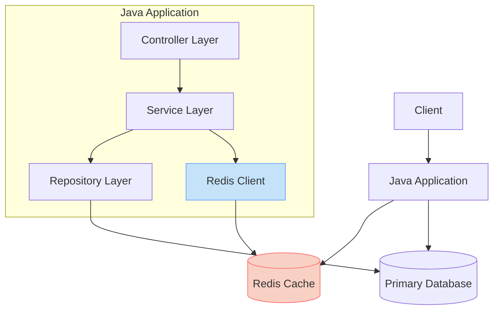

# Redis Java Integration

## Introduction

Redis (Remote Dictionary Server) is an open-source, in-memory data structure store that can be used as a database, cache, message broker, and streaming engine. Its high performance, versatility, and simplicity make it a popular choice for many applications.

In this guide, we'll explore how to integrate Redis with Java applications. Whether you're building a web application that needs caching, implementing a message queue, or working with high-throughput data processing, understanding Redis Java integration will be invaluable to your development skills.

## Why Use Redis with Java?

Before diving into implementation details, let's understand why you might want to use Redis with your Java applications:

1. **Performance**: Redis stores data in memory, making it extremely fast compared to disk-based databases.
2. **Versatility**: Redis supports various data structures like strings, hashes, lists, sets, and sorted sets.
3. **Scalability**: Redis can be scaled horizontally using Redis Cluster for handling large datasets.
4. **Simplicity**: Redis has a straightforward API that's easy to learn and use.

## Redis Java Clients

There are several Java clients available for Redis. The three most popular ones are:

1. **Jedis**: A simple and lightweight client
2. **Lettuce**: A scalable thread-safe client
3. **Redisson**: A feature-rich client that provides many distributed objects and services

Let's explore each of these clients and learn how to use them.

## Setting Up Redis

Before we start coding, make sure you have Redis installed and running. You can download Redis from the [official website](https://redis.io/download) or use Docker:

```bash
docker run --name redis -p 6379:6379 -d redis
```

## Using Jedis Client

Jedis is one of the most straightforward Redis clients for Java. Let's start by adding Jedis to our project.

### Adding Jedis Dependency

For Maven:

```xml
<dependency>
    <groupId>redis.clients</groupId>
    <artifactId>jedis</artifactId>
    <version>4.4.3</version>
</dependency>
```

For Gradle:

```groovy
implementation 'redis.clients:jedis:4.4.3'
```

### Basic Operations with Jedis

Let's see how to perform basic operations with Jedis:

```java
import redis.clients.jedis.Jedis;
import redis.clients.jedis.JedisPool;
import redis.clients.jedis.JedisPoolConfig;

public class JedisExample {
    
    public static void main(String[] args) {
        // Create a connection pool
        JedisPoolConfig poolConfig = new JedisPoolConfig();
        poolConfig.setMaxTotal(10);
        poolConfig.setMaxIdle(5);
        poolConfig.setMinIdle(1);
        
        try (JedisPool jedisPool = new JedisPool(poolConfig, "localhost", 6379)) {
            // Get a connection from the pool
            try (Jedis jedis = jedisPool.getResource()) {
                
                // String operations
                jedis.set("greeting", "Hello from Redis!");
                String greeting = jedis.get("greeting");
                System.out.println(greeting); // Output: Hello from Redis!
                
                // List operations
                jedis.lpush("languages", "Java");
                jedis.lpush("languages", "Python");
                jedis.lpush("languages", "JavaScript");
                System.out.println(jedis.lrange("languages", 0, -1)); 
                // Output: [JavaScript, Python, Java]
                
                // Hash operations
                jedis.hset("user:1", "name", "John");
                jedis.hset("user:1", "email", "john@example.com");
                System.out.println(jedis.hgetAll("user:1"));
                // Output: {name=John, email=john@example.com}
                
                // Set operations
                jedis.sadd("tags", "redis", "database", "nosql");
                System.out.println(jedis.smembers("tags"));
                // Output: [redis, database, nosql]
                
                // Delete keys
                jedis.del("greeting", "languages", "user:1", "tags");
            }
        }
    }
}
```

### Working with Transactions

Redis supports transactions, which allow you to execute multiple commands as a single atomic operation:

```java
import redis.clients.jedis.Jedis;
import redis.clients.jedis.JedisPool;
import redis.clients.jedis.Transaction;

public class JedisTransactionExample {
    
    public static void main(String[] args) {
        try (JedisPool jedisPool = new JedisPool("localhost", 6379);
             Jedis jedis = jedisPool.getResource()) {
            
            // Start a transaction
            Transaction transaction = jedis.multi();
            
            // Queue commands
            transaction.set("firstname", "John");
            transaction.set("lastname", "Doe");
            transaction.set("age", "30");
            
            // Execute the transaction
            transaction.exec();
            
            // Verify the results
            System.out.println("First name: " + jedis.get("firstname"));
            System.out.println("Last name: " + jedis.get("lastname"));
            System.out.println("Age: " + jedis.get("age"));
            
            // Output:
            // First name: John
            // Last name: Doe
            // Age: 30
            
            // Clean up
            jedis.del("firstname", "lastname", "age");
        }
    }
}
```

## Using Lettuce Client

Lettuce is a more advanced Redis client that supports synchronous, asynchronous, and reactive usage patterns.

### Adding Lettuce Dependency

For Maven:

```xml
<dependency>
    <groupId>io.lettuce</groupId>
    <artifactId>lettuce-core</artifactId>
    <version>6.2.4.RELEASE</version>
</dependency>
```

For Gradle:

```groovy
implementation 'io.lettuce:lettuce-core:6.2.4.RELEASE'
```

### Basic Operations with Lettuce

```java
import io.lettuce.core.RedisClient;
import io.lettuce.core.api.StatefulRedisConnection;
import io.lettuce.core.api.sync.RedisCommands;

public class LettuceExample {
    
    public static void main(String[] args) {
        // Create a client
        RedisClient redisClient = RedisClient.create("redis://localhost:6379");
        
        // Get a connection
        try (StatefulRedisConnection<String, String> connection = redisClient.connect()) {
            
            // Get a synchronous command interface
            RedisCommands<String, String> syncCommands = connection.sync();
            
            // String operations
            syncCommands.set("greeting", "Hello from Lettuce!");
            String greeting = syncCommands.get("greeting");
            System.out.println(greeting); // Output: Hello from Lettuce!
            
            // List operations
            syncCommands.lpush("languages", "Java");
            syncCommands.lpush("languages", "Python");
            syncCommands.lpush("languages", "JavaScript");
            System.out.println(syncCommands.lrange("languages", 0, -1));
            // Output: [JavaScript, Python, Java]
            
            // Hash operations
            syncCommands.hset("user:2", "name", "Alice");
            syncCommands.hset("user:2", "email", "alice@example.com");
            System.out.println(syncCommands.hgetall("user:2"));
            // Output: {name=Alice, email=alice@example.com}
            
            // Clean up
            syncCommands.del("greeting", "languages", "user:2");
        } finally {
            // Shut down the client
            redisClient.shutdown();
        }
    }
}
```

### Asynchronous Operations with Lettuce

Lettuce supports asynchronous operations, which can improve performance for I/O-bound operations:

```java
import io.lettuce.core.RedisClient;
import io.lettuce.core.api.StatefulRedisConnection;
import io.lettuce.core.api.async.RedisAsyncCommands;

import java.util.concurrent.ExecutionException;

public class LettuceAsyncExample {
    
    public static void main(String[] args) throws ExecutionException, InterruptedException {
        RedisClient redisClient = RedisClient.create("redis://localhost:6379");
        
        try (StatefulRedisConnection<String, String> connection = redisClient.connect()) {
            
            // Get an asynchronous command interface
            RedisAsyncCommands<String, String> asyncCommands = connection.async();
            
            // Execute commands asynchronously
            asyncCommands.set("counter", "1");
            asyncCommands.incr("counter");
            asyncCommands.incr("counter");
            
            // Get the result (blocks until available)
            Long counterValue = asyncCommands.get("counter")
                    .thenApply(Long::parseLong)
                    .get();
            
            System.out.println("Counter value: " + counterValue);
            // Output: Counter value: 3
            
            // Clean up
            asyncCommands.del("counter");
        } finally {
            redisClient.shutdown();
        }
    }
}
```

## Using Redisson Client

Redisson provides many distributed Java objects and services on top of Redis.

### Adding Redisson Dependency

For Maven:

```xml
<dependency>
    <groupId>org.redisson</groupId>
    <artifactId>redisson</artifactId>
    <version>3.23.0</version>
</dependency>
```

For Gradle:

```groovy
implementation 'org.redisson:redisson:3.23.0'
```

### Basic Operations with Redisson

```java
import org.redisson.Redisson;
import org.redisson.api.RBucket;
import org.redisson.api.RList;
import org.redisson.api.RMap;
import org.redisson.api.RedissonClient;
import org.redisson.config.Config;

public class RedissonExample {
    
    public static void main(String[] args) {
        // Create configuration
        Config config = new Config();
        config.useSingleServer()
                .setAddress("redis://localhost:6379");
        
        // Create client
        RedissonClient redisson = Redisson.create(config);
        
        try {
            // String operations using Bucket
            RBucket<String> bucket = redisson.getBucket("message");
            bucket.set("Hello from Redisson!");
            System.out.println(bucket.get()); // Output: Hello from Redisson!
            
            // List operations
            RList<String> list = redisson.getList("colors");
            list.add("red");
            list.add("green");
            list.add("blue");
            System.out.println(list); // Output: [red, green, blue]
            
            // Map operations
            RMap<String, String> map = redisson.getMap("person");
            map.put("name", "Bob");
            map.put("age", "25");
            map.put("city", "New York");
            System.out.println(map.entrySet());
            // Output: [name=Bob, age=25, city=New York]
            
            // Clean up
            bucket.delete();
            list.delete();
            map.delete();
        } finally {
            // Shutdown the client
            redisson.shutdown();
        }
    }
}
```

### Using Distributed Objects with Redisson

Redisson provides distributed objects like locks, semaphores, and atomic objects:

```java
import org.redisson.Redisson;
import org.redisson.api.RLock;
import org.redisson.api.RedissonClient;
import org.redisson.config.Config;

import java.util.concurrent.TimeUnit;

public class RedissonLockExample {
    
    public static void main(String[] args) throws InterruptedException {
        Config config = new Config();
        config.useSingleServer().setAddress("redis://localhost:6379");
        
        RedissonClient redisson = Redisson.create(config);
        
        try {
            // Create a distributed lock
            RLock lock = redisson.getLock("myLock");
            
            // Acquire the lock (waits up to 10 seconds to acquire, holds for 30 seconds)
            boolean isLocked = lock.tryLock(10, 30, TimeUnit.SECONDS);
            
            if (isLocked) {
                try {
                    System.out.println("Lock acquired, performing protected operation");
                    // Critical section - operations that require synchronization
                    Thread.sleep(5000); // Simulate work
                } finally {
                    // Always release the lock in a finally block
                    lock.unlock();
                    System.out.println("Lock released");
                }
            } else {
                System.out.println("Could not acquire the lock");
            }
            
        } finally {
            redisson.shutdown();
        }
    }
}
```

## Handling Redis Connection in a Spring Boot Application

If you're using Spring Boot, you can easily integrate Redis using Spring Data Redis:

### Adding Spring Data Redis Dependency

For Maven:

```xml
<dependency>
    <groupId>org.springframework.boot</groupId>
    <artifactId>spring-boot-starter-data-redis</artifactId>
</dependency>
```

For Gradle:

```groovy
implementation 'org.springframework.boot:spring-boot-starter-data-redis'
```

### Redis Configuration

```java
import org.springframework.context.annotation.Bean;
import org.springframework.context.annotation.Configuration;
import org.springframework.data.redis.connection.RedisConnectionFactory;
import org.springframework.data.redis.connection.lettuce.LettuceConnectionFactory;
import org.springframework.data.redis.core.RedisTemplate;
import org.springframework.data.redis.serializer.StringRedisSerializer;

@Configuration
public class RedisConfig {
    
    @Bean
    public RedisConnectionFactory redisConnectionFactory() {
        return new LettuceConnectionFactory("localhost", 6379);
    }
    
    @Bean
    public RedisTemplate<String, Object> redisTemplate() {
        RedisTemplate<String, Object> template = new RedisTemplate<>();
        template.setConnectionFactory(redisConnectionFactory());
        template.setKeySerializer(new StringRedisSerializer());
        return template;
    }
}
```

### Using RedisTemplate

```java
import org.springframework.beans.factory.annotation.Autowired;
import org.springframework.data.redis.core.RedisTemplate;
import org.springframework.stereotype.Service;

@Service
public class CacheService {
    
    private final RedisTemplate<String, Object> redisTemplate;
    
    @Autowired
    public CacheService(RedisTemplate<String, Object> redisTemplate) {
        this.redisTemplate = redisTemplate;
    }
    
    public void setValue(String key, Object value) {
        redisTemplate.opsForValue().set(key, value);
    }
    
    public Object getValue(String key) {
        return redisTemplate.opsForValue().get(key);
    }
    
    public void deleteValue(String key) {
        redisTemplate.delete(key);
    }
}
```

## Redis Pub/Sub with Java

Redis supports Publish/Subscribe messaging pattern. Here's how to implement it with Jedis:

```java
import redis.clients.jedis.Jedis;
import redis.clients.jedis.JedisPool;
import redis.clients.jedis.JedisPubSub;

public class RedisPubSubExample {
    
    public static void main(String[] args) {
        // Create a Redis pool
        JedisPool jedisPool = new JedisPool("localhost", 6379);
        
        // Start a subscriber in a separate thread
        new Thread(() -> {
            try (Jedis subscriberJedis = jedisPool.getResource()) {
                System.out.println("Subscriber is listening to 'news' channel...");
                
                // Create a subscriber
                JedisPubSub jedisPubSub = new JedisPubSub() {
                    @Override
                    public void onMessage(String channel, String message) {
                        System.out.println("Received message on channel '" + channel + "': " + message);
                        
                        // Unsubscribe after receiving specific message
                        if (message.equals("END")) {
                            this.unsubscribe();
                        }
                    }
                    
                    @Override
                    public void onSubscribe(String channel, int subscribedChannels) {
                        System.out.println("Subscribed to channel: " + channel);
                    }
                    
                    @Override
                    public void onUnsubscribe(String channel, int subscribedChannels) {
                        System.out.println("Unsubscribed from channel: " + channel);
                    }
                };
                
                // Subscribe to the "news" channel
                subscriberJedis.subscribe(jedisPubSub, "news");
                System.out.println("Subscription ended.");
            }
        }).start();
        
        // Wait for subscriber to start
        try {
            Thread.sleep(1000);
        } catch (InterruptedException e) {
            Thread.currentThread().interrupt();
        }
        
        // Publish messages
        try (Jedis publisherJedis = jedisPool.getResource()) {
            System.out.println("Publishing messages to 'news' channel...");
            publisherJedis.publish("news", "Breaking news: Redis is awesome!");
            
            try {
                Thread.sleep(1000);
            } catch (InterruptedException e) {
                Thread.currentThread().interrupt();
            }
            
            publisherJedis.publish("news", "More news: Java Redis integration is easy!");
            
            try {
                Thread.sleep(1000);
            } catch (InterruptedException e) {
                Thread.currentThread().interrupt();
            }
            
            publisherJedis.publish("news", "END");
        }
        
        // Close the pool after a delay
        try {
            Thread.sleep(2000);
        } catch (InterruptedException e) {
            Thread.currentThread().interrupt();
        }
        
        jedisPool.close();
    }
}
```

Output:
```
Subscriber is listening to 'news' channel...
Subscribed to channel: news
Publishing messages to 'news' channel...
Received message on channel 'news': Breaking news: Redis is awesome!
Received message on channel 'news': More news: Java Redis integration is easy!
Received message on channel 'news': END
Unsubscribed from channel: news
Subscription ended.
```

## Caching in Java Applications with Redis

One of the most common uses of Redis is as a cache. Here's how to implement a simple caching mechanism:

```java
import redis.clients.jedis.Jedis;
import redis.clients.jedis.JedisPool;

import java.util.function.Supplier;

public class RedisCacheExample {
    
    private final JedisPool jedisPool;
    private final int defaultExpirySeconds = 3600; // 1 hour
    
    public RedisCacheExample(String host, int port) {
        this.jedisPool = new JedisPool(host, port);
    }
    
    public <T> T getWithCache(String key, Supplier<T> dataLoader, Class<T> type) {
        try (Jedis jedis = jedisPool.getResource()) {
            // Try to get from cache
            String cachedValue = jedis.get(key);
            
            if (cachedValue != null) {
                System.out.println("Cache hit for key: " + key);
                // Convert string to required type (simplified for demo)
                if (type == String.class) {
                    return type.cast(cachedValue);
                }
                if (type == Integer.class) {
                    return type.cast(Integer.parseInt(cachedValue));
                }
                if (type == Long.class) {
                    return type.cast(Long.parseLong(cachedValue));
                }
                if (type == Boolean.class) {
                    return type.cast(Boolean.parseBoolean(cachedValue));
                }
                // Add more type conversions as needed
                throw new UnsupportedOperationException("Type conversion not supported for: " + type.getName());
            }
            
            // Cache miss - load data and store in cache
            System.out.println("Cache miss for key: " + key);
            T value = dataLoader.get();
            
            if (value != null) {
                jedis.setex(key, defaultExpirySeconds, value.toString());
            }
            
            return value;
        }
    }
    
    public void invalidateCache(String key) {
        try (Jedis jedis = jedisPool.getResource()) {
            jedis.del(key);
            System.out.println("Invalidated cache for key: " + key);
        }
    }
    
    public void close() {
        jedisPool.close();
    }
    
    public static void main(String[] args) {
        RedisCacheExample cache = new RedisCacheExample("localhost", 6379);
        
        try {
            // Expensive operation simulated with a supplier
            Supplier<String> expensiveOperation = () -> {
                System.out.println("Performing expensive operation...");
                try {
                    Thread.sleep(2000); // Simulate expensive operation
                } catch (InterruptedException e) {
                    Thread.currentThread().interrupt();
                }
                return "Result of expensive operation";
            };
            
            // First call - should be a cache miss
            String result1 = cache.getWithCache("expensive-op", expensiveOperation, String.class);
            System.out.println("Result: " + result1);
            
            // Second call - should be a cache hit
            String result2 = cache.getWithCache("expensive-op", expensiveOperation, String.class);
            System.out.println("Result: " + result2);
            
            // Invalidate cache
            cache.invalidateCache("expensive-op");
            
            // Third call - should be a cache miss again
            String result3 = cache.getWithCache("expensive-op", expensiveOperation, String.class);
            System.out.println("Result: " + result3);
            
        } finally {
            cache.close();
        }
    }
}
```

Output:
```
Cache miss for key: expensive-op
Performing expensive operation...
Result: Result of expensive operation
Cache hit for key: expensive-op
Result: Result of expensive operation
Invalidated cache for key: expensive-op
Cache miss for key: expensive-op
Performing expensive operation...
Result: Result of expensive operation
```

## Redis Architecture with Java Applications

Let's visualize how Redis fits into a typical Java application architecture:



## Best Practices for Redis with Java

1. **Use Connection Pooling**: Always use connection pooling to avoid the overhead of establishing new connections.

2. **Proper Resource Management**: Always close Redis connections and clients using try-with-resources or in finally blocks.

3. **Choose the Right Client**: 
   - **Jedis**: Simple and straightforward for basic usage
   - **Lettuce**: Better for reactive applications or when you need thread safety
   - **Redisson**: When you need distributed objects and advanced features

4. **Set Expiration Time**: Always set an expiration time for cached data to prevent memory issues.

5. **Use Pipeline for Bulk Operations**: When performing multiple operations, use pipelining to reduce network overhead:

```java
import redis.clients.jedis.Jedis;
import redis.clients.jedis.JedisPool;
import redis.clients.jedis.Pipeline;

public class JedisPipelineExample {
    
    public static void main(String[] args) {
        try (JedisPool jedisPool = new JedisPool("localhost", 6379);
             Jedis jedis = jedisPool.getResource()) {
            
            long startTime = System.currentTimeMillis();
            
            // Without pipeline - each command is sent individually
            for (int i = 0; i < 1000; i++) {
                jedis.set("key" + i, "value" + i);
            }
            
            long endTime = System.currentTimeMillis();
            System.out.println("Time without pipeline: " + (endTime - startTime) + "ms");
            
            // Clear all keys
            jedis.flushAll();
            
            // With pipeline - commands are batched
            startTime = System.currentTimeMillis();
            
            Pipeline pipeline = jedis.pipelined();
            for (int i = 0; i < 1000; i++) {
                pipeline.set("key" + i, "value" + i);
            }
            pipeline.sync(); // Execute all commands in the pipeline
            
            endTime = System.currentTimeMillis();
            System.out.println("Time with pipeline: " + (endTime - startTime) + "ms");
            
            // Clean up
            jedis.flushAll();
        }
    }
}
```

6. **Use Serialization**: For complex objects, use a serialization mechanism like JSON, Protocol Buffers, or Java serialization.

7. **Handle Failures Gracefully**: Implement proper exception handling and fallback mechanisms.

8. **Monitor Redis**: Use Redis monitoring tools to track performance and memory usage.

## Common Redis Use Cases in Java Applications

### 1. Caching

Using Redis for caching database queries, API responses, or computation results:

```java
// Pseudo-code for a service with Redis caching
public class ProductService {
    private final ProductRepository repository;
    private final JedisPool jedisPool;
    
    // Constructor and initialization...
    
    public Product getProduct(String productId) {
        try (Jedis jedis = jedisPool.getResource()) {
            // Try to get from cache
            String cachedProduct = jedis.get("product:" + productId);
            
            if (cachedProduct != null) {
                // Deserialize from JSON
                return deserializeFromJson(cachedProduct, Product.class);
            }
            
            // Not in cache, get from database
            Product product = repository.findById(productId);
            
            if (product != null) {
                // Store in cache for 1 hour
                jedis.setex("product:" + productId, 3600, serializeToJson(product));
            }
            
            return product;
        }
    }
    
    private String serializeToJson(Object object) {
        // Implementation
    }
    
    private <T> T deserializeFromJson(String json, Class<T> type) {
        // Implementation
    }
}
```

### 2. Session Storage

Redis is ideal for storing session data in distributed systems:

```java
public class RedisSessionManager {
    private final JedisPool jedisPool;
    private final int sessionTimeoutSeconds = 1800; // 30 minutes
    
    // Constructor and initialization...
    
    public void saveSession(String sessionId, Map<String, Object> sessionData) {
        try (Jedis jedis = jedisPool.getResource()) {
            // Store each session attribute
            for (Map.Entry<String, Object> entry : sessionData.entrySet()) {
                jedis.hset("session:" + sessionId, entry.getKey(), entry.getValue().toString());
            }
            
            // Set expiration
            jedis.expire("session:" + sessionId, sessionTimeoutSeconds);
        }
    }
    
    public Map<String, String> getSession(String sessionId) {
        try (Jedis jedis = jedisPool.getResource()) {
            Map<String, String> sessionData = jedis.hgetAll("session:" + sessionId);
            
            // Refresh expiration on access
            if (!sessionData.isEmpty()) {
                jedis.expire("session:" + sessionId, sessionTimeoutSeconds);
            }
            
            return sessionData;
        }
    }
    
    public void invalidateSession(String sessionId) {
        try (Jedis jedis = jedisPool.getResource()) {
            jedis.del("session:" + sessionId);
        }
    }
}
```

### 3. Rate Limiting

Implementing rate limiting to protect APIs:

```java
public class RedisRateLimiter {
    private final JedisPool jedisPool;
    
    // Constructor and initialization...
    
    /**
     * Check if a request is allowed based on rate limiting.
     * 
     * @param userId User identifier
     * @param limit Maximum number of requests allowed in the time window
     * @param windowSeconds Time window in seconds
     * @return true if request is allowed, false otherwise
     */
    public boolean isAllowed(String userId, int limit, int windowSeconds) {
        String key = "ratelimit:" + userId;
        long currentTime = System.currentTimeMillis();
        
        try (Jedis jedis = jedisPool.getResource()) {
            // Clean up old requests
            jedis.zremrangeByScore(key, 0, currentTime - (windowSeconds * 1000));
            
            // Count requests in the current window
            long requestCount = jedis.zcard(key);
            
            if (requestCount < limit) {
                // Add current request with timestamp
                jedis.zadd(key, currentTime, String.valueOf(currentTime));
                // Set expiration on the key
                jedis.expire(key, windowSeconds);
                return true;
            } else {
                return false;
            }
        }
    }
}
```

### 4. Job Queues

Implementing reliable job queues:

```java
public class RedisJobQueue {
    private final JedisPool jedisPool;
    private final String queueName;
    
    public RedisJobQueue(JedisPool jedisPool, String queueName) {
        this.jedisPool = jedisPool;
        this.queueName = queueName;
    }
    
    public void addJob(String jobData) {
        try (Jedis jedis = jedisPool.getResource()) {
            jedis.rpush(queueName, jobData);
        }
    }
    
    public String takeJob(int timeoutSeconds) {
        try (Jedis jedis = jedisPool.getResource()) {
            // BLPOP will block until a job is available or timeout
            List<String> result = jedis.blpop(timeoutSeconds, queueName);
            return result != null && result.size() > 1 ? result.get(1) : null;
        }
    }
    
    public int getQueueSize() {
        try (Jedis jedis = jedisPool.getResource()) {
            return jedis.llen(queueName).intValue();
        }
    }
}
```

## Troubleshooting Redis Java Integration

Here are some common issues when working with Redis in Java and how to solve them:

1. **Connection Refused**:
   - Ensure Redis server is running
   - Check firewall settings
   - Verify connection details (host, port)

2. **Out of Memory**:
   - Set appropriate maxmemory in Redis configuration
   - Use eviction policies (e.g., volatile-lru)
   - Set TTL (time-to-live) for keys

3. **Connection Pool Exhaustion**:
   - Increase pool size
   - Ensure connections are properly closed
   - Check for connection leaks

4. **Slow Response Times**:
   - Use pipelining for bulk operations
   - Monitor Redis memory usage
   -