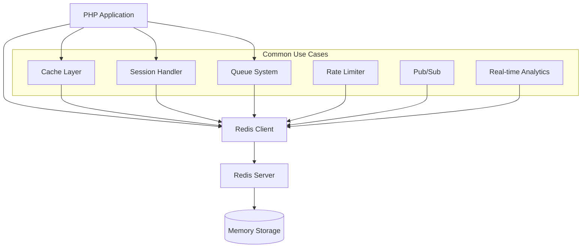

# Redis PHP Integration

## Introduction

Redis (Remote Dictionary Server) is an open-source, in-memory data structure store that can be used as a database, cache, message broker, and queue. When combined with PHP, Redis provides a powerful solution for improving application performance, managing sessions, implementing real-time features, and much more.

This guide will walk you through integrating Redis with PHP applications, from installation to implementing common patterns and solutions for real-world scenarios.

## Prerequisites

Before we begin, make sure you have:

1. PHP 7.4+ installed
2. Redis server installed and running
3. Composer (PHP package manager)

## Installing Redis PHP Extension

There are two main ways to work with Redis in PHP: using the PhpRedis extension (C extension) or using the Predis library (pure PHP implementation).

### Option 1: PhpRedis Extension (Recommended for Production)

The PhpRedis extension is written in C and offers better performance.

```bash
# For Ubuntu/Debian
sudo apt-get install php-redis

# For CentOS/RHEL
sudo yum install php-redis

# For macOS with Homebrew
brew install php-redis
```

After installation, restart your web server:

```bash
# For Apache
sudo service apache2 restart

# For Nginx with PHP-FPM
sudo service php7.4-fpm restart
```

### Option 2: Predis Library

Predis is a pure PHP implementation and is easier to install via Composer:

```bash
composer require predis/predis
```

## Basic Connection to Redis

Let's start with a simple example of connecting to Redis and performing basic operations:

### Using PhpRedis

```php
<?php
// Connect to Redis
$redis = new Redis();
$redis->connect('127.0.0.1', 6379);

// Optional: set password if configured
// $redis->auth('your_password');

// Simple string operations
$redis->set('greeting', 'Hello Redis!');
$value = $redis->get('greeting');

echo $value; // Outputs: Hello Redis!
```

### Using Predis

```php
<?php
require 'vendor/autoload.php';

$client = new Predis\Client([
    'scheme' => 'tcp',
    'host'   => '127.0.0.1',
    'port'   => 6379,
]);

$client->set('greeting', 'Hello Redis!');
$value = $client->get('greeting');

echo $value; // Outputs: Hello Redis!
```

## Common Redis Data Structures in PHP

Redis supports various data structures. Let's explore how to use them in PHP:

### Strings

Strings are the most basic Redis data type and can store text, numbers, or serialized data.

```php
<?php
// Set a string value
$redis->set('user:name', 'John Doe');

// Get the value
echo $redis->get('user:name'); // John Doe

// Set multiple values at once
$redis->mset([
    'user:email' => 'john@example.com',
    'user:age' => 30
]);

// Get multiple values
$values = $redis->mget(['user:name', 'user:email']);
print_r($values); // Array ( [0] => John Doe [1] => john@example.com )

// Increment a numeric value
$redis->set('counter', 10);
$redis->incr('counter');
echo $redis->get('counter'); // 11

// Set expiration time (in seconds)
$redis->set('temp_key', 'This will expire', ['ex' => 60]); // Expires in 60 seconds
```

### Lists

Lists in Redis are linked lists that allow you to push and pop elements from both ends:

```php
<?php
// Push items to the right of the list
$redis->rPush('tasks', 'Task 1');
$redis->rPush('tasks', 'Task 2');
$redis->rPush('tasks', 'Task 3');

// Push to the left
$redis->lPush('tasks', 'Urgent Task');

// Get list length
echo $redis->lLen('tasks'); // 4

// Get range of elements (all elements in this case)
$tasks = $redis->lRange('tasks', 0, -1);
print_r($tasks);
// Output: Array ( [0] => Urgent Task [1] => Task 1 [2] => Task 2 [3] => Task 3 )

// Pop from the left (first item)
$task = $redis->lPop('tasks');
echo $task; // Urgent Task

// Pop from the right (last item)
$task = $redis->rPop('tasks');
echo $task; // Task 3
```

### Sets

Sets are unordered collections of unique strings:

```php
<?php
// Add members to a set
$redis->sAdd('tags', 'php');
$redis->sAdd('tags', 'redis');
$redis->sAdd('tags', 'nosql');
$redis->sAdd('tags', 'php'); // Won't be added as it's already there

// Get all members of the set
$tags = $redis->sMembers('tags');
print_r($tags);
// Output: Array ( [0] => php [1] => redis [2] => nosql )

// Check if a member exists
$exists = $redis->sIsMember('tags', 'php');
echo $exists ? "Exists" : "Doesn't exist"; // Exists

// Remove a member
$redis->sRem('tags', 'nosql');

// Count members
echo $redis->sCard('tags'); // 2

// Set operations
$redis->sAdd('frontend_tags', 'javascript');
$redis->sAdd('frontend_tags', 'css');
$redis->sAdd('frontend_tags', 'html');

// Union of sets
$allTags = $redis->sUnion('tags', 'frontend_tags');
print_r($allTags);
// Output includes all unique tags from both sets
```

### Hashes

Hashes are maps between string fields and string values:

```php
<?php
// Set multiple hash fields
$redis->hMSet('user:1', [
    'username' => 'johndoe',
    'email' => 'john@example.com',
    'age' => 30,
    'active' => 1
]);

// Get specific field
echo $redis->hGet('user:1', 'username'); // johndoe

// Get all fields and values
$userData = $redis->hGetAll('user:1');
print_r($userData);
/* Output:
Array (
    [username] => johndoe
    [email] => john@example.com
    [age] => 30
    [active] => 1
)
*/

// Check if a field exists
$exists = $redis->hExists('user:1', 'email');
echo $exists ? "Exists" : "Doesn't exist"; // Exists

// Increment a numeric field
$redis->hIncrBy('user:1', 'age', 1);
echo $redis->hGet('user:1', 'age'); // 31

// Delete a field
$redis->hDel('user:1', 'active');
```

### Sorted Sets

Sorted sets combine elements of sets with a score that allows elements to be ordered:

```php
<?php
// Add members with scores
$redis->zAdd('leaderboard', 1000, 'user1');
$redis->zAdd('leaderboard', 2500, 'user2');
$redis->zAdd('leaderboard', 1800, 'user3');

// Get rank of a member (zero-based, ascending order)
echo $redis->zRank('leaderboard', 'user3'); // 1

// Get score of a member
echo $redis->zScore('leaderboard', 'user2'); // 2500

// Get range by rank (lowest to highest score)
$users = $redis->zRange('leaderboard', 0, -1);
print_r($users); // Array ( [0] => user1 [1] => user3 [2] => user2 )

// Get range by rank with scores
$usersWithScores = $redis->zRange('leaderboard', 0, -1, true);
print_r($usersWithScores);
/* Output:
Array (
    [user1] => 1000
    [user3] => 1800
    [user2] => 2500
)
*/

// Get range by score
$users = $redis->zRangeByScore('leaderboard', 1500, 3000);
print_r($users); // Array ( [0] => user3 [1] => user2 )

// Increment a score
$redis->zIncrBy('leaderboard', 500, 'user1');
echo $redis->zScore('leaderboard', 'user1'); // 1500
```

## Practical Use Cases

Let's explore some common practical applications of Redis with PHP:

### Caching Database Results

Using Redis as a cache can significantly improve application performance:

```php
<?php
function getUserData($userId) {
    global $redis, $db;
    
    // Try to get from cache first
    $cacheKey = "user:{$userId}";
    $userData = $redis->get($cacheKey);
    
    if ($userData) {
        // Data found in cache, unserialize and return
        return unserialize($userData);
    }
    
    // Cache miss, get from database
    $query = "SELECT * FROM users WHERE id = ?";
    $stmt = $db->prepare($query);
    $stmt->execute([$userId]);
    $userData = $stmt->fetch(PDO::FETCH_ASSOC);
    
    if ($userData) {
        // Store in cache for future requests (expire in 1 hour)
        $redis->set($cacheKey, serialize($userData), ['ex' => 3600]);
    }
    
    return $userData;
}

// Usage
$user = getUserData(123);
```

### Session Management

Redis is excellent for session management, especially in distributed environments:

```php
<?php
// Set Redis as the session handler
ini_set('session.save_handler', 'redis');
ini_set('session.save_path', 'tcp://127.0.0.1:6379');

// Or programmatically
$sessionHandler = new \SessionHandler();
if ($sessionHandler instanceof \SessionHandlerInterface) {
    session_set_save_handler($sessionHandler, true);
}

// Start session as usual
session_start();

// Use sessions normally
$_SESSION['user_id'] = 123;
$_SESSION['username'] = 'johndoe';
```

For more control, you can implement a custom session handler:

```php
<?php
class RedisSessionHandler implements \SessionHandlerInterface
{
    private $redis;
    private $ttl;
    
    public function __construct(Redis $redis, $ttl = 3600)
    {
        $this->redis = $redis;
        $this->ttl = $ttl;
    }
    
    public function open($savePath, $sessionName)
    {
        return true;
    }
    
    public function close()
    {
        return true;
    }
    
    public function read($id)
    {
        $data = $this->redis->get("session:{$id}");
        return $data ?: '';
    }
    
    public function write($id, $data)
    {
        return $this->redis->set("session:{$id}", $data, ['ex' => $this->ttl]);
    }
    
    public function destroy($id)
    {
        return $this->redis->del("session:{$id}");
    }
    
    public function gc($maxlifetime)
    {
        // Redis automatically expires keys, so no garbage collection needed
        return true;
    }
}

// Usage
$redis = new Redis();
$redis->connect('127.0.0.1', 6379);
$handler = new RedisSessionHandler($redis);
session_set_save_handler($handler, true);
session_start();
```

### Rate Limiting

Implement a rate limiter to protect your API from abuse:

```php
<?php
function isRateLimited($userId, $maxRequests = 100, $period = 3600)
{
    global $redis;
    
    $key = "ratelimit:{$userId}";
    $current = $redis->get($key);
    
    if (!$current) {
        // First request in the period
        $redis->set($key, 1, ['ex' => $period]);
        return false;
    }
    
    if ($current >= $maxRequests) {
        // Rate limit exceeded
        return true;
    }
    
    // Increment and continue
    $redis->incr($key);
    return false;
}

// Usage
$userId = 123;
if (isRateLimited($userId, 100, 3600)) {
    header('HTTP/1.1 429 Too Many Requests');
    echo json_encode(['error' => 'Rate limit exceeded. Try again later.']);
    exit;
}

// Process the request normally...
```

### Simple Job Queue

Create a basic job queue for background processing:

```php
<?php
// Producer: Add jobs to the queue
function addJob($jobData)
{
    global $redis;
    
    $job = json_encode([
        'id' => uniqid(),
        'created_at' => time(),
        'data' => $jobData
    ]);
    
    return $redis->rPush('job_queue', $job);
}

// Consumer: Process jobs from the queue
function processJobs()
{
    global $redis;
    
    while (true) {
        // Get job with a 10-second timeout
        $job = $redis->blPop('job_queue', 10);
        
        if (!$job) {
            // No jobs available, could sleep or exit
            echo "No jobs available
";
            continue;
        }
        
        // Job structure: [0] => queue name, [1] => job data
        $jobData = json_decode($job[1], true);
        
        echo "Processing job {$jobData['id']}
";
        
        // Process job based on data
        // ...
        
        echo "Job completed
";
    }
}

// Usage example
addJob(['action' => 'send_email', 'to' => 'user@example.com', 'subject' => 'Hello']);
// In a separate process or script, run processJobs();
```

### Real-time Analytics

Track page views or events in real-time:

```php
<?php
// Track page view
function trackPageView($page)
{
    global $redis;
    
    // Increment total views
    $redis->incr("pageviews:{$page}");
    
    // Increment views for today
    $today = date('Y-m-d');
    $redis->incr("pageviews:{$page}:{$today}");
    
    // Add to sorted set for rankings
    $redis->zIncrBy('popular_pages', 1, $page);
}

// Get top pages
function getTopPages($limit = 10)
{
    global $redis;
    
    // Get highest scoring pages with their scores
    return $redis->zRevRange('popular_pages', 0, $limit - 1, true);
}

// Usage
trackPageView('/home');
trackPageView('/products');
trackPageView('/home');

$topPages = getTopPages(5);
print_r($topPages);
```

## Redis PHP Architecture Patterns

Here's a diagram showing common Redis PHP integration patterns:



## Best Practices

When working with Redis in PHP, consider these best practices:

1. **Connection Pooling**: Use connection pooling when possible to avoid creating new connections for each request.

```php
<?php
// Create a singleton Redis connection
class RedisConnection
{
    private static $instance = null;
    private $redis;
    
    private function __construct()
    {
        $this->redis = new Redis();
        $this->redis->connect('127.0.0.1', 6379);
        $this->redis->setOption(Redis::OPT_READ_TIMEOUT, -1);
    }
    
    public static function getInstance()
    {
        if (self::$instance === null) {
            self::$instance = new self();
        }
        
        return self::$instance->redis;
    }
}

// Usage
$redis = RedisConnection::getInstance();
$redis->set('key', 'value');
```

2. **Key Naming Conventions**: Use consistent naming patterns for keys:

```php
// Good pattern: object-type:id:field
$redis->set('user:1000:profile', $profileData);
$redis->set('product:55:stock', 100);

// Use colons as separators for namespacing
$redis->set('cache:frontend:header', $headerHtml);
```

3. **Data Serialization**: Always serialize/unserialize complex data:

```php
<?php
// Store array or object
$data = ['name' => 'John', 'skills' => ['PHP', 'Redis', 'MySQL']];
$redis->set('user:data', serialize($data));

// Retrieve
$data = unserialize($redis->get('user:data'));

// Alternative: JSON
$redis->set('user:json', json_encode($data));
$data = json_decode($redis->get('user:json'), true);
```

4. **Error Handling**: Always handle Redis connection errors:

```php
<?php
try {
    $redis = new Redis();
    $redis->connect('127.0.0.1', 6379, 2.0); // 2 second timeout
    // Use Redis
} catch (RedisException $e) {
    // Log the error
    error_log("Redis connection failed: " . $e->getMessage());
    
    // Fallback to alternative storage or show an error
    // ...
}
```

5. **Monitor Memory Usage**: Redis stores everything in memory, so monitor usage:

```php
<?php
$info = $redis->info();
$usedMemory = $info['used_memory_human'];
echo "Redis is using {$usedMemory} of memory";

// Consider setting appropriate max memory and eviction policies in redis.conf
```

## Troubleshooting Common Issues

Here are solutions to common Redis PHP integration issues:

### Connection Issues

If you're having trouble connecting to Redis:

```php
<?php
// Check if Redis server is running
$isRunning = @fsockopen('127.0.0.1', 6379, $errno, $errstr, 1);
if (!$isRunning) {
    echo "Redis server is not running: {$errstr} ({$errno})";
}

// Check Redis server info
try {
    $redis = new Redis();
    $redis->connect('127.0.0.1', 6379);
    $info = $redis->info();
    echo "Redis version: " . $info['redis_version'];
} catch (Exception $e) {
    echo "Connection error: " . $e->getMessage();
}
```

### Performance Issues

If Redis operations are slow:

```php
<?php
// Benchmark Redis operations
function benchmarkRedis($operations = 1000)
{
    $redis = new Redis();
    $redis->connect('127.0.0.1', 6379);
    
    $start = microtime(true);
    
    for ($i = 0; $i < $operations; $i++) {
        $redis->set("bench:key:{$i}", "value");
    }
    
    $setTime = microtime(true) - $start;
    echo "SET: {$operations} operations in " . round($setTime, 3) . " seconds
";
    
    $start = microtime(true);
    
    for ($i = 0; $i < $operations; $i++) {
        $redis->get("bench:key:{$i}");
    }
    
    $getTime = microtime(true) - $start;
    echo "GET: {$operations} operations in " . round($getTime, 3) . " seconds
";
    
    // Clean up
    for ($i = 0; $i < $operations; $i++) {
        $redis->del("bench:key:{$i}");
    }
}

benchmarkRedis(1000);
```

## Frameworks Integration

### Laravel Integration

Laravel provides excellent Redis integration out of the box:

```php
// config/database.php
'redis' => [
    'client' => env('REDIS_CLIENT', 'phpredis'),
    'default' => [
        'host' => env('REDIS_HOST', '127.0.0.1'),
        'password' => env('REDIS_PASSWORD', null),
        'port' => env('REDIS_PORT', 6379),
        'database' => env('REDIS_DB', 0),
    ],
],

// Usage in Laravel
use Illuminate\Support\Facades\Redis;

Redis::set('key', 'value');
$value = Redis::get('key');

// For caching
Cache::store('redis')->put('key', 'value', 600); // 10 minutes

// For queues
Queue::push(new SendEmail($user));
```

### Symfony Integration

Using Redis with Symfony:

```php
// config/packages/redis.yaml
services:
    Redis:
        class: Redis
        calls:
            - method: connect
              arguments:
                  - '%env(REDIS_HOST)%'
                  - '%env(int:REDIS_PORT)%'

// Using in a controller
public function index(Redis $redis)
{
    $redis->set('key', 'value');
    return $this->json(['redis_value' => $redis->get('key')]);
}
```

## Summary

Redis is a powerful tool for PHP developers that can significantly improve application performance and enable new functionality like real-time features and distributed systems. In this guide, we've covered:

1. Installing and connecting to Redis from PHP
2. Working with Redis data structures
3. Common use cases like caching, session management, and queues
4. Best practices for Redis in PHP applications
5. Troubleshooting and performance optimization
6. Framework integration

Redis offers much more than we could cover in a single guide, including Pub/Sub messaging, geospatial features, bitfields, streams, and more.

## Additional Resources

For further learning:

1. [Official Redis Documentation](https://redis.io/documentation)
2. [PhpRedis Extension Documentation](https://github.com/phpredis/phpredis)
3. [Predis Library GitHub](https://github.com/predis/predis)
4. [Redis University](https://university.redis.com/) - Free online courses about Redis

## Exercises

To solidify your understanding, try these exercises:

1. Implement a simple distributed locking mechanism using Redis in PHP
2. Create a website visitor counter that tracks unique visitors per day
3. Build a leaderboard for a game using Redis sorted sets
4. Implement a cache for database queries with automatic invalidation
5. Create a simple chat application using Redis Pub/Sub