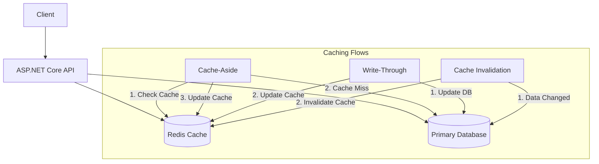

# Redis .NET Integration

## Introduction

Redis (Remote Dictionary Server) is an open-source, in-memory data structure store that can be used as a database, cache, message broker, and more. When integrated with .NET applications, Redis provides lightning-fast data access that can significantly improve your application's performance.

In this guide, we'll explore how to integrate Redis with .NET applications, using the popular StackExchange.Redis client library. You'll learn how to perform common Redis operations, implement caching patterns, and see real-world examples of Redis in .NET applications.

## Prerequisites

Before we begin, make sure you have:

- Basic knowledge of C# and .NET
- .NET SDK installed (5.0 or later recommended)
- Redis server installed locally or access to a Redis instance
- Visual Studio or another .NET-compatible IDE

## Getting Started with Redis in .NET

### Setting Up Your Project

First, create a new .NET console application and add the StackExchange.Redis package:

```csharp
dotnet new console -n RedisDemo
cd RedisDemo
dotnet add package StackExchange.Redis
```

### Establishing a Connection

To use Redis, you first need to establish a connection:

```csharp
using StackExchange.Redis;

// Create a connection to Redis
ConnectionMultiplexer redis = ConnectionMultiplexer.Connect("localhost:6379");

// Get a reference to the Redis database
IDatabase db = redis.GetDatabase();

Console.WriteLine("Connected to Redis successfully!");
```

The `ConnectionMultiplexer` is a thread-safe object that maintains connections to Redis. You should reuse this instance across your application rather than creating a new one for each operation.

## Basic Redis Operations in .NET

### Storing and Retrieving String Values

```csharp
// Store a string value
db.StringSet("greeting", "Hello, Redis!");

// Retrieve the value
string greeting = db.StringGet("greeting");
Console.WriteLine(greeting); // Output: Hello, Redis!
```

### Working with Numbers

```csharp
// Store a numeric value
db.StringSet("counter", "10");

// Increment the value
long newValue = db.StringIncrement("counter", 5);
Console.WriteLine($"New counter value: {newValue}"); // Output: New counter value: 15

// Decrement the value
newValue = db.StringDecrement("counter", 2);
Console.WriteLine($"New counter value: {newValue}"); // Output: New counter value: 13
```

### Key Expiration

You can set keys to expire automatically after a specified time:

```csharp
// Set a value with expiration of 10 seconds
db.StringSet("temporary", "This will self-destruct", TimeSpan.FromSeconds(10));

// Verify it exists
Console.WriteLine(db.KeyExists("temporary")); // Output: True

// Wait for expiration
Console.WriteLine("Waiting for key to expire...");
Thread.Sleep(11000);

// Verify it's gone
Console.WriteLine(db.KeyExists("temporary")); // Output: False
```

## Data Structures in Redis .NET

### Working with Lists

Redis lists are linked lists that allow you to push and pop elements from both ends:

```csharp
// Add values to a list
db.ListRightPush("mylist", "first item");
db.ListRightPush("mylist", "second item");
db.ListLeftPush("mylist", "new first item");

// Get all values from the list
RedisValue[] listValues = db.ListRange("mylist");
foreach (var value in listValues)
{
    Console.WriteLine(value);
}
// Output:
// new first item
// first item
// second item

// Remove and return the rightmost element
string lastItem = db.ListRightPop("mylist");
Console.WriteLine($"Popped item: {lastItem}"); // Output: Popped item: second item
```

### Working with Sets

Sets are unordered collections of unique strings:

```csharp
// Add values to a set
db.SetAdd("myset", "apple");
db.SetAdd("myset", "banana");
db.SetAdd("myset", "apple"); // Duplicate, won't be added

// Get all values from the set
RedisValue[] setValues = db.SetMembers("myset");
Console.WriteLine($"Set has {setValues.Length} members:"); // Output: Set has 2 members:
foreach (var value in setValues)
{
    Console.WriteLine(value);
}
// Output (order may vary):
// apple
// banana

// Check if a value exists in the set
bool exists = db.SetContains("myset", "apple");
Console.WriteLine($"Set contains 'apple': {exists}"); // Output: Set contains 'apple': True
```

### Working with Hashes

Hashes are maps between string fields and string values:

```csharp
// Add fields to a hash
db.HashSet("user:1", new HashEntry[] {
    new HashEntry("name", "John Smith"),
    new HashEntry("email", "john@example.com"),
    new HashEntry("age", "30")
});

// Get a specific field
string name = db.HashGet("user:1", "name");
Console.WriteLine($"User name: {name}"); // Output: User name: John Smith

// Get all fields and values
HashEntry[] userFields = db.HashGetAll("user:1");
foreach (var field in userFields)
{
    Console.WriteLine($"{field.Name}: {field.Value}");
}
// Output:
// name: John Smith
// email: john@example.com
// age: 30
```

## Implementing Caching Patterns

### Basic Caching

Let's implement a basic cache with expiration:

```csharp
// Define a function that simulates a slow database operation
string GetUserDataFromDatabase(int userId)
{
    Console.WriteLine("Fetching data from database...");
    Thread.Sleep(2000); // Simulate slow operation
    return $"{{\"id\":{userId},\"name\":\"User {userId}\",\"email\":\"user{userId}@example.com\"}}";
}

// Cache-aside pattern implementation
string GetUserData(int userId)
{
    string cacheKey = $"user:{userId}";
    
    // Try to get from cache first
    RedisValue cachedData = db.StringGet(cacheKey);
    
    if (!cachedData.IsNull)
    {
        Console.WriteLine("Cache hit! Using data from Redis");
        return cachedData;
    }
    
    // Cache miss - get from database
    Console.WriteLine("Cache miss! Fetching from database");
    string userData = GetUserDataFromDatabase(userId);
    
    // Store in cache for 1 minute
    db.StringSet(cacheKey, userData, TimeSpan.FromMinutes(1));
    
    return userData;
}

// Test the caching function
Console.WriteLine("First call (cache miss expected):");
string result1 = GetUserData(42);
Console.WriteLine($"Result: {result1}");

Console.WriteLine("
Second call (cache hit expected):");
string result2 = GetUserData(42);
Console.WriteLine($"Result: {result2}");
```

Output:
```
First call (cache miss expected):
Cache miss! Fetching from database
Fetching data from database...
Result: {"id":42,"name":"User 42","email":"user42@example.com"}

Second call (cache hit expected):
Cache hit! Using data from Redis
Result: {"id":42,"name":"User 42","email":"user42@example.com"}
```

### Distributed Locking

Redis can be used for distributed locking to coordinate access to shared resources across multiple instances of your application:

```csharp
public class RedisDistributedLock
{
    private readonly IDatabase _db;
    private readonly string _lockKey;
    private readonly string _lockValue;
    
    public RedisDistributedLock(IDatabase db, string resourceName)
    {
        _db = db;
        _lockKey = $"lock:{resourceName}";
        _lockValue = Guid.NewGuid().ToString();
    }
    
    public bool Acquire(TimeSpan expiry)
    {
        return _db.StringSet(_lockKey, _lockValue, expiry, When.NotExists);
    }
    
    public bool Release()
    {
        // Only release if we own the lock
        var script = @"
            if redis.call('get', KEYS[1]) == ARGV[1] then
                return redis.call('del', KEYS[1])
            else
                return 0
            end";
            
        return (bool)_db.ScriptEvaluate(script, 
            new RedisKey[] { _lockKey }, 
            new RedisValue[] { _lockValue });
    }
}

// Usage example
public void ProcessItem(string itemId)
{
    var lockManager = new RedisDistributedLock(db, $"item:{itemId}");
    
    if (lockManager.Acquire(TimeSpan.FromSeconds(30)))
    {
        try
        {
            // Do work with the exclusive lock
            Console.WriteLine($"Processing item {itemId}...");
            Thread.Sleep(1000); // Simulate work
        }
        finally
        {
            lockManager.Release();
        }
    }
    else
    {
        Console.WriteLine($"Could not acquire lock for item {itemId}");
    }
}
```

## Advanced Redis .NET Patterns

### Redis as a Pub/Sub System

Redis can be used as a publish/subscribe system:

```csharp
// Subscribe to a channel
ISubscriber subscriber = redis.GetSubscriber();
subscriber.Subscribe("notifications", (channel, message) => {
    Console.WriteLine($"Received: {message}");
});

// Publish messages to the channel
subscriber.Publish("notifications", "Hello subscribers!");
subscriber.Publish("notifications", "Another notification");
```

### Rate Limiting Implementation

Redis can help implement rate limiting to prevent API abuse:

```csharp
public class RedisRateLimiter
{
    private readonly IDatabase _db;
    private readonly int _maxRequests;
    private readonly TimeSpan _duration;
    
    public RedisRateLimiter(IDatabase db, int maxRequests, TimeSpan duration)
    {
        _db = db;
        _maxRequests = maxRequests;
        _duration = duration;
    }
    
    public bool IsAllowed(string clientId)
    {
        string key = $"ratelimit:{clientId}";
        
        // Create or increment the counter
        long currentCount = _db.StringIncrement(key);
        
        // Set expiry if this is the first request
        if (currentCount == 1)
        {
            _db.KeyExpire(key, _duration);
        }
        
        return currentCount <= _maxRequests;
    }
}

// Usage example
var rateLimiter = new RedisRateLimiter(db, 5, TimeSpan.FromMinutes(1));

for (int i = 1; i <= 7; i++)
{
    bool allowed = rateLimiter.IsAllowed("client123");
    Console.WriteLine($"Request {i}: {(allowed ? "Allowed" : "Blocked")}");
}
```

Output:
```
Request 1: Allowed
Request 2: Allowed
Request 3: Allowed
Request 4: Allowed
Request 5: Allowed
Request 6: Blocked
Request 7: Blocked
```

## Redis .NET in ASP.NET Core Applications

Redis is commonly used with ASP.NET Core for caching and session state management. Here's how to implement distributed caching in an ASP.NET Core application:

```csharp
// In Startup.cs or Program.cs
public void ConfigureServices(IServiceCollection services)
{
    // Add Redis distributed cache
    services.AddStackExchangeRedisCache(options =>
    {
        options.Configuration = "localhost:6379";
        options.InstanceName = "SampleInstance:";
    });
    
    // Other service registrations...
}

// In a controller or service
public class WeatherController : Controller
{
    private readonly IDistributedCache _cache;
    
    public WeatherController(IDistributedCache cache)
    {
        _cache = cache;
    }
    
    public async Task<IActionResult> GetForecast(string city)
    {
        string cacheKey = $"weather:{city.ToLower()}";
        
        // Try to get from cache
        string cachedForecast = await _cache.GetStringAsync(cacheKey);
        
        if (cachedForecast != null)
        {
            return Ok(JsonSerializer.Deserialize<WeatherForecast>(cachedForecast));
        }
        
        // Cache miss - call weather API
        WeatherForecast forecast = await _weatherService.GetForecastAsync(city);
        
        // Cache the result with a 30-minute expiration
        var cacheOptions = new DistributedCacheEntryOptions
        {
            AbsoluteExpirationRelativeToNow = TimeSpan.FromMinutes(30)
        };
        
        await _cache.SetStringAsync(
            cacheKey,
            JsonSerializer.Serialize(forecast),
            cacheOptions);
        
        return Ok(forecast);
    }
}
```

## Redis Data Flow in .NET Applications

Here's a visual representation of how Redis fits into a typical .NET application architecture:



## Best Practices for Redis in .NET

1. **Connection Management**
   - Reuse `ConnectionMultiplexer` instances (they're expensive to create)
   - Consider implementing a singleton pattern or using dependency injection

2. **Error Handling**
   - Always implement proper exception handling for Redis operations
   - Have fallback mechanisms when Redis is unavailable

   ```csharp
   try
   {
       string value = db.StringGet("mykey");
       return value;
   }
   catch (RedisConnectionException)
   {
       // Log the error
       Logger.Error("Redis connection failed");
       
       // Fall back to database
       return GetValueFromDatabase("mykey");
   }
   ```

3. **Performance Tips**
   - Use pipelining for bulk operations
   - Consider using batching with `IBatch` for multiple operations

   ```csharp
   // Execute multiple commands in a single round trip
   IBatch batch = db.CreateBatch();
   
   Task<bool> task1 = batch.StringSetAsync("key1", "value1");
   Task<bool> task2 = batch.StringSetAsync("key2", "value2");
   Task<RedisValue> task3 = batch.StringGetAsync("key3");
   
   batch.Execute();
   
   // Now get the results
   bool result1 = await task1;
   bool result2 = await task2;
   string result3 = await task3;
   ```

4. **Key Naming Conventions**
   - Use consistent naming patterns (e.g., `object:id:field`)
   - Consider prefixing keys with application name to avoid collisions

## Real-World Example: Shopping Cart Implementation

Let's implement a Redis-backed shopping cart service:

```csharp
public class RedisShoppingCartService
{
    private readonly IDatabase _db;
    private readonly string _prefix = "cart:";
    
    public RedisShoppingCartService(ConnectionMultiplexer redis)
    {
        _db = redis.GetDatabase();
    }
    
    // Add item to cart
    public void AddItem(string userId, string productId, int quantity)
    {
        string cartKey = _prefix + userId;
        
        // Use hash to store cart items (productId -> quantity)
        _db.HashSet(cartKey, productId, quantity.ToString());
        
        // Set cart to expire after 24 hours of inactivity
        _db.KeyExpire(cartKey, TimeSpan.FromHours(24));
    }
    
    // Remove item from cart
    public void RemoveItem(string userId, string productId)
    {
        string cartKey = _prefix + userId;
        _db.HashDelete(cartKey, productId);
    }
    
    // Update item quantity
    public void UpdateQuantity(string userId, string productId, int newQuantity)
    {
        if (newQuantity <= 0)
        {
            RemoveItem(userId, productId);
            return;
        }
        
        string cartKey = _prefix + userId;
        _db.HashSet(cartKey, productId, newQuantity.ToString());
    }
    
    // Get cart contents
    public Dictionary<string, int> GetCart(string userId)
    {
        string cartKey = _prefix + userId;
        HashEntry[] cartItems = _db.HashGetAll(cartKey);
        
        // Refresh expiration on access
        _db.KeyExpire(cartKey, TimeSpan.FromHours(24));
        
        var result = new Dictionary<string, int>();
        foreach (var item in cartItems)
        {
            result[item.Name] = int.Parse(item.Value);
        }
        
        return result;
    }
    
    // Clear cart
    public void ClearCart(string userId)
    {
        string cartKey = _prefix + userId;
        _db.KeyDelete(cartKey);
    }
}

// Example usage
var redis = ConnectionMultiplexer.Connect("localhost:6379");
var cartService = new RedisShoppingCartService(redis);

// Add items to cart
cartService.AddItem("user123", "product1", 2);
cartService.AddItem("user123", "product2", 1);

// Display cart contents
var cart = cartService.GetCart("user123");
Console.WriteLine("Current cart:");
foreach (var item in cart)
{
    Console.WriteLine($"Product: {item.Key}, Quantity: {item.Value}");
}

// Update quantity
cartService.UpdateQuantity("user123", "product1", 3);

// Display updated cart
cart = cartService.GetCart("user123");
Console.WriteLine("
Updated cart:");
foreach (var item in cart)
{
    Console.WriteLine($"Product: {item.Key}, Quantity: {item.Value}");
}
```

Output:
```
Current cart:
Product: product1, Quantity: 2
Product: product2, Quantity: 1

Updated cart:
Product: product1, Quantity: 3
Product: product2, Quantity: 1
```

## Summary

Redis integration with .NET applications offers significant benefits:

- High-performance caching capabilities
- Support for various data structures
- Distributed system patterns like pub/sub and locking
- Easy implementation of common features like rate limiting

By using the StackExchange.Redis library, .NET developers can harness Redis's power to build more scalable and responsive applications.

## Additional Resources

- [StackExchange.Redis GitHub Repository](https://github.com/StackExchange/StackExchange.Redis)
- [Redis Documentation](https://redis.io/documentation)
- [Microsoft Distributed Caching in ASP.NET Core](https://docs.microsoft.com/en-us/aspnet/core/performance/caching/distributed)

## Exercises

1. **Basic Redis Operations**
   - Implement a simple key-value store where users can create, read, update, and delete items using Redis.

2. **Leaderboard Implementation**
   - Use Redis Sorted Sets to implement a leaderboard for a game, with methods to add scores and get top players.

3. **Message Queue**
   - Create a simple task queue using Redis Lists, with a producer adding jobs and a consumer processing them.

4. **Cache with Automatic Refresh**
   - Implement a caching system that automatically refreshes expired items instead of returning cache misses.

5. **Session State Provider**
   - Build a custom session state provider for ASP.NET Core using Redis.