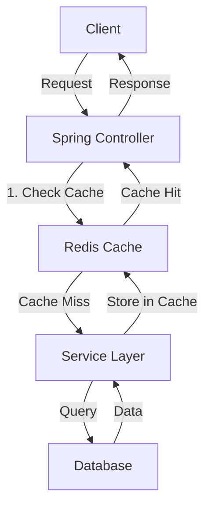

# Redis Spring Integration

## Introduction

Redis (Remote Dictionary Server) is an open-source, in-memory data structure store that can be used as a database, cache, message broker, and streaming engine. When combined with Spring, a popular Java framework, Redis provides powerful caching and data storage capabilities that can significantly enhance application performance.

This guide will walk you through the process of integrating Redis with your Spring applications. We'll cover everything from basic setup to practical implementation patterns, helping you leverage the speed and flexibility of Redis within your Spring projects.

## Why Redis with Spring?

Before diving into implementation details, let's understand why this combination is so powerful:

- **Performance Boost**: Redis stores data in memory, making data access extremely fast
- **Caching Support**: Reducing database load and improving response times
- **Session Management**: Storing and managing user sessions efficiently
- **Pub/Sub Messaging**: Implementing real-time communication between services
- **Data Structures**: Leveraging Redis' rich data structures like lists, sets, and sorted sets
- **Spring Data Redis**: Simplified Redis operations through Spring's familiar API patterns

## Getting Started

### Prerequisites

Before starting, ensure you have:

- Java 11 or higher installed
- Maven or Gradle for dependency management
- Basic knowledge of Spring framework
- Redis server installed locally or access to a Redis instance

### Setting Up Your Spring Project

Let's start by adding the necessary dependencies to your Spring Boot project.

For Maven projects, add the following to your `pom.xml`:

```xml
<dependency>
    <groupId>org.springframework.boot</groupId>
    <artifactId>spring-boot-starter-data-redis</artifactId>
</dependency>
```

For Gradle projects, add this to your `build.gradle`:

```groovy
implementation 'org.springframework.boot:spring-boot-starter-data-redis'
```

### Configuring Redis Connection

Create a configuration class to set up the Redis connection:

```java
package com.example.redisdemo.config;

import org.springframework.context.annotation.Bean;
import org.springframework.context.annotation.Configuration;
import org.springframework.data.redis.connection.RedisConnectionFactory;
import org.springframework.data.redis.connection.lettuce.LettuceConnectionFactory;
import org.springframework.data.redis.core.RedisTemplate;
import org.springframework.data.redis.serializer.GenericJackson2JsonRedisSerializer;
import org.springframework.data.redis.serializer.StringRedisSerializer;

@Configuration
public class RedisConfig {

    @Bean
    public RedisConnectionFactory redisConnectionFactory() {
        return new LettuceConnectionFactory("localhost", 6379);
    }

    @Bean
    public RedisTemplate<String, Object> redisTemplate() {
        RedisTemplate<String, Object> template = new RedisTemplate<>();
        template.setConnectionFactory(redisConnectionFactory());
        template.setKeySerializer(new StringRedisSerializer());
        template.setValueSerializer(new GenericJackson2JsonRedisSerializer());
        return template;
    }
}
```

This configuration:
1. Creates a connection to Redis server running on localhost at port 6379
2. Sets up a `RedisTemplate` with appropriate serializers for keys and values

Alternatively, you can configure Redis in your `application.properties` or `application.yml` file:

```properties
# Redis server properties
spring.redis.host=localhost
spring.redis.port=6379
```

## Basic Redis Operations with Spring

Let's explore the basic operations you can perform with Redis in a Spring application.

### Creating a Model Class

First, let's create a simple model class that we'll store in Redis:

```java
package com.example.redisdemo.model;

import java.io.Serializable;

public class Product implements Serializable {
    private static final long serialVersionUID = 1L;
    
    private String id;
    private String name;
    private double price;
    
    // Constructors
    public Product() {}
    
    public Product(String id, String name, double price) {
        this.id = id;
        this.name = name;
        this.price = price;
    }
    
    // Getters and Setters
    public String getId() { return id; }
    public void setId(String id) { this.id = id; }
    
    public String getName() { return name; }
    public void setName(String name) { this.name = name; }
    
    public double getPrice() { return price; }
    public void setPrice(double price) { this.price = price; }
    
    @Override
    public String toString() {
        return "Product{id='" + id + "', name='" + name + "', price=" + price + "}";
    }
}
```

### Repository Approach

Spring Data Redis provides repository support similar to what you might be familiar with from Spring Data JPA.

First, create an interface that extends `CrudRepository`:

```java
package com.example.redisdemo.repository;

import com.example.redisdemo.model.Product;
import org.springframework.data.repository.CrudRepository;
import org.springframework.stereotype.Repository;

@Repository
public interface ProductRepository extends CrudRepository<Product, String> {
}
```

Then, annotate your model class with Redis-specific annotations:

```java
package com.example.redisdemo.model;

import java.io.Serializable;
import org.springframework.data.annotation.Id;
import org.springframework.data.redis.core.RedisHash;

@RedisHash("Product")
public class Product implements Serializable {
    private static final long serialVersionUID = 1L;
    
    @Id
    private String id;
    private String name;
    private double price;
    
    // Rest of the class remains the same
}
```

### Using RedisTemplate Directly

For more control, you can use `RedisTemplate` directly:

```java
package com.example.redisdemo.service;

import com.example.redisdemo.model.Product;
import org.springframework.beans.factory.annotation.Autowired;
import org.springframework.data.redis.core.RedisTemplate;
import org.springframework.stereotype.Service;

import java.util.List;
import java.util.concurrent.TimeUnit;

@Service
public class ProductService {

    private static final String HASH_KEY = "Product";
    
    @Autowired
    private RedisTemplate<String, Object> redisTemplate;
    
    public Product save(Product product) {
        redisTemplate.opsForHash().put(HASH_KEY, product.getId(), product);
        return product;
    }
    
    public List<Object> findAll() {
        return redisTemplate.opsForHash().values(HASH_KEY);
    }
    
    public Product findById(String id) {
        return (Product) redisTemplate.opsForHash().get(HASH_KEY, id);
    }
    
    public String deleteById(String id) {
        redisTemplate.opsForHash().delete(HASH_KEY, id);
        return "Product removed";
    }
    
    // Example with expiration
    public void saveWithExpiration(String key, Product product, long timeout) {
        redisTemplate.opsForValue().set(key, product, timeout, TimeUnit.SECONDS);
    }
}
```

### Creating a Controller

Let's create a simple REST controller to test our Redis operations:

```java
package com.example.redisdemo.controller;

import com.example.redisdemo.model.Product;
import com.example.redisdemo.service.ProductService;
import org.springframework.beans.factory.annotation.Autowired;
import org.springframework.web.bind.annotation.*;

import java.util.List;

@RestController
@RequestMapping("/products")
public class ProductController {

    @Autowired
    private ProductService productService;
    
    @PostMapping
    public Product save(@RequestBody Product product) {
        return productService.save(product);
    }
    
    @GetMapping
    public List<Object> findAll() {
        return productService.findAll();
    }
    
    @GetMapping("/{id}")
    public Product findById(@PathVariable String id) {
        return productService.findById(id);
    }
    
    @DeleteMapping("/{id}")
    public String deleteById(@PathVariable String id) {
        return productService.deleteById(id);
    }
}
```

## Implementing Caching with Spring Redis

One of the most common uses of Redis with Spring is for caching. Spring provides excellent support for caching through annotations.

### Enabling Redis Cache

First, enable caching in your application by adding `@EnableCaching` to your configuration:

```java
package com.example.redisdemo.config;

import org.springframework.cache.annotation.EnableCaching;
import org.springframework.context.annotation.Configuration;
// Other imports

@Configuration
@EnableCaching
public class RedisConfig {
    // Existing code
}
```

### Cache Configuration

Add some additional cache configuration:

```java
@Bean
public RedisCacheManager cacheManager(RedisConnectionFactory redisConnectionFactory) {
    RedisCacheConfiguration cacheConfiguration = 
        RedisCacheConfiguration.defaultCacheConfig()
            .entryTtl(Duration.ofMinutes(10))
            .serializeKeysWith(
                RedisSerializationContext.SerializationPair.fromSerializer(new StringRedisSerializer()))
            .serializeValuesWith(
                RedisSerializationContext.SerializationPair.fromSerializer(new GenericJackson2JsonRedisSerializer()));
    
    return RedisCacheManager.builder(redisConnectionFactory)
            .cacheDefaults(cacheConfiguration)
            .build();
}
```

### Using Cache Annotations

Now you can use Spring's caching annotations in your service:

```java
@Service
public class ProductService {
    // Other code
    
    @Cacheable(value = "products", key = "#id")
    public Product findById(String id) {
        System.out.println("Fetching from database: " + id);
        // Simulating database fetch
        return new Product(id, "Product " + id, 99.99);
    }
    
    @CachePut(value = "products", key = "#product.id")
    public Product save(Product product) {
        System.out.println("Saving to database: " + product.getId());
        // Save to database logic
        return product;
    }
    
    @CacheEvict(value = "products", key = "#id")
    public String deleteById(String id) {
        System.out.println("Deleting from database: " + id);
        // Delete from database logic
        return "Product removed";
    }
    
    @CacheEvict(value = "products", allEntries = true)
    public void clearAllCache() {
        System.out.println("Clearing all product cache");
    }
}
```

The key annotations are:
- `@Cacheable`: Caches the result of the method
- `@CachePut`: Updates the cache with the result
- `@CacheEvict`: Removes entries from the cache

## Redis as a Message Broker in Spring

Redis can also function as a message broker for implementing pub/sub messaging in your application.

### Setting Up Redis Messaging

First, configure the message listener and converter:

```java
@Bean
public RedisMessageListenerContainer container(RedisConnectionFactory connectionFactory) {
    RedisMessageListenerContainer container = new RedisMessageListenerContainer();
    container.setConnectionFactory(connectionFactory);
    return container;
}

@Bean
public MessageListenerAdapter messageListener() {
    return new MessageListenerAdapter(new RedisMessageSubscriber());
}

@Bean
public Jackson2JsonRedisSerializer<Object> jackson2JsonRedisSerializer() {
    return new Jackson2JsonRedisSerializer<>(Object.class);
}
```

### Creating Publisher and Subscriber

Create a subscriber class:

```java
package com.example.redisdemo.messaging;

import org.springframework.data.redis.connection.Message;
import org.springframework.data.redis.connection.MessageListener;
import org.springframework.stereotype.Service;

@Service
public class RedisMessageSubscriber implements MessageListener {
    
    @Override
    public void onMessage(Message message, byte[] pattern) {
        System.out.println("Received message: " + new String(message.getBody()));
    }
}
```

Create a publisher class:

```java
package com.example.redisdemo.messaging;

import org.springframework.beans.factory.annotation.Autowired;
import org.springframework.data.redis.core.RedisTemplate;
import org.springframework.stereotype.Service;

@Service
public class RedisMessagePublisher {
    
    @Autowired
    private RedisTemplate<String, Object> redisTemplate;
    
    public void publish(String topic, String message) {
        redisTemplate.convertAndSend(topic, message);
    }
}
```

### Using the Publisher in a Controller

```java
@RestController
@RequestMapping("/messages")
public class MessageController {

    @Autowired
    private RedisMessagePublisher publisher;
    
    @PostMapping("/publish")
    public String publishMessage(@RequestParam String topic, @RequestParam String message) {
        publisher.publish(topic, message);
        return "Message published successfully";
    }
}
```

## Session Management with Spring Redis

Redis is excellent for managing user sessions in distributed environments. Let's set up Redis for session management in Spring.

### Adding Dependencies

For Maven:

```xml
<dependency>
    <groupId>org.springframework.session</groupId>
    <artifactId>spring-session-data-redis</artifactId>
</dependency>
```

### Configuration

```java
package com.example.redisdemo.config;

import org.springframework.context.annotation.Bean;
import org.springframework.context.annotation.Configuration;
import org.springframework.session.data.redis.config.annotation.web.http.EnableRedisHttpSession;
import org.springframework.session.web.http.CookieSerializer;
import org.springframework.session.web.http.DefaultCookieSerializer;

@Configuration
@EnableRedisHttpSession(maxInactiveIntervalInSeconds = 1800)
public class SessionConfig {

    @Bean
    public CookieSerializer cookieSerializer() {
        DefaultCookieSerializer serializer = new DefaultCookieSerializer();
        serializer.setCookieName("SESSIONID");
        serializer.setCookiePath("/");
        serializer.setDomainNamePattern("^.+?\\.(\\w+\\.[a-z]+)$");
        return serializer;
    }
}
```

### Using the Session

```java
@RestController
@RequestMapping("/session")
public class SessionController {

    @GetMapping("/set")
    public String setSessionAttribute(HttpSession session, @RequestParam String name) {
        session.setAttribute("name", name);
        return "Session attribute set: " + name;
    }
    
    @GetMapping("/get")
    public String getSessionAttribute(HttpSession session) {
        String name = (String) session.getAttribute("name");
        return "Session attribute: " + name;
    }
}
```

## Real-World Example: Product Catalog with Redis Cache

Let's implement a more complete example of a product catalog that uses Redis for caching.

### Database Model

Assume we have a traditional database (like MySQL) for persistent storage, but we'll use Redis to cache frequently accessed data.

```java
package com.example.catalog.model;

import javax.persistence.Entity;
import javax.persistence.Id;
import javax.persistence.Table;
import java.io.Serializable;

@Entity
@Table(name = "products")
public class Product implements Serializable {
    @Id
    private String id;
    private String name;
    private String description;
    private double price;
    private String category;
    
    // Constructors, getters, setters
}
```

### Service Implementation

```java
package com.example.catalog.service;

import com.example.catalog.model.Product;
import com.example.catalog.repository.ProductRepository;
import org.springframework.beans.factory.annotation.Autowired;
import org.springframework.cache.annotation.CacheEvict;
import org.springframework.cache.annotation.CachePut;
import org.springframework.cache.annotation.Cacheable;
import org.springframework.stereotype.Service;

import java.util.List;
import java.util.Optional;

@Service
public class ProductService {

    @Autowired
    private ProductRepository productRepository;
    
    @Cacheable(value = "products", key = "#id")
    public Optional<Product> findById(String id) {
        System.out.println("Fetching product from database: " + id);
        return productRepository.findById(id);
    }
    
    @Cacheable(value = "productsByCategory", key = "#category")
    public List<Product> findByCategory(String category) {
        System.out.println("Fetching products by category from database: " + category);
        return productRepository.findByCategory(category);
    }
    
    @CachePut(value = "products", key = "#product.id")
    public Product save(Product product) {
        System.out.println("Saving product to database: " + product.getId());
        return productRepository.save(product);
    }
    
    @CacheEvict(value = "products", key = "#id")
    public void deleteById(String id) {
        System.out.println("Deleting product from database: " + id);
        productRepository.deleteById(id);
        
        // Also clear category cache since we don't know which category this product belonged to
        clearCategoryCache();
    }
    
    @CacheEvict(value = "productsByCategory", allEntries = true)
    public void clearCategoryCache() {
        System.out.println("Clearing category cache");
    }
}
```

### Controller Implementation

```java
package com.example.catalog.controller;

import com.example.catalog.model.Product;
import com.example.catalog.service.ProductService;
import org.springframework.beans.factory.annotation.Autowired;
import org.springframework.http.ResponseEntity;
import org.springframework.web.bind.annotation.*;

import java.util.List;

@RestController
@RequestMapping("/api/products")
public class ProductController {

    @Autowired
    private ProductService productService;
    
    @GetMapping("/{id}")
    public ResponseEntity<Product> getProduct(@PathVariable String id) {
        return productService.findById(id)
                .map(ResponseEntity::ok)
                .orElse(ResponseEntity.notFound().build());
    }
    
    @GetMapping("/category/{category}")
    public ResponseEntity<List<Product>> getProductsByCategory(@PathVariable String category) {
        List<Product> products = productService.findByCategory(category);
        return ResponseEntity.ok(products);
    }
    
    @PostMapping
    public ResponseEntity<Product> createProduct(@RequestBody Product product) {
        Product savedProduct = productService.save(product);
        return ResponseEntity.ok(savedProduct);
    }
    
    @PutMapping("/{id}")
    public ResponseEntity<Product> updateProduct(
            @PathVariable String id,
            @RequestBody Product product) {
        
        return productService.findById(id)
                .map(existingProduct -> {
                    product.setId(id);
                    return ResponseEntity.ok(productService.save(product));
                })
                .orElse(ResponseEntity.notFound().build());
    }
    
    @DeleteMapping("/{id}")
    public ResponseEntity<Void> deleteProduct(@PathVariable String id) {
        return productService.findById(id)
                .map(product -> {
                    productService.deleteById(id);
                    return ResponseEntity.ok().<Void>build();
                })
                .orElse(ResponseEntity.notFound().build());
    }
}
```

## Understanding the Redis Data Flow

Let's visualize how data flows in a Spring application with Redis cache:



## Performance Considerations

When using Redis with Spring, keep these performance tips in mind:

1. **Serialization**: Choose the right serializer for your needs. Jackson2JsonRedisSerializer is readable but larger, while JdkSerializationRedisSerializer can be faster.

2. **TTL (Time-To-Live)**: Set appropriate expiration times for cached items to prevent stale data.

3. **Selective Caching**: Only cache data that is:
   - Frequently accessed
   - Relatively static
   - Expensive to compute or retrieve

4. **Cache Invalidation**: Implement proper cache invalidation strategies to ensure data consistency.

5. **Connection Pooling**: Use connection pooling for high-traffic applications.

## Monitoring Redis in Spring Applications

Spring Boot Actuator provides integration with Redis for monitoring:

```xml
<dependency>
    <groupId>org.springframework.boot</groupId>
    <artifactId>spring-boot-starter-actuator</artifactId>
</dependency>
```

Configure in `application.properties`:

```properties
management.endpoints.web.exposure.include=health,info,redis
```

## Troubleshooting Common Issues

### Connection Issues

If you're having trouble connecting to Redis, check:

1. Redis server is running and accessible
2. Correct host and port in configuration
3. No firewalls blocking connection

### Serialization Issues

If objects aren't serializing correctly:
1. Ensure your objects implement `Serializable`
2. Check that you're using the appropriate serializer
3. Consider using a more robust serializer like Jackson2JsonRedisSerializer

### Data Not Being Cached

If your data isn't being cached:
1. Verify caching is enabled with `@EnableCaching`
2. Ensure cache names match between annotations
3. Check for transaction issues (annotations might not work within the same class)

## Advanced Topics

### Redis Transactions

Spring Data Redis supports Redis transactions:

```java
redisTemplate.execute(new SessionCallback<Object>() {
    @Override
    public Object execute(RedisOperations operations) throws DataAccessException {
        operations.multi();
        operations.opsForValue().set("key1", "value1");
        operations.opsForHash().put("hash1", "field1", "value1");
        return operations.exec();
    }
});
```

### Reactive Redis

For reactive applications, Spring WebFlux provides `ReactiveRedisTemplate`:

```java
@Bean
public ReactiveRedisTemplate<String, Object> reactiveRedisTemplate(
        ReactiveRedisConnectionFactory factory) {
    Jackson2JsonRedisSerializer<Object> serializer = new Jackson2JsonRedisSerializer<>(Object.class);
    RedisSerializationContext.RedisSerializationContextBuilder<String, Object> builder =
            RedisSerializationContext.newSerializationContext(new StringRedisSerializer());
    
    RedisSerializationContext<String, Object> context = builder
            .value(serializer)
            .build();
    
    return new ReactiveRedisTemplate<>(factory, context);
}
```

## Summary

In this guide, we've explored how to integrate Redis with Spring applications:

- Setting up Redis with Spring Boot
- Performing basic CRUD operations
- Implementing caching with annotations
- Using Redis as a message broker
- Managing sessions with Redis
- Building a complete product catalog with Redis caching

Redis is a powerful tool in your Spring application architecture, providing significant performance improvements through caching and additional capabilities through its versatile data structures.

## Further Resources

To continue learning about Redis and Spring integration:

1. [Spring Data Redis Documentation](https://docs.spring.io/spring-data/redis/docs/current/reference/html/)
2. [Redis Official Documentation](https://redis.io/documentation)
3. [Spring Framework Documentation](https://docs.spring.io/spring-framework/docs/current/reference/html/)

## Exercises

To reinforce your learning, try these exercises:

1. Implement a simple shopping cart using Redis Lists
2. Create a leaderboard using Redis Sorted Sets
3. Build a rate limiter using Redis and Spring AOP
4. Implement distributed locks with Redis for concurrency control
5. Create a notification system using Redis Pub/Sub