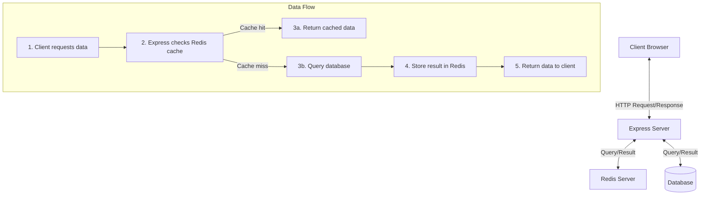

# Redis Express

## Introduction

Redis Express refers to the integration of Redis, an in-memory data structure store, with Express.js, a popular web application framework for Node.js. This powerful combination enables developers to enhance their web applications with features like caching, session management, rate limiting, and pub/sub messaging.

Redis acts as a high-performance data store that complements Express applications by providing:

- **Lightning-fast data access**: Redis stores data in memory, making it incredibly quick
- **Versatile data structures**: Lists, sets, sorted sets, hashes, and more
- **Persistence options**: Data can be saved to disk for durability
- **Expiration policies**: Automatically remove data after a specified time

In this guide, we'll explore how to integrate Redis with Express applications and implement common patterns that will improve your application's performance and capabilities.

## Prerequisites

Before we begin, make sure you have:

- Basic knowledge of JavaScript and Node.js
- Node.js installed on your system
- npm (Node Package Manager) installed
- Redis server installed locally or access to a Redis instance

## Setting Up Redis with Express

### Step 1: Install Required Packages

First, let's create a new Express project and install the necessary dependencies:

```bash
# Create a new project directory
mkdir redis-express-demo
cd redis-express-demo

# Initialize a new Node.js project
npm init -y

# Install required packages
npm install express redis
```

### Step 2: Connect to Redis in an Express Application

Now, let's create a basic Express application that connects to Redis:

```javascript
const express = require('express');
const redis = require('redis');

// Create Express app
const app = express();
const port = 3000;

// Create Redis client
const client = redis.createClient({
  host: 'localhost',
  port: 6379
});

client.on('error', (err) => {
  console.error('Redis Error:', err);
});

client.on('connect', () => {
  console.log('Connected to Redis');
});

// Basic route
app.get('/', (req, res) => {
  res.send('Redis Express Demo');
});

// Start server
app.listen(port, () => {
  console.log(`Server running on http://localhost:${port}`);
});
```

This sets up a basic Express server with a Redis connection. When you run this application with `node app.js`, it will connect to your local Redis server.

## Common Redis Use Cases with Express

### 1. Implementing Basic Caching

One of the most common uses for Redis with Express is caching API responses or database queries:

```javascript
// Example: Caching data from a slow API or database query
app.get('/api/users', async (req, res) => {
  try {
    // Check if data exists in cache
    client.get('users', async (err, cachedUsers) => {
      if (err) throw err;
      
      // If cache hit, return the cached data
      if (cachedUsers) {
        console.log('Cache hit for users');
        return res.json(JSON.parse(cachedUsers));
      }
      
      // If cache miss, fetch data from source (simulated here)
      console.log('Cache miss for users, fetching data...');
      
      // Simulate API call or database query with setTimeout
      const users = await new Promise(resolve => {
        setTimeout(() => {
          resolve([
            { id: 1, name: 'Alice' },
            { id: 2, name: 'Bob' },
            { id: 3, name: 'Charlie' }
          ]);
        }, 2000); // Simulate 2 second delay
      });
      
      // Store the result in cache with an expiration of 60 seconds
      client.setex('users', 60, JSON.stringify(users));
      
      // Return the data
      res.json(users);
    });
  } catch (error) {
    res.status(500).json({ error: error.message });
  }
});
```

In this example:
1. We first check if the data exists in Redis cache
2. If found, we return it immediately
3. If not found, we fetch the data from the source (simulated with a timeout)
4. We then store the fetched data in Redis with an expiration time
5. Finally, we return the data to the client

### 2. Managing Sessions with Redis

Express applications often need session management. Redis is an excellent store for session data:

```bash
# Install express-session and connect-redis
npm install express-session connect-redis
```

```javascript
const express = require('express');
const redis = require('redis');
const session = require('express-session');
const RedisStore = require('connect-redis')(session);

const app = express();
const port = 3000;

// Create Redis client
const redisClient = redis.createClient({
  host: 'localhost',
  port: 6379
});

// Configure session middleware with Redis store
app.use(session({
  store: new RedisStore({ client: redisClient }),
  secret: 'your-secret-key',
  resave: false,
  saveUninitialized: false,
  cookie: {
    secure: process.env.NODE_ENV === 'production',
    httpOnly: true,
    maxAge: 1000 * 60 * 60 * 24 // 24 hours
  }
}));

// Session usage example
app.get('/', (req, res) => {
  // Initialize view count if not exists
  if (!req.session.viewCount) {
    req.session.viewCount = 0;
  }
  
  // Increment view count
  req.session.viewCount++;
  
  res.send(`You have visited this page ${req.session.viewCount} times`);
});

app.listen(port, () => {
  console.log(`Server running on http://localhost:${port}`);
});
```

This implementation:
1. Uses `connect-redis` to store Express session data in Redis
2. Sets appropriate cookie options (secure in production, HTTP-only)
3. Demonstrates session usage by tracking page visits

### 3. Implementing Rate Limiting

Redis can help protect your API from abuse by implementing rate limiting:

```bash
# Install rate limiting package
npm install express-rate-limit rate-limit-redis
```

```javascript
const express = require('express');
const redis = require('redis');
const rateLimit = require('express-rate-limit');
const RedisStore = require('rate-limit-redis');

const app = express();
const port = 3000;

// Create Redis client
const redisClient = redis.createClient({
  host: 'localhost',
  port: 6379
});

// Configure rate limiter
const limiter = rateLimit({
  store: new RedisStore({
    client: redisClient,
    prefix: 'rate-limit:',
    expiry: 60 // seconds
  }),
  windowMs: 60 * 1000, // 1 minute
  max: 5, // 5 requests per minute
  message: 'Too many requests, please try again after a minute'
});

// Apply rate limiter to all routes
app.use(limiter);

// Example route
app.get('/api/limited', (req, res) => {
  res.json({ message: 'This route is rate limited' });
});

app.listen(port, () => {
  console.log(`Server running on http://localhost:${port}`);
});
```

In this implementation:
1. We use `express-rate-limit` with a Redis store
2. We configure it to allow 5 requests per minute per IP address
3. When the limit is exceeded, a message is sent to the client

### 4. Building a Pub/Sub System

Redis's pub/sub capabilities allow you to build real-time applications with Express:

```javascript
const express = require('express');
const redis = require('redis');
const http = require('http');
const socketIo = require('socket.io');

// Create Express app
const app = express();
const server = http.createServer(app);
const io = socketIo(server);
const port = 3000;

// Serve static files
app.use(express.static('public'));
app.use(express.json());

// Create Redis publisher and subscriber clients
const publisher = redis.createClient();
const subscriber = redis.createClient();

// Subscribe to channel
subscriber.subscribe('notifications');

// Listen for messages
subscriber.on('message', (channel, message) => {
  console.log(`Received message from ${channel}: ${message}`);
  io.emit('notification', message);
});

// WebSocket connection
io.on('connection', (socket) => {
  console.log('Client connected');
  
  socket.on('disconnect', () => {
    console.log('Client disconnected');
  });
});

// API endpoint to publish messages
app.post('/api/notify', (req, res) => {
  const { message } = req.body;
  
  if (!message) {
    return res.status(400).json({ error: 'Message is required' });
  }
  
  publisher.publish('notifications', message);
  res.json({ success: true });
});

server.listen(port, () => {
  console.log(`Server running on http://localhost:${port}`);
});
```

HTML/JavaScript client example (to be saved in a `public/index.html` file):

```html
<!DOCTYPE html>
<html lang="en">
<head>
  <meta charset="UTF-8">
  <meta name="viewport" content="width=device-width, initial-scale=1.0">
  <title>Redis Pub/Sub Demo</title>
  <script src="/socket.io/socket.io.js"></script>
  <style>
    body { font-family: Arial, sans-serif; max-width: 800px; margin: 0 auto; padding: 20px; }
    #notifications { border: 1px solid #ccc; padding: 10px; height: 300px; overflow-y: auto; margin-bottom: 20px; }
    input, button { padding: 8px; margin-right: 10px; }
    button { cursor: pointer; background-color: #4CAF50; color: white; border: none; }
  </style>
</head>
<body>
  <h1>Redis Pub/Sub Demo</h1>
  
  <div id="notifications"></div>
  
  <div>
    <input type="text" id="message" placeholder="Enter a message">
    <button id="send">Send Notification</button>
  </div>
  
  <script>
    const socket = io();
    const notificationsDiv = document.getElementById('notifications');
    const messageInput = document.getElementById('message');
    const sendButton = document.getElementById('send');
    
    // Listen for notifications
    socket.on('notification', (message) => {
      const messageElement = document.createElement('p');
      messageElement.textContent = message;
      notificationsDiv.appendChild(messageElement);
      notificationsDiv.scrollTop = notificationsDiv.scrollHeight;
    });
    
    // Send notification
    sendButton.addEventListener('click', async () => {
      const message = messageInput.value.trim();
      if (!message) return;
      
      try {
        const response = await fetch('/api/notify', {
          method: 'POST',
          headers: { 'Content-Type': 'application/json' },
          body: JSON.stringify({ message })
        });
        
        if (response.ok) {
          messageInput.value = '';
        }
      } catch (error) {
        console.error('Error sending notification:', error);
      }
    });
  </script>
</body>
</html>
```

This implementation:
1. Creates a simple pub/sub system using Redis
2. Uses Socket.IO to push messages to connected clients in real-time
3. Provides an API endpoint for publishing messages
4. Includes a simple web interface for demonstration

## Understanding Redis Data Flow in Express Applications

Let's visualize how data flows in a Redis-Express application:



## Best Practices for Redis with Express

### Connection Management

For production applications, implement proper connection management:

```javascript
// Handle Redis connection failures and reconnection
const client = redis.createClient({
  host: process.env.REDIS_HOST || 'localhost',
  port: process.env.REDIS_PORT || 6379,
  retry_strategy: function(options) {
    if (options.error && options.error.code === 'ECONNREFUSED') {
      // End reconnecting on a specific error
      console.error('Redis server refused connection');
      return new Error('The server refused the connection');
    }
    if (options.total_retry_time > 1000 * 60 * 60) {
      // End reconnecting after 1 hour
      return new Error('Retry time exhausted');
    }
    if (options.attempt > 10) {
      // End reconnecting with built in error
      return undefined;
    }
    // Reconnect after increasing delay
    return Math.min(options.attempt * 100, 3000);
  }
});

// Graceful shutdown
process.on('SIGINT', () => {
  client.quit(() => {
    console.log('Redis client disconnected');
    process.exit(0);
  });
});
```

### Error Handling

Always implement proper error handling for Redis operations:

```javascript
// Promise-based approach to Redis operations
function getAsync(key) {
  return new Promise((resolve, reject) => {
    client.get(key, (err, reply) => {
      if (err) reject(err);
      resolve(reply);
    });
  });
}

// Using the promisified function
app.get('/api/data/:id', async (req, res) => {
  try {
    const { id } = req.params;
    const cacheKey = `data:${id}`;
    
    let data;
    try {
      data = await getAsync(cacheKey);
    } catch (redisError) {
      console.error('Redis error:', redisError);
      // Continue execution even if Redis fails
    }
    
    if (data) {
      return res.json(JSON.parse(data));
    }
    
    // Fetch from database or other source if not in cache
    // ...
    
  } catch (error) {
    res.status(500).json({ error: error.message });
  }
});
```

### Security Considerations

When using Redis in production, implement security best practices:

```javascript
// Using environment variables for sensitive configuration
const client = redis.createClient({
  host: process.env.REDIS_HOST,
  port: process.env.REDIS_PORT,
  password: process.env.REDIS_PASSWORD,
  tls: process.env.REDIS_TLS === 'true' ? {} : undefined
});
```

## Complete Example: API Caching Middleware

Let's put it all together with a reusable caching middleware for Express:

```javascript
const express = require('express');
const redis = require('redis');
const { promisify } = require('util');

// Create Express app
const app = express();
const port = 3000;

// Create Redis client
const client = redis.createClient({
  host: process.env.REDIS_HOST || 'localhost',
  port: process.env.REDIS_PORT || 6379
});

// Promisify Redis commands
const getAsync = promisify(client.get).bind(client);
const setexAsync = promisify(client.setex).bind(client);

// Caching middleware
function cacheMiddleware(duration) {
  return async (req, res, next) => {
    // Skip caching for non-GET requests
    if (req.method !== 'GET') {
      return next();
    }

    // Create a cache key from the request URL
    const cacheKey = `cache:${req.originalUrl}`;
    
    try {
      // Try to get cached response
      const cachedResponse = await getAsync(cacheKey);
      
      if (cachedResponse) {
        // Parse the cached JSON response
        const responseData = JSON.parse(cachedResponse);
        console.log(`Cache hit for ${req.originalUrl}`);
        return res.status(200).json(responseData);
      }
      
      // Store the original JSON response method
      const originalJson = res.json;
      
      // Override res.json method to cache the response
      res.json = function(data) {
        // Store the response in Redis before sending
        setexAsync(cacheKey, duration, JSON.stringify(data))
          .catch(err => console.error('Redis caching error:', err));
        
        // Call the original json method
        return originalJson.call(this, data);
      };
      
      // Continue to the next middleware
      next();
    } catch (error) {
      console.error('Cache middleware error:', error);
      // Continue without caching in case of Redis errors
      next();
    }
  };
}

// Mock database function (simulating slow operations)
async function getUsersFromDatabase() {
  // Simulate database delay
  await new Promise(resolve => setTimeout(resolve, 2000));
  
  return [
    { id: 1, name: 'Alice', email: 'alice@example.com' },
    { id: 2, name: 'Bob', email: 'bob@example.com' },
    { id: 3, name: 'Charlie', email: 'charlie@example.com' }
  ];
}

// Routes
app.get('/api/users', cacheMiddleware(60), async (req, res) => {
  try {
    console.log('Fetching users from database...');
    const users = await getUsersFromDatabase();
    res.json(users);
  } catch (error) {
    res.status(500).json({ error: error.message });
  }
});

// Start server
app.listen(port, () => {
  console.log(`Server running on http://localhost:${port}`);
});
```

This complete example implements:
1. A reusable caching middleware for any Express route
2. Promisified Redis commands for cleaner async/await syntax
3. Cache key generation based on request URL
4. Response interception to cache data automatically
5. Proper error handling to prevent Redis issues from breaking the application

## Performance Considerations

When using Redis with Express, keep these performance tips in mind:

1. **Choose appropriate TTL values**: Set expiration times based on how frequently your data changes.
2. **Use pipelining for batch operations**: When performing multiple Redis operations, use pipelining to reduce network overhead.
3. **Consider Redis data structures**: Use the most efficient Redis data structure for your specific use case.
4. **Monitor memory usage**: Redis is an in-memory database, so monitor memory consumption carefully.
5. **Use compression for large values**: Consider compressing large values before storing them in Redis.

## Troubleshooting Common Issues

Here are solutions to common problems when working with Redis and Express:

### Connection Issues

```javascript
// Verbose debugging for connection issues
const client = redis.createClient({
  host: process.env.REDIS_HOST || 'localhost',
  port: process.env.REDIS_PORT || 6379,
  debug_mode: true // Enable for debugging only
});

client.on('error', (err) => {
  console.error('Redis Connection Error:', err);
});

client.on('connect', () => {
  console.log('Connected to Redis successfully');
});

client.on('reconnecting', (params) => {
  console.log('Reconnecting to Redis...', params);
});
```

### Memory Management

Monitor Redis memory usage and implement strategies to handle memory pressure:

```javascript
// Periodically check Redis info
setInterval(async () => {
  client.info((err, info) => {
    if (err) {
      console.error('Error fetching Redis info:', err);
      return;
    }
    
    // Parse info to get memory usage
    const memoryMatch = info.match(/used_memory_human:(.+)\r
/);
    if (memoryMatch && memoryMatch[1]) {
      console.log(`Redis Memory Usage: ${memoryMatch[1].trim()}`);
    }
  });
}, 60000); // Check every minute
```

## Summary

Redis integration with Express.js provides powerful capabilities for your web applications:

- **Caching**: Reduce database load and improve response times
- **Session management**: Store user sessions efficiently
- **Rate limiting**: Protect your API from abuse
- **Pub/Sub messaging**: Enable real-time features
- **Data structures**: Leverage Redis's versatile data types for complex operations

By following the best practices and examples in this guide, you can effectively integrate Redis into your Express applications to make them more scalable, robust, and performant.

## Additional Resources

Here are some resources to deepen your knowledge:

- [Redis Official Documentation](https://redis.io/documentation)
- [Express.js Documentation](https://expressjs.com/)
- [Node-Redis Documentation](https://github.com/NodeRedis/node-redis)

## Exercises

1. **Basic Caching**: Implement a caching system for a weather API that caches results by city for 30 minutes.
2. **Leaderboard**: Create a simple game leaderboard using Redis sorted sets.
3. **Job Queue**: Implement a background job processing system using Redis lists.
4. **Distributed Locks**: Use Redis to implement distributed locks for synchronized access to resources.
5. **Analytics Dashboard**: Build a real-time analytics dashboard using Redis pub/sub and Socket.IO.