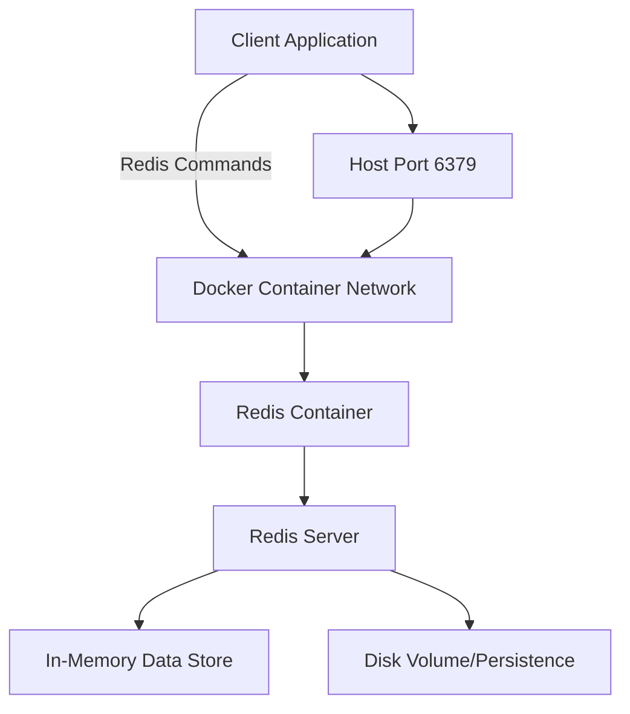

# Redis Docker

## Introduction

Redis (Remote Dictionary Server) is an open-source, in-memory data structure store that can be used as a database, cache, message broker, and streaming engine. Docker is a platform that enables developers to build, share, and run applications in containers. When combined, Redis and Docker provide a powerful way to develop, test, and deploy Redis-based applications with consistency across different environments.

This guide will walk you through setting up Redis using Docker, configuring it for your applications, and understanding best practices for using Redis in containerized environments.

## Prerequisites

Before you begin, make sure you have:

- Docker installed on your system
- Basic understanding of Redis concepts
- Familiarity with command line operations

## Getting Started with Redis in Docker

### Running a Redis Container

The simplest way to get started with Redis in Docker is to pull and run the official Redis image from Docker Hub.

```bash
# Pull the Redis image
docker pull redis

# Run Redis in a container
docker run --name my-redis -p 6379:6379 -d redis
```

This command:
- Creates a container named `my-redis`
- Maps the container's Redis port (6379) to your host machine
- Runs the container in detached mode (`-d`)

You can verify that your Redis container is running with:

```bash
docker ps
```

Output example:
```
CONTAINER ID   IMAGE    COMMAND                  CREATED          STATUS          PORTS                    NAMES
a1b2c3d4e5f6   redis    "docker-entrypoint.s…"   5 seconds ago    Up 4 seconds    0.0.0.0:6379->6379/tcp   my-redis
```

### Connecting to Redis

You can interact with your Redis container using the Redis CLI:

```bash
docker exec -it my-redis redis-cli
```

This opens an interactive Redis CLI session:

```
127.0.0.1:6379> ping
PONG
127.0.0.1:6379> set mykey "Hello Redis with Docker"
OK
127.0.0.1:6379> get mykey
"Hello Redis with Docker"
127.0.0.1:6379> exit
```

## Customizing Your Redis Container

### Using a Redis Configuration File

For production use, you'll likely want to customize Redis with a configuration file.

1. Create a `redis.conf` file on your host machine:

```
# redis.conf
bind 0.0.0.0
protected-mode yes
port 6379
tcp-backlog 511
timeout 0
tcp-keepalive 300
daemonize no
supervised no
pidfile /var/run/redis_6379.pid
loglevel notice
logfile ""
databases 16
always-show-logo yes
save 900 1
save 300 10
save 60 10000
stop-writes-on-bgsave-error yes
rdbcompression yes
rdbchecksum yes
dbfilename dump.rdb
dir ./
```

2. Run Redis with your configuration:

```bash
docker run --name my-redis-custom -v $(pwd)/redis.conf:/usr/local/etc/redis/redis.conf -p 6379:6379 -d redis redis-server /usr/local/etc/redis/redis.conf
```

### Persisting Redis Data

To persist Redis data across container restarts, mount a volume to the container:

```bash
# Create a Docker volume
docker volume create redis-data

# Run Redis with the volume mounted
docker run --name my-redis-persistent -v redis-data:/data -p 6379:6379 -d redis redis-server --appendonly yes
```

The `--appendonly yes` option enables Redis's Append Only File (AOF) persistence, which provides better durability.

## Redis Docker Compose Setup

For more complex setups, Docker Compose is an excellent tool. Create a `docker-compose.yml` file:

```yaml
version: '3'

services:
  redis:
    image: redis:latest
    container_name: redis
    ports:
      - "6379:6379"
    volumes:
      - redis-data:/data
      - ./redis.conf:/usr/local/etc/redis/redis.conf
    command: redis-server /usr/local/etc/redis/redis.conf --appendonly yes
    restart: always
    networks:
      - app-network

volumes:
  redis-data:

networks:
  app-network:
    driver: bridge
```

Start the services with:

```bash
docker-compose up -d
```

## Securing Redis in Docker

Security is essential when running Redis, especially in production environments.

### Setting a Password

Modify your `redis.conf` to include a password:

```
# In redis.conf
requirepass your_strong_password
```

Or using Docker run:

```bash
docker run --name my-redis-secure -p 6379:6379 -d redis redis-server --requirepass "your_strong_password"
```

To connect with authentication:

```bash
docker exec -it my-redis-secure redis-cli -a "your_strong_password"
```

Or in a Redis CLI session:

```
127.0.0.1:6379> auth your_strong_password
OK
```

### Network Isolation

Use Docker networks to isolate your Redis container:

```bash
# Create a network
docker network create redis-net

# Run Redis in the network
docker run --name my-redis-isolated --network redis-net -d redis

# Run your application in the same network
docker run --name my-app --network redis-net -d my-application-image
```

## Redis Docker for Development

### Redis with Different Versions

You can specify a particular version of Redis:

```bash
docker run --name redis-5 -p 6379:6379 -d redis:5.0
docker run --name redis-6 -p 6380:6379 -d redis:6.0
docker run --name redis-latest -p 6381:6379 -d redis:latest
```

### Redis Modules

Redis has modules that extend its functionality. For example, to use Redis with the RedisJSON module:

```bash
docker run --name redis-json -p 6379:6379 -d redislabs/rejson:latest
```

## Practical Examples

### Example 1: Simple Web Counter with Redis and Node.js

Here's a simple Node.js application that uses Redis as a counter:

```javascript
// app.js
const express = require('express');
const redis = require('redis');
const { promisify } = require('util');

const app = express();
const port = 3000;

// Connect to Redis
const client = redis.createClient({
  host: 'redis', // Container name if in Docker network
  port: 6379,
  // password: 'your_password' // Uncomment if using password
});

// Promisify Redis commands
const getAsync = promisify(client.get).bind(client);
const incrAsync = promisify(client.incr).bind(client);

app.get('/', async (req, res) => {
  try {
    // Increment the page views counter
    const views = await incrAsync('pageviews');
    res.send(`This page has been viewed ${views} times!`);
  } catch (error) {
    console.error(error);
    res.status(500).send('Error connecting to Redis');
  }
});

app.listen(port, () => {
  console.log(`App listening at http://localhost:${port}`);
});
```

Docker Compose file for this example:

```yaml
version: '3'

services:
  redis:
    image: redis
    container_name: redis
    ports:
      - "6379:6379"

  app:
    build: .
    container_name: counter-app
    ports:
      - "3000:3000"
    depends_on:
      - redis
    environment:
      - REDIS_URL=redis://redis:6379
```

### Example 2: Session Storage with Redis and Express

Redis is commonly used for session storage in web applications:

```javascript
// session-app.js
const express = require('express');
const session = require('express-session');
const RedisStore = require('connect-redis')(session);
const redis = require('redis');

const app = express();
const port = 3000;

// Redis client
const redisClient = redis.createClient({
  host: 'redis',
  port: 6379
});

// Session middleware
app.use(
  session({
    store: new RedisStore({ client: redisClient }),
    secret: 'mysecretkey',
    resave: false,
    saveUninitialized: false,
    cookie: {
      secure: false, // Set to true in production with HTTPS
      httpOnly: true,
      maxAge: 1000 * 60 * 60 * 24 // 1 day
    }
  })
);

app.get('/', (req, res) => {
  if (req.session.views) {
    req.session.views++;
    res.send(`You have visited this page ${req.session.views} times`);
  } else {
    req.session.views = 1;
    res.send('Welcome to this page for the first time!');
  }
});

app.listen(port, () => {
  console.log(`Session app listening at http://localhost:${port}`);
});
```

## Redis Docker Architecture

Redis in Docker follows a client-server architecture:



## Best Practices

### Production Readiness

1. **Use specific Redis versions** - Avoid using the `latest` tag in production.
2. **Implement proper persistence** - Use AOF for better durability.
3. **Set memory limits** - Configure Redis's `maxmemory` settings to avoid container crashes.
4. **Regular backups** - Implement a backup strategy for Redis data.
5. **Health checks** - Add Docker health checks to monitor Redis container health.

Example Docker Compose with health check:

```yaml
services:
  redis:
    image: redis:6.2
    healthcheck:
      test: ["CMD", "redis-cli", "ping"]
      interval: 10s
      timeout: 5s
      retries: 3
```

### Resource Management

Configure container resources explicitly:

```bash
docker run --name my-redis -p 6379:6379 --memory="512m" --cpus="2" -d redis
```

## Monitoring Redis in Docker

You can monitor Redis performance using the Redis CLI:

```bash
docker exec -it my-redis redis-cli info
```

For more comprehensive monitoring, tools like Prometheus and Grafana can be integrated with your Redis Docker setup.

## Scaling Redis with Docker

### Redis Replication

Set up Redis with a primary and replica:

```yaml
version: '3'

services:
  redis-primary:
    image: redis
    ports:
      - "6379:6379"
    volumes:
      - redis-primary-data:/data
    command: redis-server --appendonly yes

  redis-replica:
    image: redis
    ports:
      - "6380:6379"
    volumes:
      - redis-replica-data:/data
    command: redis-server --appendonly yes --replicaof redis-primary 6379
    depends_on:
      - redis-primary

volumes:
  redis-primary-data:
  redis-replica-data:
```

### Redis Cluster

For more advanced setups, you can implement Redis Cluster with Docker Compose. This is beyond the scope of this tutorial but is recommended for production environments requiring high availability.

## Summary

Redis and Docker provide a powerful combination for developing, testing, and deploying applications that require fast, in-memory data storage. In this guide, we've covered:

- Setting up a basic Redis container
- Configuring Redis with custom settings
- Persisting Redis data across container restarts
- Securing Redis in Docker
- Using Docker Compose for more complex setups
- Real-world examples of Redis with containerized applications
- Best practices for running Redis in Docker

By containerizing Redis, you gain portability, isolation, and consistency across different environments, making development and deployment more efficient and reliable.

## Further Resources

- [Official Redis Documentation](https://redis.io/documentation)
- [Redis Docker Hub Page](https://hub.docker.com/_/redis)
- [Docker Documentation](https://docs.docker.com/)
- [Redis University](https://university.redis.com/) - Free online courses

## Exercises

1. Set up a Redis container with password authentication and test connecting to it.
2. Create a Docker Compose file that includes Redis and a simple web application that counts visits.
3. Implement Redis persistence using both RDB and AOF, and test recovery after container restarts.
4. Set up a Redis replication with one primary and two replicas using Docker Compose.
5. Benchmark Redis performance inside a Docker container vs. native installation.