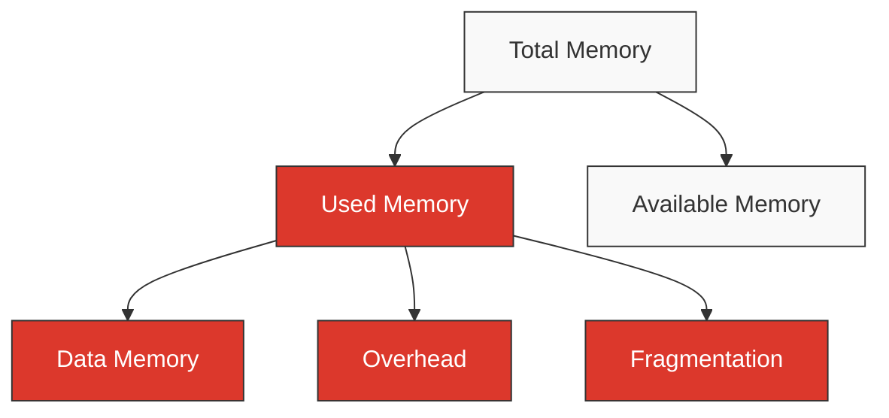

# Redis Memory Optimization

## Introduction

Redis is an in-memory data structure store that's widely used as a database, cache, message broker, and streaming engine. As the name suggests, Redis stores all data in memory (RAM), which is what makes it incredibly fast. However, this design choice also means that memory usage directly impacts both performance and operating costs.

In this guide, we'll explore various techniques to optimize Redis memory usage while maintaining performance. Understanding these concepts is crucial because efficient memory usage allows you to:

- Store more data within the same hardware constraints
- Reduce infrastructure costs
- Minimize garbage collection pauses
- Improve overall application performance

## Understanding Redis Memory Usage

Before optimizing memory, it's important to understand how Redis uses memory. Redis maintains several types of memory allocations:

- **Data memory**: Used to store the actual data (keys and values)
- **Overhead memory**: Used for Redis internal structures
- **Fragmentation**: Unused memory resulting from the memory allocation process
- **Operating system memory**: Memory used by the OS itself

Let's visualize Redis memory usage:



### Checking Current Memory Usage

Before optimizing, you need to know your current memory usage. Redis provides several commands to inspect memory:

```bash
> INFO memory
# Memory
used_memory:1032016
used_memory_human:1007.83K
used_memory_rss:7962624
used_memory_rss_human:7.59M
mem_fragmentation_ratio:7.72
```

To get memory usage for a specific key:

```bash
> MEMORY USAGE mykey
(integer) 90
```

## Memory Optimization Techniques

Let's explore the most effective methods for optimizing Redis memory usage:

### 1. Choose Appropriate Data Structures

Redis offers various data structures, each with different memory characteristics:

| Data Structure | When to Use | Memory Efficiency |
|----------------|-------------|-------------------|
| String         | Simple values | Good for small values |
| Hash           | Objects with multiple fields | Very efficient for small objects |
| List           | Ordered collection | Good for queues and stacks |
| Set            | Unique items | Moderate |
| Sorted Set     | Scored items | Higher memory usage |

#### Example: Using Hashes Instead of Individual Strings

Instead of:

```bash
> SET user:1:name "John"
> SET user:1:email "john@example.com"
> SET user:1:age "30"
```

Use a hash:

```bash
> HSET user:1 name "John" email "john@example.com" age "30"
```

This significantly reduces memory overhead as a single key stores multiple fields.

### 2. Use Key Expiration

Set an expiration time for keys that don't need to be stored permanently:

```bash
> SET session:12345 "user_data" EX 3600  # Expires in 1 hour
```

You can also use the `EXPIRE` command for existing keys:

```bash
> EXPIRE cache:results 300  # Expires in 5 minutes
```

### 3. Enable Redis Compression

Redis can compress values using the LZF algorithm with the `redis.conf` setting:

```
maxmemory-policy allkeys-lru
```

This is particularly effective for string values with repetitive patterns.

### 4. Optimize String Encoding

Redis automatically uses a special encoding for strings that represent integers:

```bash
> SET mystring "12345"
> OBJECT ENCODING mystring
"int"
```

For strings under 44 bytes, Redis uses the 'embstr' encoding, which is more memory-efficient:

```bash
> SET mystring "hello"
> OBJECT ENCODING mystring
"embstr"
```

### 5. Configure Redis Maxmemory and Eviction Policies

Set a memory limit and an eviction policy to automatically manage memory:

```
# In redis.conf
maxmemory 100mb
maxmemory-policy allkeys-lru
```

Available eviction policies:

- `noeviction`: Return errors when memory limit is reached
- `allkeys-lru`: Evict least recently used keys
- `volatile-lru`: Evict least recently used keys with expiration set
- `allkeys-random`: Evict random keys
- `volatile-random`: Evict random keys with expiration set
- `volatile-ttl`: Evict keys with shortest time-to-live

### 6. Use Redis Key Naming Conventions

Adopt a consistent naming convention to help with key management:

```
object-type:id:field
```

For example:

```
user:1000:profile
product:xyz:inventory
```

This makes it easier to manage and expire related keys.

## Practical Example: Optimizing a Cache System

Let's implement a memory-efficient caching system for a web application:

```javascript
const redis = require('redis');
const client = redis.createClient();

// Function to cache API results efficiently
async function cacheApiResult(endpoint, data, ttlSeconds) {
  // Use hashes for structured data
  if (typeof data === 'object') {
    // Convert object to flat fields for HSET
    const fields = [];
    
    for (const [key, value] of Object.entries(data)) {
      fields.push(key);
      fields.push(typeof value === 'object' ? JSON.stringify(value) : String(value));
    }
    
    // Store as hash with expiration
    await client.hSet(`api:${endpoint}`, fields);
    await client.expire(`api:${endpoint}`, ttlSeconds);
  } else {
    // Use string for simple data with expiration
    await client.set(`api:${endpoint}`, String(data), {
      EX: ttlSeconds
    });
  }
}

// Example usage
async function fetchUserData(userId) {
  const cacheKey = `user:${userId}`;
  
  // Try to get from cache first
  const cachedData = await client.hGetAll(cacheKey);
  
  if (Object.keys(cachedData).length > 0) {
    console.log('Cache hit!');
    return cachedData;
  }
  
  console.log('Cache miss, fetching from API...');
  // Simulate API call
  const userData = {
    id: userId,
    name: 'John Doe',
    email: 'john@example.com',
    preferences: {
      theme: 'dark',
      notifications: true
    }
  };
  
  // Cache for 10 minutes
  await cacheApiResult(cacheKey, userData, 600);
  
  return userData;
}
```

This implementation:
- Uses hashes for structured data to reduce memory overhead
- Implements automatic expiration to prevent memory leaks
- Follows a consistent key naming convention

## Advanced Memory Optimization Techniques

### 1. Using Redis Modules

Redis modules like RedisJSON provide specialized data structures that can be more memory-efficient:

```bash
> JSON.SET user:1 $ '{"name":"John","email":"john@example.com","age":30}'
```

### 2. Implementing Key Sharding

For large datasets, distribute keys across multiple Redis instances:

```javascript
function getRedisClient(key) {
  // Simple hash function to determine shard
  const shard = stringHash(key) % NUM_SHARDS;
  return redisClients[shard];
}
```

### 3. Use Redis Streams Instead of Lists for Logs

Redis Streams are more memory-efficient for log-like data:

```bash
> XADD logs * timestamp 1609459200 level info message "User logged in"
```

## Monitoring Memory Usage in Production

Implement continuous monitoring to catch memory issues:

```javascript
async function monitorRedisMemory() {
  const info = await client.info('memory');
  const lines = info.split('\r
');
  const memoryStats = {};
  
  for (const line of lines) {
    if (line.startsWith('used_memory') || line.includes('fragmentation')) {
      const [key, value] = line.split(':');
      memoryStats[key] = value;
    }
  }
  
  console.log('Memory stats:', memoryStats);
  
  // Alert if memory usage exceeds threshold
  if (parseInt(memoryStats.used_memory) > MEMORY_THRESHOLD) {
    triggerAlert('Redis memory usage exceeds threshold');
  }
}
```

## Memory Optimization Checklist

Use this checklist to ensure you've considered all optimization options:

- [ ] Use appropriate data structures (hashes for objects)
- [ ] Set expiration for temporary data
- [ ] Configure maxmemory and eviction policy
- [ ] Monitor memory usage and fragmentation
- [ ] Consider compression for large values
- [ ] Implement consistent key naming
- [ ] Shard data across instances if needed

## Summary

Memory optimization is critical for Redis performance and cost-efficiency. By understanding how Redis uses memory and implementing the techniques covered in this guide, you can significantly reduce memory usage while maintaining performance.

Remember these key points:
- Choose appropriate data structures (hashes are often more efficient)
- Set expiration times for temporary data
- Configure memory limits and eviction policies
- Monitor memory usage in production
- Use consistent key naming conventions

## Additional Resources

- [Redis Memory Optimization Documentation](https://redis.io/topics/memory-optimization)
- [Redis Memory Management](https://redis.io/topics/memory-management)
- [Redis Data Types](https://redis.io/topics/data-types)

## Exercises

1. Compare the memory usage of storing 1000 user objects as individual keys versus using hashes.
2. Implement a caching system with automatic expiration for an API.
3. Set up monitoring for Redis memory usage and simulate memory pressure.
4. Experiment with different maxmemory-policies and measure their impact.