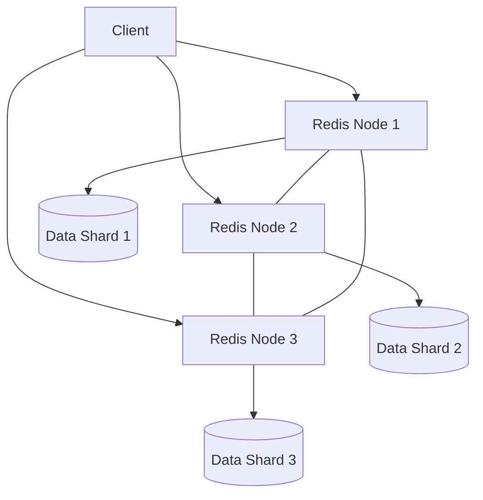

# Redis CPU Optimization

## Introduction

Redis is known for its lightning-fast performance as an in-memory data store. However, as your application scales, you might notice increased CPU usage that could potentially become a bottleneck. This guide explores techniques to optimize Redis CPU utilization, helping you maintain high performance even under heavy loads.

Redis operations are primarily single-threaded (with some exceptions in newer versions), which means efficient CPU usage is crucial for maintaining responsiveness and throughput. By understanding how Redis uses CPU resources and implementing optimization strategies, you can significantly improve your Redis deployment's performance.

## Understanding Redis CPU Usage

Before diving into optimization techniques, let's understand what causes high CPU usage in Redis:

1. **Command complexity**: Some Redis commands require more CPU cycles than others.
2. **High throughput**: Processing a large number of requests, even if they're simple.
3. **Large datasets**: Working with large keys or performing operations on large collections.
4. **Inefficient data structures**: Using the wrong data structure for your use case.
5. **Background processes**: Operations like RDB persistence and key expiration.

## Monitoring Redis CPU Usage

The first step in optimization is identifying whether CPU is actually your bottleneck:

```bash
# Using redis-cli INFO command
$ redis-cli INFO CPU

# Output
used_cpu_sys:10.49
used_cpu_user:9.46
used_cpu_sys_children:0.00
used_cpu_user_children:0.00
```

You can also use the `MONITOR` command to observe Redis operations in real-time, but be cautious as this adds overhead:

```bash
$ redis-cli MONITOR
```

For production environments, consider tools like Redis Exporter with Prometheus and Grafana for comprehensive monitoring.

## Optimization Techniques

### 1. Choose Efficient Commands

Some Redis commands are more CPU-intensive than others. Here's a comparison:

| Command Type | CPU Efficiency | Examples |
|--------------|----------------|----------|
| Simple Key Operations | High | GET, SET, INCR |
| Hash Operations | High | HGET, HSET |
| List Operations | Medium | LPUSH, RPOP |
| Set Operations | Medium | SADD, SISMEMBER |
| Sorted Set Operations | Low | ZADD, ZRANGE |
| Complex Operations | Very Low | SORT, ZUNIONSTORE |

**Example**: Instead of using `KEYS` (which can be extremely expensive), use `SCAN`:

```bash
# Bad practice
$ redis-cli KEYS "user:*"

# Better practice
$ redis-cli --scan --pattern "user:*"
```

### 2. Optimize Lua Scripts

Lua scripts allow you to combine multiple operations into a single atomic unit, reducing network overhead. However, complex scripts can consume significant CPU:

```lua
-- A simple and efficient Lua script
local key = KEYS[1]
local value = redis.call("GET", key)
if value then
  return redis.call("INCR", key)
else
  return redis.call("SET", key, 1)
end
```

```bash
# Execute the Lua script
$ redis-cli EVAL "local key = KEYS[1]; local value = redis.call(\"GET\", key); if value then return redis.call(\"INCR\", key) else return redis.call(\"SET\", key, 1) end" 1 mykey
```

When using Lua scripts:
- Keep them simple and focused
- Avoid loops with many iterations
- Pre-compute values when possible

### 3. Use Pipelining

Pipelining batches commands, reducing the impact of network latency and improving throughput:

```javascript
// Node.js example using ioredis
const Redis = require("ioredis");
const redis = new Redis();

const pipeline = redis.pipeline();
for (let i = 0; i < 1000; i++) {
  pipeline.set(`key:${i}`, `value:${i}`);
}
pipeline.exec().then(results => {
  console.log(`Completed ${results.length} operations`);
});
```

### 4. Choose Appropriate Data Structures

Redis offers multiple data structures, each with different CPU characteristics:

```bash
# Using a hash for storing user properties (efficient)
$ redis-cli HMSET user:1000 name "John" email "john@example.com" age 30

# Instead of multiple string keys (less efficient)
$ redis-cli SET user:1000:name "John"
$ redis-cli SET user:1000:email "john@example.com"
$ redis-cli SET user:1000:age 30
```

### 5. Optimize Key Expiration

Key expiration can cause CPU spikes. Redis uses two strategies:

- **Passive expiration**: Keys are removed when accessed (low CPU impact)
- **Active expiration**: Redis periodically samples keys (can cause CPU spikes)

To optimize:

```bash
# Configure the expiration sampling frequency in redis.conf
hz 10  # Default is 10, higher values use more CPU but expire keys more precisely
```

### 6. Memory Optimization (Impacts CPU)

Memory optimization indirectly affects CPU usage by reducing work for internal processes:

```bash
# Configure maxmemory and eviction policy in redis.conf
maxmemory 4gb
maxmemory-policy allkeys-lru
```

### 7. Configure Client Connections

Excessive client connections can increase CPU overhead:

```bash
# Configure maximum clients in redis.conf
maxclients 10000
```

## Advanced Techniques

### 1. Use Redis Cluster

Redis Cluster distributes data across multiple nodes, spreading CPU load:



### 2. Utilize Redis 6+ Threaded I/O

Redis 6 introduced threaded I/O which can significantly improve performance:

```bash
# Configure I/O threads in redis.conf
io-threads 4
io-threads-do-reads yes
```

### 3. Consider Redis Enterprise

For mission-critical applications, Redis Enterprise provides enhanced performance features including:
- Multi-threaded architecture
- Resource isolation
- Advanced monitoring

## Real-World Examples

### E-Commerce Product Catalog

An e-commerce site storing product information in Redis was experiencing high CPU usage. The problem and solution:

**Problem**: Using separate string keys for each product attribute.
**Solution**: Switched to hash data structure.

```bash
# Before: Multiple GET operations
$ redis-cli GET product:1001:name
$ redis-cli GET product:1001:price
$ redis-cli GET product:1001:stock

# After: Single HGETALL operation
$ redis-cli HGETALL product:1001
```

**Result**: CPU usage decreased by 45%.

### Social Media Feed

A social media application generating user feeds experienced CPU spikes.

**Problem**: Generating feeds on-demand with complex sorted set operations.
**Solution**: Pre-compute feeds and update incrementally.

```bash
# Instead of computing this for each request
$ redis-cli ZINTERSTORE user:123:feed 2 global:posts user:123:following WEIGHTS 1 0

# Pre-compute and update incrementally
$ redis-cli ZADD user:123:feed 1634567890 post:456
```

**Result**: 70% reduction in CPU usage during peak times.

## Common Pitfalls to Avoid

1. **Using KEYS in production**: Use SCAN instead.
2. **Storing large objects**: Break them down into smaller pieces.
3. **Inefficient Lua scripts**: Optimize algorithms within scripts.
4. **Ignoring pipelining**: Always batch related operations.
5. **Overusing expensive commands**: Like SORT, ZUNIONSTORE, etc.

## Summary

Optimizing Redis CPU usage involves understanding Redis's execution model, choosing appropriate commands and data structures, and implementing efficient access patterns. By following these strategies, you can ensure Redis continues to deliver exceptional performance even as your application scales.

Remember that optimization should be data-driven—monitor your Redis instances, identify bottlenecks, and then apply targeted optimizations based on your findings.

## Additional Resources

- [Redis Official Documentation](https://redis.io/documentation)
- [Redis Command Reference](https://redis.io/commands)
- [Redis Optimization Tips from Redis Labs](https://redis.com/blog/)

## Exercises

1. Use the INFO command to measure CPU usage for different Redis operations. Compare simple operations (GET/SET) with complex ones (ZUNIONSTORE).
2. Implement a Lua script to optimize a multi-step operation in your application.
3. Convert an application using individual Redis keys to one using hashes, and measure the performance difference.
4. Set up a Redis monitoring dashboard using Prometheus and Grafana.
5. Experiment with different values for the `hz` configuration parameter and observe its impact on CPU usage.