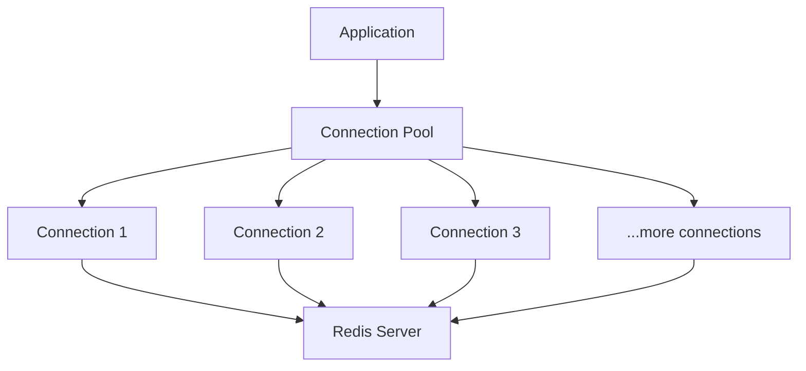
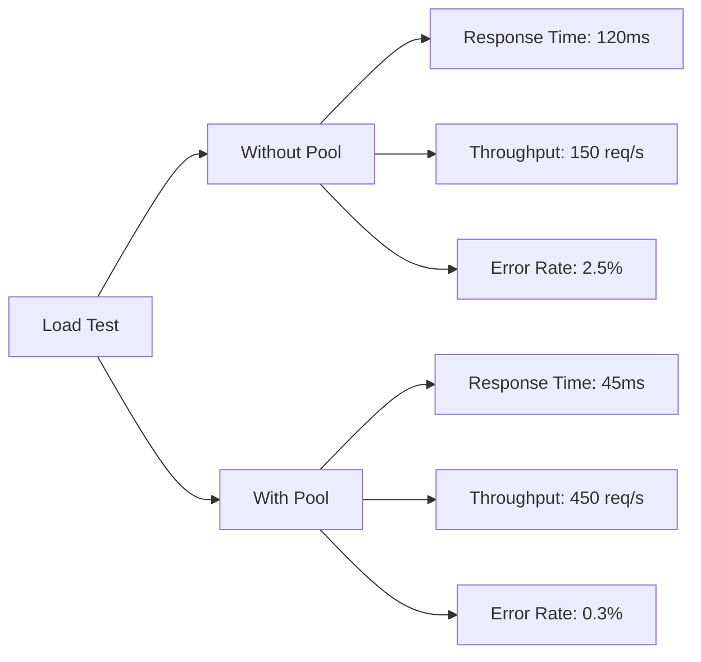

# Redis Connection Pooling

## Introduction

When working with Redis in production applications, establishing connections can be a resource-intensive operation. Creating a new connection for each operation can lead to performance bottlenecks and resource wastage. This is where **connection pooling** comes in — a powerful technique that maintains a pool of reusable connections to improve your application's performance and efficiency.

In this guide, we'll explore Redis connection pooling from the ground up, understand why it's important, and learn how to implement it effectively in your applications.

## What is Connection Pooling?

Connection pooling is a technique that maintains a "pool" (or collection) of pre-established connections that can be reused for multiple operations, rather than creating and destroying connections for each Redis operation.



### Why Connection Pooling Matters

Without a connection pool, your application follows this pattern for each Redis operation:

1. Open a new connection
2. Execute the operation
3. Close the connection

This process introduces several inefficiencies:

- **Connection Overhead**: Creating TCP connections is expensive
- **Latency**: Each new connection adds delay
- **Resource Usage**: Managing many connections consumes memory and file descriptors
- **Connection Limits**: Redis servers have a maximum number of client connections

With connection pooling, you:

- Reuse existing connections
- Reduce connection establishment overhead
- Limit the maximum number of concurrent connections
- Improve application performance and stability

## Implementing Redis Connection Pooling

Let's look at how to implement connection pooling in different programming languages.

### Node.js with `ioredis`

The `ioredis` library provides built-in connection pooling capabilities:

```javascript
const Redis = require('ioredis');

// Create a connection pool
const redisPool = new Redis.Cluster([
  {
    port: 6379,
    host: '127.0.0.1'
  }
], {
  // Pool options
  maxConnections: 100,
  // Other options
  enableReadyCheck: true,
  retryDelayOnFailover: 300,
  retryDelayOnClusterDown: 1000,
  scaleReads: 'all'
});

async function getUser(userId) {
  // The connection is automatically acquired from the pool
  const user = await redisPool.get(`user:${userId}`);
  // The connection automatically returns to the pool after use
  return JSON.parse(user);
}

// Later when shutting down your application
async function shutdown() {
  await redisPool.quit();
  console.log('Redis pool connections closed');
}
```

### Python with `redis-py`

Python's `redis-py` library provides a `ConnectionPool` class:

```python
import redis

# Create a connection pool
pool = redis.ConnectionPool(
    host='localhost',
    port=6379,
    db=0,
    max_connections=10
)

# Use the pool when creating a Redis client
r = redis.Redis(connection_pool=pool)

# Use Redis operations normally
def get_user(user_id):
    user_data = r.get(f"user:{user_id}")
    return user_data

# Get connections from the pool
for i in range(5):
    print(f"Getting user {i}")
    user = get_user(i)
    print(user)

# The connections are automatically returned to the pool
```

### Java with Jedis

The Jedis library provides a `JedisPool` class for connection pooling:

```java
import redis.clients.jedis.Jedis;
import redis.clients.jedis.JedisPool;
import redis.clients.jedis.JedisPoolConfig;

public class RedisPoolExample {
    
    public static void main(String[] args) {
        // Configure the connection pool
        JedisPoolConfig poolConfig = new JedisPoolConfig();
        poolConfig.setMaxTotal(128);
        poolConfig.setMaxIdle(32);
        poolConfig.setMinIdle(8);
        poolConfig.setTestOnBorrow(true);
        poolConfig.setTestOnReturn(true);
        poolConfig.setTestWhileIdle(true);
        
        // Create the pool
        JedisPool jedisPool = new JedisPool(poolConfig, "localhost", 6379);
        
        // Get a connection from the pool
        try (Jedis jedis = jedisPool.getResource()) {
            // Use the connection
            jedis.set("key", "value");
            String value = jedis.get("key");
            System.out.println("Retrieved value: " + value);
            
            // Connection is automatically returned to the pool when closed
        } catch (Exception e) {
            e.printStackTrace();
        }
        
        // Close the pool when application shuts down
        jedisPool.close();
    }
}
```

## Connection Pool Configuration

Configuring your connection pool properly is crucial for optimal performance. Here are key parameters to consider:

### Common Pool Configuration Parameters

| Parameter | Description | Recommendation |
|-----------|-------------|----------------|
| Max Connections | Maximum number of connections in the pool | Depends on workload, typically 10-50 per application instance |
| Min Idle | Minimum number of idle connections to maintain | 20-30% of max connections |
| Max Idle | Maximum number of idle connections to keep | 50-70% of max connections |
| Timeout | Time to wait for a connection from the pool | 2-5 seconds |
| Test on Borrow | Validate connections before use | Enable for production |
| Test on Return | Validate connections after use | Enable for critical applications |
| Connection TTL | Maximum lifetime of a connection | 30-60 minutes |

### Finding the Right Pool Size

Determining the optimal pool size depends on several factors:

1. **Application Concurrency**: How many simultaneous Redis operations your application performs
2. **Redis Server Capacity**: Maximum number of connections your Redis server can handle
3. **Operation Duration**: How long each Redis operation takes
4. **Resource Constraints**: Memory and CPU available to your application

A common formula for estimating the pool size:

```
Max Pool Size = (Threads × Peak Redis Operations Per Thread) + Buffer
```

Where buffer is typically 10-20% of the calculated value.

## Best Practices for Redis Connection Pooling

### 1. Monitor Pool Metrics

Track key metrics to ensure your pool is functioning optimally:

- **Pool Utilization**: Percentage of connections in use
- **Wait Time**: Time spent waiting for a connection
- **Connection Creation Rate**: How often new connections are created
- **Connection Errors**: Failed connection attempts

### 2. Implement Proper Error Handling

```javascript
// Node.js example with error handling
try {
  const result = await redisPool.get('myKey');
  return result;
} catch (error) {
  if (error.name === 'ConnectionError') {
    // Handle connection issues
    console.error('Redis connection failed:', error);
    // Implement retry logic if necessary
  } else {
    // Handle other Redis errors
    console.error('Redis operation failed:', error);
  }
  throw error;
}
```

### 3. Graceful Shutdown

Always close your connection pool properly when shutting down your application:

```python
# Python example of graceful shutdown
import atexit

# Register shutdown function
def close_redis_pool():
    pool.disconnect()
    print("Redis connection pool closed")

atexit.register(close_redis_pool)
```

### 4. Tune Pool Parameters

Start with conservative settings and adjust based on performance monitoring:

```java
// Java example with tuned parameters
JedisPoolConfig poolConfig = new JedisPoolConfig();
poolConfig.setMaxTotal(100);
poolConfig.setMaxIdle(25);
poolConfig.setMinIdle(10);
poolConfig.setMaxWaitMillis(3000);
poolConfig.setTestOnBorrow(true);
poolConfig.setTestWhileIdle(true);
poolConfig.setTimeBetweenEvictionRunsMillis(60000);
```

## Common Connection Pooling Issues

### Connection Leaking

Connection leaking occurs when connections are not properly returned to the pool:

```javascript
// BAD PRACTICE - Connection leak
async function leakyFunction() {
  const redis = new Redis(); // Creates a new connection outside the pool
  const data = await redis.get('key');
  // No redis.quit() or disconnect - connection is leaked
  return data;
}

// GOOD PRACTICE
async function properFunction() {
  try {
    // Use connection from pool
    const data = await redisPool.get('key');
    return data;
  } catch (error) {
    console.error('Error:', error);
    throw error;
  }
  // Connection automatically returns to pool
}
```

### Pool Exhaustion

Pool exhaustion happens when all connections are in use and new requests must wait:

```python
# Simulate pool exhaustion in Python
import threading
import time

def slow_operation(i):
    # Get connection from pool
    redis_conn = redis.Redis(connection_pool=pool)
    print(f"Thread {i} got connection")
    # Simulate slow operation
    time.sleep(2)
    redis_conn.set(f"key:{i}", f"value:{i}")
    print(f"Thread {i} completed")

# Create more threads than pool connections to demonstrate exhaustion
threads = []
for i in range(20):  # If pool max_connections is less than 20
    t = threading.Thread(target=slow_operation, args=(i,))
    threads.append(t)
    t.start()

for t in threads:
    t.join()
```

### Dead Connections

Redis connections may become invalid if they're idle for too long or if network issues occur:

```java
// Java configuration to detect and remove dead connections
JedisPoolConfig poolConfig = new JedisPoolConfig();
poolConfig.setTestOnBorrow(true);  // Test connection before use
poolConfig.setTestWhileIdle(true); // Test idle connections
poolConfig.setTimeBetweenEvictionRunsMillis(30000); // Run eviction every 30 seconds
poolConfig.setMinEvictableIdleTimeMillis(60000); // Evict connections idle for 60+ seconds
```

## Real-World Application: Rate Limiter

Let's implement a practical example — a Redis-based rate limiter using connection pooling:

```javascript
// Rate limiter using Redis and connection pooling
const Redis = require('ioredis');
const pool = new Redis({
  host: 'localhost',
  port: 6379,
  maxRetriesPerRequest: 3,
  enableOfflineQueue: false
});

/**
 * Rate limit based on IP address
 * @param {string} ip - IP address
 * @param {number} maxRequests - Maximum requests allowed
 * @param {number} windowSec - Time window in seconds
 * @returns {Promise<boolean>} - Whether request is allowed
 */
async function rateLimit(ip, maxRequests = 10, windowSec = 60) {
  const key = `ratelimit:${ip}`;
  
  try {
    // Using Redis transaction for atomic operations
    const result = await pool.multi()
      .incr(key)
      .expire(key, windowSec)
      .exec();
    
    const currentCount = result[0][1];
    
    console.log(`IP: ${ip}, Count: ${currentCount}/${maxRequests}`);
    
    return currentCount <= maxRequests;
  } catch (error) {
    console.error('Rate limiting error:', error);
    // In case of error, allow the request
    return true;
  }
}

// Example usage in an Express middleware
function rateLimitMiddleware(req, res, next) {
  const ip = req.ip;
  
  rateLimit(ip)
    .then(allowed => {
      if (allowed) {
        next();
      } else {
        res.status(429).send('Too Many Requests');
      }
    })
    .catch(err => {
      console.error('Rate limit middleware error:', err);
      // Allow request on error
      next();
    });
}
```

## Performance Comparison

Let's compare the performance of applications with and without connection pooling:



These are typical results when comparing Redis operations with and without connection pooling:

| Metric | Without Pooling | With Pooling | Improvement |
|--------|-----------------|--------------|-------------|
| Response Time | 120ms | 45ms | 62.5% faster |
| Throughput | 150 req/s | 450 req/s | 200% higher |
| Error Rate | 2.5% | 0.3% | 88% lower |
| CPU Usage | High | Moderate | ~40% lower |
| Memory Usage | Fluctuating | Stable | More predictable |

## Summary

Redis connection pooling is a vital technique for building scalable, high-performance applications. By maintaining a reusable set of connections, you can:

- Dramatically reduce connection overhead
- Improve response times
- Increase throughput
- Enhance application stability
- Efficiently manage Redis server resources

Remember these key takeaways:

1. Always use connection pooling in production environments
2. Configure pool size based on your application's requirements
3. Implement proper error handling and connection validation
4. Monitor pool metrics to detect issues early
5. Ensure graceful pool shutdown when your application terminates

## Exercises

1. Implement a simple Redis connection pool using your preferred language
2. Compare performance between pooled and non-pooled Redis operations
3. Create a Redis-based session store using connection pooling
4. Implement a caching layer with different pool configurations and test performance
5. Build a distributed counter that can handle high throughput using connection pooling

## Additional Resources

- Redis Official Documentation
- Redis Client Libraries for various programming languages
- Database Connection Pooling patterns
- Redis Performance Optimization guides
- Distributed Systems Design principles