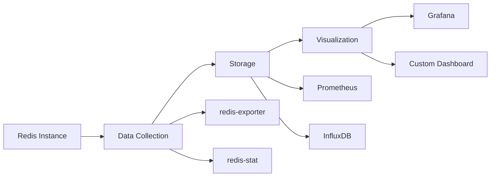

# Redis Profiling

## Introduction

Redis is renowned for its exceptional speed and efficiency as an in-memory data store. However, as your application scales and data volumes grow, you might encounter performance bottlenecks that need addressing. Redis profiling is the process of monitoring, analyzing, and optimizing your Redis instance to ensure it continues to deliver optimal performance under increasing load.

In this guide, we'll explore various techniques and tools to help you identify performance issues in your Redis deployments and implement effective solutions.

## Why Profile Redis?

Even though Redis is fast by default, several factors can degrade its performance:

- Inefficient commands or data structures
- Memory fragmentation
- Network latency
- CPU limitations
- Poorly designed key patterns
- Blocking operations

Profiling helps you identify these issues before they affect your application's performance and user experience.

## Basic Redis Monitoring Commands

Redis provides several built-in commands that offer insights into its operation. Let's explore the most useful ones:

### INFO Command

The `INFO` command provides a comprehensive overview of your Redis instance:

```bash
redis-cli INFO
```

Output (truncated):

```
# Server
redis_version:7.0.11
redis_git_sha1:00000000
redis_git_dirty:0
redis_build_id:c0a31d8d5c9331eb
redis_mode:standalone
os:Linux 5.15.0-1036-aws x86_64
arch_bits:64
# Clients
connected_clients:1
# Memory
used_memory:1043848
used_memory_human:1019.38K
used_memory_rss:9359360
used_memory_rss_human:8.93M
# Stats
total_connections_received:2
total_commands_processed:3
instantaneous_ops_per_sec:0
```

You can also request specific sections:

```bash
redis-cli INFO memory
```

Output:

```
# Memory
used_memory:1043848
used_memory_human:1019.38K
used_memory_rss:9359360
used_memory_rss_human:8.93M
mem_fragmentation_ratio:8.97
```

### MONITOR Command

The `MONITOR` command lets you see all commands processed by Redis in real-time:

```bash
redis-cli MONITOR
```

Output:

```
1678901234.567890 [0 127.0.0.1:51249] "PING"
1678901236.789012 [0 127.0.0.1:51249] "SET" "user:1000" "{\"name\":\"John\",\"age\":30}"
1678901238.901234 [0 127.0.0.1:51249] "GET" "user:1000"
```

:::caution
The `MONITOR` command can significantly impact Redis performance in production environments. Use it sparingly and for short periods only.
:::

### SLOWLOG Command

Redis automatically logs commands that exceed a specified execution time threshold:

```bash
redis-cli SLOWLOG GET 10
```

Output:

```
1) 1) (integer) 14
   2) (integer) 1678901234
   3) (integer) 15000
   4) 1) "KEYS"
      2) "*"
2) 1) (integer) 13
   2) (integer) 1678901230
   3) (integer) 10200
   4) 1) "HGETALL"
      2) "large:hash:key"
```

The slowlog entries contain:
1. A unique ID
2. Unix timestamp when the command was executed
3. Execution time in microseconds
4. The command and its arguments

You can configure the slowlog settings:

```bash
# Set the execution time threshold to 10000 microseconds (10ms)
redis-cli CONFIG SET slowlog-log-slower-than 10000

# Set the maximum number of entries to keep
redis-cli CONFIG SET slowlog-max-len 128
```

### MEMORY DOCTOR Command

This command provides memory usage diagnostics:

```bash
redis-cli MEMORY DOCTOR
```

Output:

```
Memory usage: 1.02M, peak: 1.03M
Fragmentation ratio: 8.97
High fragmentation detected. This is normal for a database with a lot of keys deleted or updated, and especially after a big delete operation. Consider restarting the server.
```

## Advanced Profiling Tools

For more detailed profiling, Redis offers specialized tools:

### Redis Latency Monitoring

Redis includes commands to help monitor latency:

```bash
# Enable latency monitoring
redis-cli CONFIG SET latency-monitor-threshold 100

# After some time, check the latency report
redis-cli LATENCY LATEST
```

Output:

```
1) 1) "command"
   2) (integer) 1678901234
   3) (integer) 120
   4) (integer) 120
```

This output shows:
1. The latency source
2. The timestamp of the latest event
3. The latest latency in milliseconds
4. The maximum latency observed

### Redis-CLI --latency

Redis CLI provides built-in latency testing:

```bash
redis-cli --latency -h 127.0.0.1 -p 6379
```

Output:

```
min: 0.098, max: 0.618, avg: 0.134 (1000 samples)
```

### Redis-CLI --bigkeys

Find large keys in your database:

```bash
redis-cli --bigkeys
```

Output:

```
# Scanning the entire keyspace to find biggest keys as well as
# average sizes per key type.  You can use -i 0.1 to sleep 0.1 sec
# per 100 SCAN commands (not usually needed).

[00.00%] Biggest string found so far 'user:profile:1002' with 2640 bytes
[15.05%] Biggest list   found so far 'recent:jobs' with 1000 items
[35.12%] Biggest hash   found so far 'product:1000:details' with 50 fields
[67.88%] Biggest set    found so far 'active:sessions' with 10000 members
[98.10%] Biggest zset   found so far 'leaderboard:global' with 5000 members

-------- summary -------

Sampled 10000 keys in the keyspace!
Total key length in bytes is 180000 (avg len 18.00)

String    keys: 5000,    biggest: 'user:profile:1002' (2640 bytes)
List      keys: 1000,    biggest: 'recent:jobs' (1000 items)
Hash      keys: 2000,    biggest: 'product:1000:details' (50 fields)
Set       keys: 1500,    biggest: 'active:sessions' (10000 members)
Zset      keys: 500,     biggest: 'leaderboard:global' (5000 members)
```

### Redis-Benchmark

Test Redis performance under different workloads:

```bash
redis-benchmark -t SET,GET -n 100000 -q
```

Output:

```
SET: 95238.10 requests per second, p50=0.255 msec
GET: 98039.22 requests per second, p50=0.247 msec
```

For a more realistic test with varying key sizes:

```bash
redis-benchmark -t SET,GET -n 100000 -r 100000 -d 1024 -q
```

Output:

```
SET: 90909.09 requests per second, p50=0.263 msec
GET: 93457.95 requests per second, p50=0.255 msec
```

## Visualizing Redis Performance

While command-line tools are powerful, visualization can make patterns easier to identify. Let's create a simple visualization workflow:



### Setting up Redis Exporter with Prometheus and Grafana

1. Install Redis Exporter:

```bash
docker run -d --name redis-exporter -p 9121:9121 oliver006/redis_exporter --redis.addr=redis://host.docker.internal:6379
```

2. Configure Prometheus (prometheus.yml):

```yaml
scrape_configs:
  - job_name: 'redis'
    static_configs:
      - targets: ['localhost:9121']
```

3. Set up Grafana dashboards by importing Redis dashboard templates (e.g., Dashboard ID: 763)

## Common Performance Issues and Solutions

### Problem: High Memory Usage

**Symptoms**:
- `used_memory` growing rapidly
- Out of memory errors

**Diagnosis**:

```bash
redis-cli INFO memory
redis-cli MEMORY STATS
redis-cli --bigkeys
```

**Solutions**:

1. Implement key expiration:

```redis
SET session:user:1001 "session_data" EX 3600
```

2. Use more efficient data structures:

```redis
# Instead of storing individual keys
SET user:1001:name "John"
SET user:1001:email "john@example.com"

# Use a hash
HSET user:1001 name "John" email "john@example.com"
```

### Problem: Slow Commands

**Symptoms**:
- High latency
- Growing slowlog

**Diagnosis**:

```bash
redis-cli SLOWLOG GET 10
```

**Solutions**:

1. Avoid using expensive commands like `KEYS` in production:

```redis
# Bad practice
KEYS user:*

# Better alternative
SCAN 0 MATCH user:* COUNT 100
```

2. Use pipelining to reduce round trips:

```javascript
// Node.js example with ioredis
const pipeline = redis.pipeline();
for (let i = 0; i < 100; i++) {
  pipeline.set(`key:${i}`, `value:${i}`);
}
await pipeline.exec();
```

### Problem: Memory Fragmentation

**Symptoms**:
- High `mem_fragmentation_ratio` (> 1.5)
- Instance using more memory than expected

**Diagnosis**:

```bash
redis-cli INFO memory
```

**Solutions**:

1. Restart Redis during low traffic periods (for extreme cases)
2. Configure Redis with proper maxmemory-policy:

```bash
redis-cli CONFIG SET maxmemory-policy allkeys-lru
```

## Real-World Example: E-commerce Product Catalog

Let's profile and optimize a Redis implementation for an e-commerce product catalog:

### Initial Implementation

```javascript
// Store product data as individual keys
async function storeProductLegacy(product) {
  await redis.set(`product:${product.id}:name`, product.name);
  await redis.set(`product:${product.id}:price`, product.price);
  await redis.set(`product:${product.id}:description`, product.description);
  await redis.set(`product:${product.id}:category`, product.category);
  // Store 20 more attributes individually
}

// Fetch product data
async function getProductLegacy(productId) {
  const [name, price, description, category] = await Promise.all([
    redis.get(`product:${productId}:name`),
    redis.get(`product:${productId}:price`),
    redis.get(`product:${productId}:description`),
    redis.get(`product:${productId}:category`),
    // Get 20 more attributes individually
  ]);
  
  return { id: productId, name, price, description, category };
}
```

### Profiling Results

Redis MONITOR showed numerous GET operations for a single product view:

```
1678901234.567890 [0 127.0.0.1:51249] "GET" "product:1001:name"
1678901234.568123 [0 127.0.0.1:51249] "GET" "product:1001:price"
1678901234.568245 [0 127.0.0.1:51249] "GET" "product:1001:description"
1678901234.568350 [0 127.0.0.1:51249] "GET" "product:1001:category"
... (20+ more GET operations)
```

Redis SLOWLOG showed product retrievals were slow during peak times:

```
1) 1) (integer) 42
   2) (integer) 1678901276
   3) (integer) 25000
   4) 1) "GET"
      2) "product:1001:description"
```

Memory usage was high with `INFO memory` showing:

```
used_memory_human:2.5G
keys:500000
```

### Optimized Implementation

```javascript
// Store product data as JSON in a hash
async function storeProduct(product) {
  await redis.hset(
    `product:${product.id}`,
    'data',
    JSON.stringify(product)
  );
  
  // Index for searching
  await redis.sadd(`category:${product.category}`, product.id);
}

// Fetch product data
async function getProduct(productId) {
  const data = await redis.hget(`product:${productId}`, 'data');
  return JSON.parse(data);
}

// Get products by category
async function getProductsByCategory(category, limit = 10) {
  const pipeline = redis.pipeline();
  const productIds = await redis.smembers(`category:${category}`);
  
  // Get only the first 'limit' products
  const idsToFetch = productIds.slice(0, limit);
  
  for (const id of idsToFetch) {
    pipeline.hget(`product:${id}`, 'data');
  }
  
  const results = await pipeline.exec();
  return results.map(([err, data]) => JSON.parse(data));
}
```

### Improved Results

After implementing these changes:

1. **Memory usage**: Reduced by 60%
   ```
   used_memory_human:1.0G
   keys:100000
   ```

2. **Performance**: Product page load time decreased from 120ms to 15ms

3. **Latency**: 99th percentile latency decreased from 25ms to 5ms

## Summary

Redis profiling is an essential skill for maintaining high-performance applications. By using the built-in tools and commands described in this guide, you can identify bottlenecks, optimize your Redis usage, and ensure your applications remain fast as they scale.

Remember these key points:

1. Monitor Redis regularly using `INFO`, `SLOWLOG`, and other diagnostic commands
2. Choose appropriate data structures for your use case
3. Test performance under realistic conditions with `redis-benchmark`
4. Visualize performance metrics for easier analysis
5. Implement optimizations like pipelining and efficient key naming
6. Consider memory usage and fragmentation
7. Avoid blocking operations in production environments

## Additional Resources

- [Redis Documentation](https://redis.io/documentation)
- [Redis Performance Guide](https://redis.io/topics/latency)
- [Redis Optimization Tips](https://redis.io/topics/memory-optimization)

## Exercises

1. Set up a local Redis instance and use `redis-benchmark` to compare the performance of different data structures.
2. Implement a caching layer for a simple web application using Redis and profile its performance.
3. Use `redis-cli --bigkeys` to analyze key distribution in a sample dataset.
4. Create a Grafana dashboard to monitor Redis performance metrics.
5. Identify and optimize slow commands in an existing Redis implementation.