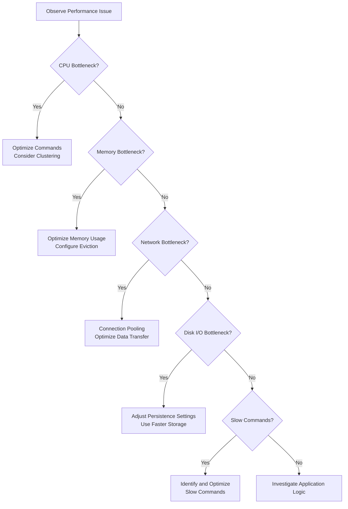

# Redis Bottleneck Analysis

## Introduction

Redis is renowned for its blazing-fast performance, often processing tens of thousands of operations per second. However, as your application scales, you might encounter performance bottlenecks that prevent Redis from delivering its full potential. This guide will help you identify, analyze, and resolve common Redis bottlenecks, ensuring your applications maintain peak performance.

Redis bottlenecks can occur at various levels—from the Redis server itself to network infrastructure, client configurations, or even data structure choices. By understanding how to properly diagnose these issues, you'll be equipped to optimize Redis for your specific use cases.

## Understanding Redis Performance Basics

Before diving into bottleneck analysis, let's understand what makes Redis fast and what factors can affect its performance:

### Redis Performance Fundamentals

- **In-memory operations**: Redis keeps all data in RAM, making operations extremely fast
- **Single-threaded core**: Redis processes commands one at a time on the main thread
- **Efficient data structures**: Specialized implementations optimized for speed
- **Minimal copying**: Zero-copy optimizations for network and memory operations
- **Event-driven architecture**: Non-blocking I/O for handling multiple clients

## Common Redis Bottlenecks

Let's explore the most frequent bottlenecks you might encounter:

### 1. CPU Saturation

Redis is primarily single-threaded for data operations, which means it can fully utilize only one CPU core for command processing. When this CPU core reaches 100% utilization, Redis can't process commands any faster.

#### How to identify CPU bottlenecks:

```bash
# Check Redis CPU usage
$ redis-cli INFO | grep used_cpu

# System-wide CPU monitoring
$ top -p $(pgrep -d ',' redis-server)
```

You might see output like:

```
used_cpu_sys:13892.22
used_cpu_user:7792.04
used_cpu_sys_children:10.83
used_cpu_user_children:1.42
```

High and rapidly increasing values indicate potential CPU bottlenecks.

#### Solution approaches:

- Scale horizontally by adding more Redis instances (Redis Cluster)
- Optimize expensive commands (avoid O(N) operations on large datasets)
- Consider using Redis modules that support multithreading for specific operations
- Implement client-side caching to reduce requests

### 2. Memory Constraints

Since Redis stores all data in memory, running out of available RAM is a common bottleneck.

#### How to identify memory bottlenecks:

```bash
# Check memory usage
$ redis-cli INFO memory
```

Look for metrics like:

```
used_memory:1073741824
used_memory_human:1.00G
used_memory_rss:1132462080
used_memory_rss_human:1.05G
mem_fragmentation_ratio:1.05
```

When `used_memory` approaches your system's available RAM or Redis `maxmemory` setting, you'll face performance degradation.

#### Solution approaches:

- Increase server RAM
- Configure appropriate maxmemory settings and eviction policies
- Optimize key storage (shorter key names, compressed values)
- Use Redis data types more efficiently
- Implement key expiration strategies

### 3. Network Bandwidth and Latency

Redis can be bottlenecked by network conditions, especially in distributed systems or cloud environments.

#### How to identify network bottlenecks:

```bash
# Monitor Redis network stats
$ redis-cli INFO stats | grep net_

# Check current connections
$ redis-cli CLIENT LIST | wc -l
```

High network traffic or numerous connections can indicate network bottlenecks:

```
total_net_input_bytes:1274042
total_net_output_bytes:2850009
instantaneous_input_kbps:51.94
instantaneous_output_kbps:103.22
```

#### Solution approaches:

- Place Redis closer to your application servers
- Use connection pooling
- Optimize batch operations (pipelining, transactions)
- Implement proper connection handling (don't create new connections for each operation)
- Consider using Redis cluster with proper sharding

### 4. Disk I/O (for persistence)

While Redis operates in-memory, persistence features like RDB snapshots and AOF logs require disk I/O, which can cause bottlenecks.

#### How to identify disk I/O bottlenecks:

```bash
# Check latest persistence status
$ redis-cli INFO persistence
```

Look for metrics indicating slow saves or high latency during persistence operations:

```
rdb_last_bgsave_time_sec:10
rdb_current_bgsave_time_sec:-1
aof_current_rewrite_time_sec:-1
aof_last_rewrite_time_sec:11
```

Large positive values or frequent saves may indicate disk I/O bottlenecks.

#### Solution approaches:

- Use faster storage (SSDs over HDDs)
- Adjust persistence settings (less frequent RDB saves, AOF fsync policies)
- Separate Redis instances for read-heavy vs. write-heavy workloads
- Consider disabling persistence for caching-only use cases

### 5. Slow Commands

Certain Redis commands that operate on large data structures can block the Redis server temporarily.

#### How to identify slow commands:

```bash
# Enable slow log with threshold of 10 milliseconds
$ redis-cli CONFIG SET slowlog-log-slower-than 10000

# Get the most recent slow commands
$ redis-cli SLOWLOG GET 10
```

Example output:

```
1) 1) (integer) 14
   2) (integer) 1678622593
   3) (integer) 15023
   4) 1) "KEYS"
      2) "*pattern*"
   5) "127.0.0.1:58372"
   6) ""
```

This shows a `KEYS` command that took 15ms to execute, which is relatively slow for Redis.

#### Solution approaches:

- Avoid O(N) commands on large datasets (`KEYS`, `SMEMBERS`, `HGETALL`)
- Use alternatives like `SCAN`, `SSCAN`, `HSCAN`
- Break large operations into smaller chunks
- Schedule expensive operations during low-traffic periods

## Practical Bottleneck Analysis Flow

Let's walk through a methodical approach to identifying and resolving Redis bottlenecks:



## Real-world Example: E-commerce Product Catalog

Let's analyze and optimize a Redis implementation for an e-commerce product catalog:

### Initial Setup

```javascript
// Initial implementation with potential bottlenecks
async function getProductDetails(productId) {
  // Get basic product info
  const productInfo = await redis.hgetall(`product:${productId}`);
  
  // Get all product categories (potentially many)
  const categories = await redis.smembers(`product:${productId}:categories`);
  
  // Get all product reviews (could be hundreds)
  const reviewIds = await redis.smembers(`product:${productId}:reviews`);
  
  // Fetch each review individually (N+1 query problem)
  const reviews = [];
  for (const reviewId of reviewIds) {
    const review = await redis.hgetall(`review:${reviewId}`);
    reviews.push(review);
  }
  
  return { ...productInfo, categories, reviews };
}
```

### Bottleneck Identification

1. **Multiple network round-trips**: Each Redis command requires a separate network round-trip
2. **O(N) commands on potentially large sets**: `SMEMBERS` loads all members in memory
3. **N+1 query pattern**: Fetching each review individually is inefficient

### Optimized Implementation

```javascript
async function getProductDetailsOptimized(productId) {
  // Use pipelining to reduce network round-trips
  const pipeline = redis.pipeline();
  
  // Get basic product info
  pipeline.hgetall(`product:${productId}`);
  
  // Use SSCAN instead of SMEMBERS for large sets (iterator pattern)
  // For simplicity, we're getting first batch only
  pipeline.sscan(`product:${productId}:categories`, 0, 'COUNT', 50);
  
  // Get review IDs (limited to recent 20)
  pipeline.zrevrange(`product:${productId}:reviews_by_date`, 0, 19);
  
  // Execute all commands in one round-trip
  const [productInfo, [_, categories], reviewIds] = await pipeline.exec();
  
  // Fetch reviews in a single operation using Lua script
  const reviewsScript = `
    local reviews = {}
    for i, reviewId in ipairs(ARGV) do
      reviews[i] = redis.call('HGETALL', 'review:'..reviewId)
    end
    return reviews
  `;
  
  const reviews = await redis.eval(
    reviewsScript, 
    0,  // No keys used
    ...reviewIds  // Pass review IDs as arguments
  );
  
  return { ...productInfo, categories, reviews };
}
```

### Performance Improvements

- **Reduced network round-trips**: From N+3 to just 2 (pipeline + Lua script)
- **Better handling of large data sets**: Using `SSCAN` and `ZREVRANGE` with limits
- **Elimination of N+1 query pattern**: Using Lua script to fetch all reviews at once
- **Better memory usage**: Only fetching necessary data

## Monitoring Redis Performance

To proactively identify bottlenecks, set up comprehensive monitoring:

### Key Metrics to Monitor

- **CPU usage**: Both Redis process and system-wide
- **Memory usage**: Both used memory and RSS
- **Command statistics**: Commands/second, command latency
- **Network metrics**: Bandwidth, connections
- **Keyspace metrics**: Total keys, evictions, expirations
- **Client connections**: Number of connected clients

### Monitoring Tools

1. **Redis CLI**: Basic real-time monitoring
   ```bash
   $ redis-cli --stat
   $ redis-cli monitor
   ```

2. **Redis Exporter with Prometheus and Grafana**: For comprehensive dashboards

3. **Redis Enterprise or Redis Cloud**: Built-in monitoring solutions

4. **Application Performance Monitoring (APM) tools**: New Relic, Datadog, etc.

## Summary

Redis bottleneck analysis is a critical skill for maintaining high-performance Redis deployments. By understanding the common bottlenecks—CPU, memory, network, disk I/O, and slow commands—you can systematically identify and resolve performance issues.

Remember these key principles:
- Monitor Redis metrics proactively
- Use the right data structures and commands for your use case
- Optimize for fewer network round-trips using pipelining and Lua scripts
- Scale horizontally when vertical scaling reaches its limits
- Consider Redis Enterprise features for mission-critical deployments

## Further Learning

To deepen your understanding of Redis performance, consider exploring:
- Redis pipelining and transactions
- Lua scripting for Redis
- Redis Cluster architecture
- Memory optimization techniques
- Redis modules for specialized workloads

## Practice Exercises

1. Set up a Redis instance and use `redis-benchmark` to test performance under different workloads
2. Implement a connection pooling solution for your Redis client
3. Identify and optimize slow commands in an existing Redis implementation
4. Create a monitoring dashboard for your Redis instances
5. Experiment with different persistence configurations and measure their impact on performance