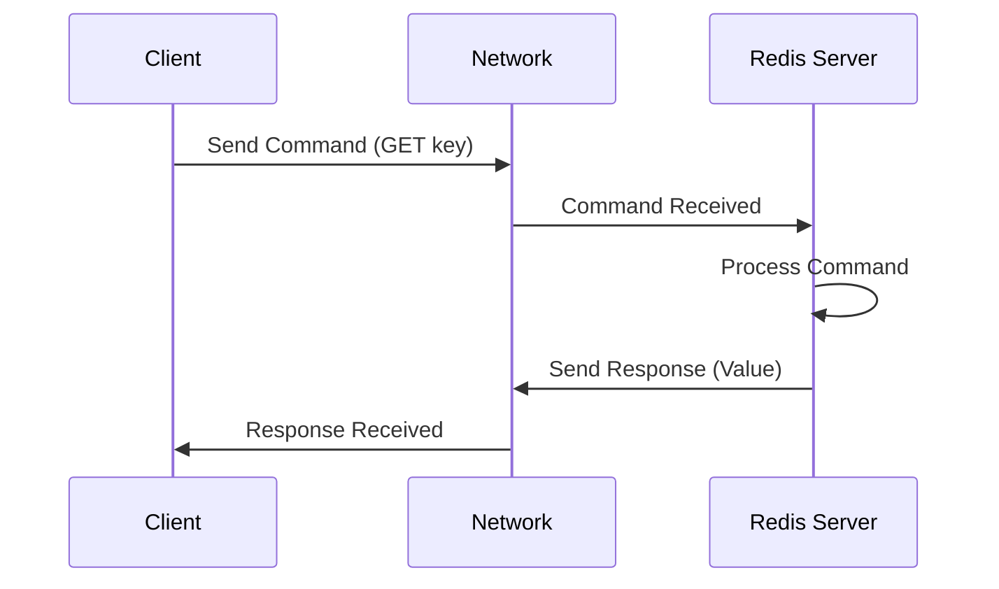

# Redis Network Optimization

## Introduction

Redis is known for its exceptional speed, but network-related bottlenecks can significantly impact its performance. When deploying Redis in production environments, network optimization becomes crucial to maintain high throughput and low latency. This guide explores various techniques and best practices for optimizing Redis network performance, helping you get the most out of your Redis deployments.

## Understanding Redis Network Communication

Before diving into optimization techniques, it's important to understand how Redis communicates over the network:

1. **Client-Server Model**: Redis follows a client-server architecture where clients send commands to the Redis server and receive responses.
2. **TCP Protocol**: Redis primarily uses TCP for network communication, which ensures reliable data delivery.
3. **Request-Response Cycle**: Each Redis command typically involves a complete request-response cycle over the network.
4. **Protocol Overhead**: Redis uses its own RESP (REdis Serialization Protocol) for encoding commands and responses.

The following diagram illustrates the basic flow of Redis network communication:



## Key Network Optimization Techniques

### 1. Connection Pooling

Establishing TCP connections is expensive. Connection pooling reuses existing connections to reduce overhead.

```javascript
// Example using Node.js redis client with connection pooling
const Redis = require('ioredis');

// Create a connection pool
const redisPool = new Redis.Cluster([
  {
    port: 6379,
    host: '127.0.0.1'
  }
], {
  // Configure pool options
  maxConnections: 100,
  enableReadyCheck: true,
  enableOfflineQueue: true
});

// Use the pool for operations
async function getValue(key) {
  return await redisPool.get(key);
}
```

**Benefits of Connection Pooling:**
- Reduces connection establishment overhead
- Minimizes the number of TCP connections
- Improves response times for high-concurrency applications

### 2. Pipelining

Pipelining allows sending multiple commands without waiting for responses, reducing network round trips.

```javascript
// Redis pipelining example using Node.js
const Redis = require('ioredis');
const redis = new Redis();

// Without pipelining (3 round trips)
async function withoutPipelining() {
  console.time('without-pipeline');
  await redis.set('key1', 'value1');
  await redis.set('key2', 'value2');
  await redis.set('key3', 'value3');
  console.timeEnd('without-pipeline');
}

// With pipelining (1 round trip)
async function withPipelining() {
  console.time('with-pipeline');
  const pipeline = redis.pipeline();
  pipeline.set('key1', 'value1');
  pipeline.set('key2', 'value2');
  pipeline.set('key3', 'value3');
  await pipeline.exec();
  console.timeEnd('with-pipeline');
}

// Example output:
// without-pipeline: 45ms
// with-pipeline: 15ms
```

**When to use pipelining:**
- For batching related operations
- When sending multiple commands to Redis in sequence
- In high-latency network environments

### 3. Redis Protocol Compression

For high-volume data transfer, you can enable protocol compression between Redis clients and servers.

```bash
# Configure Redis server to use compression
redis-server --enable-compression yes

# Or in redis.conf
enable-compression yes

# Set compression threshold (in bytes)
compression-threshold 5000
```

Redis supports different compression algorithms. Here's how to specify the preferred algorithm:

```bash
# In redis.conf
compression-algorithm [lzf|lz4|gzip]
```

### 4. Network Bandwidth and Latency Management

#### Minimize Data Transfer

```javascript
// Poor practice - transferring large datasets
const allUsers = await redis.get('all:users'); // Might be several MB

// Better practice - use filtering at the Redis level
// With Redis JSON module
const activeUsers = await redis.call(
  'JSON.GET', 
  'users', 
  '$.users[?(@.status=="active")]'
);

// Or using Hash structures for selective retrieval
const userEmail = await redis.hget('user:1000', 'email');
```

#### Use Appropriate Data Structures

Choose Redis data structures that minimize network overhead for your specific use case:

```javascript
// Using sorted sets for efficient range operations
// Set up leaderboard
await redis.zadd('leaderboard', 100, 'player1', 85, 'player2', 95, 'player3');

// Get top 3 players (single network request)
const topPlayers = await redis.zrevrange('leaderboard', 0, 2, 'WITHSCORES');
console.log(topPlayers);
// Output: ['player1', '100', 'player3', '95', 'player2', '85']
```

### 5. Client-side Optimizations

#### Client Timeouts and Retry Policies

```javascript
const Redis = require('ioredis');

const redis = new Redis({
  host: 'redis-server',
  port: 6379,
  connectTimeout: 10000,         // Connection timeout in ms
  maxRetriesPerRequest: 3,       // Max retries per command
  retryStrategy: function(times) {
    const delay = Math.min(times * 50, 2000);
    return delay;
  }
});

// Error handling
redis.on('error', function(error) {
  console.error('Redis connection error:', error);
});
```

#### Client-side Caching

Redis 6.0+ supports client-side caching to reduce network traffic:

```javascript
// Enable tracking (client-side caching)
await redis.clientTracking('ON', 'REDIRECT', clientId);

// Define a local cache
const localCache = new Map();

// Get value with local cache check
async function getCachedValue(key) {
  // Check local cache first
  if (localCache.has(key)) {
    return localCache.get(key);
  }
  
  // If not in cache, get from Redis
  const value = await redis.get(key);
  
  // Store in local cache
  localCache.set(key, value);
  
  return value;
}

// When invalidation message is received
redis.on('invalidate', function(keys) {
  keys.forEach(key => localCache.delete(key));
});
```

### 6. Network Configuration

#### TCP Keepalive

```bash
# In redis.conf
tcp-keepalive 300  # 300 seconds

# On Linux system level
sudo sysctl -w net.ipv4.tcp_keepalive_time=60
sudo sysctl -w net.ipv4.tcp_keepalive_intvl=10
sudo sysctl -w net.ipv4.tcp_keepalive_probes=9
```

#### Optimizing TCP Buffer Sizes

```bash
# Linux system configuration for TCP buffers
sudo sysctl -w net.core.rmem_max=16777216
sudo sysctl -w net.core.wmem_max=16777216
sudo sysctl -w net.ipv4.tcp_rmem="4096 87380 16777216"
sudo sysctl -w net.ipv4.tcp_wmem="4096 65536 16777216"
```

## Real-world Optimization Scenario

Let's walk through a complete real-world scenario of optimizing a Redis deployment for an e-commerce product catalog:

### Initial Setup (Before Optimization)

```javascript
// Simple Redis client setup
const redis = new Redis();

// Product lookup function
async function getProductDetails(productId) {
  const product = await redis.get(`product:${productId}`);
  return JSON.parse(product);
}

// Category listing function
async function getProductsByCategory(categoryId) {
  // Get all product IDs in this category
  const productIds = await redis.smembers(`category:${categoryId}:products`);
  
  // For each product ID, fetch the full product
  const products = [];
  for (const id of productIds) {
    const product = await redis.get(`product:${id}`);
    products.push(JSON.parse(product));
  }
  
  return products;
}
```

**Performance issues:**
- Multiple sequential network calls for category listings
- Full product objects transferred when not needed
- No connection management
- No error handling or timeout policies

### Optimized Solution

```javascript
// Optimized Redis client setup
const Redis = require('ioredis');

// Create connection pool
const redisPool = new Redis.Cluster([
  { port: 6379, host: 'redis-primary.example.com' },
  { port: 6379, host: 'redis-replica-1.example.com' },
  { port: 6379, host: 'redis-replica-2.example.com' }
], {
  maxConnections: 100,
  enableReadyCheck: true,
  scaleReads: 'slave',  // Read from replicas
  retryStrategy: function(times) {
    const delay = Math.min(times * 100, 2000);
    return delay;
  }
});

// Optimized product lookup with field filtering
async function getProductDetails(productId, fields = null) {
  if (fields) {
    // Only get specific fields from hash
    return await redisPool.hgetall(`product:${productId}`);
  } else {
    // Get all fields
    const productData = await redisPool.hgetall(`product:${productId}`);
    
    // Deserialize nested objects if needed
    if (productData.attributes) {
      productData.attributes = JSON.parse(productData.attributes);
    }
    
    return productData;
  }
}

// Optimized category listing with pipelining
async function getProductsByCategory(categoryId, page = 1, limit = 20) {
  const start = (page - 1) * limit;
  const end = start + limit - 1;
  
  // Get paginated product IDs
  const productIds = await redisPool.zrange(
    `category:${categoryId}:products:sorted`, 
    start, 
    end
  );
  
  if (productIds.length === 0) {
    return [];
  }
  
  // Use pipelining to fetch multiple products in one round trip
  const pipeline = redisPool.pipeline();
  
  // Request only needed fields for listing
  productIds.forEach(id => {
    pipeline.hmget(`product:${id}`, 'name', 'price', 'thumbnail');
  });
  
  // Execute pipeline
  const results = await pipeline.exec();
  
  // Process results
  return results.map((result, index) => {
    const [err, data] = result;
    if (err) {
      console.error(`Error fetching product ${productIds[index]}:`, err);
      return null;
    }
    
    const [name, price, thumbnail] = data;
    return {
      id: productIds[index],
      name,
      price: parseFloat(price),
      thumbnail
    };
  }).filter(Boolean); // Remove nulls from errors
}

// Cache product search results
const searchCache = new Map();
const CACHE_TTL = 60000; // 1 minute

async function searchProducts(query, options = {}) {
  const cacheKey = `${query}:${JSON.stringify(options)}`;
  
  // Check local cache
  const cached = searchCache.get(cacheKey);
  if (cached && cached.timestamp > Date.now() - CACHE_TTL) {
    return cached.results;
  }
  
  // Perform search using Redis
  // (Using Redis Search module in this example)
  const results = await redisPool.call(
    'FT.SEARCH',
    'products-idx',
    query,
    'LIMIT',
    options.offset || 0,
    options.limit || 20
  );
  
  // Process search results...
  const processedResults = processSearchResults(results);
  
  // Update cache
  searchCache.set(cacheKey, {
    timestamp: Date.now(),
    results: processedResults
  });
  
  return processedResults;
}
```

**Key improvements:**
- Connection pooling with read/write splitting
- Data structure optimizations (hashes instead of JSON strings)
- Pipelining for batch operations
- Client-side caching for repetitive queries
- Field filtering to reduce data transfer
- Error handling and retry logic

## Monitoring Network Performance

### Using Redis SLOWLOG

```bash
# Set slowlog configuration in redis.conf
slowlog-log-slower-than 10000  # Log commands that take longer than 10,000 microseconds
slowlog-max-len 128            # Keep track of last 128 slow commands

# Query slow logs
SLOWLOG GET 10  # Get last 10 slow command entries
```

### Using Redis INFO Command

```bash
# Get network-related stats
redis-cli INFO stats | grep -E 'total_connections|total_commands|connected_clients'

# Sample output:
# total_connections_received:1001
# total_commands_processed:100000
# connected_clients:56
```

### Monitoring Network Latency

```bash
# Redis CLI latency monitoring
redis-cli --latency

# Redis CLI latency histogram
redis-cli --latency-history

# Redis built-in latency monitor
redis-cli > LATENCY DOCTOR
```

## Summary

Optimizing Redis network performance requires a multi-faceted approach:

1. **Connection Management**: Use connection pooling to minimize connection overhead
2. **Command Optimization**: Utilize pipelining and batching to reduce round trips
3. **Data Optimization**: Choose appropriate data structures and minimize payload sizes
4. **Client Configuration**: Implement proper timeout and retry strategies
5. **Network Setup**: Configure TCP parameters appropriately for Redis workloads
6. **Monitoring**: Continuously monitor latency and throughput to identify bottlenecks

By applying these techniques, you can significantly improve the network performance of your Redis deployments, resulting in lower latencies and higher throughput for your applications.

## Further Resources

- [Redis Official Documentation on Pipelining](https://redis.io/topics/pipelining)
- [Redis Clients Documentation](https://redis.io/clients)
- [Redis Administration Guide](https://redis.io/topics/admin)
- [Redis Latency Monitoring Framework](https://redis.io/topics/latency-monitor)

## Exercises

1. **Exercise 1**: Set up a Redis instance and measure the performance difference between individual commands and pipelined commands.
2. **Exercise 2**: Implement a connection pool in your preferred programming language and benchmark its performance against a single connection.
3. **Exercise 3**: Use the Redis `MONITOR` command to observe network traffic and identify optimization opportunities in your application.
4. **Exercise 4**: Implement client-side caching with invalidation for a simple web application.
5. **Exercise 5**: Compare the network performance of different Redis data structures (hashes vs. strings) for storing complex objects.