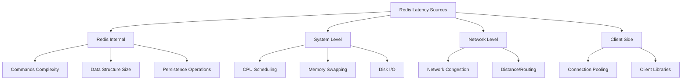

# Redis Latency Monitoring

## Introduction

Latency is the time it takes for Redis to respond to a command. Low latency is one of Redis's most celebrated features, typically delivering sub-millisecond response times in optimal conditions. However, various factors can introduce unexpected delays, which can significantly impact your application's performance.

In this guide, we'll explore how to monitor, diagnose, and resolve latency issues in Redis. Understanding these concepts is crucial for maintaining high-performance Redis deployments, whether you're running a small project or a large-scale production environment.

## Why Monitor Redis Latency?

Before diving into monitoring techniques, let's understand why latency matters:

- **User Experience**: High latency directly affects application responsiveness
- **System Performance**: Latency spikes can cascade, causing system-wide slowdowns
- **Resource Utilization**: Latency issues often indicate inefficient resource usage
- **Early Warning**: Monitoring latency helps detect potential problems before they become critical

## Understanding Redis Latency Sources

Redis latency can come from multiple sources:



## Basic Latency Monitoring Tools

### 1. The PING Command

The simplest way to check Redis latency is using the `PING` command:

```bash
redis-cli -h redis-server -p 6379 ping
```

Output:
```
PONG
```

To measure response time:

```bash
time redis-cli -h redis-server -p 6379 ping
```

Output:
```
PONG

real    0m0.007s
user    0m0.001s
sys     0m0.002s
```

### 2. Redis CLI `--latency` Mode

Redis CLI provides a dedicated mode for monitoring latency:

```bash
redis-cli -h redis-server -p 6379 --latency
```

Output:
```
min: 0, max: 1, avg: 0.19 (427 samples)
```

For a more visual representation:

```bash
redis-cli -h redis-server -p 6379 --latency-histogram
```

Output:
```
redis-cli --latency-histogram
--------------------------------------------
 0.064 ms - 1.639 ms    | 99.09% (49547)
 1.640 ms - 3.215 ms    |  0.91% (454)
 3.216 ms - 4.791 ms    |  0.00% (0)
 4.792 ms - 6.367 ms    |  0.00% (0)
```

### 3. Using INFO Command

The `INFO` command provides useful statistics:

```bash
redis-cli -h redis-server -p 6379 INFO stats | grep latency
```

Output:
```
latency_percentiles_usec_values:10,50,90,95,99,100
latency_percentiles_usec_counters:10,50,90,95,99,100
```

## Advanced Latency Monitoring

### 1. Redis Latency Monitor

Redis includes a built-in latency monitoring system that can be enabled with:

```bash
redis-cli -h redis-server -p 6379 CONFIG SET latency-monitor-threshold 100
```

This configures Redis to log events causing latency spikes above 100 milliseconds. To view these events:

```bash
redis-cli -h redis-server -p 6379 LATENCY LATEST
```

Output (when latency events are detected):
```
1) 1) "command"
   2) (integer) 1635200000
   3) (integer) 120
   4) (integer) 130
```

Each entry shows:
1. Event type
2. Timestamp of the latest event
3. Latest latency value in milliseconds
4. Maximum latency observed

### 2. Latency Time Series

Redis can track latency events over time:

```bash
redis-cli -h redis-server -p 6379 LATENCY HISTORY command
```

Output:
```
1) 1) (integer) 1635200000
   2) (integer) 120
2) 1) (integer) 1635200010
   2) (integer) 115
```

### 3. Latency Doctor

Redis provides an automated analysis tool:

```bash
redis-cli -h redis-server -p 6379 LATENCY DOCTOR
```

Output:
```
Dave, I'm not feeling too well...

I detected a few latency issues in this Redis instance:

1. High latency for 'command' command: 120 milliseconds.
   This is usually due to slow commands execution or CPU contention.

I suggest the following steps to improve the situation:
- Check for slow commands using SLOWLOG GET 10
- Avoid using O(N) commands on large data sets
- If persistence is enabled, check the disk isn't saturated
```

## Identifying Specific Latency Issues

### 1. Slow Log

Redis logs slow commands exceeding a configurable threshold:

```bash
# Set slowlog threshold to 10 microseconds (very low for demonstration)
redis-cli -h redis-server -p 6379 CONFIG SET slowlog-log-slower-than 10

# Execute some commands...

# Retrieve slow commands
redis-cli -h redis-server -p 6379 SLOWLOG GET 5
```

Output:
```
1) 1) (integer) 1
   2) (integer) 1635200100
   3) (integer) 15000
   4) 1) "KEYS"
      2) "*"
   5) "127.0.0.1:52431"
   6) ""
```

Each entry contains:
1. Unique ID
2. Timestamp
3. Execution time (microseconds)
4. Command and arguments
5. Client information

### 2. Memory-Related Latency

Monitor memory usage to avoid swapping:

```bash
redis-cli -h redis-server -p 6379 INFO memory | grep used_memory
```

Output:
```
used_memory:1032304
used_memory_human:1008.11K
used_memory_rss:8990720
used_memory_rss_human:8.57M
```

### 3. Persistence-Related Latency

If using RDB or AOF persistence, check statistics:

```bash
redis-cli -h redis-server -p 6379 INFO persistence
```

Output:
```
# Persistence
loading:0
rdb_changes_since_last_save:0
rdb_bgsave_in_progress:0
rdb_last_save_time:1635200000
rdb_last_bgsave_status:ok
rdb_last_bgsave_time_sec:0
rdb_current_bgsave_time_sec:-1
aof_enabled:0
...
```

## Real-World Latency Troubleshooting Scenarios

### Scenario 1: Slow Commands on Large Data Sets

Problem: Running `KEYS *` on a production database.

Diagnosis:
```bash
redis-cli -h redis-server -p 6379 SLOWLOG GET 10
```

Reveals `KEYS *` taking several seconds to execute.

Solution:
```bash
# Instead of KEYS *, use SCAN which is non-blocking
redis-cli -h redis-server -p 6379 SCAN 0 MATCH user:* COUNT 10
```

Output:
```
1) "192"
2) 1) "user:1001"
   2) "user:1002"
   3) "user:1003"
```

### Scenario 2: AOF Rewrite Causing Latency Spikes

Problem: Regular latency spikes occurring at predictable intervals.

Diagnosis:
```bash
redis-cli -h redis-server -p 6379 INFO persistence
```

Shows AOF rewrite in progress during spikes.

Solution: Adjust AOF rewrite parameters:

```bash
redis-cli -h redis-server -p 6379 CONFIG SET auto-aof-rewrite-min-size "1gb"
```

### Scenario 3: Network-Related Latency

Problem: Inconsistent latency observed from different clients.

Diagnosis:
```bash
# Run latency test directly on Redis server
redis-cli -h localhost --latency

# Then from remote client
redis-cli -h redis-server --latency
```

Compare results to identify network issues.

Solution: Consider Redis replication or moving clients closer to Redis server.

## Best Practices for Reducing Redis Latency

1. **Avoid Expensive Commands**
   - Minimize use of `KEYS`, `SMEMBERS` on large sets, `SORT` without `LIMIT`
   - Use `SCAN`, `SSCAN`, `HSCAN`, etc. for iterating large collections

2. **Optimize Client Connections**
   ```js
   // Bad practice: Creating new connection for each operation
   function getData(key) {
     const client = redis.createClient();
     return client.get(key).finally(() => client.quit());
   }

   // Good practice: Connection pooling
   const redisPool = redis.createPool({ max: 10 });
   function getData(key) {
     return redisPool.use(client => client.get(key));
   }
   ```

3. **Pipeline Commands When Possible**
   ```js
   // Without pipelining (multiple round-trips)
   const val1 = await client.get('key1');
   const val2 = await client.get('key2');
   const val3 = await client.get('key3');

   // With pipelining (single round-trip)
   const [val1, val2, val3] = await client
     .pipeline()
     .get('key1')
     .get('key2')
     .get('key3')
     .exec();
   ```

4. **Configure Appropriate Persistence Settings**
   - Use RDB snapshots for point-in-time recovery
   - If using AOF, consider `everysec` sync policy for balance

5. **Monitor and Tune System Resources**
   - Ensure sufficient memory to avoid swapping
   - Configure appropriate `maxmemory` and eviction policies
   - Use dedicated instance for Redis (avoid CPU contention)

## Setting Up Comprehensive Latency Monitoring

For production environments, set up a complete monitoring solution:

1. **Configure Redis Latency Monitoring**
   ```bash
   redis-cli CONFIG SET latency-monitor-threshold 100
   ```

2. **Set Up Regular Collection of Metrics**
   ```bash
   # Create a cron job or scheduled task
   */5 * * * * redis-cli -h redis-server LATENCY LATEST >> /var/log/redis/latency.log
   ```

3. **Integrate with Monitoring Tools**
   
   Example using Node.js with Prometheus:
   ```js
   const client = redis.createClient();
   const promClient = require('prom-client');
   
   // Create a Gauge for Redis latency
   const redisLatencyGauge = new promClient.Gauge({
     name: 'redis_command_latency_milliseconds',
     help: 'Redis command latency in milliseconds'
   });
   
   // Sample latency every 10 seconds
   setInterval(async () => {
     const startTime = process.hrtime();
     await client.ping();
     const [seconds, nanoseconds] = process.hrtime(startTime);
     const milliseconds = seconds * 1000 + nanoseconds / 1000000;
     
     redisLatencyGauge.set(milliseconds);
   }, 10000);
   ```

## Summary

Redis latency monitoring is crucial for maintaining high-performance applications. We've covered:

- Understanding the various sources of Redis latency
- Basic and advanced latency monitoring tools
- Identifying specific latency issues using Redis utilities
- Real-world scenarios and their solutions
- Best practices for reducing Redis latency
- Setting up comprehensive latency monitoring

By implementing these monitoring practices and following the recommended optimizations, you can ensure your Redis deployment maintains its reputation for lightning-fast performance.

## Additional Resources

- [Redis Official Documentation on Latency](https://redis.io/topics/latency)
- [Redis Slow Log Documentation](https://redis.io/commands/slowlog)
- [Redis Persistence Documentation](https://redis.io/topics/persistence)

## Practice Exercises

1. Set up Redis locally and experiment with different `latency-monitor-threshold` values.
2. Create a script that periodically samples Redis latency and generates alerts when thresholds are exceeded.
3. Simulate a high-latency scenario by running expensive commands, then use the tools described in this guide to diagnose the issue.
4. Compare latency between different Redis data structures (strings, hashes, sorted sets) on large datasets.
5. Implement a basic latency dashboard using Grafana or a similar tool to visualize Redis performance over time.