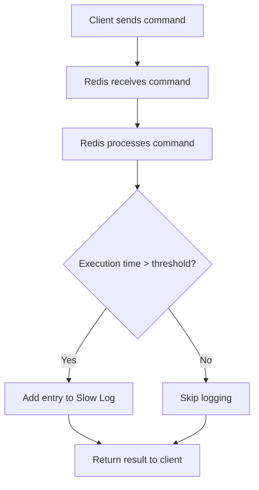

# Redis Slow Log

## Introduction

When optimizing a Redis database, one of the most important steps is identifying which commands are taking too long to execute. Redis provides a built-in feature called the **Slow Log** that helps track and analyze slow commands. This feature logs commands that exceed a configurable execution time threshold, enabling developers to identify performance bottlenecks and optimize their applications.

In this guide, we'll explore how the Redis Slow Log works, how to configure it, and how to use it effectively to improve your Redis application's performance.

## What is Redis Slow Log?

The Redis Slow Log is an internal logging mechanism that captures information about commands that take longer than a specified threshold to execute. When a command's execution time exceeds this threshold, Redis adds an entry to the Slow Log containing:

- A unique ID for the log entry
- The timestamp when the command was processed
- The execution time of the command
- The command itself, with its arguments
- The client information (optional, depending on Redis version)

This logging mechanism is lightweight and has minimal impact on Redis performance, making it safe to use in production environments.

## How to Configure the Slow Log

Redis provides two configuration parameters for the Slow Log:

### 1. `slowlog-log-slower-than`

This parameter defines the execution time threshold in microseconds. Commands that take longer than this threshold will be logged. The default value is 10,000 microseconds (10 milliseconds).

```bash
# Set the threshold to 5 milliseconds (5000 microseconds)
CONFIG SET slowlog-log-slower-than 5000
```

Setting this parameter to 0 will log every command, while setting it to a negative value will disable the Slow Log completely.

### 2. `slowlog-max-len`

This parameter defines the maximum number of entries to keep in the Slow Log. When the log reaches this limit, older entries are removed as new ones are added. The default value is 128 entries.

```bash
# Set the maximum length to 500 entries
CONFIG SET slowlog-max-len 500
```

You can make these configuration changes permanent by adding them to your `redis.conf` file:

```
slowlog-log-slower-than 5000
slowlog-max-len 500
```

## Working with the Slow Log

Redis provides several commands to interact with the Slow Log:

### Retrieving Slow Log Entries

To get the entire Slow Log:

```bash
SLOWLOG GET
```

To get a specific number of the most recent entries:

```bash
SLOWLOG GET 10
```

Example output:

```
1) 1) (integer) 14  # Unique ID
   2) (integer) 1600789258  # Timestamp (Unix time)
   3) (integer) 15123  # Execution time (microseconds)
   4) 1) "KEYS"  # Command and arguments
      2) "*"
   5) "127.0.0.1:52341"  # Client information (address:port)
   6) "username"  # Client name (if set)
```

### Getting the Length of the Slow Log

To check how many entries are currently in the Slow Log:

```bash
SLOWLOG LEN
```

Example output:

```
(integer) 14
```

### Resetting the Slow Log

To clear all entries from the Slow Log:

```bash
SLOWLOG RESET
```

This command is useful after you've analyzed the current entries and want to start fresh.

## Practical Examples

Let's look at some real-world scenarios where the Redis Slow Log can be helpful.

### Example 1: Identifying Expensive KEYS Commands

The `KEYS` command can be particularly expensive in production environments with large datasets. Let's set up the Slow Log to monitor for such commands:

```bash
# Set a lower threshold to catch more commands
CONFIG SET slowlog-log-slower-than 1000
```

After running your application for a while, check the Slow Log:

```bash
SLOWLOG GET
```

If you see entries with the `KEYS` command, you might consider replacing it with more efficient alternatives like `SCAN`:

```bash
# Before: Potentially slow operation
KEYS "user:*"

# After: More efficient scanning
SCAN 0 MATCH "user:*" COUNT 100
```

### Example 2: Monitoring Complex Operations

For applications using Redis for complex operations like sorted sets or geo-spatial commands, monitoring execution times can help optimize these operations:

```javascript
// Run a complex ZRANGE operation
const Redis = require('redis');
const client = Redis.createClient();

// Example of a potentially slow sorted set operation
client.zrange('large_leaderboard', 0, -1, 'WITHSCORES', (err, result) => {
  if (err) console.error(err);
  console.log(`Retrieved ${result.length / 2} leaderboard entries`);
});
```

After running operations like this, check the Slow Log:

```bash
SLOWLOG GET 5
```

If you find that certain operations consistently appear in the Slow Log, consider:
- Breaking down large operations into smaller ones
- Using pagination with LIMIT clauses
- Redesigning your data model for better performance

### Example 3: Setting Up Slow Log Monitoring in Production

For production environments, it's a good practice to regularly check and analyze the Slow Log. Here's a simple Node.js script to periodically check and report slow commands:

```javascript
const Redis = require('redis');
const client = Redis.createClient();

// Function to check slow log and report entries
function checkSlowLog() {
  client.slowlog('GET', 10, (err, logs) => {
    if (err) {
      console.error('Error getting slow log:', err);
      return;
    }
    
    if (logs.length > 0) {
      console.log('Recent slow commands:');
      logs.forEach(log => {
        const [id, timestamp, executionTime, command] = log;
        console.log(`ID: ${id} | Time: ${new Date(timestamp * 1000).toISOString()} | Duration: ${executionTime}μs | Command: ${command.join(' ')}`);
      });
    } else {
      console.log('No slow commands detected.');
    }
  });
}

// Check slow log every 15 minutes
setInterval(checkSlowLog, 15 * 60 * 1000);
```

## Visualization with Mermaid

Here's a diagram showing how the Redis Slow Log fits into the command execution flow:



## Best Practices

1. **Set appropriate thresholds**: Start with a lower threshold (1-5ms) in development and adjust for production based on your performance requirements.

2. **Regularly check the Slow Log**: Make it part of your monitoring routine to identify potential issues before they impact users.

3. **Adjust the log size**: For busy production servers, increase `slowlog-max-len` to capture more historical data (500-1000 entries).

4. **Reset after analysis**: Use `SLOWLOG RESET` after addressing identified issues to maintain a clean log for future monitoring.

5. **Combine with other tools**: Use the Slow Log alongside tools like Redis INFO statistics and monitoring platforms for comprehensive performance analysis.

6. **Review after deployments**: Always check the Slow Log after deploying new features or changes to catch any regression in performance.

## Summary

The Redis Slow Log is a powerful built-in tool for identifying and troubleshooting performance issues in your Redis deployments. By properly configuring and regularly monitoring the Slow Log, you can:

- Identify commands that take too long to execute
- Understand which operations might be causing bottlenecks
- Optimize your application's interaction with Redis
- Improve overall system performance

Regular analysis of the Slow Log should be part of your Redis maintenance routine, especially in production environments where performance is critical.

## Practice Exercises

1. Configure the Redis Slow Log to capture commands that take longer than 2ms to execute.

2. Write a script to periodically check the Slow Log and send alerts if any command takes longer than 100ms.

3. Analyze a Redis instance under load and identify the top 3 slowest commands.

4. Create a dashboard that visualizes Slow Log data over time.

5. Compare the performance impact of different Redis data structures (hashes, sets, sorted sets) using the Slow Log.

## Additional Resources

- [Redis Official Documentation on Slow Log](https://redis.io/commands/slowlog)
- [Redis Performance Troubleshooting Guide](https://redis.io/topics/latency)
- [Redis Command Reference](https://redis.io/commands)
- [Redis Performance Best Practices](https://redis.io/topics/latency-monitor)