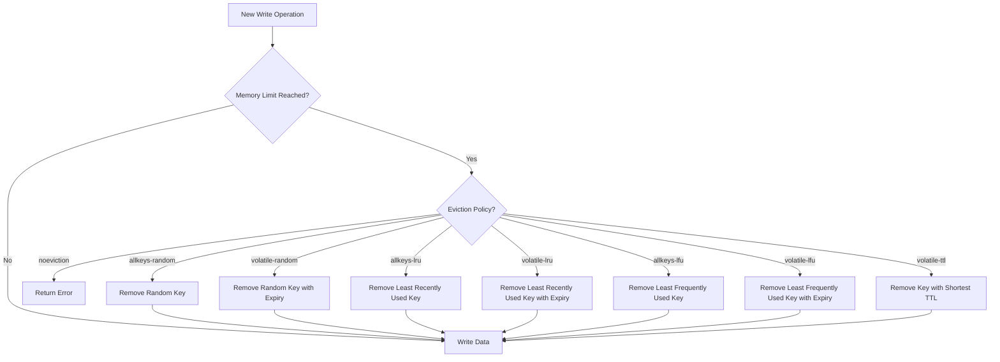

# Redis Eviction Policies

## Introduction

When working with Redis, one of the most important aspects to understand is how it manages memory. Redis is an in-memory data store, which means all data is kept in RAM for lightning-fast access. However, this presents a challenge: what happens when Redis runs out of memory?

This is where **eviction policies** come into play. Eviction policies determine how Redis behaves when it reaches its memory limit and needs to make room for new data. Understanding these policies is crucial for maintaining optimal performance and ensuring your application behaves predictably under memory pressure.

## Memory Management in Redis

Before diving into eviction policies, let's understand how Redis manages memory:

1. Redis stores all data in memory (RAM)
2. You can set a maximum memory limit using the `maxmemory` configuration
3. When this limit is reached, Redis needs to decide what to do with new write operations
4. The behavior is determined by the configured eviction policy

## Setting Memory Limits

You can set memory limits in your `redis.conf` file or dynamically using the `CONFIG SET` command:

```bash
# In redis.conf
maxmemory 100mb

# Or dynamically
redis-cli> CONFIG SET maxmemory 100mb
```

If you don't set a limit, Redis will continue to grow until it consumes all available system memory, which could lead to performance degradation or crashes.

## Available Eviction Policies

Redis offers several eviction policies, each with different behaviors and use cases:

### No Eviction (noeviction)

```bash
redis-cli> CONFIG SET maxmemory-policy noeviction
```

With this policy:
- Redis will not remove any keys when memory is full
- New write commands will return an error when memory limit is reached
- Read operations will still work

**Best for**: Applications where data loss is unacceptable and you prefer to receive errors rather than lose data.

### Random Eviction (allkeys-random, volatile-random)

```bash
redis-cli> CONFIG SET maxmemory-policy allkeys-random
# OR
redis-cli> CONFIG SET maxmemory-policy volatile-random
```

With these policies:
- `allkeys-random`: Redis removes keys randomly from the entire dataset
- `volatile-random`: Redis removes keys randomly, but only considers keys with an expiration set

**Best for**: When all keys have similar importance and access patterns, or when computational overhead needs to be minimized.

### LRU - Least Recently Used (allkeys-lru, volatile-lru)

```bash
redis-cli> CONFIG SET maxmemory-policy allkeys-lru
# OR
redis-cli> CONFIG SET maxmemory-policy volatile-lru
```

With these policies:
- `allkeys-lru`: Redis removes the least recently accessed keys first
- `volatile-lru`: Redis removes the least recently accessed keys, but only considers keys with an expiration set

**Best for**: Caching scenarios where recently accessed items are more likely to be accessed again.

### LFU - Least Frequently Used (allkeys-lfu, volatile-lfu)

```bash
redis-cli> CONFIG SET maxmemory-policy allkeys-lfu
# OR
redis-cli> CONFIG SET maxmemory-policy volatile-lfu
```

With these policies:
- `allkeys-lfu`: Redis removes the least frequently accessed keys first
- `volatile-lfu`: Redis removes the least frequently accessed keys, but only considers keys with an expiration set

**Best for**: Applications where access frequency matters more than recency, such as content caching where popular items should stay cached.

### TTL (volatile-ttl)

```bash
redis-cli> CONFIG SET maxmemory-policy volatile-ttl
```

With this policy:
- Redis removes keys with the shortest time-to-live (TTL) first
- Only keys with an expiration set are considered

**Best for**: When you want keys closest to expiration to be removed first.

## How Eviction Works: A Visual Explanation



## Practical Examples

### Example 1: Setting Up a Cache with LRU Eviction

Let's set up a Redis instance to act as a cache with LRU eviction:

```bash
# Start Redis with configuration
$ redis-server --maxmemory 100mb --maxmemory-policy allkeys-lru
```

Now let's demonstrate how the cache behaves by adding some data:

```bash
# Connect to Redis
$ redis-cli

# Add some items to the cache
redis> SET product:1001 "Smartphone" EX 3600
OK
redis> SET product:1002 "Laptop" EX 3600
OK
redis> SET product:1003 "Headphones" EX 3600
OK

# Access some items (this updates their LRU status)
redis> GET product:1001
"Smartphone"
redis> GET product:1002
"Laptop"

# Now, if memory limit is reached and eviction occurs,
# product:1003 would be evicted first (least recently used)
```

### Example 2: Demonstrating Different Policies

Let's compare how different policies behave by using the Redis CLI to simulate memory pressure:

```bash
# Set a small memory limit to trigger eviction
redis-cli> CONFIG SET maxmemory 1mb

# Fill Redis with data
redis-cli> SCRIPT LOAD "local i=0; while i<1000 do redis.call('SET', 'key'..i, string.rep('x', 1000)); i=i+1; end"

# Check available memory
redis-cli> INFO memory
# Output will show used_memory approaching maxmemory

# Test with different policies
redis-cli> CONFIG SET maxmemory-policy allkeys-lru
redis-cli> SET newkey "test value"
# This works because Redis evicted some least recently used key

redis-cli> CONFIG SET maxmemory-policy noeviction
redis-cli> SET another_key "test value"
# This should fail with an OOM (Out Of Memory) error
```

## Choosing the Right Eviction Policy

| Policy | Use Case | Pros | Cons |
|--------|----------|------|------|
| `noeviction` | Mission-critical data | No data loss | Can cause errors |
| `allkeys-random` | Simple caching | Low CPU overhead | Might evict important keys |
| `allkeys-lru` | General-purpose caching | Keeps recently accessed items | Higher CPU overhead |
| `volatile-lru` | Caching with selective persistence | Balance between caching and persistence | Only works if keys have expiration |
| `allkeys-lfu` | Frequency-based importance | Keeps frequently accessed items | Requires Redis 4.0+ |
| `volatile-ttl` | Time-based data | Natural expiration flow | Only works if keys have expiration |

## Implementation Notes and Best Practices

1. **Monitor memory usage**: Use the `INFO memory` command to track Redis memory consumption
   ```bash
   redis-cli> INFO memory
   ```

2. **Understand approximation**: Redis doesn't track exact LRU/LFU - it uses sampling to minimize overhead
   ```bash
   # Configure LRU/LFU samples (higher = more accurate but more CPU)
   redis-cli> CONFIG SET maxmemory-samples 10
   ```

3. **Set appropriate expiration times**: Even with eviction policies, it's good practice to set TTLs
   ```bash
   # Set a key with 1 hour expiration
   redis-cli> SET session:user123 "data" EX 3600
   ```

4. **Test under load**: Before deploying to production, test how your chosen policy behaves under memory pressure

5. **Consider key size distribution**: If some keys are much larger than others, they may affect eviction behavior differently

## Monitoring Eviction

You can monitor eviction events using Redis INFO command:

```bash
redis-cli> INFO stats | grep evicted_keys
evicted_keys:123456  # Number of keys removed due to reaching maxmemory limit
```

A high number of evictions could indicate:
- Memory limit is set too low
- Your dataset is too large for available memory
- Your write rate is too high

## Summary

Redis eviction policies provide flexible options for managing memory constraints. By choosing the right policy based on your application's needs, you can ensure that Redis performs optimally even when under memory pressure.

The key points to remember:
- Set an appropriate `maxmemory` limit
- Choose an eviction policy that matches your use case
- Monitor eviction rates and memory usage
- Use expiration times when appropriate
- Test your configuration under load

## Exercises

1. Configure Redis with different eviction policies and observe the behavior when memory is filled
2. Write a simple script that adds data to Redis until eviction occurs, then observe which keys are removed
3. Compare the performance impact of different eviction policies under high load
4. Experiment with different `maxmemory-samples` values to understand the accuracy vs. performance tradeoff

## Additional Resources

- [Redis Documentation on Eviction Policies](https://redis.io/topics/lru-cache)
- [Redis Configuration Reference](https://redis.io/topics/config)
- [Redis Memory Optimization Guide](https://redis.io/topics/memory-optimization)