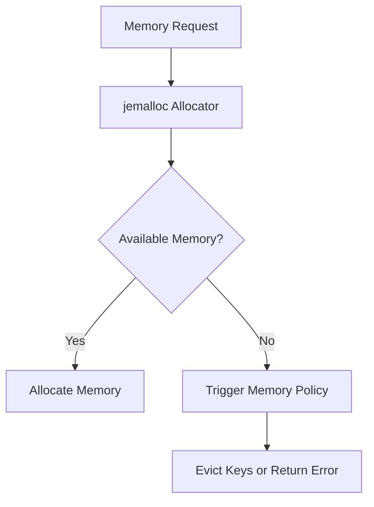

# Redis Memory Management

Redis is an in-memory data store that keeps all its data in RAM, making memory management a critical aspect of Redis performance and stability. In this article, we'll explore how Redis handles memory, common memory-related challenges, and practical techniques to optimize memory usage.

## Introduction to Redis Memory Model

Redis keeps its entire dataset in memory, which is why it's incredibly fast but also why memory management is crucial. Unlike disk-based databases, Redis trades memory consumption for speed, making efficient memory usage essential.

When Redis runs out of memory, it can crash or start evicting keys based on your configuration. Understanding Redis memory management will help you:

- Prevent out-of-memory errors
- Optimize memory usage
- Scale your applications appropriately
- Choose the right data structures for your use case

## How Redis Uses Memory

### Memory Allocation

Redis uses a custom memory allocator called `jemalloc` by default on most systems. This allocator is designed to reduce fragmentation and improve performance for Redis workloads.



### Redis Data Structure Memory Overhead

Each Redis data structure has memory overhead beyond the actual data it stores:

| Data Structure | Memory Overhead |
|----------------|----------------|
| String         | At least 90 bytes for small strings |
| Hash           | Around 100 bytes + 21 bytes per field |
| List           | About 40 bytes per element |
| Set            | About 40 bytes per element |
| Sorted Set     | About 80 bytes per element |

Let's see a practical example of memory consumption:

```redis
> SET simple_string "Hello World"
OK

> MEMORY USAGE simple_string
(integer) 65
```

The string "Hello World" (11 bytes) actually consumes 65 bytes in Redis!

## Memory Usage Monitoring

Redis provides several commands to check memory usage:

### INFO Memory Command

```redis
> INFO memory
# Memory
used_memory:1032824
used_memory_human:1008.62K
used_memory_rss:1908736
used_memory_rss_human:1.82M
mem_fragmentation_ratio:1.85
```

Key metrics here:
- **used_memory**: Total bytes allocated by Redis
- **used_memory_rss**: Physical memory used by Redis process (as reported by OS)
- **mem_fragmentation_ratio**: Ratio of RSS to used_memory (higher values indicate more fragmentation)

### MEMORY Commands

Redis 4.0+ introduced the `MEMORY` command set:

```redis
> MEMORY USAGE mykey
(integer) 65

> MEMORY STATS
 1) "peak.allocated"
 2) (integer) 423128
 3) "total.allocated"
 4) (integer) 410064
 5) "startup.allocated"
 6) (integer) 409928
 7) "replication.backlog"
 8) (integer) 0
 9) "clients.slaves"
10) (integer) 0
11) "clients.normal"
12) (integer) 20752
13) "aof.buffer"
14) (integer) 0
15) "lua.caches"
16) (integer) 0
17) "db.0"
18) (integer) 59816
```

## Memory Management Policies

When Redis approaches its memory limit, it can take several actions based on your configuration:

### maxmemory Configuration

The `maxmemory` directive in `redis.conf` sets the maximum memory Redis can use:

```
maxmemory 100mb
```

When Redis reaches this limit, it begins evicting keys according to the specified `maxmemory-policy`.

### Eviction Policies

Redis supports several eviction policies:

```redis
> CONFIG GET maxmemory-policy
1) "maxmemory-policy"
2) "noeviction"
```

Available policies:
- **noeviction**: Returns errors when memory limit is reached
- **allkeys-lru**: Evicts less recently used keys first
- **allkeys-lfu**: Evicts least frequently used keys first (Redis 4.0+)
- **volatile-lru**: Evicts less recently used keys with expiry set
- **volatile-lfu**: Evicts least frequently used keys with expiry set (Redis 4.0+)
- **volatile-ttl**: Evicts keys with shortest TTL first
- **volatile-random**: Randomly evicts keys with expiry set
- **allkeys-random**: Randomly evicts any key

Here's how to set an eviction policy:

```redis
> CONFIG SET maxmemory-policy allkeys-lru
OK
```

## Memory Optimization Techniques

### 1. Use the Right Data Structures

Choose data structures wisely based on your access patterns:

```redis
# Instead of storing user data in separate keys:
SET user:1:name "John"
SET user:1:email "john@example.com"
SET user:1:age "30"

# Use a Hash to reduce memory overhead:
HMSET user:1 name "John" email "john@example.com" age "30"
```

Hashes are more memory-efficient for storing object fields, especially with many small values.

### 2. Use Redis Key Expiration

Set TTL (Time To Live) for ephemeral data like sessions or cache:

```redis
> SET session:12345 "user_data" EX 3600  # Expires in 1 hour
OK

> TTL session:12345
(integer) 3598
```

### 3. Use Redis Compression

For string values, consider compressing large data before storing:

```javascript
// Node.js example
const redis = require('redis');
const zlib = require('zlib');
const client = redis.createClient();

// Storing compressed data
function storeCompressed(key, value) {
  const compressed = zlib.deflateSync(Buffer.from(value));
  client.set(key, compressed);
}

// Retrieving and decompressing
function getDecompressed(key, callback) {
  client.get(key, (err, result) => {
    if (err) return callback(err);
    const decompressed = zlib.inflateSync(result).toString();
    callback(null, decompressed);
  });
}
```

### 4. Configure Redis with Memory Efficiency in Mind

```
# redis.conf optimizations
maxmemory 1gb
maxmemory-policy allkeys-lru
activerehashing yes
```

### 5. Use Redis Memory Analysis

Redis provides tools to analyze memory usage patterns:

```redis
> MEMORY DOCTOR
Memory for keys with TTL: 0.00% (0/36)
1 keys consume 94.00% of memory (1/36)
Peak memory: current peak/total is 1.00 (stable)
Memory efficiency: 0.58 (good)
Fragmentation: 1.85 (ok)
```

## Practical Example: Caching System with Memory Limits

Let's design a simple Redis-based caching system with memory constraints:

```javascript
// Node.js example of a memory-efficient cache
const redis = require('redis');
const client = redis.createClient({
  host: 'localhost',
  port: 6379
});

async function setupCache() {
  // Set memory limit to 100MB
  await client.config_set('maxmemory', '100mb');
  
  // Use LRU eviction for automatic cache management
  await client.config_set('maxmemory-policy', 'allkeys-lru');
  
  console.log('Cache configured with 100MB limit and LRU eviction');
}

async function cacheItem(key, value, ttlSeconds = 3600) {
  // Use compression for large values
  let storageValue = value;
  if (typeof value === 'string' && value.length > 1000) {
    storageValue = '_compressed_' + zlib.deflateSync(Buffer.from(value)).toString('base64');
  }
  
  // Set with expiration
  await client.set(key, storageValue, 'EX', ttlSeconds);
}

async function getCachedItem(key) {
  const value = await client.get(key);
  
  // Decompress if needed
  if (value && value.startsWith('_compressed_')) {
    const compressed = value.substring('_compressed_'.length);
    return zlib.inflateSync(Buffer.from(compressed, 'base64')).toString();
  }
  
  return value;
}
```

## Memory Issues and Troubleshooting

### Common Memory Problems

1. **Memory Fragmentation**: When the `mem_fragmentation_ratio` is too high (>1.5)
2. **Out of Memory (OOM)**: Redis crashes when it can't allocate more memory
3. **Slow Performance due to Swapping**: When Redis data gets swapped to disk

### Troubleshooting Strategies

#### For High Fragmentation

```redis
> INFO memory
# Check mem_fragmentation_ratio

# If high, consider restarting Redis during low traffic periods
```

#### For Out of Memory Issues

```bash
# Check for large keys
$ redis-cli --bigkeys

# Monitor memory in real-time
$ redis-cli info memory | grep used_memory_human
```

#### Debugging with MONITOR and SLOWLOG

```redis
> MONITOR  # Caution: performance impact in production!

> SLOWLOG GET 10  # Get the 10 slowest commands
```

## Summary

Redis memory management is critical for performance and stability. Key takeaways:

- Redis stores all data in memory, making memory management essential
- Use appropriate data structures to minimize memory usage
- Configure memory limits and eviction policies based on your needs
- Monitor memory usage regularly with `INFO memory` and `MEMORY` commands
- Use TTL settings for transient data
- Consider compression for large values

## Additional Resources

- [Redis Documentation on Memory Optimization](https://redis.io/topics/memory-optimization)
- [Redis Configuration](https://redis.io/topics/config)
- [Redis Memory Analysis Tools](https://redis.io/commands/memory-doctor)

## Exercises

1. Experiment with different eviction policies and observe their effects
2. Compare memory usage between individual keys and hash fields for storing user data
3. Write a script to monitor Redis memory usage over time and alert when it crosses thresholds
4. Benchmark the performance impact of compressed vs. uncompressed data in Redis
5. Identify and optimize the top memory-consuming keys in your Redis instance