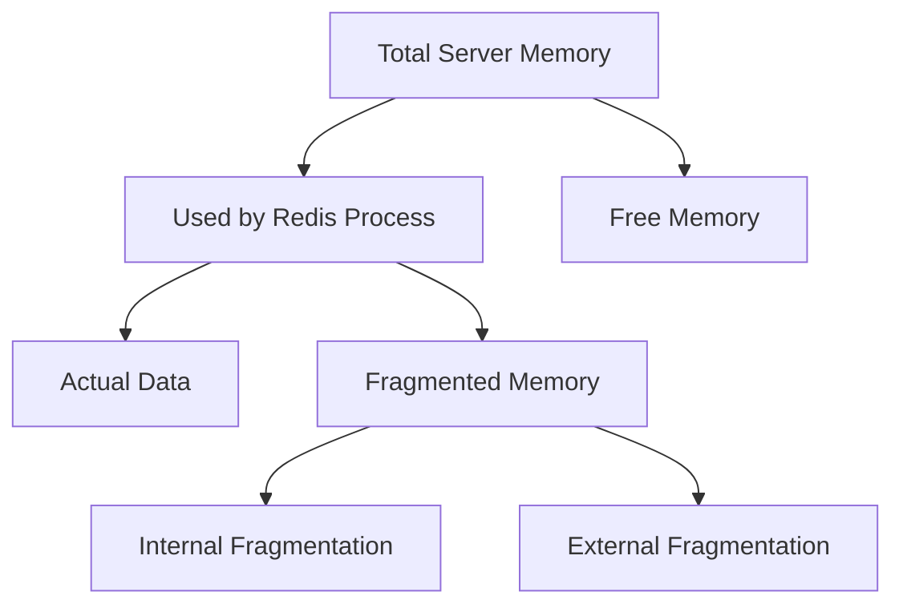

# Redis Fragmentation

## Introduction

Memory fragmentation is a critical aspect of Redis performance that can significantly impact your application's efficiency and resource utilization. In simple terms, fragmentation occurs when the memory allocated by Redis doesn't match the actual memory used by your data, leading to wasted resources.

As a beginner, understanding fragmentation will help you maintain your Redis instances more effectively and troubleshoot performance issues as your applications scale.

## What is Memory Fragmentation?

Memory fragmentation in Redis refers to the inefficient use of allocated memory. It happens when the memory Redis has requested from the operating system (RSS - Resident Set Size) is substantially larger than the amount of memory actually used to store your data.

There are two primary types of fragmentation in Redis:

1. **Internal Fragmentation**: Occurs within Redis itself when memory blocks allocated for data are larger than necessary.

2. **External Fragmentation**: Occurs at the operating system level when the memory allocator creates gaps between allocated memory blocks.



## Measuring Fragmentation in Redis

Redis provides a fragmentation ratio metric that helps you understand the severity of fragmentation in your system:

```
Fragmentation Ratio = RSS / Used Memory
```

Where:
- **RSS (Resident Set Size)**: The total memory allocated to the Redis process by the operating system.
- **Used Memory**: The amount of memory Redis reports as actually being used to store your data.

You can check this ratio using the `INFO memory` command:

```bash
redis-cli INFO memory
```

Example output:

```
# Memory
used_memory:1073741824
used_memory_human:1.00G
used_memory_rss:1288490394
used_memory_rss_human:1.20G
mem_fragmentation_ratio:1.20
...
```

In this example, the fragmentation ratio is 1.20, meaning there's about 20% memory overhead due to fragmentation.

### Interpreting the Fragmentation Ratio

- **Ratio < 1**: May indicate Redis is using swap memory, which is problematic for performance.
- **Ratio ≈ 1**: Ideal, minimal fragmentation.
- **Ratio between 1.0 and 1.5**: Normal range for a healthy Redis instance.
- **Ratio > 1.5**: High fragmentation that may require attention.
- **Ratio > 2.0**: Severe fragmentation that should be addressed.

## Common Causes of Redis Fragmentation

### 1. Frequent Write and Delete Operations

When you repeatedly write and delete data of varying sizes, the memory allocator may not reuse freed space effectively, leading to fragments.

```javascript
// Example of operations that might cause fragmentation
// Adding a large value
redis.set("large_key", "..." /* 1MB of data */);

// Deleting the large value
redis.del("large_key");

// Adding many small values where the large value was
for (let i = 0; i < 1000; i++) {
  redis.set(`small_key_${i}`, "small data");
}
```

### 2. Using Append Operations

Appending data to existing values can cause Redis to reallocate memory, potentially creating fragments:

```bash
redis-cli SET mykey "Hello"
redis-cli APPEND mykey " World"
```

### 3. Large and Varied Key Sizes

Having keys with significantly different sizes can lead to suboptimal memory allocation:

```bash
redis-cli SET tiny_key "a"
redis-cli SET huge_key "..." # 5MB of data
```

### 4. Long-Running Instances

Redis instances that run for extended periods without restarts may accumulate fragmentation over time.

## Practical Monitoring Example

Let's walk through a practical example of monitoring fragmentation:

```bash
# Store this script as check_fragmentation.sh
#!/bin/bash

while true; do
  echo "Redis Memory Status:"
  redis-cli INFO memory | grep -E "used_memory_human|used_memory_rss_human|mem_fragmentation_ratio"
  echo "------------------------"
  sleep 10
done
```

Running this script will give you periodic updates on memory usage and fragmentation:

```
Redis Memory Status:
used_memory_human:1.24G
used_memory_rss_human:1.89G
mem_fragmentation_ratio:1.52
------------------------
```

## Addressing Redis Fragmentation

### 1. Restart Redis

The simplest solution is to restart Redis, which releases all memory back to the operating system and starts fresh:

```bash
sudo systemctl restart redis
# or
redis-cli SAVE
redis-cli SHUTDOWN
```

### 2. Use `jemalloc` Memory Allocator

Redis works best with the `jemalloc` memory allocator, which is designed to reduce fragmentation:

```bash
# Check if Redis is using jemalloc
redis-cli INFO memory | grep mem_allocator

# Output should be:
mem_allocator:jemalloc-5.1.0
```

If not using `jemalloc`, you may need to recompile Redis with:

```bash
make MALLOC=jemalloc
```

### 3. Configure Memory Policy

Set an appropriate `maxmemory` policy to control memory usage:

```bash
redis-cli CONFIG SET maxmemory 1gb
redis-cli CONFIG SET maxmemory-policy allkeys-lru
```

### 4. Use `activedefrag` Feature (Redis 4.0+)

Redis 4.0 and above include active defragmentation:

```bash
redis-cli CONFIG SET activedefrag yes
redis-cli CONFIG SET active-defrag-threshold-lower 10
redis-cli CONFIG SET active-defrag-threshold-upper 100
```

Example configuration in `redis.conf`:

```
activedefrag yes
active-defrag-ignore-bytes 100mb
active-defrag-threshold-lower 10
active-defrag-threshold-upper 100
active-defrag-cycle-min 25
active-defrag-cycle-max 75
```

## Real-world Application Example

Let's examine a scenario where a web application's session store in Redis experiences fragmentation over time:

```javascript
// Node.js Express server storing sessions in Redis
const express = require('express');
const session = require('express-session');
const RedisStore = require('connect-redis')(session);
const redis = require('redis');
const client = redis.createClient();

const app = express();

app.use(session({
  store: new RedisStore({ client }),
  secret: 'your-secret-key',
  resave: false,
  saveUninitialized: false,
  cookie: { maxAge: 86400000 } // 24 hours
}));

// Routes that create and modify sessions
app.get('/login', (req, res) => {
  // Create a new session with user data
  req.session.user = { 
    id: 12345,
    username: 'user123',
    preferences: { /* small object */ }
  };
  res.send('Logged in');
});

app.get('/update-preferences', (req, res) => {
  // Modify existing session with larger data
  req.session.user.preferences = {
    // Much larger object that causes reallocation
    theme: 'dark',
    language: 'en',
    notifications: { /* complex nested object */ },
    // ... more fields
  };
  res.send('Preferences updated');
});
```

**The Problem**: As users log in and update preferences, session objects change size repeatedly. Over time, this leads to fragmentation.

**Monitoring Script**:

```bash
#!/bin/bash
# monitor_redis_for_sessions.sh

echo "Monitoring Redis used for session storage..."
while true; do
  redis-cli INFO memory | grep -E "used_memory_human|used_memory_rss_human|mem_fragmentation_ratio"
  redis-cli DBSIZE # Shows number of keys (sessions)
  echo "------------------------"
  sleep 3600 # Check hourly
done
```

**Solution Implementation**:

```javascript
// 1. Use more consistent session objects
app.get('/login', (req, res) => {
  // Pre-allocate space for preferences to reduce future reallocations
  req.session.user = { 
    id: 12345,
    username: 'user123',
    preferences: {
      theme: 'default',
      language: 'en',
      notifications: {},
      // Include empty placeholders for all possible fields
    }
  };
  res.send('Logged in');
});

// 2. Set up a scheduled task to check fragmentation
const checkFragmentation = async () => {
  const info = await util.promisify(client.info).bind(client)('memory');
  const ratio = /mem_fragmentation_ratio:(\d+\.\d+)/.exec(info)[1];
  
  if (parseFloat(ratio) > 1.5) {
    console.log(`High fragmentation detected: ${ratio}. Consider restarting Redis.`);
    // Optionally send an alert or trigger a maintenance process
  }
};

setInterval(checkFragmentation, 24 * 60 * 60 * 1000); // Check daily
```

## Summary

Redis fragmentation occurs when there's a discrepancy between the memory allocated to Redis and the memory actually used for data storage. Key points to remember:

- Monitor fragmentation using the `INFO memory` command and track the `mem_fragmentation_ratio`.
- A ratio between 1.0 and 1.5 is generally acceptable.
- Common causes include frequent writes/deletes, varied key sizes, and append operations.
- Solutions include restarting Redis, using `jemalloc`, configuring appropriate memory policies, and enabling active defragmentation.
- Regular monitoring is essential for maintaining optimal Redis performance.

## Additional Resources

- Practice tracking fragmentation in a development environment with various workloads.
- Experiment with different memory allocation patterns and observe their impact.
- Set up automated monitoring for your Redis instances.

## Exercises

1. Set up a local Redis instance and write a script that creates fragmentation by repeatedly creating and deleting keys of different sizes.
2. Monitor the fragmentation ratio as your script runs.
3. Implement active defragmentation and observe its effects.
4. Create a monitoring dashboard for Redis fragmentation using Prometheus and Grafana.
5. Research how different Redis data structures (Strings, Hashes, Lists) might affect fragmentation differently.