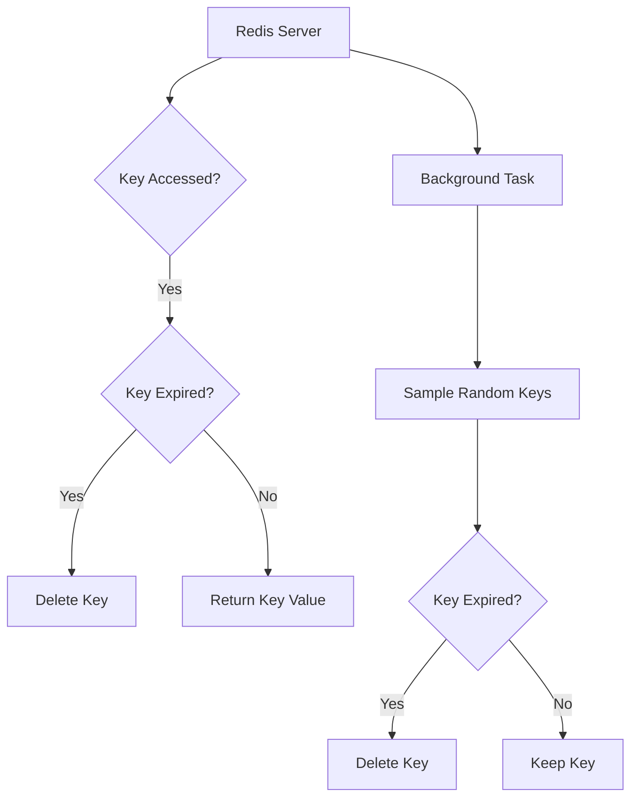

# Redis Garbage Collection

## Introduction

Redis is an in-memory data structure store commonly used as a database, cache, and message broker. Being an in-memory system means that Redis keeps all its data in RAM, which provides exceptional speed but also makes memory management critical. Unlike traditional database systems that store data on disk, Redis must carefully manage its memory footprint to ensure stable performance and prevent crashes due to out-of-memory errors.

In this article, we'll explore how Redis handles garbage collection - the process of freeing up memory that's no longer needed. While Redis doesn't use traditional garbage collection like languages such as Java or Python, it employs several mechanisms to manage memory efficiently. Understanding these mechanisms is essential for maintaining optimal Redis performance in production environments.

## Redis Memory Management Basics

Before diving into garbage collection specifics, let's understand how Redis manages memory:

1. **All in RAM**: Redis keeps the entire dataset in memory, which is why it's so fast
2. **No traditional GC**: Redis doesn't use mark-and-sweep or similar algorithms
3. **Manual & automatic approaches**: Redis combines explicit and implicit memory management techniques

## Key Redis Memory Management Mechanisms

Redis uses several approaches that serve as alternatives to traditional garbage collection:

### 1. Explicit Key Eviction Policies

Redis allows you to configure how it should behave when memory limits are reached through eviction policies.

```bash
# Example of setting a maxmemory policy in redis.conf
maxmemory 100mb
maxmemory-policy allkeys-lru
```

The available eviction policies include:

- `noeviction`: Returns errors when memory limit is reached
- `allkeys-lru`: Evicts less recently used keys first
- `volatile-lru`: Evicts less recently used keys with an expire set
- `allkeys-random`: Randomly evicts keys
- `volatile-random`: Randomly evicts keys with an expire set
- `volatile-ttl`: Evicts keys with expire set and shortest TTL first
- `volatile-lfu`: Evicts less frequently used keys with an expire set (Redis 4.0+)
- `allkeys-lfu`: Evicts less frequently used keys (Redis 4.0+)

### 2. Key Expiration

Redis allows setting time-to-live (TTL) on keys, after which they're automatically removed:

```javascript
// Setting a key with 60-second expiration
> SET mykey "Hello" EX 60
"OK"

// Check remaining time-to-live
> TTL mykey
(integer) 58
```

Key expiration works through two mechanisms:

1. **Passive expiration**: Keys are checked when accessed and removed if expired
2. **Active expiration**: Redis periodically samples random keys with expire flags



### 3. Memory Fragmentation Handling

As Redis allocates and frees memory, fragmentation can occur. Redis addresses this:

```bash
# Check memory fragmentation in Redis CLI
> INFO memory
# Memory
used_memory:1073741824
used_memory_rss:1132462080
mem_fragmentation_ratio:1.05
```

When the fragmentation ratio gets too high, Redis may need intervention:

```bash
# Force memory defragmentation (Redis 4.0+)
> MEMORY DEFRAG
"OK"
```

### 4. Lazy Freeing

Redis 4.0+ introduced "lazy" (asynchronous) freeing operations:

```bash
# Delete a large hash asynchronously
> UNLINK bighashkey
(integer) 1

# Flush database asynchronously
> FLUSHALL ASYNC
"OK"
```

This allows Redis to free memory in the background without blocking the main thread, which is particularly important for large datasets.

## Redis Garbage Collection in Action: Practical Examples

### Example 1: Configuring Max Memory and Eviction Policy

Let's see how to configure Redis to automatically manage memory limits:

```bash
# In redis.conf
maxmemory 1gb
maxmemory-policy volatile-lru
```

In this configuration:
- Redis will use a maximum of 1GB of memory
- When the limit is reached, it will remove the least recently used keys that have an expiration set

### Example 2: Monitoring Memory Usage and Fragmentation

```javascript
// Connect to Redis and check memory stats
> INFO memory
# Memory
used_memory:1073741824
used_memory_human:1024.00M
used_memory_rss:1132462080
used_memory_rss_human:1080.00M
mem_fragmentation_ratio:1.05
mem_allocator:jemalloc-5.1.0
active_defrag_running:0
```

Key metrics to monitor:
- `used_memory`: Actual memory used by Redis
- `used_memory_rss`: Memory allocated by the operating system
- `mem_fragmentation_ratio`: Ratio between RSS and used memory

### Example 3: Using SCAN for Safe Large-Scale Operations

Traditional commands like `KEYS *` can block Redis when working with large datasets. The `SCAN` command provides a safer alternative:

```javascript
// Start scanning with cursor 0
> SCAN 0 MATCH user:* COUNT 10
1) "17"  // Next cursor
2) 1) "user:1"
   2) "user:2"
   3) "user:3"

// Continue with returned cursor
> SCAN 17 MATCH user:* COUNT 10
...
```

By incrementally scanning and processing keys, you can perform maintenance without impacting Redis performance.

## LRU vs LFU Cache Algorithms

Redis 4.0 introduced the LFU (Least Frequently Used) algorithm as an alternative to LRU:

```bash
# LRU configuration
maxmemory-policy allkeys-lru

# LFU configuration
maxmemory-policy allkeys-lfu
```

The difference:
- **LRU** evicts based on recent access (time-based)
- **LFU** evicts based on access frequency (count-based)

LFU is often better for caching scenarios where some items are consistently more popular than others.

## Redis Memory Optimization Best Practices

### 1. Use Appropriate Data Structures

Redis offers specialized data structures that can be more memory-efficient:

```javascript
// Instead of storing objects as individual keys:
> SET user:1:name "John"
> SET user:1:email "john@example.com"

// Use a hash (more memory efficient):
> HSET user:1 name "John" email "john@example.com"
```

### 2. Enable Compression for Large Values

For string values, consider using compression:

```javascript
// Client-side compression example in Node.js
const redis = require('redis');
const zlib = require('zlib');
const client = redis.createClient();

// Storing compressed data
const original = JSON.stringify(largeObject);
const compressed = zlib.deflateSync(original);
client.set('compressed_key', compressed);

// Retrieving and decompressing
client.get('compressed_key', (err, result) => {
  const decompressed = zlib.inflateSync(result);
  const object = JSON.parse(decompressed);
  console.log(object);
});
```

### 3. Configure Redis for Your Workload

Adjust Redis configuration based on your specific use case:

```bash
# For cache workloads
maxmemory-policy allkeys-lfu
# For session storage
maxmemory-policy volatile-lru
# For queue systems where all data matters
maxmemory-policy noeviction
```

## Advanced Topic: Redis Memory Analyzer

Redis provides the `MEMORY USAGE` command to analyze the memory footprint of specific keys:

```javascript
// Check memory usage of a key
> SET mystring "Hello World"
"OK"
> MEMORY USAGE mystring
(integer) 63  // bytes

// Check memory usage of a hash
> HSET myhash field1 "value1" field2 "value2"
(integer) 2
> MEMORY USAGE myhash
(integer) 109  // bytes
```

You can use this information to identify memory-intensive keys in your application.

## Summary

Redis doesn't use traditional garbage collection but employs several mechanisms to manage memory efficiently:

1. **Key eviction policies** automatically remove keys based on configured rules
2. **Key expiration** removes keys after their TTL expires
3. **Memory defragmentation** consolidates fragmented memory
4. **Lazy freeing** operations work asynchronously to avoid blocking

By understanding and properly configuring these mechanisms, you can ensure your Redis instances maintain optimal performance under memory pressure.

## Additional Resources

- [Redis Documentation on Memory Optimization](https://redis.io/topics/memory-optimization)
- [Redis Configuration Documentation](https://redis.io/topics/config)
- [Redis Memory Analysis Command Reference](https://redis.io/commands/memory-usage)

## Exercises

1. Configure a Redis instance with a memory limit of 100MB and test different eviction policies to see how they behave under memory pressure.
2. Write a script that monitors Redis memory usage and alerts when fragmentation exceeds 1.5.
3. Compare the memory usage of different Redis data structures (strings, hashes, sorted sets) for storing the same information.
4. Implement a pattern for safely deleting large keys using the `SCAN` command and `UNLINK`.