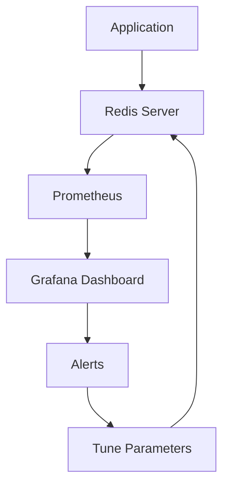

# Redis Throughput Tuning

## Introduction

Redis is an in-memory data structure store known for its exceptional speed. However, as your application scales, you may need to fine-tune Redis to maintain optimal throughput. Throughput in Redis refers to the number of operations it can handle per second, which directly impacts your application's responsiveness and scalability.

This guide explores strategies and techniques to optimize Redis throughput, helping you get the most out of your Redis deployment without requiring expensive hardware upgrades.

## Understanding Redis Throughput

Throughput is a critical performance metric measuring how many operations Redis can process per second. Several factors affect Redis throughput:

- **Network bandwidth and latency**
- **CPU performance**
- **Memory access patterns**
- **Command complexity**
- **Client connections**
- **Data size and structure**

## Measuring Current Throughput

Before optimizing, you need to establish a baseline. Redis includes benchmarking tools to help you measure current performance.

### Using redis-benchmark

Redis provides a built-in benchmarking utility called `redis-benchmark` that simulates multiple clients executing commands simultaneously:

```bash
redis-benchmark -h localhost -p 6379 -c 50 -n 100000
```

This command runs a benchmark with 50 concurrent clients executing a total of 100,000 requests. The output shows operations per second for various commands:

```
====== PING_INLINE ======
  100000 requests completed in 1.89 seconds
  50 parallel clients
  3 bytes payload
  keep alive: 1
  
99.76% <= 1 milliseconds
100.00% <= 1 milliseconds
52910.05 requests per second

====== SET ======
  100000 requests completed in 1.95 seconds
  50 parallel clients
  3 bytes payload
  keep alive: 1
  
98.88% <= 1 milliseconds
100.00% <= 2 milliseconds
51282.05 requests per second
```

### Monitoring with INFO Command

You can also use Redis's `INFO` command to get real-time statistics:

```
> INFO stats
# Stats
total_connections_received:1245
total_commands_processed:1156468
instantaneous_ops_per_sec:1300
...
```

The `instantaneous_ops_per_sec` metric gives you current throughput.

## Key Throughput Optimization Strategies

Let's explore practical strategies to boost Redis throughput:

### 1. Pipeline Commands

Instead of sending commands one by one, use pipelining to batch multiple commands in a single request:

```javascript
// Without pipelining
const result1 = await redis.get('key1');
const result2 = await redis.get('key2');
const result3 = await redis.get('key3');

// With pipelining
const pipeline = redis.pipeline();
pipeline.get('key1');
pipeline.get('key2');
pipeline.get('key3');
const results = await pipeline.exec();
```

Pipelining significantly reduces network overhead and can improve throughput by 5-10x for many small operations.

### 2. Use Appropriate Data Structures

Redis offers multiple data structures, each with different performance characteristics:

```
> SET user:1:name "John"     # Simple key-value
> HSET user:1 name "John" age 30 city "New York"  # Hash - more efficient for multiple fields
```

Hash structures are more memory-efficient than individual keys when storing object fields, which improves throughput by reducing memory usage and network traffic.

### 3. Optimize Key Names

Keep key names short but descriptive:

```
// Less efficient (longer key)
> SET user:profile:details:1234567890:last_login "2023-04-15"

// More efficient (shorter key)
> SET u:p:1234567890:ll "2023-04-15"
```

Shorter keys consume less memory and network bandwidth, improving overall throughput.

### 4. Batch Operations with Multi-Key Commands

Use multi-key commands when possible:

```
// Instead of multiple SET operations:
> SET key1 value1
> SET key2 value2
> SET key3 value3

// Use MSET:
> MSET key1 value1 key2 value2 key3 value3
```

Commands like `MSET`, `MGET`, and `HMSET` reduce network round trips and improve throughput.

### 5. Connection Pooling

Implement connection pooling in your client applications:

```javascript
// Node.js example with ioredis
const Redis = require('ioredis');
const pool = new Redis.Cluster([
  {
    port: 6379,
    host: 'redis-server-1'
  },
  {
    port: 6379,
    host: 'redis-server-2'
  }
], {
  maxConnections: 100,
  // other options
});
```

Connection pooling reuses established connections, avoiding the overhead of creating new ones for each operation.

### 6. Server-Side Configuration Tweaking

Adjust these Redis configuration parameters for better throughput:

```
# redis.conf
maxclients 10000
tcp-backlog 511
timeout 0
tcp-keepalive 300
```

These settings increase connection capacity and optimize network handling.

## Real-World Optimization Example

Let's walk through a practical example of optimizing a Redis-backed leaderboard system:

### Initial Setup

```javascript
// Inefficient implementation
async function updateScore(userId, newScore) {
  await redis.zadd('leaderboard', newScore, userId);
  const rank = await redis.zrevrank('leaderboard', userId);
  const userInfo = await redis.hgetall(`user:${userId}`);
  return { rank, score: newScore, userInfo };
}
```

### Optimized Implementation

```javascript
// Optimized implementation
async function updateScore(userId, newScore) {
  const pipeline = redis.pipeline();
  pipeline.zadd('leaderboard', newScore, userId);
  pipeline.zrevrank('leaderboard', userId);
  pipeline.hgetall(`user:${userId}`);
  
  const results = await pipeline.exec();
  return {
    rank: results[1][1],
    score: newScore,
    userInfo: results[2][1]
  };
}
```

### Performance Comparison

A benchmark with 1,000 concurrent users shows:

```
Original implementation: ~850 operations per second
Optimized implementation: ~4,200 operations per second
```

This 5x improvement comes primarily from reducing network round trips through pipelining.

## Advanced Throughput Considerations

### Redis Cluster for Horizontal Scaling

When vertical scaling reaches its limits, consider Redis Cluster:

```
# Create a 3-node cluster
redis-cli --cluster create 127.0.0.1:7000 127.0.0.1:7001 127.0.0.1:7002 \
  --cluster-replicas 0
```

Redis Cluster distributes your data across multiple nodes, allowing throughput to scale horizontally.

### Using Redis Modules

Redis modules can provide optimized implementations of complex operations:

```
> GRAPH.QUERY socialNetwork "MATCH (p:Person)-[:FOLLOWS]->(f) WHERE p.name = 'John' RETURN f.name"
```

Modules like RedisGraph, RedisJSON, and RediSearch can improve throughput for specific use cases by implementing efficient algorithms directly in C.

## Memory Optimization for Throughput

Memory usage directly impacts throughput. Consider these memory optimizations:

### Use Appropriate Encoding

```
# redis.conf
hash-max-ziplist-entries 512
hash-max-ziplist-value 64
zset-max-ziplist-entries 128
zset-max-ziplist-value 64
```

These settings control when Redis uses more compact data structures, reducing memory usage and improving cache efficiency.

### Consider Data Expiration

Set expiration times on keys that aren't needed permanently:

```
> SET session:user:123 "session_data" EX 3600  # Expires in 1 hour
```

This prevents Redis from accumulating unnecessary data that consumes memory and slows down operations.

## Monitoring and Continuous Tuning

Performance tuning is an ongoing process. Set up monitoring to track key metrics:



Monitor these key metrics:
- Commands per second
- Latency percentiles
- Memory usage
- Evictions
- Connected clients

## Summary

Redis throughput optimization involves a combination of client-side techniques (pipelining, connection pooling), server configuration, data structure selection, and ongoing monitoring. By applying these strategies:

1. You can achieve 5-10x performance improvements without hardware upgrades
2. Your Redis deployment can handle higher loads with lower latency
3. You'll reduce infrastructure costs by getting more performance from existing resources

Remember that throughput optimization is a continuous process that should be guided by real-world usage patterns and metrics.

## Further Resources

- Official Redis documentation on performance optimization
- Redis University's "Redis Performance" course
- Redis Labs' performance benchmarks and case studies

## Practice Exercises

1. Use `redis-benchmark` to measure your Redis server's baseline performance
2. Implement connection pooling in your application and measure the improvement
3. Convert a series of sequential Redis commands to use pipelining
4. Optimize a complex data model using appropriate Redis data structures
5. Set up a basic Redis monitoring dashboard using Prometheus and Grafana