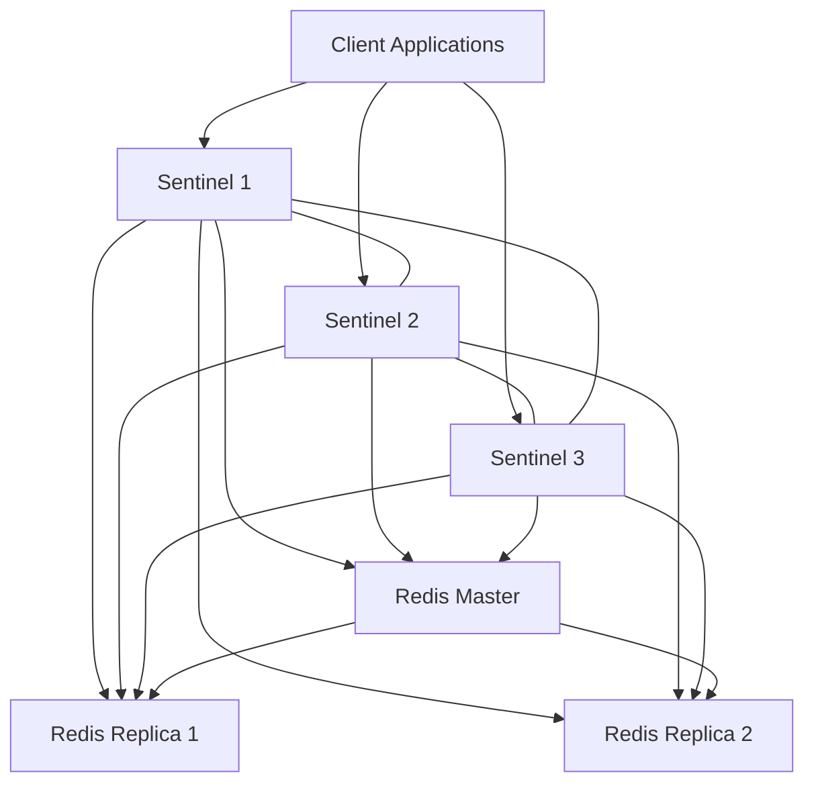
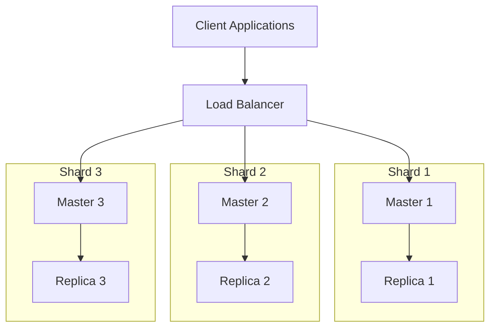

# Redis Deployment

Redis is an in-memory data structure store that can be used as a database, cache, message broker, and more. Deploying Redis properly is essential for ensuring optimal performance, reliability, and security for your applications.

## Introduction to Redis Deployment

Deploying Redis involves setting up the Redis server in various environments, from development machines to production servers. The deployment approach depends on your specific requirements, such as:

- Performance needs
- Data persistence requirements
- High availability considerations
- Scaling capabilities
- Security constraints

In this guide, we'll explore different deployment options and best practices to help you make informed decisions when setting up Redis for your applications.

## Deployment Options

### Local Development Deployment

Let's start with the simplest deployment option - setting up Redis on your local machine for development purposes.

#### Installing Redis Locally

**On Ubuntu/Debian:**

```bash
# Update package list
sudo apt update

# Install Redis
sudo apt install redis-server

# Start Redis service
sudo systemctl start redis-server

# Check status
sudo systemctl status redis-server
```

**On macOS (using Homebrew):**

```bash
# Install Redis
brew install redis

# Start Redis service
brew services start redis
```

**On Windows:**

Windows is not officially supported by Redis. However, you can use:

1. Windows Subsystem for Linux (WSL)
2. Redis provided by Microsoft for Windows
3. Docker (recommended)

#### Verifying Local Installation

After installation, verify that Redis is running:

```bash
# Connect to Redis using CLI
redis-cli

# Test connection
127.0.0.1:6379> PING
PONG

# Set and get a key
127.0.0.1:6379> SET test "Hello, Redis!"
OK
127.0.0.1:6379> GET test
"Hello, Redis!"
```

### Docker-based Deployment

Docker provides an isolated, consistent environment for Redis deployment, making it ideal for both development and production use.

#### Basic Docker Deployment

```bash
# Pull the official Redis image
docker pull redis

# Run Redis container
docker run --name my-redis -p 6379:6379 -d redis

# Connect to Redis running in Docker
docker exec -it my-redis redis-cli
```

#### Persistent Storage with Docker

To ensure data persists even if the container restarts:

```bash
# Create a directory for Redis data
mkdir -p ~/redis-data

# Run Redis with volume mount
docker run --name my-redis -p 6379:6379 \
  -v ~/redis-data:/data \
  -d redis redis-server --appendonly yes
```

#### Docker Compose Example

Create a `docker-compose.yml` file:

```yaml
version: '3'

services:
  redis:
    image: redis:latest
    ports:
      - "6379:6379"
    volumes:
      - ./redis-data:/data
    command: redis-server --appendonly yes
    restart: always
```

Then start Redis with:

```bash
docker-compose up -d
```

### Production Deployment

For production environments, you need to consider several additional factors.

#### Standalone Server Deployment

1. **Install Redis on your server:**

```bash
sudo apt update
sudo apt install redis-server
```

2. **Configure Redis for production** in `/etc/redis/redis.conf`:

```
# Bind to specific interface (example)
bind 10.0.0.5

# Set a strong password
requirepass YourStrongPasswordHere

# Enable AOF persistence
appendonly yes
appendfsync everysec

# Set memory limit
maxmemory 2gb
maxmemory-policy allkeys-lru

# Disable commands that might be dangerous
rename-command FLUSHDB ""
rename-command FLUSHALL ""
rename-command DEBUG ""
```

3. **Restart Redis to apply changes:**

```bash
sudo systemctl restart redis-server
```

#### High Availability with Redis Sentinel

Redis Sentinel provides high availability for Redis by monitoring instances, handling automatic failover, and providing client discovery.

Here's a basic Sentinel setup:

1. **Create a sentinel.conf file:**

```
port 26379
dir /tmp
sentinel monitor mymaster 10.0.0.5 6379 2
sentinel down-after-milliseconds mymaster 5000
sentinel failover-timeout mymaster 60000
sentinel auth-pass mymaster YourStrongPasswordHere
```

2. **Start Sentinel:**

```bash
redis-sentinel /path/to/sentinel.conf
```

A complete Sentinel deployment requires at least 3 Sentinel instances and typically involves:



#### Redis Cluster Deployment

Redis Cluster provides a way to scale horizontally by sharding data across multiple Redis nodes.

1. **Configure each Redis instance** with cluster support:

```
port 7000
cluster-enabled yes
cluster-config-file nodes.conf
cluster-node-timeout 5000
appendonly yes
```

2. **Create and start the cluster:**

```bash
# Assuming you have 6 Redis instances running on ports 7000-7005
redis-cli --cluster create 127.0.0.1:7000 127.0.0.1:7001 \
  127.0.0.1:7002 127.0.0.1:7003 127.0.0.1:7004 127.0.0.1:7005 \
  --cluster-replicas 1
```

This creates a cluster with 3 master nodes and 3 replica nodes.

### Cloud-based Deployment

Many cloud providers offer managed Redis services that handle infrastructure management, scaling, and monitoring.

#### AWS ElastiCache

```bash
# Using AWS CLI to create an ElastiCache Redis cluster
aws elasticache create-cache-cluster \
  --cache-cluster-id my-redis \
  --cache-node-type cache.t2.small \
  --engine redis \
  --num-cache-nodes 1 \
  --cache-parameter-group default.redis6.x
```

#### Azure Cache for Redis

Azure provides a managed Redis service through the Azure portal or Azure CLI:

```bash
# Using Azure CLI
az redis create \
  --name my-redis-cache \
  --resource-group my-resource-group \
  --location eastus \
  --sku Basic \
  --vm-size C0
```

## Deployment Best Practices

### Security Considerations

1. **Use strong authentication:**

```
# In redis.conf
requirepass YourComplexPasswordHere
```

2. **Network security:**

```
# Bind to specific interfaces
bind 127.0.0.1 10.0.0.5

# Disable protected mode only if you're using authentication
protected-mode no
```

3. **Disable or rename dangerous commands:**

```
# Rename/disable commands
rename-command FLUSHALL ""
rename-command CONFIG ""
```

### Performance Tuning

1. **Memory configuration:**

```
# Set memory limit
maxmemory 2gb

# Set eviction policy
maxmemory-policy allkeys-lru
```

2. **Persistence settings:**

```
# For better performance with acceptable data loss risk
appendonly yes
appendfsync everysec
```

3. **Client connection settings:**

```
# Adjust as needed for your workload
maxclients 10000
timeout 300
```

### Monitoring and Maintenance

Set up monitoring for:

1. Memory usage
2. Command execution time
3. Connection count
4. Replication lag

Tools for monitoring:

- Redis INFO command
- Redis MONITOR command (be careful in production)
- Prometheus with Redis exporter
- Grafana dashboards

## Real-world Deployment Example

Let's walk through a complete example of deploying a Redis Cluster for a high-traffic e-commerce application.

### Requirements

- Handle 50,000+ requests per second
- Provide high availability (no single point of failure)
- Ensure data persistence
- Scale horizontally as traffic grows

### Architecture

We'll use a 6-node Redis Cluster with 3 master nodes and 3 replica nodes:



### Implementation Steps

1. **Provision 6 servers** (can be VMs or containers)

2. **Install Redis on each server:**

```bash
sudo apt update
sudo apt install redis-server
```

3. **Configure each instance** (example for first node):

```
# redis-7000.conf
port 7000
cluster-enabled yes
cluster-config-file nodes-7000.conf
cluster-node-timeout 5000
appendonly yes
appendfsync everysec
maxmemory 4gb
maxmemory-policy volatile-lru
requirepass YourStrongPasswordHere
masterauth YourStrongPasswordHere
bind 0.0.0.0
protected-mode no
```

4. **Start each Redis instance:**

```bash
redis-server /path/to/redis-7000.conf
```

5. **Create the cluster:**

```bash
redis-cli --cluster create 10.0.1.1:7000 10.0.1.2:7000 10.0.1.3:7000 \
  10.0.1.4:7000 10.0.1.5:7000 10.0.1.6:7000 \
  -a YourStrongPasswordHere --cluster-replicas 1
```

6. **Verify the cluster:**

```bash
redis-cli -c -h 10.0.1.1 -p 7000 -a YourStrongPasswordHere cluster info
```

7. **Configure your application** to connect to all master nodes and handle Redis Cluster redirects.

### Client Connection Example (Node.js)

```javascript
const Redis = require('ioredis');

// Create a Redis Cluster client
const cluster = new Redis.Cluster([
  { host: '10.0.1.1', port: 7000 },
  { host: '10.0.1.2', port: 7000 },
  { host: '10.0.1.3', port: 7000 }
], {
  redisOptions: {
    password: 'YourStrongPasswordHere'
  },
  scaleReads: 'slave' // Read from replicas when possible
});

// Use the cluster
async function testCluster() {
  await cluster.set('user:1001', JSON.stringify({ name: 'Alice', cart: [] }));
  const user = await cluster.get('user:1001');
  console.log('Retrieved user:', JSON.parse(user));
}

testCluster().catch(console.error);
```

## Summary

Redis deployment can range from simple standalone instances for development to complex distributed systems for high-traffic production applications. Key considerations include:

- **Deployment environment**: Local, Docker, bare metal, or cloud-managed services
- **High availability**: Using Redis Sentinel or Redis Cluster
- **Persistence**: Configuring RDB snapshots and/or AOF logs
- **Security**: Setting passwords, configuring network access, disabling dangerous commands
- **Performance**: Tuning memory, connections, and persistence settings
- **Monitoring**: Setting up proper observability for your Redis deployment

Choose the deployment strategy that best matches your application's requirements for performance, availability, and scalability.

## Further Learning

### Exercises

1. Set up a local Redis instance and practice basic operations using redis-cli
2. Deploy Redis using Docker and configure persistence
3. Create a simple Redis Sentinel setup with one master and two replicas
4. Configure and test a small Redis Cluster on your development machine

### Additional Resources

- [Redis Official Documentation](https://redis.io/documentation)
- [Redis Security](https://redis.io/topics/security)
- [Redis Persistence](https://redis.io/topics/persistence)
- [Redis High Availability](https://redis.io/topics/high-availability)
- [Redis Cluster Specification](https://redis.io/topics/cluster-spec)