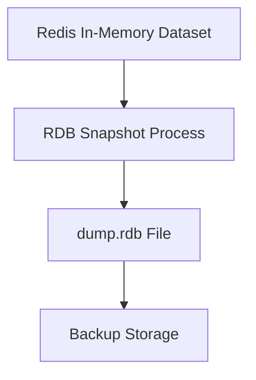
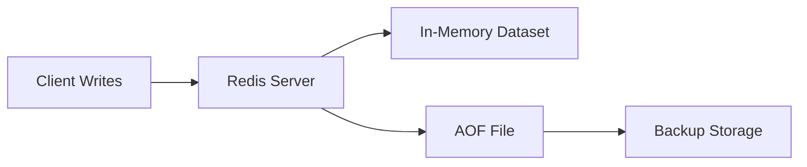
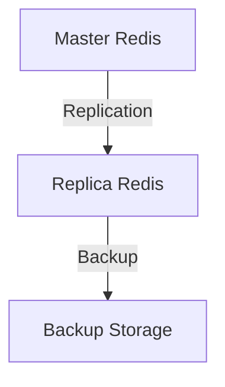

# Redis Backup

## Introduction

Data loss can be catastrophic for any application. For Redis servers storing critical data, implementing a robust backup strategy is essential. This guide explores various Redis backup approaches, helping you protect your data against hardware failures, human errors, or other unexpected events.

Redis, as an in-memory database, presents unique challenges for backup. Since data primarily lives in RAM, special consideration must be given to creating persistent backups that can survive server restarts or crashes.

## Why Backup Redis?

Before diving into the how, let's understand why Redis backups are crucial:

- **Disaster recovery**: Recover from server crashes, power outages, or hardware failures
- **Data migration**: Move data between Redis instances or environments
- **Point-in-time recovery**: Restore data to a specific moment in time
- **Protection against mistakes**: Recover from accidental data modification or deletion

## Redis Persistence Options

Redis offers built-in persistence mechanisms that form the foundation of many backup strategies:

### RDB (Redis Database File)

RDB creates point-in-time snapshots of your dataset at specified intervals.



**Configuring RDB**:

```
# In redis.conf
save 900 1      # Save if at least 1 key changed in 900 seconds
save 300 10     # Save if at least 10 keys changed in 300 seconds
save 60 10000   # Save if at least 10000 keys changed in 60 seconds
dbfilename dump.rdb
dir /var/lib/redis    # Directory where RDB file is saved
```

**Pros**:
- Compact single-file backups
- Minimal impact on performance
- Perfect for point-in-time recovery
- Faster restart with large datasets

**Cons**:
- Potential for data loss between snapshots
- Fork operation can be resource-intensive on large datasets

### AOF (Append Only File)

AOF logs every write operation received by the server, allowing for complete data recovery.



**Configuring AOF**:

```
# In redis.conf
appendonly yes
appendfilename "appendonly.aof"
appendfsync everysec  # Options: always, everysec, no
```

**Pros**:
- Minimal data loss (as low as 1 second with default settings)
- Automatic rewrites to prevent unlimited growth
- Human-readable format

**Cons**:
- Larger file size compared to RDB
- Can be slower for restarts with large datasets
- Slightly impacts write performance with most durable settings

## Backup Strategies

### Strategy 1: Using RDB Snapshots

The simplest way to back up Redis is to copy the RDB file to a secure location.

#### Manual RDB Snapshot

You can trigger RDB snapshots manually using the `SAVE` or `BGSAVE` commands:

```
# Blocking save operation (not recommended in production)
redis-cli SAVE

# Non-blocking background save
redis-cli BGSAVE
```

#### Example Backup Script

```bash
#!/bin/bash

# Configuration
REDIS_HOST="localhost"
REDIS_PORT="6379"
REDIS_PASSWORD="your_password"
BACKUP_DIR="/path/to/backups"
DATE=$(date +%Y%m%d%H%M%S)
RETENTION_DAYS=7

# Create backup directory if it doesn't exist
mkdir -p $BACKUP_DIR

# Trigger RDB backup
redis-cli -h $REDIS_HOST -p $REDIS_PORT -a $REDIS_PASSWORD BGSAVE

# Wait for the backup to complete
sleep 10

# Get the Redis data directory
REDIS_DIR=$(redis-cli -h $REDIS_HOST -p $REDIS_PORT -a $REDIS_PASSWORD CONFIG GET dir | grep -v dir)

# Copy the dump.rdb file to the backup directory
cp $REDIS_DIR/dump.rdb $BACKUP_DIR/redis-backup-$DATE.rdb

# Compress the backup
gzip $BACKUP_DIR/redis-backup-$DATE.rdb

# Remove backups older than RETENTION_DAYS
find $BACKUP_DIR -name "redis-backup-*.rdb.gz" -mtime +$RETENTION_DAYS -delete

echo "Backup completed: $BACKUP_DIR/redis-backup-$DATE.rdb.gz"
```

### Strategy 2: Using AOF for Continuous Backup

AOF provides a continuous log of operations, reducing the risk of data loss.

#### Backing Up AOF Files

```bash
#!/bin/bash

# Configuration
REDIS_HOST="localhost"
REDIS_PORT="6379"
REDIS_PASSWORD="your_password"
BACKUP_DIR="/path/to/backups"
DATE=$(date +%Y%m%d%H%M%S)
RETENTION_DAYS=7

# Create backup directory if it doesn't exist
mkdir -p $BACKUP_DIR

# Get the Redis data directory
REDIS_DIR=$(redis-cli -h $REDIS_HOST -p $REDIS_PORT -a $REDIS_PASSWORD CONFIG GET dir | grep -v dir)

# Copy the AOF file to the backup directory
cp $REDIS_DIR/appendonly.aof $BACKUP_DIR/redis-aof-backup-$DATE.aof

# Compress the backup
gzip $BACKUP_DIR/redis-aof-backup-$DATE.aof

# Remove backups older than RETENTION_DAYS
find $BACKUP_DIR -name "redis-aof-backup-*.aof.gz" -mtime +$RETENTION_DAYS -delete

echo "AOF Backup completed: $BACKUP_DIR/redis-aof-backup-$DATE.aof.gz"
```

### Strategy 3: Combined RDB and AOF

Redis can use both persistence methods simultaneously for comprehensive protection.

```
# In redis.conf
appendonly yes
save 900 1
save 300 10
save 60 10000
```

This approach gives you:
- RDB snapshots for point-in-time recovery and efficient restarts
- AOF for minimal data loss between snapshots

### Strategy 4: Redis Replication for Backup

You can use a Redis replica (slave) server primarily for backup purposes.



**Setting up a backup replica**:

1. Configure the replica server:

```
# In the replica's redis.conf
replicaof master_ip master_port
replica-read-only yes
```

2. Take backups from the replica to avoid impacting primary server performance:

```bash
#!/bin/bash

# Configuration for backup from replica
REPLICA_HOST="replica_server"
REPLICA_PORT="6379"
BACKUP_DIR="/path/to/backups"
DATE=$(date +%Y%m%d%H%M%S)

# Create RDB snapshot on replica
redis-cli -h $REPLICA_HOST -p $REPLICA_PORT BGSAVE

# Wait for backup to complete
sleep 10

# Get Redis data directory
REDIS_DIR=$(redis-cli -h $REPLICA_HOST -p $REPLICA_PORT CONFIG GET dir | grep -v dir)

# Copy and compress backup
cp $REDIS_DIR/dump.rdb $BACKUP_DIR/redis-backup-$DATE.rdb
gzip $BACKUP_DIR/redis-backup-$DATE.rdb

echo "Backup from replica completed: $BACKUP_DIR/redis-backup-$DATE.rdb.gz"
```

## Using Redis-CLI for Backup

Redis provides a built-in method to create backups using `redis-cli`:

```bash
redis-cli --rdb /path/to/backup.rdb
```

This command connects to Redis (default: localhost:6379) and generates an RDB file at the specified location.

For a remote Redis server:

```bash
redis-cli -h redis.example.com -p 6379 -a password --rdb /path/to/backup.rdb
```

## Automated Backup Solutions

### Scheduled Backups with Cron

Set up regular backups using cron jobs:

```bash
# Edit crontab
crontab -e

# Add a daily backup at 2 AM
0 2 * * * /path/to/backup_script.sh >> /var/log/redis-backup.log 2>&1
```

### Cloud Provider Backup Services

Many cloud providers offer managed Redis services with integrated backup solutions:

- **AWS ElastiCache**: Automatic backups with customizable retention
- **Azure Cache for Redis**: Scheduled backups to Azure Storage
- **Google Cloud Memorystore**: On-demand and automatic backup options

## Restoring Redis Backups

### Restoring from RDB Files

1. Stop the Redis server:
   ```bash
   sudo systemctl stop redis
   ```

2. Replace the dump.rdb file:
   ```bash
   cp /path/to/backup.rdb /var/lib/redis/dump.rdb
   sudo chown redis:redis /var/lib/redis/dump.rdb
   ```

3. Restart Redis:
   ```bash
   sudo systemctl start redis
   ```

### Restoring from AOF Files

1. Stop the Redis server:
   ```bash
   sudo systemctl stop redis
   ```

2. Replace the appendonly.aof file:
   ```bash
   cp /path/to/backup.aof /var/lib/redis/appendonly.aof
   sudo chown redis:redis /var/lib/redis/appendonly.aof
   ```

3. Restart Redis:
   ```bash
   sudo systemctl start redis
   ```

## Best Practices for Redis Backup

1. **Test your backups**: Regularly verify that backups can be successfully restored
2. **Store backups offsite**: Keep copies in different geographic locations
3. **Automate the process**: Use scripts and scheduled jobs for consistent backups
4. **Monitor backup jobs**: Set up alerts for backup failures
5. **Document restoration procedures**: Create step-by-step guides for recovery scenarios
6. **Consider Redis memory usage**: Schedule backups during low-traffic periods
7. **Implement backup rotation**: Keep backups for different time frames (daily, weekly, monthly)
8. **Encrypt sensitive backups**: Protect data with appropriate encryption
9. **Implement version control**: Keep track of backup versions and changes

## Monitoring Backup Status

You can check the status of the last successful RDB save using the `INFO` command:

```
redis-cli INFO Persistence
```

This will show output like:

```
# Persistence
loading:0
rdb_changes_since_last_save:0
rdb_bgsave_in_progress:0
rdb_last_save_time:1626782409
rdb_last_bgsave_status:ok
rdb_last_bgsave_time_sec:0
rdb_current_bgsave_time_sec:-1
rdb_last_cow_size:0
aof_enabled:1
aof_rewrite_in_progress:0
aof_rewrite_scheduled:0
aof_last_rewrite_time_sec:-1
aof_current_rewrite_time_sec:-1
aof_last_bgrewrite_status:ok
aof_last_write_status:ok
aof_last_cow_size:0
```

## Redis Backup in Containerized Environments

For Redis running in Docker or Kubernetes, special considerations apply:

### Docker Example

```bash
# Backup Redis running in a Docker container
docker exec redis redis-cli BGSAVE
docker cp redis:/data/dump.rdb /backup/redis-backup-$(date +%Y%m%d%H%M%S).rdb
```

### Kubernetes Example

```bash
# Get pod name
REDIS_POD=$(kubectl get pods -l app=redis -o jsonpath='{.items[0].metadata.name}')

# Trigger backup
kubectl exec $REDIS_POD -- redis-cli BGSAVE

# Copy backup file
kubectl cp $REDIS_POD:/data/dump.rdb ./redis-backup-$(date +%Y%m%d%H%M%S).rdb
```

## Summary

Redis backup is a critical aspect of database administration that ensures data safety and business continuity. This guide covered:

- Native Redis persistence mechanisms: RDB and AOF
- Various backup strategies using these persistence options
- Practical scripts for automating the backup process
- Restoration procedures to recover from data loss
- Best practices for maintaining a robust backup strategy

By implementing a well-planned Redis backup strategy, you can protect your data against unexpected failures and ensure that your applications remain resilient.

## Exercises

1. Set up a Redis server with both RDB and AOF persistence enabled.
2. Create a backup script that triggers a BGSAVE and copies the RDB file to a backup directory.
3. Configure a cron job to execute your backup script daily.
4. Simulate a failure by renaming the original Redis data files and practice restoring from your backups.
5. Implement a replica Redis server and configure it to be used for backups instead of the master.

## Additional Resources

- [Redis Persistence Documentation](https://redis.io/topics/persistence)
- [Redis Replication Documentation](https://redis.io/topics/replication)
- [Redis Security](https://redis.io/topics/security)
- [Redis Administration](https://redis.io/topics/admin)