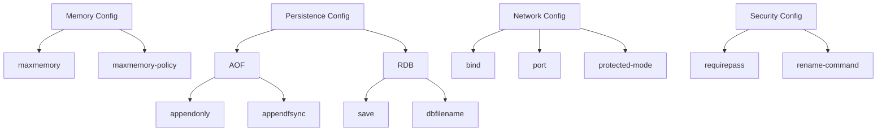

# Redis Configuration Management

## Introduction

Redis is a powerful, open-source, in-memory data structure store that can be used as a database, cache, message broker, and more. One of the key aspects of Redis administration is proper configuration management, which directly impacts performance, security, and reliability.

In this guide, we'll explore how to effectively manage Redis configurations, from basic settings to advanced options, helping you optimize your Redis instances for your specific use cases.

## Understanding the Redis Configuration File

Redis configurations are stored in a text file called `redis.conf`. This file contains various parameters that control Redis behavior.

### Finding the Configuration File

By default, Redis looks for a configuration file in the following locations:

```bash
/etc/redis/redis.conf
/etc/redis.conf
/usr/local/etc/redis/redis.conf
/usr/local/etc/redis.conf
```

You can also specify a custom configuration file location when starting Redis:

```bash
redis-server /path/to/your/redis.conf
```

### Basic Configuration File Structure

The Redis configuration file is structured with directives in the format:

```
directive value
```

For example:

```
port 6379
```

Comments in the configuration file start with `#`:

```
# This is a comment
port 6379  # This is also a comment
```

## Essential Configuration Parameters

Let's explore the most important configuration parameters every Redis administrator should know:

### Network Settings

```
# Binding to specific interfaces
bind 127.0.0.1 ::1

# Port to listen on
port 6379

# TCP backlog
tcp-backlog 511

# Timeout in seconds
timeout 0

# TCP keepalive
tcp-keepalive 300
```

### Memory Management

```
# Maximum memory Redis can use
maxmemory 2gb

# Eviction policy when max memory is reached
maxmemory-policy allkeys-lru

# Sample size for eviction
maxmemory-samples 5
```

The eviction policies include:
- `noeviction`: Return errors when memory limit is reached
- `allkeys-lru`: Evict any key using LRU algorithm
- `volatile-lru`: Evict keys with expiration set using LRU
- `allkeys-random`: Evict random keys
- `volatile-random`: Evict random keys with expiration set
- `volatile-ttl`: Evict keys with expiration set and shortest TTL

### Persistence Options

```
# Save RDB snapshots
save 900 1
save 300 10
save 60 10000

# RDB filename
dbfilename dump.rdb

# Directory for RDB files
dir ./

# AOF configuration
appendonly yes
appendfilename "appendonly.aof"
appendfsync everysec
```

### Security Settings

```
# Require password
requirepass YourStrongPasswordHere

# Rename dangerous commands
rename-command FLUSHALL ""
rename-command FLUSHDB ""
rename-command CONFIG ""
```

## Modifying Configuration at Runtime

Redis provides two ways to modify configuration at runtime:

### Using CONFIG SET Command

You can change most configuration parameters without restarting Redis using the `CONFIG SET` command:

```
redis-cli> CONFIG SET maxmemory 4gb
OK
```

### Persisting Runtime Changes

To save runtime configuration changes to the configuration file:

```
redis-cli> CONFIG REWRITE
OK
```

Let's see a practical example:

```bash
# Connect to Redis
$ redis-cli

# Check current maxmemory
127.0.0.1:6379> CONFIG GET maxmemory
1) "maxmemory"
2) "0"

# Set new maxmemory value
127.0.0.1:6379> CONFIG SET maxmemory 1gb
OK

# Verify the change
127.0.0.1:6379> CONFIG GET maxmemory
1) "maxmemory"
2) "1073741824"

# Save changes to configuration file
127.0.0.1:6379> CONFIG REWRITE
OK
```

## Advanced Configuration Options

### Tuning for Performance

```
# Disable expensive commands in production
rename-command KEYS ""

# Set number of databases
databases 16

# Set limits on clients
maxclients 10000

# Enable threaded I/O
io-threads 4
```

### Configuring Redis for High Availability

```
# Replication configuration (for replica nodes)
replicaof 192.168.1.1 6379
replica-read-only yes

# Set replica priority (lower number means higher priority)
replica-priority 100

# Minimum number of replicas to write
min-replicas-to-write 1
min-replicas-max-lag 10
```

## Real-World Configuration Examples

Let's look at some real-world Redis configuration scenarios:

### Cache-Only Redis

```
maxmemory 4gb
maxmemory-policy allkeys-lru
save ""  # Disable persistence
appendonly no
```

This configuration is optimized for use as a cache, with no persistence and automatic eviction of least recently used keys when memory is full.

### Redis as a Persistent Store

```
maxmemory 8gb
maxmemory-policy noeviction
save 900 1
save 300 10
save 60 10000
appendonly yes
appendfsync everysec
```

This configuration prioritizes data safety with both RDB and AOF persistence enabled.

### Redis in High-Traffic Production

```
maxmemory 16gb
maxmemory-policy volatile-lru
bind 10.0.0.5
protected-mode yes
requirepass StrongPasswordHere
save 900 1
appendonly yes
appendfsync everysec
no-appendfsync-on-rewrite yes
auto-aof-rewrite-percentage 100
auto-aof-rewrite-min-size 64mb
```

This configuration balances performance and data safety in a high-traffic environment.

## Monitoring Redis Configuration

You can view all current configuration settings using the `CONFIG GET` command:

```
# Get all configurations
redis-cli> CONFIG GET *

# Get specific configuration
redis-cli> CONFIG GET maxmemory
```

It's also useful to understand how Redis reports its own configuration status:

```
# Get Redis info including memory usage
redis-cli> INFO memory
```

## Visualizing Configuration Dependencies

Configuration parameters often have relationships with each other. Here's a diagram showing some key dependencies:



## Troubleshooting Common Configuration Issues

### High Memory Usage

If Redis is using more memory than expected:

1. Check your `maxmemory` setting
2. Review your eviction policy
3. Look for memory leaks in your application
4. Consider using Redis memory analysis tools:

```bash
redis-cli> MEMORY DOCTOR
```

### Slow Performance

If Redis performance is degrading:

1. Check for expensive commands (`KEYS`, `SMEMBERS` on large sets)
2. Review persistence settings
3. Check for network issues
4. Optimize client connection patterns

```bash
# Monitor Redis commands in real-time
redis-cli> MONITOR

# Check latency
redis-cli --latency
```

## Best Practices for Redis Configuration

1. **Always use a configuration file** - Don't rely on defaults
2. **Set appropriate memory limits** - Prevent Redis from swapping
3. **Choose the right eviction policy** - Based on your use case
4. **Secure your Redis instance** - Always use `protected-mode` and `requirepass`
5. **Tune persistence for your needs** - Balance between performance and data safety
6. **Regularly back up your configuration file**
7. **Document your configuration choices**
8. **Use version control for tracking configuration changes**

## Summary

Effective Redis configuration management is crucial for building reliable, high-performance applications. By understanding and properly configuring Redis parameters, you can optimize for your specific use cases, whether you're using Redis as a cache, database, or message broker.

Key takeaways:
- Redis configuration directly impacts performance, security, and reliability
- Most settings can be modified at runtime using `CONFIG SET`
- Different use cases require different configuration approaches
- Regular monitoring and adjustment of configurations is essential

## Additional Resources and Exercises

### Resources

- [Official Redis Configuration Documentation](https://redis.io/topics/config)
- [Redis Administration Guide](https://redis.io/topics/admin)
- [Redis Persistence Guide](https://redis.io/topics/persistence)

### Exercises

1. Set up Redis with different persistence options and benchmark the performance difference
2. Experiment with different memory policies and observe eviction behavior
3. Create a monitoring script that alerts when Redis configuration drifts from expected values
4. Compare memory usage with different data types and configurations
5. Practice upgrading Redis versions while maintaining your configuration

By mastering Redis configuration management, you'll be well-equipped to handle the diverse requirements of modern applications while ensuring optimal performance and reliability.