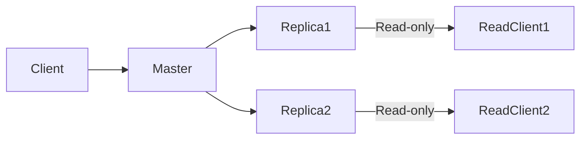
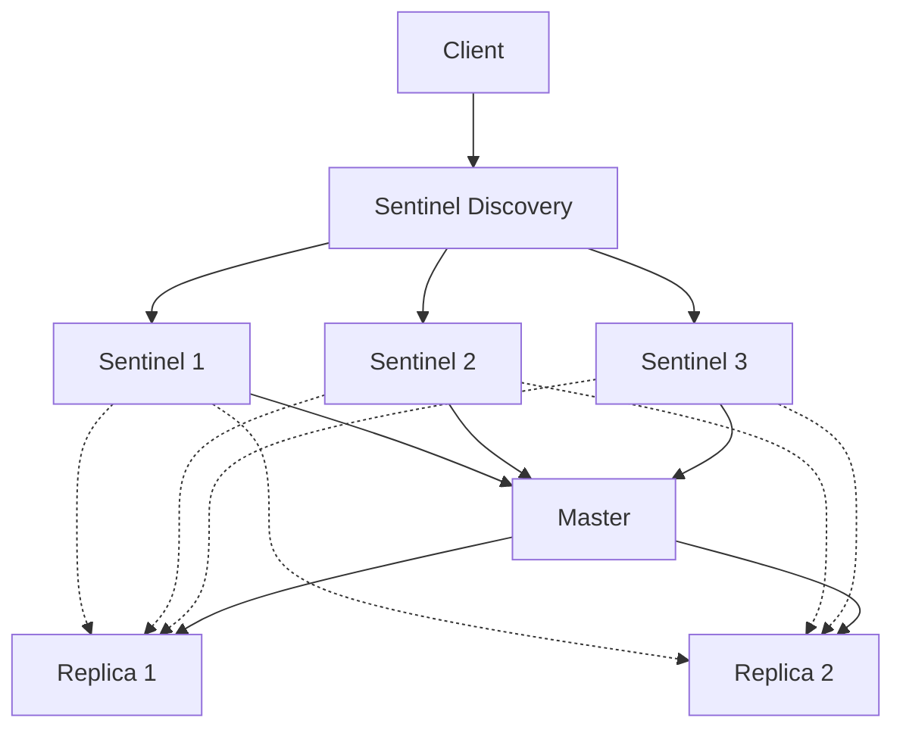
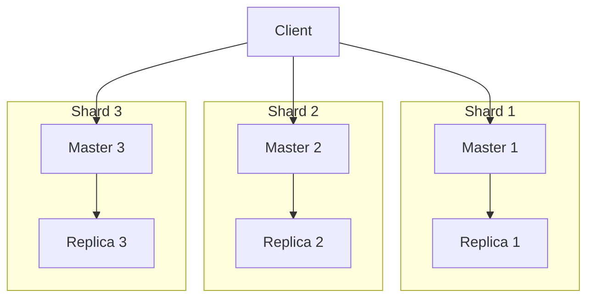

# Redis Disaster Recovery

## Introduction

Disaster recovery (DR) is a critical aspect of any production-grade Redis deployment. When you're using Redis in production environments, having a solid disaster recovery plan ensures that your data remains safe and your services stay operational even when unexpected failures occur.

In this guide, we'll explore various strategies, tools, and best practices for implementing effective disaster recovery for Redis. We'll cover everything from basic backup approaches to advanced high-availability configurations, making sure you're well-equipped to protect your Redis data against potential disasters.

## Why Redis Disaster Recovery Matters

Redis is often used to store crucial data like:

- Session information
- Caching layers for applications
- Real-time analytics
- Message queues
- Rate limiting data

Losing this data or experiencing extended downtime can have significant impacts on your application's functionality and user experience. That's why implementing proper disaster recovery mechanisms is essential.

## Key Concepts in Redis Disaster Recovery

Before diving into specific strategies, let's understand some fundamental concepts:

### RTO and RPO

- **Recovery Time Objective (RTO)**: The maximum acceptable time to restore the system after a failure
- **Recovery Point Objective (RPO)**: The maximum acceptable amount of data loss measured in time

These metrics help you define your disaster recovery requirements. For critical systems, you might aim for near-zero RPO (minimal data loss) and very low RTO (quick recovery).

## Basic Redis Backup Strategies

### Method 1: RDB Snapshots

Redis Database (RDB) snapshots create point-in-time binary copies of your Redis dataset.

**Configuration in redis.conf:**

```bash
save 900 1      # Save if at least 1 key changed in 900 seconds (15 minutes)
save 300 10     # Save if at least 10 keys changed in 300 seconds (5 minutes)
save 60 10000   # Save if at least 10000 keys changed in 60 seconds (1 minute)
```

**Manual triggering:**

```bash
redis-cli> SAVE      # Synchronous, blocks Redis until complete
redis-cli> BGSAVE    # Asynchronous, forks a background process
```

**Pros:**
- Compact single-file format
- Perfect for point-in-time backups
- Low overhead during normal operation

**Cons:**
- Potential data loss between snapshots
- Blocking if using SAVE command
- Fork operation can be memory-intensive on large datasets

### Method 2: AOF (Append-Only File)

The Append-Only File logs every write operation received by the server, enabling reconstruction of the dataset by replaying the operations.

**Configuration in redis.conf:**

```bash
appendonly yes
appendfsync everysec  # Options: always, everysec, no
```

**Pros:**
- Better durability than RDB
- Various sync options for balancing performance and safety
- Automatic rewrite to optimize size

**Cons:**
- Larger file size compared to RDB
- Slower restart time due to command replay
- Potential performance impact with frequent syncing

### Combined Approach

For optimal protection, you can enable both RDB and AOF:

```bash
appendonly yes
save 900 1
save 300 10
save 60 10000
```

### Automating External Backups

It's crucial to move backup files off the Redis server for true disaster recovery.

**Example Backup Script:**

```bash
#!/bin/bash

# Configuration
REDIS_HOST="localhost"
REDIS_PORT="6379"
BACKUP_DIR="/var/backups/redis"
DATE=$(date +%Y%m%d%H%M)

# Create backup directory if it doesn't exist
mkdir -p $BACKUP_DIR

# Trigger BGSAVE
redis-cli -h $REDIS_HOST -p $REDIS_PORT BGSAVE

# Wait for BGSAVE to complete
while [ "$(redis-cli -h $REDIS_HOST -p $REDIS_PORT info persistence | grep rdb_bgsave_in_progress | cut -d: -f2 | tr -d '[:space:]')" != "0" ]; do
  sleep 1
done

# Copy RDB file to backup directory
cp /var/lib/redis/dump.rdb $BACKUP_DIR/dump-$DATE.rdb

# Compress the backup
gzip $BACKUP_DIR/dump-$DATE.rdb

# Optional: Move to offsite storage
# aws s3 cp $BACKUP_DIR/dump-$DATE.rdb.gz s3://my-redis-backups/
```

## Redis Replication for Disaster Recovery

Replication creates copies of your Redis dataset on multiple servers, providing redundancy and protection.

### Setting Up Basic Replication

**On the replica server (redis.conf):**

```bash
replicaof master_ip master_port
```

Or dynamically:

```bash
redis-cli> REPLICAOF master_ip master_port
```

### Verifying Replication Status

```bash
redis-cli> INFO replication
```

Example output:

```
# Replication
role:slave
master_host:192.168.1.100
master_port:6379
master_link_status:up
master_last_io_seconds_ago:5
master_sync_in_progress:0
...
```

### Replication Diagram



## High Availability with Redis Sentinel

Redis Sentinel provides high availability through automatic failover when the master becomes unavailable.

### Basic Sentinel Configuration (sentinel.conf)

```bash
port 26379
sentinel monitor mymaster 192.168.1.100 6379 2
sentinel down-after-milliseconds mymaster 5000
sentinel failover-timeout mymaster 60000
```

### Sentinel in Action



### Automatic Failover Process

1. Sentinels detect the master is down
2. Sentinels agree on the failure (quorum)
3. They select a replica to promote
4. The selected replica is promoted to master
5. Other replicas are reconfigured to use the new master
6. The old master, when back online, becomes a replica

## Redis Cluster for Sharded High Availability

For larger deployments, Redis Cluster provides both high availability and data sharding.

### Basic Cluster Configuration (redis.conf)

```bash
port 7000
cluster-enabled yes
cluster-config-file nodes.conf
cluster-node-timeout 5000
```

### Creating a Cluster

```bash
redis-cli --cluster create 127.0.0.1:7000 127.0.0.1:7001 127.0.0.1:7002 \
  127.0.0.1:7003 127.0.0.1:7004 127.0.0.1:7005 --cluster-replicas 1
```

This creates a cluster with 3 masters and 3 replicas (one replica per master).

### Cluster Architecture



## Disaster Recovery Procedures

### Scenario 1: Recovering from RDB Snapshot

Let's say your Redis server has crashed and the data directory is corrupted. Here's how to recover using an RDB backup:

```bash
# Stop Redis if it's running
sudo systemctl stop redis

# Replace the corrupted dump.rdb with the backup
sudo cp /var/backups/redis/dump-20230401.rdb.gz /var/lib/redis/
sudo gunzip /var/lib/redis/dump-20230401.rdb.gz
sudo mv /var/lib/redis/dump-20230401.rdb /var/lib/redis/dump.rdb
sudo chown redis:redis /var/lib/redis/dump.rdb

# Start Redis
sudo systemctl start redis

# Verify data was restored
redis-cli> KEYS *
```

### Scenario 2: Manual Failover with Sentinel

You can trigger a manual failover for maintenance:

```bash
redis-cli -p 26379 
sentinel> SENTINEL failover mymaster
```

### Scenario 3: Recovering a Redis Cluster

If a node in your Redis Cluster fails permanently:

```bash
# Add a new node
redis-cli --cluster add-node 127.0.0.1:7006 127.0.0.1:7000

# If it was a master, assign slots to the new node
redis-cli --cluster reshard 127.0.0.1:7000
```

## Testing Your Disaster Recovery Plan

A DR plan is only as good as its testing. Here's a simple checklist:

1. **Regular test restores**: Schedule periodic test restores from backups
2. **Simulated failures**: Occasionally simulate node failures in non-production environments
3. **Documented procedures**: Keep step-by-step recovery procedures updated
4. **Recovery time measurement**: Track RTO and RPO metrics during tests
5. **Staff training**: Ensure team members are familiar with recovery procedures

### Example Test Script

```bash
#!/bin/bash

# Start timing
START_TIME=$(date +%s)

# Simulate catastrophic failure
sudo systemctl stop redis
sudo rm /var/lib/redis/dump.rdb

# Perform recovery procedure
sudo cp /var/backups/redis/dump-latest.rdb.gz /var/lib/redis/
sudo gunzip /var/lib/redis/dump-latest.rdb.gz
sudo mv /var/lib/redis/dump-latest.rdb /var/lib/redis/dump.rdb
sudo chown redis:redis /var/lib/redis/dump.rdb
sudo systemctl start redis

# End timing
END_TIME=$(date +%s)
RECOVERY_TIME=$((END_TIME - START_TIME))

echo "Recovery completed in $RECOVERY_TIME seconds"

# Verify data integrity
KEYS_COUNT=$(redis-cli DBSIZE)
echo "Database has $KEYS_COUNT keys after recovery"
```

## Best Practices for Redis Disaster Recovery

1. **Multiple backup methods**: Use both RDB and AOF for comprehensive protection
2. **Offsite backups**: Store backups in geographically separate locations
3. **Regular testing**: Test your recovery procedures frequently
4. **Monitoring**: Implement monitoring to detect issues before they become disasters
5. **Documentation**: Maintain clear, step-by-step recovery procedures
6. **Automation**: Automate backup processes and basic recovery steps
7. **Security**: Encrypt backups containing sensitive data
8. **Versioning**: Keep multiple backup versions to guard against corruption
9. **Cross-region replication**: For cloud deployments, replicate across regions
10. **Regular training**: Ensure your team knows the recovery procedures

## Monitoring Redis for Potential Issues

Proactive monitoring can help identify potential problems before they cause disasters:

```bash
# Monitor memory usage
redis-cli> INFO memory

# Check persistence status
redis-cli> INFO persistence

# Monitor replication lag
redis-cli> INFO replication
```

Consider using tools like Prometheus with Redis Exporter and Grafana for comprehensive monitoring.

## Summary

Disaster recovery for Redis involves a combination of backup strategies, replication, and high-availability setups. By implementing a comprehensive DR plan that includes regular backups, replication, sentinel or cluster configurations, and thorough testing, you can ensure your Redis deployment remains resilient in the face of unexpected failures.

The key components to remember are:

- Regular backups (RDB, AOF, or both)
- Replication for redundancy
- Sentinel or Cluster for high availability
- Clear recovery procedures
- Regular testing and monitoring

By following these practices, you'll significantly reduce both the likelihood and impact of Redis-related disasters.

## Further Resources

- [Redis Documentation on Persistence](https://redis.io/docs/management/persistence/)
- [Redis Replication Guide](https://redis.io/docs/management/replication/)
- [Redis Sentinel Documentation](https://redis.io/docs/management/sentinel/)
- [Redis Cluster Tutorial](https://redis.io/docs/management/scaling/)

## Practice Exercises

1. Set up a Redis instance with both RDB and AOF persistence enabled. Create a script to perform automated backups every hour.
2. Configure a master-replica setup with two Redis instances and test the failover process manually.
3. Set up a three-node Redis Sentinel system and trigger a manual failover.
4. Create a comprehensive disaster recovery plan for a hypothetical e-commerce application using Redis for session management and caching.
5. Set up a monitoring system for Redis using Prometheus and Grafana, with alerts for replication issues and memory problems.