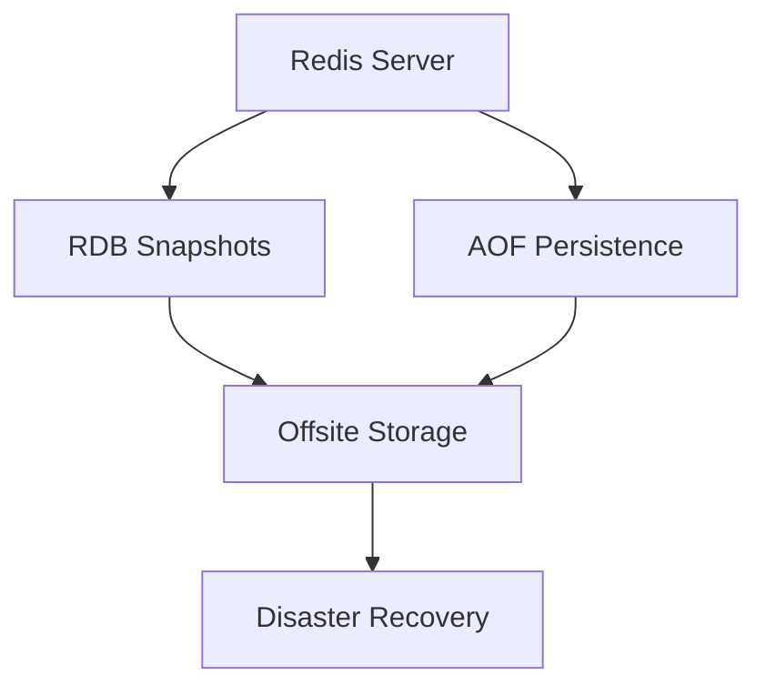
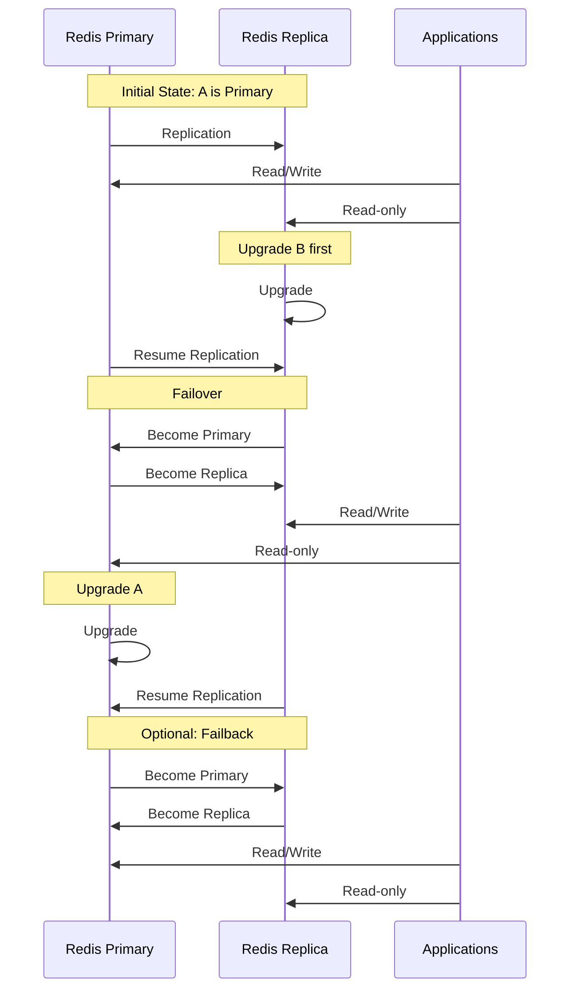

# Redis Maintenance

## Introduction

Redis is an in-memory data structure store that serves as a database, cache, and message broker. Despite its robust design, Redis requires regular maintenance to ensure optimal performance, data integrity, and availability. This guide walks you through essential Redis maintenance tasks that every administrator should know.

Proper maintenance of your Redis instances helps prevent data loss, ensures high availability, and optimizes performance for your applications. Whether you're running Redis in development or production environments, these maintenance practices will help you keep your Redis deployments healthy.

## Regular Backups

### Why Backups Matter

Redis primarily stores data in memory, making it vulnerable to data loss during unexpected shutdowns or server failures. Regular backups are your safety net against such scenarios.

### RDB Snapshots

Redis Database (RDB) snapshots create point-in-time copies of your dataset.

```bash
# Manual RDB snapshot
redis-cli SAVE
```

You can also configure automatic snapshots in your `redis.conf` file:

```
save 900 1      # Save if at least 1 key changes in 900 seconds (15 minutes)
save 300 10     # Save if at least 10 keys change in 300 seconds (5 minutes)
save 60 10000   # Save if at least 10000 keys change in 60 seconds
```

### AOF (Append-Only File)

The AOF persistence logs every write operation, allowing for complete data recovery.

Enable AOF in your `redis.conf`:

```
appendonly yes
appendfsync everysec  # Sync every second (balanced option)
```

You can trigger an AOF rewrite to optimize file size:

```bash
redis-cli BGREWRITEAOF
```

### Implementing Backup Strategies

For critical environments, combine both RDB and AOF for maximum protection:



Create a backup script that runs periodically:

```bash
#!/bin/bash
# Example backup script
DATE=$(date +%Y%m%d_%H%M%S)
BACKUP_DIR="/path/to/backups"

# Create backup directory if it doesn't exist
mkdir -p $BACKUP_DIR

# Trigger a Redis snapshot
redis-cli SAVE

# Copy the RDB file
cp /var/lib/redis/dump.rdb $BACKUP_DIR/redis_backup_$DATE.rdb

# Compress the backup
gzip $BACKUP_DIR/redis_backup_$DATE.rdb

# Delete backups older than 30 days
find $BACKUP_DIR -name "redis_backup_*.rdb.gz" -mtime +30 -delete
```

## Monitoring Redis

### Key Metrics to Watch

Regular monitoring helps identify issues before they become critical:

1. **Memory Usage**: Redis is memory-bound, so monitoring memory is crucial
2. **CPU Usage**: High CPU can indicate inefficient operations
3. **Network Bandwidth**: Monitor for network bottlenecks
4. **Client Connections**: Track connection patterns and limits
5. **Operation Throughput**: Monitor commands per second
6. **Latency**: Ensure response times stay low

### Using INFO Command

The `INFO` command provides comprehensive statistics:

```bash
redis-cli INFO
```

For specific sections:

```bash
redis-cli INFO memory
redis-cli INFO clients
redis-cli INFO stats
```

Sample output:

```
# Memory
used_memory:1032216
used_memory_human:1008.02K
used_memory_rss:1568768
used_memory_rss_human:1.50M
...
```

### Monitoring Tools

Several tools can help with Redis monitoring:

1. **Redis-cli**: Built-in monitoring with `MONITOR` command (use sparingly in production)
2. **Redis Sentinel**: For monitoring Redis instances
3. **Prometheus + Grafana**: For comprehensive monitoring dashboards
4. **Redis Exporter**: To expose Redis metrics in Prometheus format

Setting up a basic dashboard can help visualize important metrics:

```bash
# Install Prometheus Redis Exporter
docker run -d --name redis-exporter -p 9121:9121 oliver006/redis_exporter

# Add to your Prometheus configuration
- job_name: 'redis'
  static_configs:
  - targets: ['redis-exporter:9121']
```

## Performance Tuning

### Memory Optimization

Redis performance is heavily dependent on memory management:

1. **Set Appropriate maxmemory**:

```
maxmemory 2gb
maxmemory-policy allkeys-lru  # Removes least recently used keys when memory is full
```

2. **Use Specialized Data Structures**:

Replace large hashes with more efficient data structures:

```redis
# Instead of storing an entire object in one hash
HMSET user:1000 username "johndoe" email "john@example.com" visits 10

# Consider splitting into smaller structures
SET user:1000:username "johndoe"
SET user:1000:email "john@example.com"
SET user:1000:visits 10
```

### Connection Tuning

Optimize client connections for better performance:

```
timeout 300                 # Close idle connections after 300 seconds
tcp-keepalive 60            # TCP keepalive packets every 60 seconds
maxclients 10000            # Maximum number of client connections
```

### Benchmarking Your Setup

Use the `redis-benchmark` tool to test performance:

```bash
# Basic benchmark
redis-benchmark -q -n 100000

# Testing specific commands
redis-benchmark -t set,get -n 100000 -q

# Simulating multiple clients
redis-benchmark -c 50 -n 100000 -q
```

Sample output:

```
SET: 92592.59 requests per second
GET: 94339.62 requests per second
LPUSH: 90909.09 requests per second
LPOP: 90909.09 requests per second
```

## Redis Maintenance Schedule

Establish a regular maintenance schedule:

| Frequency | Task |
|-----------|------|
| Daily | Check server health using INFO command |
| Daily | Verify backup completion |
| Weekly | Review logs for errors or warnings |
| Weekly | Analyze memory usage patterns |
| Monthly | Test backup restoration process |
| Monthly | Benchmark performance |
| Quarterly | Review Redis configuration |
| Bi-annually | Plan for version upgrades |

## Redis Security Maintenance

### Password Protection

Always set a strong Redis password:

```
requirepass YourStrongPasswordHere
```

To connect with a password:

```bash
redis-cli -a YourStrongPasswordHere
# Or after connecting
redis-cli
> AUTH YourStrongPasswordHere
```

### Network Security

Restrict Redis to listen only on certain interfaces:

```
bind 127.0.0.1 192.168.1.100
```

### Regular Security Audits

Periodically check for security issues:

1. Verify that Redis is not exposed to the internet
2. Ensure proper authentication is enabled
3. Review access control lists
4. Check for outdated Redis versions with security vulnerabilities

## Upgrading Redis

### Pre-Upgrade Checklist

Before upgrading Redis:

1. Back up all data
2. Review release notes for breaking changes
3. Test the upgrade in a staging environment
4. Schedule maintenance window
5. Prepare rollback plan

### Upgrade Process

A simple upgrade process might look like:

```bash
# Stop Redis
sudo systemctl stop redis

# Backup data
cp /var/lib/redis/dump.rdb /var/lib/redis/dump.rdb.backup

# Install new version
sudo apt update
sudo apt install redis-server

# Start Redis
sudo systemctl start redis

# Verify new version
redis-cli INFO | grep redis_version
```

For minimal downtime in production, consider using replication:



## Maintaining Redis Replication

### Setting Up Replication

Replication provides high availability and read scaling:

Primary config:
```
# No special config needed on primary
```

Replica config:
```
replicaof 192.168.1.100 6379
```

### Monitoring Replication

Check replication status:

```bash
redis-cli INFO replication
```

Sample output:
```
# Replication
role:master
connected_slaves:1
slave0:ip=192.168.1.101,port=6379,state=online,offset=1426,lag=0
...
```

### Handling Replication Issues

If replication breaks:

```bash
# On replica - check errors
redis-cli INFO stats | grep sync

# Restart replication if needed
redis-cli REPLICAOF NO ONE  # First detach
redis-cli REPLICAOF 192.168.1.100 6379  # Then reconnect
```

## Troubleshooting Common Issues

### Memory Issues

If Redis uses too much memory:

```bash
# Check memory usage
redis-cli INFO memory

# Find big keys
redis-cli --bigkeys

# Set memory limit if not already set
redis-cli CONFIG SET maxmemory 2gb
redis-cli CONFIG SET maxmemory-policy allkeys-lru
```

### Slow Commands

Identify slow operations:

```bash
# Enable slow log
redis-cli CONFIG SET slowlog-log-slower-than 10000  # Log commands taking > 10ms

# Check slow log
redis-cli SLOWLOG GET 10  # Get last 10 slow commands
```

Example output:
```
1) 1) (integer) 14  # Slow log entry ID
   2) (integer) 1612196799  # Timestamp
   3) (integer) 15220  # Execution time in microseconds
   4) 1) "KEYS"  # Command
      2) "*"  # Arguments
```

### Connection Issues

If clients can't connect:

```bash
# Check if Redis is running
redis-cli PING

# Check current connections
redis-cli CLIENT LIST | wc -l

# Check connection limit
redis-cli CONFIG GET maxclients
```

## Summary

Effective Redis maintenance involves:

1. Regular backups using RDB snapshots and AOF persistence
2. Continuous monitoring of key metrics
3. Performance tuning for memory and connections
4. Implementing security best practices
5. Following a structured maintenance schedule
6. Planning and executing safe upgrades
7. Maintaining healthy replication
8. Troubleshooting common issues proactively

By implementing these maintenance practices, you'll ensure that your Redis deployments remain reliable, performant, and secure.

## Additional Resources

- [Redis Official Documentation](https://redis.io/documentation)
- [Redis Administration Guide](https://redis.io/topics/admin)
- [Redis Persistence Guide](https://redis.io/topics/persistence)

## Exercises

1. Set up a Redis instance with both RDB and AOF persistence enabled.
2. Create a shell script to automate your Redis backup process.
3. Configure and test different `maxmemory-policy` settings to see their impact.
4. Set up a primary-replica configuration and practice failover scenarios.
5. Use `redis-benchmark` to compare performance with different client counts.