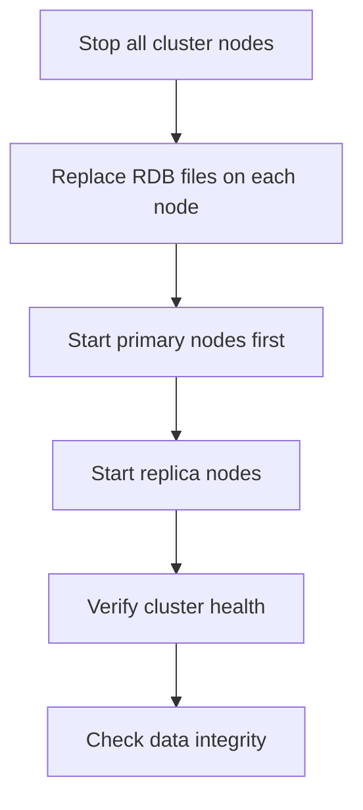

# Redis Restore

## Introduction

Data restoration is a critical aspect of database administration. In Redis, restoring data means bringing back your database to a previously saved state using backup files. This capability is essential for disaster recovery, migrating between environments, or reverting unwanted changes.

This guide will walk you through the Redis restore process, covering different restoration methods, common scenarios, and best practices to ensure your data can be reliably recovered when needed.

## Understanding Redis Restore

Redis restore operations allow you to rebuild your database from previously created backup files. These backups can be:

1. **RDB files** - Point-in-time snapshots of your database
2. **AOF files** - Logs of all write operations performed on the database
3. **Mixed backup approaches** combining both methods

Let's explore how to restore data from each of these backup types.

## Restoring from RDB Files

RDB (Redis Database Backup) files contain snapshots of your Redis dataset at specific points in time. They are compact, perfect for backups, and allow for fast restoration.

### Basic RDB Restore

To restore Redis from an RDB file, follow these steps:

1. Stop the Redis server (if running)
2. Copy your RDB file to the Redis working directory (usually named `dump.rdb`)
3. Start the Redis server

```bash
# Stop Redis server
sudo systemctl stop redis

# Copy backup to Redis working directory
cp /path/to/backup/dump.rdb /var/lib/redis/

# Set proper permissions
sudo chown redis:redis /var/lib/redis/dump.rdb

# Start Redis server
sudo systemctl start redis
```

### Verifying Restored Data

After restoration, connect to your Redis instance and verify that data was properly restored:

```bash
redis-cli
> AUTH your_password
> KEYS *
> GET sample_key
```

## Restoring from AOF Files

Append-Only Files (AOF) record every write operation received by the server. They provide better durability than RDB files, as they can be updated after each command, each second, or at custom intervals.

### AOF Restore Process

The process is similar to RDB restoration:

1. Stop the Redis server
2. Place your AOF file in the Redis working directory (typically named `appendonly.aof`)
3. Ensure Redis is configured to use AOF
4. Start the Redis server

```bash
# Stop Redis server
sudo systemctl stop redis

# Copy AOF backup
cp /path/to/backup/appendonly.aof /var/lib/redis/

# Set proper permissions
sudo chown redis:redis /var/lib/redis/appendonly.aof

# Start Redis server
sudo systemctl start redis
```

### Configuring Redis for AOF

Make sure your `redis.conf` has AOF enabled:

```
appendonly yes
appendfilename "appendonly.aof"
```

## Restoring to a Specific Point in Time

For more advanced recovery scenarios, you might need to restore to a specific point in time.

### Using Redis-PITR (Point-In-Time Recovery)

Redis doesn't natively support point-in-time recovery, but you can approximate it using a combination of RDB snapshots and AOF files:

```bash
# Stop Redis
sudo systemctl stop redis

# Copy the RDB file that predates your target recovery point
cp /backup/path/dump_20230301.rdb /var/lib/redis/dump.rdb

# Start Redis with AOF disabled to load the RDB
redis-server --appendonly no

# Once loaded, enable AOF and replay specific commands
# (This requires custom scripting to extract and replay specific commands)
```

## Redis Restore CLI Commands

Redis provides several CLI commands useful during restore operations:

### RESTORE Command

The `RESTORE` command can recreate a key from a serialized value:

```bash
# Syntax: RESTORE key ttl serialized-value [REPLACE] [ABSTTL] [IDLETIME seconds] [FREQ frequency]
redis-cli> RESTORE mykey 0 "\x00\x1c\x00\x00\x00\x12\x00\x00\x00\x03\x00\x00\xc0\x01\x00\x04\x00\xa0\x00\x00\x00\x02\x00\x00\x00\x15\x00\x00\x00\x0fHello, Redis!" REPLACE
```

This is useful for programmatically restoring specific keys rather than entire databases.

### CONFIG Commands for Restore Operations

These commands let you modify Redis configuration during restore:

```bash
# Set directory for RDB/AOF files
redis-cli> CONFIG SET dir /var/lib/redis

# Set RDB filename
redis-cli> CONFIG SET dbfilename dump.rdb

# Force saving of RDB file after restore verification
redis-cli> SAVE
```

## Practical Restore Scenarios

Let's explore common real-world scenarios where you need to perform restore operations.

### Scenario 1: Disaster Recovery

Imagine your production Redis server has crashed with data corruption:

```bash
# On a new server or instance:
sudo apt-get install redis-server  # Or your distro's equivalent

# Stop the new Redis instance
sudo systemctl stop redis

# Copy the most recent backup to the Redis data directory
scp backup-server:/backups/redis/dump_latest.rdb /var/lib/redis/dump.rdb
sudo chown redis:redis /var/lib/redis/dump.rdb

# Start Redis
sudo systemctl start redis
```

### Scenario 2: Migrating to a New Server

When upgrading or migrating to a new Redis instance:

```bash
# On the source server - create a fresh backup
redis-cli
> SAVE
> exit

# Transfer the file to the new server
scp /var/lib/redis/dump.rdb new-server:/tmp/

# On the new server
sudo systemctl stop redis
sudo cp /tmp/dump.rdb /var/lib/redis/
sudo chown redis:redis /var/lib/redis/dump.rdb
sudo systemctl start redis
```

### Scenario 3: Restoring After Accidental Data Deletion

If a key or data set was accidentally deleted:

```bash
# Stop Redis
sudo systemctl stop redis

# Restore from the most recent backup before the deletion
sudo cp /backups/redis/hourly/dump_10am.rdb /var/lib/redis/dump.rdb
sudo chown redis:redis /var/lib/redis/dump.rdb

# Start Redis
sudo systemctl start redis
```

## Redis Restore in Different Deployment Scenarios

### Docker Restore Process

If running Redis in Docker:

```bash
# Copy the backup file to the host
scp backup-server:/path/to/dump.rdb ./

# Stop the Redis container
docker stop redis-container

# Start a new container with the backup mounted
docker run --name redis-restored \
  -v $(pwd)/dump.rdb:/data/dump.rdb \
  -d redis:latest

# Verify the restoration
docker exec -it redis-restored redis-cli KEYS *
```

### Redis Cluster Restore

Restoring a Redis cluster is more complex and requires coordination:



For a Redis cluster:

```bash
# On each node:
sudo systemctl stop redis

# Copy the appropriate backup to each node
# (each node requires its own backup file)
cp /backup/node1/dump.rdb /var/lib/redis/dump.rdb

# Start primaries first, then replicas
sudo systemctl start redis

# Verify cluster state
redis-cli -c
> CLUSTER INFO
```

## Best Practices for Redis Restore

### Testing Restoration Procedures

Always test your restore processes before you need them:

```bash
# Create a test instance
docker run --name redis-test -d redis:latest

# Copy a backup file to the container
docker cp dump.rdb redis-test:/data/

# Restart the container to load the RDB
docker restart redis-test

# Verify data
docker exec -it redis-test redis-cli KEYS *
```

### Maintaining Backup Rotation

Implement a backup rotation strategy:

```bash
# Example backup rotation script
#!/bin/bash
BACKUP_DIR="/backups/redis"
REDIS_DATA="/var/lib/redis"

# Create daily backup
cp $REDIS_DATA/dump.rdb $BACKUP_DIR/daily/dump_$(date +%A).rdb

# Create monthly backup on 1st day of month
if [ $(date +%d) = "01" ]; then
  cp $REDIS_DATA/dump.rdb $BACKUP_DIR/monthly/dump_$(date +%Y-%m).rdb
fi
```

### Automating Restore Verification

Verify your backups automatically:

```bash
#!/bin/bash
# Script to verify Redis backup

BACKUP_FILE=$1
TEST_PORT=6380

# Start test Redis on different port
redis-server --port $TEST_PORT --dbfilename backup_test.rdb &
PID=$!

# Wait for Redis to start
sleep 1

# Copy backup file
cp $BACKUP_FILE /tmp/backup_test.rdb

# Load the backup
redis-cli -p $TEST_PORT CONFIG SET dir /tmp
redis-cli -p $TEST_PORT CONFIG SET dbfilename backup_test.rdb
redis-cli -p $TEST_PORT BGREWRITEAOF

# Check for keys
KEY_COUNT=$(redis-cli -p $TEST_PORT DBSIZE)
echo "Backup contains $KEY_COUNT keys"

# Clean up
kill $PID
rm /tmp/backup_test.rdb
```

## Troubleshooting Redis Restore Issues

### Common Restore Errors

#### Permission Issues

```
# Error in logs: Can't open the RDB file dump.rdb (in server root) for saving: Permission denied
# Solution:
sudo chown redis:redis /var/lib/redis/dump.rdb
sudo chmod 660 /var/lib/redis/dump.rdb
```

#### Corrupted RDB Files

```
# Error: Bad file format reading the append only file
# Solution - repair the AOF file:
redis-check-aof --fix /var/lib/redis/appendonly.aof
```

For corrupted RDB files:

```bash
# Check RDB file integrity
redis-check-rdb /path/to/dump.rdb

# If it's corrupted, you'll need to use an older backup
```

#### Memory Limitations

If the restored dataset requires more memory than available:

```
# Configure Redis to use maxmemory policy
redis-cli CONFIG SET maxmemory 4gb
redis-cli CONFIG SET maxmemory-policy allkeys-lru
```

## Advanced Restore Techniques

### Partial Data Restoration

Sometimes you only need to restore specific keys:

```bash
# Export specific keys from the source Redis
redis-cli --csv KEYS "user:*" > keys_to_restore.txt

# Read the keys and their values, then restore them
cat keys_to_restore.txt | while read key; do
  VAL=$(redis-cli GET "$key")
  TTL=$(redis-cli TTL "$key")
  # If key doesn't expire
  if [ $TTL -eq -1 ]; then
    redis-cli -h target-host SET "$key" "$VAL"
  else
    redis-cli -h target-host SETEX "$key" $TTL "$VAL"
  fi
done
```

### Restoring with Data Transformation

For more complex scenarios, you might need to transform data during restoration:

```python
import redis

# Connect to source and target
source = redis.Redis(host='source-host', port=6379)
target = redis.Redis(host='target-host', port=6379)

# Get keys matching a pattern
keys = source.keys('user:*')

for key in keys:
    # Get value and transform it
    value = source.get(key)
    
    # Example transformation: prefix all user IDs
    if key.startswith(b'user:'):
        new_key = b'new_' + key
        target.set(new_key, value)
```

## Summary

Redis restore operations are critical for ensuring data durability and business continuity. In this guide, we've covered:

- Basic restoration from RDB and AOF files
- CLI commands for restore operations
- Real-world restore scenarios
- Redis restore in different deployment environments
- Best practices for effective restores
- Troubleshooting common restore issues
- Advanced restore techniques

By implementing proper backup and restore procedures, you can protect your Redis data from accidental loss, corruption, or disaster scenarios.

## Additional Resources

- Try creating a backup and restore pipeline using the techniques covered in this guide
- Experiment with partial restores for specific key patterns
- Set up automated verification of your backup files

For more advanced Redis administration topics, be sure to explore:
- Redis Replication
- Redis Sentinel for high availability
- Redis Cluster for scaling and sharding