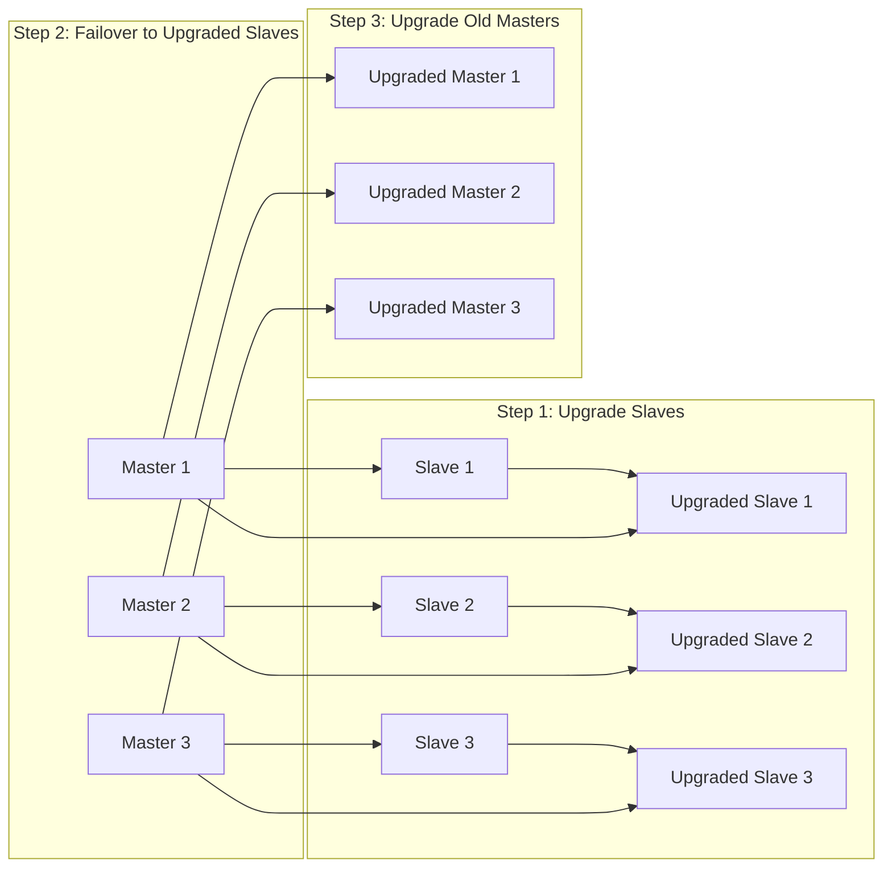

# Redis Upgrade

## Introduction

Upgrading Redis is a critical operational task that ensures your database system benefits from the latest features, performance improvements, and security patches. This guide will walk you through the Redis upgrade process, covering different upgrade strategies, potential challenges, and best practices to ensure a smooth transition with minimal downtime.

Redis, being a widely-used in-memory data structure store, requires careful handling during upgrades to maintain data integrity and service availability. Whether you're running Redis in development, testing, or production environments, following a structured approach to upgrades is essential.

## Understanding Redis Versioning

Before diving into the upgrade process, it's important to understand how Redis versioning works:

- **Major versions** (e.g., Redis 5.x to Redis 6.x): May introduce breaking changes and significant new features
- **Minor versions** (e.g., Redis 6.0 to Redis 6.2): Usually add new features while maintaining backward compatibility
- **Patch versions** (e.g., Redis 6.2.5 to Redis 6.2.6): Typically contain bug fixes and security patches

Redis follows semantic versioning, which helps you assess the risk and scope of an upgrade.

## Pre-Upgrade Checklist

Before upgrading Redis, complete the following checklist:

1. **Review release notes**: Understand what changes are included in the target version
2. **Backup your data**: Create a complete backup of your Redis data
3. **Check compatibility**: Ensure your application is compatible with the new Redis version
4. **Plan for downtime**: Determine if and how much downtime is acceptable
5. **Test the upgrade**: Practice the upgrade process in a non-production environment

Let's create a simple pre-upgrade checklist script:

```bash
#!/bin/bash
# Redis Pre-Upgrade Checklist Script

# Current Redis version
CURRENT_VERSION=$(redis-cli INFO | grep redis_version | cut -d ":" -f2 | tr -d "[:space:]")
echo "Current Redis version: $CURRENT_VERSION"

# Create backup
echo "Creating Redis backup..."
redis-cli SAVE
cp /var/lib/redis/dump.rdb /var/lib/redis/pre_upgrade_backup_$(date +%Y%m%d).rdb
echo "Backup created at /var/lib/redis/pre_upgrade_backup_$(date +%Y%m%d).rdb"

# Check for any warnings
echo "Checking for any warnings..."
redis-cli INFO | grep warnings
echo "Running memory diagnostics..."
redis-cli INFO memory

echo "Please review the above information before proceeding with the upgrade."
```

## Upgrade Strategies

Redis supports several upgrade strategies, each with its own advantages and considerations:

### 1. In-Place Upgrade

The simplest approach is an in-place upgrade, where you stop Redis, install the new version, and restart the service.

```bash
# Stop Redis service
sudo systemctl stop redis

# Install new Redis version (Ubuntu/Debian example)
sudo apt update
sudo apt install redis-server

# Start Redis service
sudo systemctl start redis

# Verify the new version
redis-cli INFO | grep redis_version
```

**Pros**: Simple and straightforward
**Cons**: Causes downtime, which may not be acceptable for production environments

### 2. Rolling Upgrade (for Redis Cluster)

If you're running Redis Cluster, you can perform a rolling upgrade by upgrading one node at a time.



Steps to perform a rolling upgrade:

```bash
# For each slave node:
# 1. Stop Redis on the slave
sudo systemctl stop redis

# 2. Upgrade Redis
sudo apt update
sudo apt install redis-server

# 3. Start Redis
sudo systemctl start redis

# 4. Once all slaves are upgraded, perform a manual failover for each master-slave pair
redis-cli -h <master-node> CLUSTER FAILOVER

# 5. Upgrade the old master nodes following steps 1-3
```

**Pros**: Minimal downtime, suitable for production environments
**Cons**: More complex, requires Redis Cluster setup

### 3. Blue-Green Deployment

For high-availability setups, a blue-green deployment approach can be used:

```bash
# 1. Set up a new Redis instance with the new version
sudo apt update
sudo apt install redis-server=<new-version> -y

# 2. Configure the new instance with a different port
sudo sed -i 's/port 6379/port 6380/' /etc/redis/redis.conf
sudo systemctl start redis

# 3. Migrate data using redis-cli or MIGRATE command
redis-cli -p 6379 MIGRATE 127.0.0.1 6380 "" 0 5000 COPY REPLACE

# 4. Update your application to use the new Redis instance
# 5. Once confirmed working, you can decommission the old instance
```

**Pros**: Zero downtime, safe rollback option
**Cons**: Requires additional resources, more complex setup

## Handling Compatibility Issues

When upgrading Redis, particularly between major versions, you may encounter compatibility issues. Here are some common challenges and solutions:

### Command Deprecation

Some Redis commands may be deprecated or changed between versions.

```redis
# Redis 5.x
redis> HMSET user:1000 username antirez birthyear 1977
OK

# Redis 6.x+ (HMSET still works but HSET is preferred and more flexible)
redis> HSET user:1000 username antirez birthyear 1977
(integer) 2
```

### Configuration Changes

Configuration parameters might change between Redis versions. Always review the Redis configuration file after upgrading:

```bash
# Check for deprecated configurations
redis-cli CONFIG GET *

# Compare with default configuration of the new version
diff /etc/redis/redis.conf.default /etc/redis/redis.conf
```

### Module Compatibility

If you use Redis modules, ensure they're compatible with the new Redis version:

```bash
# Check loaded modules
redis-cli MODULE LIST

# Verify module compatibility with the new Redis version
# (Check module documentation or GitHub repository)
```

## Testing the Upgrade

It's crucial to test the Redis upgrade process before applying it to production:

1. **Create a staging environment** that mirrors your production setup
2. **Export production data** to test with realistic datasets:

```bash
# Export production data
redis-cli --rdb /tmp/production_dump.rdb

# Import to staging
sudo systemctl stop redis
sudo cp /tmp/production_dump.rdb /var/lib/redis/dump.rdb
sudo chown redis:redis /var/lib/redis/dump.rdb
sudo systemctl start redis
```

3. **Run performance tests** to ensure the new version performs as expected:

```bash
# Using redis-benchmark
redis-benchmark -h localhost -p 6379 -c 50 -n 100000 -t set,get -q

# Compare results with the same benchmark on production
```

4. **Verify application compatibility** by running your application against the upgraded Redis instance

## Real-World Upgrade Example

Let's walk through a real-world example of upgrading Redis from version 6.0 to 6.2 on Ubuntu:

```bash
# 1. Check current Redis version
redis-cli INFO | grep redis_version
# Output: redis_version:6.0.9

# 2. Create a backup
sudo systemctl stop redis
sudo cp /var/lib/redis/dump.rdb /var/lib/redis/backup_6.0.9.rdb
sudo systemctl start redis

# 3. Add Redis repository to get the latest version
sudo add-apt-repository ppa:redis/redis
sudo apt update

# 4. Install the new version
sudo apt install redis-server

# 5. Restart Redis service
sudo systemctl restart redis

# 6. Verify the upgrade
redis-cli INFO | grep redis_version
# Output: redis_version:6.2.6

# 7. Monitor for any errors
sudo tail -f /var/log/redis/redis-server.log
```

## Monitoring After Upgrade

After upgrading Redis, monitor these key metrics to ensure everything is working correctly:

1. **Memory usage**:
```bash
redis-cli INFO memory | grep used_memory_human
```

2. **Connected clients**:
```bash
redis-cli INFO clients | grep connected_clients
```

3. **Operations per second**:
```bash
redis-cli INFO stats | grep instantaneous_ops_per_sec
```

4. **Error logs**:
```bash
sudo tail -f /var/log/redis/redis-server.log | grep ERR
```

## Troubleshooting Common Upgrade Issues

### Issue: Redis Won't Start After Upgrade

```bash
# Check for syntax errors in redis.conf
redis-server --test-memory 1

# Check error logs
sudo tail -f /var/log/redis/redis-server.log

# Solution: Revert to default configuration and migrate your changes
sudo cp /etc/redis/redis.conf.default /etc/redis/redis.conf
# Then add your custom settings manually
```

### Issue: Increased Memory Usage

```bash
# Check memory statistics before and after upgrade
redis-cli INFO memory

# Solution: Adjust maxmemory configuration if needed
redis-cli CONFIG SET maxmemory 2gb
redis-cli CONFIG REWRITE
```

### Issue: Slow Performance After Upgrade

```bash
# Run benchmark to identify specific operations that are slow
redis-benchmark -t set,get,incr -n 100000 -q

# Solution: Review and adjust new configurations
redis-cli CONFIG GET *
```

## Downgrading in Case of Problems

If you encounter critical issues after upgrading, you may need to downgrade:

```bash
# 1. Stop Redis
sudo systemctl stop redis

# 2. Install the previous version
sudo apt install redis-server=<previous-version>

# 3. Restore your backup
sudo cp /var/lib/redis/backup_<previous-version>.rdb /var/lib/redis/dump.rdb
sudo chown redis:redis /var/lib/redis/dump.rdb

# 4. Start Redis
sudo systemctl start redis

# 5. Verify the downgrade
redis-cli INFO | grep redis_version
```

## Best Practices for Redis Upgrades

1. **Always read the release notes** for breaking changes and new features
2. **Automate the upgrade process** with scripts to reduce human error
3. **Use Redis Sentinel or Cluster** for high-availability during upgrades
4. **Monitor key metrics** before, during, and after the upgrade
5. **Keep backups** for at least a few days after the upgrade
6. **Document the upgrade process** for future reference

## Conclusion

Upgrading Redis is a necessary maintenance task that, when done correctly, improves performance, security, and functionality. By following a structured approach—planning, testing, executing, and monitoring—you can minimize risks and ensure a smooth upgrade process.

Remember that different environments may require different upgrade strategies. What works for a development environment might not be suitable for a mission-critical production system. Always tailor your approach to your specific needs and constraints.

## Additional Resources

- [Official Redis Documentation](https://redis.io/documentation)
- [Redis GitHub Repository](https://github.com/redis/redis)
- [Redis Release Notes](https://raw.githubusercontent.com/redis/redis/unstable/00-RELEASENOTES)

## Exercises

1. Create a shell script to automate the Redis upgrade process for your environment
2. Set up a Redis Cluster and practice performing a rolling upgrade
3. Experiment with the MIGRATE command to move data between different Redis versions
4. Compare performance metrics between Redis 6.x and 7.x using redis-benchmark
5. Create a disaster recovery plan for Redis upgrades that addresses potential failure scenarios