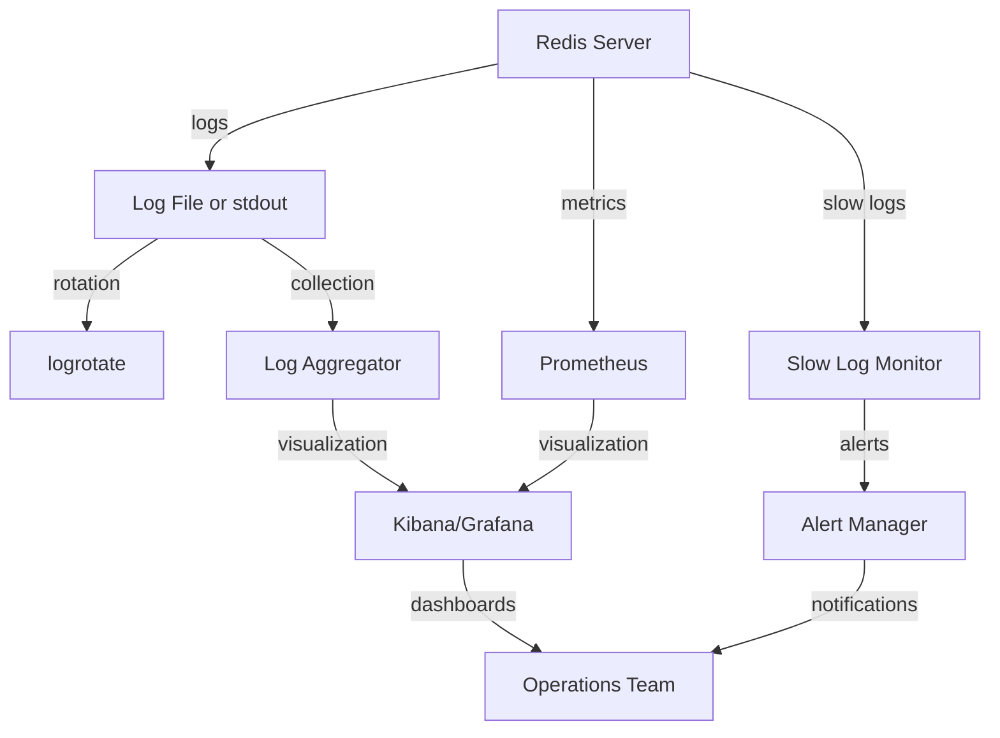

# Redis Logging

## Introduction

Logging is a crucial aspect of Redis administration that provides insights into the operation and health of your Redis server. Effective logging helps you monitor performance, troubleshoot issues, and maintain the overall stability of your Redis deployment. In this guide, we'll explore how Redis handles logging, the various logging levels, configuration options, and best practices for managing logs in different environments.

## Understanding Redis Logging Basics

Redis generates logs to record various events and operations that occur during its execution. By default, Redis logs to standard output (stdout), which makes it easy to integrate with system logging facilities like syslog or journald.

### Redis Log Levels

Redis provides several logging levels that determine the verbosity of the log output:

| Log Level | Value | Description |
|-----------|-------|------------|
| debug     | 0     | Very verbose, includes detailed information useful for debugging |
| verbose   | 1     | More information than standard notice level |
| notice    | 2     | Moderately verbose, the default level |
| warning   | 3     | Only warnings and more critical messages |

The default logging level is `notice`, which provides a balanced amount of information without overwhelming the logs.

## Configuring Redis Logging

You can configure Redis logging either in the Redis configuration file (`redis.conf`) or at runtime using the `CONFIG SET` command.

### Setting the Log Level

To set the log level in the configuration file:

```
loglevel notice
```

To change the log level at runtime:

```
redis-cli> CONFIG SET loglevel warning
```

### Configuring Log Output

By default, Redis logs to standard output, but you can redirect logs to a file:

```
logfile /var/log/redis/redis-server.log
```

If you're using Redis in a container environment, it's often better to stick with logging to stdout/stderr and let the container runtime handle log collection.

### Configuring Syslog Integration

Redis can send logs to the system's syslog facility:

```
syslog-enabled yes
syslog-ident redis
syslog-facility local0
```

- `syslog-enabled`: Enables or disables syslog logging
- `syslog-ident`: Sets the identity string used in syslog messages
- `syslog-facility`: Sets the syslog facility (local0 through local7)

## Sample Log Messages

Let's look at some sample Redis log messages and what they indicate:

```
1:M 15 Apr 2023 12:00:00.000 # Server started, Redis version 7.0.10
1:M 15 Apr 2023 12:00:00.000 * DB loaded from disk: 0.001 seconds
1:M 15 Apr 2023 12:00:00.000 * Ready to accept connections
```

The log format follows this pattern:
- Process ID and role (M for Master, S for Slave, C for Child, X for Sentinel)
- Date and time
- Log level indicator (# for notice, * for verbose, - for debug)
- The actual log message

### Common Log Messages and Their Meaning

Here are some common log messages you might encounter:

#### Startup Messages

```
# Server started, Redis version 7.0.10
* Loading RDB produced by version 7.0.10
* DB loaded from disk: 0.001 seconds
* Ready to accept connections
```

#### Connection Messages

```
* Accepted connection from 127.0.0.1:51234
# Client closed connection
```

#### Warning Messages

```
# Warning: no config file specified, using the default config
# WARNING overcommit_memory is set to 0!
# WARNING you have Transparent Huge Pages (THP) support enabled
```

## Monitoring and Analyzing Redis Logs

Effective monitoring of Redis logs can help you identify potential issues before they become critical problems. Here's how to approach logging monitoring:

### Real-time Log Monitoring

To monitor Redis logs in real-time:

```bash
tail -f /var/log/redis/redis-server.log
```

Or if you're using Redis in a Docker container:

```bash
docker logs -f redis-container
```

### Common Issues Identified Through Logs

1. **Memory Issues**:
   ```
   # WARNING: Memory overcommit must be enabled!
   ```

2. **Connection Issues**:
   ```
   # Disconnected client exceeded max number of connections
   ```

3. **Performance Issues**:
   ```
   * 1000 changes in 60 seconds. Saving...
   * Background saving started
   # RDB: 14 MB of memory used by copy-on-write
   ```

## Managing Redis Log Rotation

For production systems, it's important to manage log files to prevent them from consuming excessive disk space. Redis itself doesn't handle log rotation, but you can use external tools.

### Using logrotate

Create a configuration file `/etc/logrotate.d/redis`:

```
/var/log/redis/redis-server.log {
    daily
    rotate 7
    compress
    delaycompress
    postrotate
        [ -f /var/run/redis/redis-server.pid ] && kill -USR1 $(cat /var/run/redis/redis-server.pid)
    endscript
}
```

This configuration:
- Rotates logs daily
- Keeps 7 days of logs
- Compresses old logs
- Signals Redis to reopen its log file after rotation

## Redis Slow Log

Redis provides a special logging mechanism called the "slow log" that captures commands that exceed a specified execution time. This is separate from the standard Redis logs and is stored in memory.

### Configuring the Slow Log

In `redis.conf`:

```
slowlog-log-slower-than 10000  # in microseconds (10ms)
slowlog-max-len 128            # maximum entries to keep
```

Or at runtime:

```
redis-cli> CONFIG SET slowlog-log-slower-than 10000
redis-cli> CONFIG SET slowlog-max-len 128
```

### Accessing the Slow Log

```
redis-cli> SLOWLOG GET 10  # Get the latest 10 slow log entries
```

Sample output:

```
1) 1) (integer) 14
   2) (integer) 1618507292
   3) (integer) 15000
   4) 1) "LRANGE"
      2) "my_list"
      3) "0"
      4) "-1"
   5) "127.0.0.1:52780"
   6) ""
```

The fields represent:
1. Entry ID
2. Timestamp
3. Execution time in microseconds
4. Command and arguments
5. Client address
6. Client name (if set)

### Example: Monitoring Slow Commands

Create a script to periodically check for slow commands:

```bash
#!/bin/bash
# save as monitor_slow_commands.sh

while true; do
  echo "Checking for slow commands..."
  redis-cli SLOWLOG GET 5
  sleep 300  # Check every 5 minutes
done
```

## Visualizing Redis Logs

For better insight into your Redis operations, you can use visualization tools that can ingest and display Redis logs.

### Using Grafana and Prometheus

With the Redis Exporter for Prometheus, you can collect metrics from Redis and visualize them in Grafana. Create a basic monitoring dashboard with these steps:

1. Set up Prometheus to scrape Redis metrics
2. Configure Grafana to use Prometheus as a data source
3. Import a Redis dashboard or create custom panels

## Practical Logging Strategies for Different Environments

The appropriate logging strategy depends on your environment. Here are some recommendations:

### Development Environment

```
loglevel debug
logfile stdout
```

In development, verbose logs help with debugging, and outputting to the console is convenient.

### Production Environment

```
loglevel warning
logfile /var/log/redis/redis-server.log
```

In production, focus on warnings and errors to avoid excessive log volume, and direct logs to a file for persistence.

### Containerized Environment

```
loglevel notice
logfile ""  # Empty string means log to stdout
```

For containerized Redis, log to stdout/stderr and let the container platform handle log collection and aggregation.

## Log Analysis Case Study

Let's walk through a scenario where Redis logs help diagnose a performance issue:

1. Users report slow response times during peak hours
2. Examining Redis logs reveals numerous entries like:
   ```
   * Starting BGSAVE for SYNC with target: disk
   * Background saving started by pid 13246
   * Background saving terminated with success
   ```

3. Further investigation in the slow log shows many slow SAVE operations
4. The root cause: Redis is performing too many background saves due to frequent configuration changes
5. Solution: Adjust the save configuration and implement more controlled configuration updates

## Best Practices for Redis Logging

To make the most of Redis logging:

1. **Use appropriate log levels**: Use `warning` in production and `notice` or `verbose` in staging
2. **Implement log rotation**: Prevent log files from growing indefinitely
3. **Centralize logs**: In multi-node setups, centralize logs for easier correlation
4. **Monitor slow logs**: Regularly check slow logs to identify performance bottlenecks
5. **Set up alerts**: Configure alerts for critical log patterns
6. **Include Redis logs in your overall monitoring strategy**: Correlate Redis events with other system events

## Putting It All Together: A Complete Logging Setup

Here's an example of a comprehensive Redis logging setup:



## Summary

Redis logging is an essential tool for monitoring, troubleshooting, and maintaining a healthy Redis deployment. By understanding the available logging options, configuring appropriate log levels, and implementing good logging practices, you can gain valuable insights into your Redis instances' behavior and performance.

Proper logging configuration helps you catch issues early, understand system behavior, and ensure the reliability of your Redis deployments. As your Redis usage grows, consider implementing more sophisticated logging strategies that include centralized log collection, real-time monitoring, and alerting.

## Exercises

1. Configure Redis to log at the `verbose` level and observe the difference in log output.
2. Set up slow log monitoring with a threshold of 5ms and identify the slowest commands in your application.
3. Create a simple bash script that parses Redis logs and alerts you when there are more than 5 warning messages in a minute.
4. Configure Redis to use syslog and verify that messages appear in your system's log files.
5. Set up a log rotation policy for Redis logs that keeps logs for 14 days and compresses logs older than 1 day.