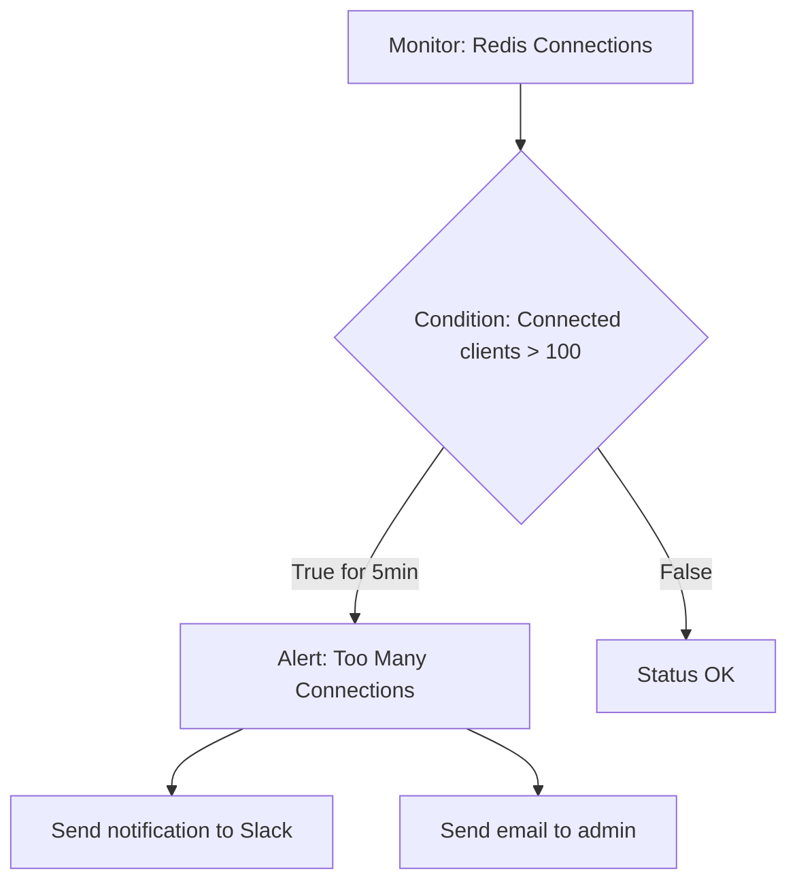

# Redis Alerting

## Introduction

Redis is known for its speed and reliability as an in-memory data store. However, like any critical infrastructure component, it requires proper monitoring and alerting to ensure smooth operation. This guide will walk you through the essentials of Redis alerting - the practice of setting up automated notifications when your Redis instances show signs of trouble or require attention.

Effective alerting allows you to:
- Respond quickly to potential issues before they impact users
- Track performance metrics over time
- Plan capacity upgrades proactively
- Ensure high availability and reliability of your Redis deployment

## Understanding Redis Metrics

Before setting up alerts, it's important to understand the key metrics that indicate the health of your Redis instance.

### Essential Redis Metrics to Monitor

1. **Memory Usage**
   - Used Memory
   - Memory Fragmentation Ratio
   - Eviction Count

2. **Performance Metrics**
   - Operations Per Second
   - Latency
   - Hit/Miss Ratio for Cache Workloads

3. **Connection Metrics**
   - Connected Clients
   - Blocked Clients
   - Rejected Connections

4. **Persistence Metrics**
   - Last RDB Save Time
   - AOF Rewrite in Progress
   - Changes Since Last Save

5. **Replication Metrics** (for Redis clusters)
   - Replication Delay
   - Master-Replica Connection Status
   - Resync Events

## Redis Monitoring Tools

Several tools are available for monitoring Redis:

### 1. Redis CLI

The simplest way to check Redis metrics is through the Redis command-line interface using the `INFO` command:

```bash
redis-cli info
```

Output example:

```
# Server
redis_version:6.2.6
redis_git_sha1:00000000
redis_git_dirty:0
redis_build_id:a4f7b35afb60d588
redis_mode:standalone
os:Linux 5.4.0-1059-aws x86_64
arch_bits:64
multiplexing_api:epoll
# Clients
connected_clients:1
client_recent_max_input_buffer:4
client_recent_max_output_buffer:0
blocked_clients:0
# Memory
used_memory:871528
used_memory_human:851.10K
used_memory_rss:9297920
used_memory_rss_human:8.87M
# ... more sections
```

### 2. Redis Exporter with Prometheus and Grafana

For more robust monitoring, you can use:

- **Redis Exporter**: Exposes Redis metrics for Prometheus
- **Prometheus**: Stores time-series data
- **Grafana**: Visualizes the data and provides alerting capabilities

Setup example:

```yaml
# docker-compose.yml for Redis monitoring stack
version: '3'

services:
  redis:
    image: redis:6.2
    ports:
      - "6379:6379"
  
  redis-exporter:
    image: oliver006/redis_exporter
    environment:
      - REDIS_ADDR=redis://redis:6379
    ports:
      - "9121:9121"
    depends_on:
      - redis
  
  prometheus:
    image: prom/prometheus
    volumes:
      - ./prometheus.yml:/etc/prometheus/prometheus.yml
    ports:
      - "9090:9090"
    depends_on:
      - redis-exporter
  
  grafana:
    image: grafana/grafana
    ports:
      - "3000:3000"
    depends_on:
      - prometheus
```

Corresponding `prometheus.yml` configuration:

```yaml
global:
  scrape_interval: 15s

scrape_configs:
  - job_name: 'redis'
    static_configs:
      - targets: ['redis-exporter:9121']
```

### 3. Redis Enterprise Monitoring

Redis Enterprise provides built-in monitoring features with pre-configured dashboards and alerts.

### 4. Cloud Provider Monitoring

If you're using Redis as a service from cloud providers (AWS ElastiCache, Azure Cache for Redis, etc.), they offer integrated monitoring solutions.

## Setting Up Redis Alerts

Let's explore how to set up alerts for Redis using different approaches:

### Alert Types

1. **Threshold-based alerts**: Trigger when a metric crosses a predefined threshold
2. **Anomaly-based alerts**: Detect abnormal patterns in metrics
3. **Health check alerts**: Signal when Redis becomes unreachable

### Example Alert Scenarios

#### Memory Usage Alert

Memory is critical for Redis. Set an alert when memory usage exceeds 80% of max memory:

Using Redis CLI and a shell script:

```bash
#!/bin/bash

# Get memory usage percentage
MEMORY_USAGE=$(redis-cli -h $REDIS_HOST info memory | grep "used_memory:" | cut -d: -f2)
MAX_MEMORY=$(redis-cli -h $REDIS_HOST config get maxmemory | tail -1)

# Calculate percentage
PERCENTAGE=$(awk "BEGIN { pc=100*${MEMORY_USAGE}/${MAX_MEMORY}; print pc }")

# Check threshold
if (( $(echo "$PERCENTAGE > 80" | bc -l) )); then
  echo "ALERT: Redis memory usage is at ${PERCENTAGE}%"
  # Send email, Slack notification, etc.
fi
```

#### High Latency Alert with Prometheus

In Prometheus, you can define an alert rule for high latency:

```yaml
# prometheus-rules.yml
groups:
- name: redis_alerts
  rules:
  - alert: RedisHighLatency
    expr: redis_commands_duration_seconds_total{cmd="get"} > 0.01
    for: 5m
    labels:
      severity: warning
    annotations:
      summary: "Redis high latency detected"
      description: "Redis GET command latency is above 10ms for 5 minutes on {{ $labels.instance }}"
```

### Using Grafana for Alerting

Grafana offers a user-friendly interface to set up alerts:

1. Create a dashboard with Redis metrics
2. Add alert conditions to panels:
   - Click on a panel title
   - Select "Edit"
   - Go to the "Alert" tab
   - Define conditions
   - Specify notification channels (email, Slack, PagerDuty, etc.)

Example alert rule in Grafana:



## Practical Alert Examples for Common Redis Issues

### 1. Redis Running Out of Memory

**Alert Condition**: Redis memory usage > 80% of max memory

**Why it matters**: Redis is an in-memory database. When it runs out of memory, depending on your configuration, it will either:
- Start evicting keys (if maxmemory-policy is set to eviction)
- Return errors on write operations (if maxmemory-policy is noeviction)

**Action when triggered**:
- Increase Redis memory allocation
- Review data storage patterns
- Implement key expiration policies

### 2. High Keyspace Miss Rate

**Alert Condition**: Cache miss rate > 30% for 15 minutes

**Why it matters**: A high miss rate indicates your cache might not be effective, leading to increased load on your primary database.

**Metrics to watch**:
```
keyspace_hits / (keyspace_hits + keyspace_misses)
```

**Action when triggered**:
- Review cache expiration policies
- Consider increasing cache size
- Analyze access patterns to optimize caching strategy

### 3. Replication Lag Alert

**Alert Condition**: Replication lag > 10 seconds

**Why it matters**: High replication lag means replica nodes are not in sync with the master, potentially serving stale data.

**Action when triggered**:
- Check network connectivity between master and replicas
- Verify if master is experiencing high write load
- Consider scaling up replica resources

## Implementing Redis Sentinel for Automated Failover

Redis Sentinel provides high availability for Redis by monitoring instances and performing automatic failover if the primary node fails.

### Basic Sentinel Setup

1. Configure three or more Sentinel nodes for quorum:

```
# sentinel.conf
sentinel monitor mymaster 127.0.0.1 6379 2
sentinel down-after-milliseconds mymaster 5000
sentinel failover-timeout mymaster 60000
sentinel parallel-syncs mymaster 1
```

2. Start Sentinel:

```bash
redis-sentinel /path/to/sentinel.conf
```

3. Set up alerts for Sentinel status:

```bash
#!/bin/bash
# Check if Sentinel has the expected master
CURRENT_MASTER=$(redis-cli -p 26379 sentinel get-master-addr-by-name mymaster | head -1)
EXPECTED_MASTER="redis-master-ip"

if [[ "$CURRENT_MASTER" != "$EXPECTED_MASTER" ]]; then
  echo "ALERT: Redis failover detected! New master is $CURRENT_MASTER"
  # Send notification
fi
```

## Best Practices for Redis Alerting

1. **Set meaningful thresholds**: Understand your workload before setting alert thresholds to avoid alert fatigue

2. **Implement tiered alerting**:
   - Warning: For early signs of issues
   - Critical: For immediate action required

3. **Group related alerts**: Use alert grouping to avoid notification storms

4. **Document response procedures**: Create playbooks for common alerts:

```markdown
## Memory Usage Alert Response

1. Check actual memory usage: `redis-cli info memory`
2. Look for large keys: `redis-cli --bigkeys`
3. Consider eviction policy changes if appropriate
4. Plan for scaling if needed
```

5. **Test your alerting system**: Periodically verify alerts are working by triggering test conditions

6. **Alert on rate of change**: Sometimes the velocity of change is more important than absolute values

## Integrating with Notification Systems

Connect your Redis alerts to notification channels:

### Slack Integration Example

Using a simple webhook approach:

```python
import requests
import json

def send_slack_alert(webhook_url, message, channel="#redis-alerts"):
    payload = {
        "channel": channel,
        "username": "Redis Monitor",
        "text": message,
        "icon_emoji": ":redis:"
    }
    
    response = requests.post(
        webhook_url,
        data=json.dumps(payload),
        headers={"Content-Type": "application/json"}
    )
    
    return response.status_code
```

### Email Alerts

Using SMTP with Python:

```python
import smtplib
from email.mime.text import MIMEText
from email.mime.multipart import MIMEMultipart

def send_email_alert(subject, message, from_email, to_email, smtp_server):
    msg = MIMEMultipart()
    msg['From'] = from_email
    msg['To'] = to_email
    msg['Subject'] = subject
    
    msg.attach(MIMEText(message, 'plain'))
    
    server = smtplib.SMTP(smtp_server, 587)
    server.starttls()
    server.login(from_email, "your-password")  # Use environment variables in production!
    server.send_message(msg)
    server.quit()
```

## Summary

Redis alerting is a critical component of maintaining a healthy Redis deployment. By monitoring key metrics and setting up appropriate alerts, you can:

- Detect and respond to issues before they impact users
- Maintain optimal performance
- Ensure data safety and availability
- Plan capacity upgrades proactively

Remember that effective alerting requires:
1. Understanding which metrics matter for your specific Redis usage
2. Setting appropriate thresholds based on your workload
3. Creating clear response procedures for each alert type
4. Regularly reviewing and refining your alerting strategy

## Additional Resources

- [Redis Documentation on Monitoring](https://redis.io/topics/monitoring)
- [Prometheus Documentation](https://prometheus.io/docs/introduction/overview/)
- [Grafana Alerting Guide](https://grafana.com/docs/grafana/latest/alerting/)

## Exercises

1. Set up a basic Redis monitoring system using Redis Exporter, Prometheus, and Grafana.
2. Create an alert for when Redis memory usage exceeds 75% of the configured maximum.
3. Write a script that checks for blocked clients in Redis and sends an alert if any are found.
4. Configure Redis Sentinel and set up an alert for failover events.
5. Design an alerting dashboard in Grafana that shows the key health metrics for a Redis cluster.