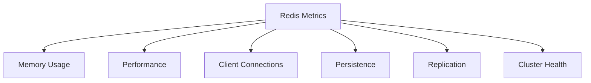

# Redis Metrics

## Introduction

Redis is an in-memory data structure store that powers countless modern applications as a database, cache, message broker, and streaming engine. As with any critical system, properly monitoring Redis is essential to ensure optimal performance and reliability.

This guide explores the key metrics you should monitor in Redis, how to interpret them, and what actions to take when metrics indicate potential issues. Whether you're running Redis for development or in production, understanding these metrics will help you ensure your Redis instances run smoothly.

## Why Monitor Redis Metrics?

Monitoring Redis provides several benefits:

- **Performance optimization**: Identify bottlenecks and tune your Redis instance
- **Capacity planning**: Track resource usage to plan for future growth
- **Troubleshooting**: Diagnose issues before they become critical
- **Stability**: Ensure consistent application performance

## Essential Redis Metrics Categories

Redis metrics can be grouped into several key categories:



Let's explore each category and the specific metrics to monitor.

## Memory Usage Metrics

Redis is an in-memory database, making memory its most critical resource. Monitoring memory ensures you don't experience unexpected out-of-memory errors.

### Key Memory Metrics

#### 1. `used_memory`

This metric shows the total amount of memory Redis is using in bytes.

```bash
127.0.0.1:6379> INFO memory
# Memory
used_memory:1032216
used_memory_human:1008.02K
# ... additional output
```

#### 2. `used_memory_rss`

The Resident Set Size (RSS) is the amount of memory allocated by the operating system to Redis. This is typically higher than `used_memory` due to memory fragmentation.

#### 3. `mem_fragmentation_ratio`

This ratio shows the relationship between `used_memory_rss` and `used_memory`:

```
mem_fragmentation_ratio = used_memory_rss / used_memory
```

- **Ratio > 1.5**: Indicates high fragmentation, which might need addressing
- **Ratio < 1**: Redis is likely using swap memory, which severely impacts performance

Example of checking memory metrics:

```bash
127.0.0.1:6379> INFO memory
# Memory
used_memory:1032216
used_memory_human:1008.02K
used_memory_rss:9297920
used_memory_rss_human:8.87M
mem_fragmentation_ratio:9.01
mem_allocator:jemalloc-5.1.0
```

### Memory Management Best Practices

1. **Set `maxmemory` configuration**:
   
   ```bash
   # In redis.conf
   maxmemory 1gb
   maxmemory-policy allkeys-lru
   ```

2. **Monitor eviction policies at work**:

   ```bash
   127.0.0.1:6379> INFO stats
   # Stats
   evicted_keys:0
   # ... other stats
   ```

3. **Use memory analysis tools**:

   ```bash
   # Sample output from redis-cli --bigkeys
   -------- summary -------
   Sampled 250 keys in the keyspace!
   Total key length in bytes is 7395 (avg len 29.58)
   
   Biggest string found "large_string_key" has 65536 bytes
   1 strings with 65536 bytes (0.40% of keys, avg size 65536.00)
   ```

## Performance Metrics

Performance metrics help you understand how efficiently Redis is processing commands.

### Key Performance Metrics

#### 1. `instantaneous_ops_per_sec`

The number of commands processed per second, a key indicator of Redis throughput.

```bash
127.0.0.1:6379> INFO stats
# Stats
instantaneous_ops_per_sec:1723
# ... other stats
```

#### 2. `hit_rate` and `miss_rate`

Cache hit and miss rates tell you how effectively Redis is serving as a cache:

```
hit_rate = keyspace_hits / (keyspace_hits + keyspace_misses)
```

Example of retrieving hit/miss data:

```bash
127.0.0.1:6379> INFO stats
# Stats
keyspace_hits:1353
keyspace_misses:247
# ... other stats
```

From this example:
```
hit_rate = 1353 / (1353 + 247) = 0.845 = 84.5%
```

#### 3. `latency`

Command execution latency indicates overall Redis performance. High latency often signals problems.

You can monitor latency with the Redis `LATENCY` commands:

```bash
127.0.0.1:6379> LATENCY LATEST
1) 1) "command"
   2) (integer) 1600197000
   3) (integer) 1
   4) (integer) 10
```

#### 4. `blocked_clients`

The number of clients waiting for some blocking operation to complete:

```bash
127.0.0.1:6379> INFO clients
# Clients
connected_clients:49
blocked_clients:0
# ... other client stats
```

## Client Connection Metrics

Client connection metrics help you understand how your applications are connecting to Redis.

### Key Connection Metrics

#### 1. `connected_clients`

The current number of client connections:

```bash
127.0.0.1:6379> INFO clients
# Clients
connected_clients:49
# ... other client info
```

#### 2. `client_longest_output_list` and `client_biggest_input_buf`

These metrics help identify clients that might be using excessive resources:

```bash
127.0.0.1:6379> INFO clients
# Clients
connected_clients:49
client_longest_output_list:0
client_biggest_input_buf:0
# ... other client info
```

#### 3. `rejected_connections`

The number of connections rejected due to the `maxclients` limit:

```bash
127.0.0.1:6379> INFO stats
# Stats
rejected_connections:0
# ... other stats
```

## Persistence Metrics

Redis offers persistence options (RDB and AOF). Monitoring these ensures your data is being saved correctly.

### Key Persistence Metrics

#### 1. `rdb_last_save_time`

The Unix timestamp of the last successful RDB save:

```bash
127.0.0.1:6379> INFO persistence
# Persistence
rdb_last_save_time:1600197000
# ... other persistence info
```

#### 2. `rdb_changes_since_last_save`

The number of changes since the last RDB save:

```bash
127.0.0.1:6379> INFO persistence
# Persistence
rdb_changes_since_last_save:250
# ... other persistence info
```

#### 3. `aof_current_size` and `aof_buffer_length`

Size metrics for the AOF file and buffer:

```bash
127.0.0.1:6379> INFO persistence
# Persistence
aof_enabled:1
aof_current_size:99384
# ... other persistence info
```

## Replication Metrics

For Redis deployments with replication, monitoring replication lag and status is critical.

### Key Replication Metrics

#### 1. `master_link_status`

For Redis replicas, the status of the connection to the master:

```bash
# On a replica
127.0.0.1:6379> INFO replication
# Replication
role:slave
master_host:redis-master
master_port:6379
master_link_status:up
# ... other replication info
```

#### 2. `master_last_io_seconds_ago`

The number of seconds since the last interaction with the master:

```bash
# On a replica
127.0.0.1:6379> INFO replication
# Replication
master_last_io_seconds_ago:3
# ... other replication info
```

#### 3. `slave_repl_offset` and `master_repl_offset`

The replication offset on replicas and masters. The difference indicates replication lag:

```bash
127.0.0.1:6379> INFO replication
# Replication
master_repl_offset:12985
# ... other replication info
```

## Tools for Monitoring Redis Metrics

Several tools can help you collect and visualize Redis metrics:

### 1. Redis CLI Commands

The built-in commands in Redis provide immediate insights:

```bash
# Basic server information
redis-cli INFO

# Memory analysis
redis-cli --bigkeys

# Latency monitoring
redis-cli --latency

# Real-time stats
redis-cli MONITOR
```

### 2. Redis Exporter for Prometheus

For production environments, Prometheus with Redis Exporter provides robust monitoring:

```bash
# Example docker-compose.yml snippet
services:
  redis-exporter:
    image: oliver006/redis_exporter
    command: -redis.addr redis://redis:6379
    ports:
      - 9121:9121
```

### 3. Redis Insights

Redis Insights is a graphical user interface for monitoring and analyzing Redis:

```bash
docker run -v redisinsight:/db -p 8001:8001 redislabs/redisinsight
```

## Practical Example: Setting Up Basic Monitoring

Let's implement a simple shell script to monitor key Redis metrics:

```bash
#!/bin/bash
# redis-monitor.sh

# Configuration
REDIS_HOST="localhost"
REDIS_PORT=6379
REDIS_PASS=""

# Command prefix
CMD_PREFIX="redis-cli"
if [ ! -z "$REDIS_PASS" ]; then
  CMD_PREFIX="$CMD_PREFIX -a $REDIS_PASS"
fi

# Collect metrics
echo "===== Redis Monitoring Report ====="
echo "Timestamp: $(date)"
echo

echo "## Memory Usage ##"
$CMD_PREFIX INFO memory | grep -E "used_memory_human|used_memory_rss_human|mem_fragmentation_ratio"
echo

echo "## Performance ##"
$CMD_PREFIX INFO stats | grep -E "instantaneous_ops_per_sec|keyspace_hits|keyspace_misses"
echo

echo "## Clients ##"
$CMD_PREFIX INFO clients | grep -E "connected_clients|blocked_clients"
echo

echo "## Persistence ##"
$CMD_PREFIX INFO persistence | grep -E "rdb_last_save_time|rdb_changes_since_last_save"
echo

# Calculate hit rate
HITS=$($CMD_PREFIX INFO stats | grep keyspace_hits | cut -d: -f2)
MISSES=$($CMD_PREFIX INFO stats | grep keyspace_misses | cut -d: -f2)
TOTAL=$((HITS + MISSES))
if [ $TOTAL -ne 0 ]; then
  HIT_RATE=$(echo "scale=2; $HITS * 100 / $TOTAL" | bc)
  echo "Cache Hit Rate: $HIT_RATE%"
fi
```

Make the script executable and run it periodically:

```bash
chmod +x redis-monitor.sh
./redis-monitor.sh
```

Sample output:

```
===== Redis Monitoring Report =====
Timestamp: Fri Sep 17 14:35:27 UTC 2023

## Memory Usage ##
used_memory_human:15.30M
used_memory_rss_human:17.59M
mem_fragmentation_ratio:1.15

## Performance ##
instantaneous_ops_per_sec:1342
keyspace_hits:5492
keyspace_misses:211

## Clients ##
connected_clients:8
blocked_clients:0

## Persistence ##
rdb_last_save_time:1695037520
rdb_changes_since_last_save:42

Cache Hit Rate: 96.30%
```

## Setting Up Alerts

After collecting metrics, you'll want to set up alerts for critical conditions. Here are some recommended alert thresholds:

1. **Memory Usage**: Alert when `used_memory` exceeds 80% of `maxmemory`
2. **Memory Fragmentation**: Alert when `mem_fragmentation_ratio` > 1.5
3. **Connection Spike**: Alert on sudden increases in `connected_clients`
4. **Replica Lag**: Alert when `master_last_io_seconds_ago` > 30
5. **Performance**: Alert when `instantaneous_ops_per_sec` drops significantly
6. **Evictions**: Alert when `evicted_keys` increases rapidly

## Summary

Monitoring Redis metrics is essential for ensuring the performance, stability, and reliability of your Redis instances. By focusing on the key metrics in each category:

- Memory usage and fragmentation
- Command throughput and latency
- Client connections
- Persistence status
- Replication health

You can proactively identify issues, optimize performance, and ensure your Redis deployment meets your application's needs.

## Additional Resources

- [Redis Documentation on Monitoring](https://redis.io/docs/management/optimization/monitoring/)
- [Redis Latency Monitoring Framework](https://redis.io/docs/management/optimization/latency-monitor/)
- [Redis Memory Optimization](https://redis.io/docs/management/optimization/memory-optimization/)

## Exercises

1. Set up the monitoring script above and run it on your Redis instance. What are your baseline metrics?

2. Simulate load on your Redis instance (using redis-benchmark) and observe how the metrics change:

   ```bash
   redis-benchmark -q -n 100000
   ```

3. Configure a Redis instance with maxmemory and observe eviction behavior:

   ```bash
   redis-cli CONFIG SET maxmemory 100mb
   redis-cli CONFIG SET maxmemory-policy allkeys-lru
   ```

4. Set up Redis Exporter with Prometheus and Grafana to create a visual dashboard of your Redis metrics.

5. Practice troubleshooting: Identify which client is using the most resources by using the `CLIENT LIST` command.