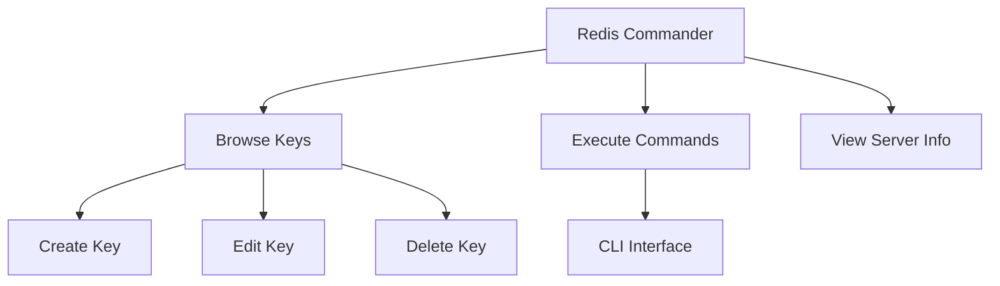
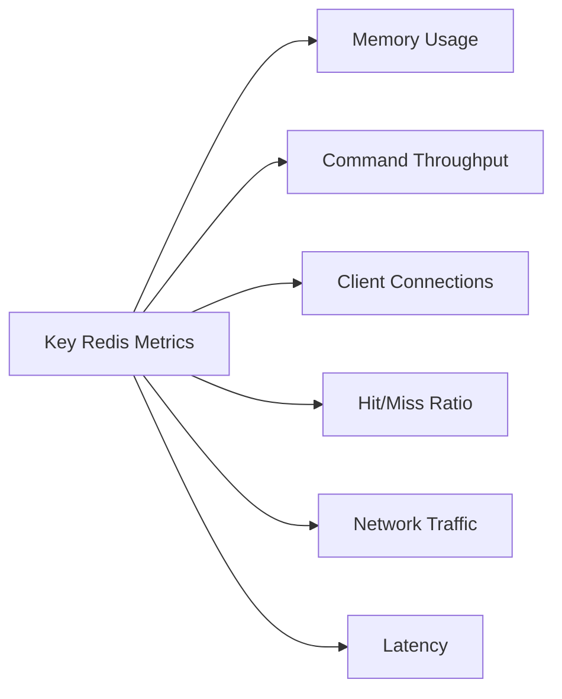

# Redis Dashboard

## Introduction

Redis dashboards are powerful visual interfaces that allow developers and system administrators to monitor, manage, and troubleshoot Redis instances through an intuitive graphical interface. As Redis is an in-memory data structure store widely used for caching, real-time analytics, and message brokering, having a comprehensive dashboard is essential for maintaining optimal performance and ensuring system health.

In this tutorial, we'll explore various Redis dashboard solutions, their setup process, key features, and how to effectively use them to manage your Redis deployments. Whether you're running a single Redis instance or a complex cluster, a good dashboard will provide valuable insights into your system's behavior.

## Why Use a Redis Dashboard?

Before diving into specific dashboard solutions, let's understand why a dedicated Redis dashboard is valuable:

- **Real-time monitoring**: Track key metrics like memory usage, operations per second, and connected clients
- **Performance optimization**: Identify bottlenecks and inefficient commands
- **Troubleshooting**: Quickly diagnose issues when they arise
- **Resource planning**: Understand usage patterns to plan for scaling
- **Configuration management**: Update Redis configuration without command-line interventions

## Popular Redis Dashboard Solutions

### 1. Redis Commander

Redis Commander is an open-source web management tool for Redis with a clean, intuitive interface.

#### Installation

```bash
# Install Redis Commander using npm
npm install -g redis-commander

# Launch Redis Commander
redis-commander
```

After installation, access the dashboard by navigating to `http://localhost:8081` in your web browser.

#### Key Features

- Browse and edit Redis keys
- Execute Redis commands
- View and edit configuration
- Multi-server support
- Basic monitoring capabilities

#### Example: Managing Keys in Redis Commander

Redis Commander provides a tree view of your Redis keys, allowing you to navigate through your data structure easily. You can create, view, edit, and delete keys directly from the interface.



### 2. RedisInsight

RedisInsight is Redis Labs' official GUI tool, offering advanced features for Redis management and monitoring.

#### Installation

```bash
# Download and install RedisInsight
# For Linux
wget https://downloads.redisinsight.redislabs.com/latest/redisinsight-linux64
chmod +x redisinsight-linux64
./redisinsight-linux64

# For macOS (using Homebrew)
brew tap redis-stack/redis-stack
brew install --cask redisinsight
```

Access RedisInsight by navigating to `http://localhost:8001` in your browser.

#### Key Features

- Comprehensive database browser
- Built-in profiling tools
- Redis Streams management
- RediSearch and RedisJSON support
- Advanced cluster analysis
- Memory analysis tools

#### Example: Performance Monitoring with RedisInsight

Let's examine how to analyze command execution statistics using RedisInsight:

1. Connect to your Redis instance
2. Navigate to the "Performance" section
3. View the command distribution chart

This will show you which commands are executed most frequently, allowing you to optimize your application's Redis usage.

### 3. Prometheus + Grafana

For production environments, combining Prometheus (for metrics collection) with Grafana (for visualization) provides a powerful monitoring solution.

#### Setup Steps

First, we need to export Redis metrics using redis_exporter:

```bash
# Install redis_exporter
docker run -d --name redis_exporter -p 9121:9121 oliver006/redis_exporter

# Configure Prometheus to scrape redis_exporter
# Add to prometheus.yml:
scrape_configs:
  - job_name: 'redis'
    static_configs:
      - targets: ['redis_exporter:9121']
```

Then, set up Grafana and import a Redis dashboard:

```bash
# Run Grafana
docker run -d --name grafana -p 3000:3000 grafana/grafana

# Access Grafana at http://localhost:3000
# Import a Redis dashboard (ID: 763)
```

#### Example: Creating a Custom Redis Dashboard in Grafana

Once Grafana is connected to Prometheus, you can create custom dashboards to monitor specific Redis metrics:

```javascript
// Sample Prometheus query for a Grafana panel
// Query to display Redis memory usage over time
rate(redis_memory_used_bytes[5m])
```

This query will display the rate of memory usage over 5-minute intervals, helping you identify memory growth patterns.

## Building Your Own Redis Dashboard

While pre-built dashboards are convenient, you might want to create a custom solution tailored to your specific needs.

### Using Redis INFO Command

The `INFO` command is the foundation of Redis monitoring. It provides comprehensive information about your Redis instance:

```bash
# Connect to Redis CLI
redis-cli

# Get all Redis information
INFO

# Get specific section
INFO memory
```

Output example:

```
# Memory
used_memory:1068320
used_memory_human:1.02M
used_memory_rss:3510272
used_memory_rss_human:3.35M
used_memory_peak:1068320
used_memory_peak_human:1.02M
...
```

### Creating a Simple Node.js Dashboard

Here's how to build a simple Redis dashboard using Node.js and Express:

```javascript
const express = require('express');
const redis = require('redis');
const app = express();
const port = 3000;

// Create Redis client
const client = redis.createClient();

// Connect to Redis
client.connect().catch(console.error);

// Set up routes
app.get('/', async (req, res) => {
  try {
    // Get Redis INFO
    const info = await client.info();
    
    // Parse INFO output
    const sections = info.split('#');
    const parsedInfo = {};
    
    sections.forEach(section => {
      const lines = section.trim().split('
');
      if (lines.length > 1) {
        const sectionName = lines[0].trim();
        parsedInfo[sectionName] = {};
        
        for (let i = 1; i < lines.length; i++) {
          const line = lines[i].trim();
          if (line) {
            const [key, value] = line.split(':');
            parsedInfo[sectionName][key] = value;
          }
        }
      }
    });
    
    // Render dashboard
    res.send(`
      <h1>Redis Dashboard</h1>
      <h2>Memory</h2>
      <p>Used Memory: ${parsedInfo['Memory']['used_memory_human']}</p>
      <p>Peak Memory: ${parsedInfo['Memory']['used_memory_peak_human']}</p>
      
      <h2>Stats</h2>
      <p>Connected Clients: ${parsedInfo['Clients']['connected_clients']}</p>
      <p>Total Commands Processed: ${parsedInfo['Stats']['total_commands_processed']}</p>
    `);
  } catch (err) {
    res.status(500).send(`Error: ${err.message}`);
  }
});

app.listen(port, () => {
  console.log(`Redis dashboard at http://localhost:${port}`);
});
```

This simple dashboard displays key Redis metrics like memory usage and command statistics. You can expand it to include more metrics, add charts using libraries like Chart.js, or implement real-time updates with WebSockets.

## Best Practices for Redis Dashboard Setup

### 1. Set Appropriate Monitoring Intervals

Balance between monitoring frequency and system overhead:
- For development: 10-30 second intervals
- For production: 5-15 second intervals
- For critical systems: 1-5 second intervals

### 2. Configure Alerting

Set up alerts for critical thresholds:
- Memory usage exceeding 70-80%
- Connection count approaching max_clients
- Replication lag beyond acceptable limits
- High latency in command execution

### 3. Secure Your Dashboard

Always implement security measures:
- Use HTTPS for dashboard access
- Implement proper authentication
- Restrict dashboard access to trusted IPs
- Use Redis AUTH for Redis connections
- Consider read-only dashboards for broader access

### 4. Monitor Key Redis Metrics

Focus on these essential metrics:



### 5. Dashboard Organization

Structure your dashboard logically:
- Overview panel with critical metrics
- Detailed panels for specific subsystems
- Historical trends section
- Command analysis area
- Configuration management section

## Case Study: Optimizing Redis Performance Using a Dashboard

Let's walk through a practical example of using a Redis dashboard to identify and resolve performance issues.

### Scenario

A web application is experiencing increased latency. The operations team uses a Redis dashboard to investigate.

### Investigation Steps

1. **Check Memory Usage**

Using the dashboard, they observe memory usage is at 95%, with frequent evictions.

```javascript
// Redis INFO memory output
used_memory_human:3.8G
maxmemory_human:4G
evicted_keys:25843
```

2. **Analyze Command Distribution**

The dashboard shows a high proportion of complex commands:

```
KEYS*: 15%
SMEMBERS: 25%
HGETALL: 40%
GET: 20%
```

3. **Examine Latency**

The latency graph shows spikes correlating with KEYS operations.

### Solution

Based on dashboard insights, they implement these changes:

1. Increase Redis memory allocation
2. Replace KEYS commands with SCAN
3. Implement more targeted data retrieval instead of HGETALL
4. Add caching for frequent queries

### Results

After implementing changes and monitoring through the dashboard:
- Memory usage stabilized at 65%
- No key evictions
- 75% reduction in command latency
- Overall application performance improved by 40%

This case study demonstrates how effective dashboard usage can lead to significant performance improvements.

## Setting Up Redis Dashboard in Docker

Docker provides an easy way to deploy Redis with monitoring capabilities:

```bash
# Create a docker-compose.yml file
version: '3'
services:
  redis:
    image: redis:latest
    ports:
      - "6379:6379"
    
  redis-exporter:
    image: oliver006/redis_exporter
    command: -redis.addr redis://redis:6379
    ports:
      - "9121:9121"
    depends_on:
      - redis
      
  prometheus:
    image: prom/prometheus
    volumes:
      - ./prometheus.yml:/etc/prometheus/prometheus.yml
    ports:
      - "9090:9090"
    depends_on:
      - redis-exporter
      
  grafana:
    image: grafana/grafana
    ports:
      - "3000:3000"
    depends_on:
      - prometheus
```

With this setup, you can access Grafana at `http://localhost:3000` and import a Redis dashboard template.

## Summary

Redis dashboards are essential tools for effectively managing and monitoring Redis instances. They provide real-time visibility into performance metrics, help identify bottlenecks, and facilitate troubleshooting when issues arise.

In this tutorial, we explored:
- Popular Redis dashboard solutions including Redis Commander, RedisInsight, and Prometheus/Grafana
- How to build a simple custom dashboard using Node.js
- Best practices for dashboard setup and configuration
- A real-world case study showing how dashboard insights can lead to performance improvements
- Containerized deployment using Docker

By implementing a proper Redis dashboard, you'll gain valuable insights into your Redis instances, allowing for better resource utilization, improved performance, and faster troubleshooting.

## Exercises

1. Install Redis Commander and connect it to your local Redis instance. Try creating, editing, and deleting keys through the interface.

2. Set up Prometheus and Grafana to monitor a Redis instance. Create a custom dashboard that tracks memory usage, operations per second, and connected clients.

3. Build a simple custom dashboard using a programming language of your choice that displays the top 10 keys by memory usage.

4. Create an alerting system that notifies you when Redis memory usage exceeds 80% or when there are more than 100 connected clients.

5. Use RedisInsight to analyze the memory usage pattern of your Redis instance and identify opportunities for optimization.

## Additional Resources

- [Redis Documentation](https://redis.io/documentation)
- [RedisInsight Documentation](https://docs.redis.com/latest/ri/)
- [Prometheus Documentation](https://prometheus.io/docs/introduction/overview/)
- [Grafana Documentation](https://grafana.com/docs/)
- [Redis Exporter GitHub](https://github.com/oliver006/redis_exporter)