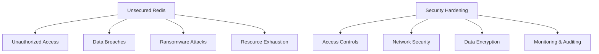

# Redis Security Hardening

## Introduction

Redis is an open-source, in-memory data structure store used as a database, cache, message broker, and streaming engine. While Redis offers exceptional performance and versatility, its default configuration prioritizes ease of use over security. This makes securing Redis a critical task for any production deployment.

In this guide, we'll explore essential security measures to protect your Redis instances from unauthorized access, data breaches, and other security threats. Whether you're running Redis in development, testing, or production environments, these hardening techniques will help you establish a robust security posture.

## Why Redis Security Matters

Redis was designed with speed and simplicity in mind, not security by default. Some of the security challenges with Redis include:

1. No authentication by default
2. No encryption for data in transit (without configuration)
3. Vulnerable to command injection if improperly configured
4. Potential exposure to the internet if network controls aren't in place



Let's dive into the specific hardening measures you can implement to secure your Redis deployment.

## 1. Authentication and Password Protection

### Setting a Strong Password

By default, Redis doesn't require authentication. This means anyone who can connect to the Redis port can access all data. The first step in hardening Redis is to set a strong password:

```bash
# In redis.conf file
requirepass "your_complex_password_here"
```

To set a password dynamically:

```bash
redis-cli> CONFIG SET requirepass "your_complex_password_here"
```

Once set, all clients must authenticate:

```bash
redis-cli> AUTH your_complex_password_here
OK
```

or connect with:

```bash
redis-cli -a your_complex_password_here
```

:::caution
Using the `-a` flag exposes your password in the command history and process list. It's better to use the `AUTH` command after connecting.
:::

### Using Redis ACLs (Access Control Lists)

Redis 6.0+ introduces a more granular authentication system with Access Control Lists (ACLs), allowing you to create multiple users with different permissions:

```bash
# Create a user with limited permissions
redis-cli> ACL SETUSER analyst ON >analyst_password ~* +@read
```

This creates a user "analyst" who:
- Is active (ON)
- Has password "analyst_password"
- Can access all keys (~*)
- Can only execute read commands (+@read)

To list all users:

```bash
redis-cli> ACL LIST
1) "user default on nopass ~* +@all"
2) "user analyst on #5ca2ab5c4b51782efba7270f0151d6517010e100b2d3a451df3647df249d4d61 ~* +@read"
```

## 2. Network Security

### Binding to Specific IP Addresses

By default, Redis binds to all network interfaces (0.0.0.0). Restrict this to specific interfaces:

```bash
# In redis.conf
bind 127.0.0.1 192.168.1.100
```

This configuration only allows connections from localhost and the specific IP 192.168.1.100.

### Disabling Dangerous Commands

Some Redis commands can be dangerous in production environments. Disable them with:

```bash
# In redis.conf
rename-command FLUSHALL ""
rename-command FLUSHDB ""
rename-command CONFIG ""
rename-command SHUTDOWN ""
```

Alternatively, rename them to something complex:

```bash
rename-command FLUSHALL "b840fc02d524045429941cc15f59e41cb7be6c52"
```

### Protected Mode

Redis 3.2+ includes protected mode, which prevents external connections when no password is set and Redis is bound to all interfaces:

```bash
# In redis.conf
protected-mode yes
```

### Firewalls and Security Groups

Always protect Redis with a firewall. For example, with `ufw` on Ubuntu:

```bash
sudo ufw allow from 192.168.1.0/24 to any port 6379
```

In cloud environments, use security groups or firewall rules to control access to your Redis instances.

## 3. Transport Layer Security (TLS)

Redis 6.0+ supports TLS encryption for data in transit. Configure it as follows:

```bash
# In redis.conf
tls-port 6380
tls-cert-file /path/to/redis.crt
tls-key-file /path/to/redis.key
tls-ca-cert-file /path/to/ca.crt
tls-auth-clients yes
```

Connect to a TLS-enabled Redis server:

```bash
redis-cli --tls --cert /path/to/client.crt --key /path/to/client.key --cacert /path/to/ca.crt -h redis.example.com -p 6380
```

## 4. Redis Configuration Hardening

### Disable Direct Memory Access

The `CONFIG` command lets clients modify server configuration at runtime. Restrict it in production:

```bash
# In redis.conf
rename-command CONFIG "ADMIN_CONFIG_120723"
```

### Set Resource Limits

Prevent resource exhaustion attacks:

```bash
# In redis.conf
maxmemory 1gb
maxmemory-policy allkeys-lru
maxclients 10000
timeout 60
```

### Disable Modules

Redis modules can execute arbitrary code. If not needed, disable them:

```bash
# In redis.conf
loadmodule ""
```

### Set Data Persistence Controls

Configure appropriate persistence settings to prevent data loss while managing security:

```bash
# In redis.conf
save 900 1
save 300 10
save 60 10000
dbfilename dump.rdb
dir /var/lib/redis
```

Ensure the directory permissions are restricted:

```bash
sudo chown redis:redis /var/lib/redis
sudo chmod 750 /var/lib/redis
```

## 5. Monitoring and Auditing

### Enable Logging

Configure Redis to log security events:

```bash
# In redis.conf
loglevel notice
logfile /var/log/redis/redis-server.log
```

### Monitor Redis Commands

Use the `MONITOR` command with caution (it adds overhead) to audit Redis activity:

```bash
redis-cli> MONITOR
1613753753.452156 [0 127.0.0.1:57862] "PING"
1613753754.021092 [0 127.0.0.1:57863] "SET" "user:1000" "{\"name\":\"John\"}"
```

### Set Up Alerts

Configure monitoring tools to alert on suspicious activities, like:
- Multiple failed authentication attempts
- Usage of renamed dangerous commands
- Unexpected traffic spikes

### Regular Security Audits

Perform periodic security audits of your Redis deployment:

```bash
# Example of checking network exposure
sudo netstat -tulpn | grep redis

# Check running Redis process permissions
ps aux | grep redis

# Verify file permissions
ls -la /etc/redis/redis.conf
```

## 6. Real-World Example: Securing a Production Redis Instance

Let's walk through securing a production Redis instance step by step:

1. First, create a dedicated Redis user:

```bash
sudo adduser --system --group --no-create-home redis
```

2. Set up a proper directory structure:

```bash
sudo mkdir -p /etc/redis /var/lib/redis /var/log/redis
sudo chown redis:redis /etc/redis /var/lib/redis /var/log/redis
sudo chmod 750 /etc/redis /var/lib/redis /var/log/redis
```

3. Create a secure configuration file:

```bash
sudo nano /etc/redis/redis.conf
```

With these settings:

```
# Basic configuration
port 6379
bind 127.0.0.1
daemonize yes
supervised systemd
pidfile /var/run/redis/redis-server.pid
loglevel notice
logfile /var/log/redis/redis-server.log

# Security settings
requirepass "YOUR_STRONG_PASSWORD_HERE"
rename-command FLUSHALL ""
rename-command FLUSHDB ""
rename-command CONFIG ""
protected-mode yes
maxmemory 2gb
maxmemory-policy allkeys-lru
maxclients 10000
timeout 60

# Persistence
dir /var/lib/redis
dbfilename dump.rdb
save 900 1
save 300 10
save 60 10000
```

4. Create a systemd service file:

```bash
sudo nano /etc/systemd/system/redis.service
```

With these contents:

```
[Unit]
Description=Redis In-Memory Data Store
After=network.target

[Service]
User=redis
Group=redis
ExecStart=/usr/local/bin/redis-server /etc/redis/redis.conf
ExecStop=/usr/local/bin/redis-cli shutdown
Restart=always

[Install]
WantedBy=multi-user.target
```

5. Set up firewall rules:

```bash
sudo ufw allow from 10.0.1.0/24 to any port 6379 proto tcp
```

6. Enable and start the service:

```bash
sudo systemctl daemon-reload
sudo systemctl enable redis
sudo systemctl start redis
```

7. Verify it's running securely:

```bash
# Test authentication
redis-cli
> AUTH YOUR_STRONG_PASSWORD_HERE
OK

# Try a restricted command
> CONFIG GET *
(error) ERR unknown command 'CONFIG'
```

## 7. Security Testing

### Testing Authentication

Test that authentication is properly enforced:

```bash
redis-cli
> SET mykey "test"
(error) NOAUTH Authentication required.
```

### Scanning for Open Redis Instances

Use tools like `nmap` to check for exposed Redis instances:

```bash
sudo nmap -p 6379 192.168.1.0/24 --open
```

### Penetration Testing

Consider using dedicated Redis security tools for thorough testing:

- Redis-cli for authentication testing
- Redis-check-aof and redis-check-rdb for data file integrity
- Custom scripts to test command restrictions

## Summary

Redis security hardening is an essential practice for any organization using Redis in production. By implementing the measures outlined in this guide, you can significantly reduce the attack surface and protect your data:

1. **Authentication**: Use strong passwords and ACLs
2. **Network Security**: Bind to specific IPs and use firewalls
3. **Encryption**: Enable TLS for data in transit
4. **Configuration Hardening**: Disable dangerous commands and set resource limits
5. **Monitoring**: Set up logging and alerting
6. **Regular Testing**: Validate your security controls

Remember that security is an ongoing process, not a one-time task. Regularly review and update your Redis security practices to address new vulnerabilities and threats.

## Additional Resources

- [Redis Security Documentation](https://redis.io/topics/security)
- [Redis ACL Documentation](https://redis.io/topics/acl)
- [Redis TLS Support](https://redis.io/topics/encryption)

## Exercises

1. Set up a Redis instance with password authentication and test that it works correctly.
2. Create three different Redis users with varying permission levels using ACLs.
3. Configure Redis to use TLS and test a secure connection.
4. Write a simple shell script to audit your Redis configuration for security best practices.
5. Develop a monitoring strategy for your Redis deployment, including what events to alert on.