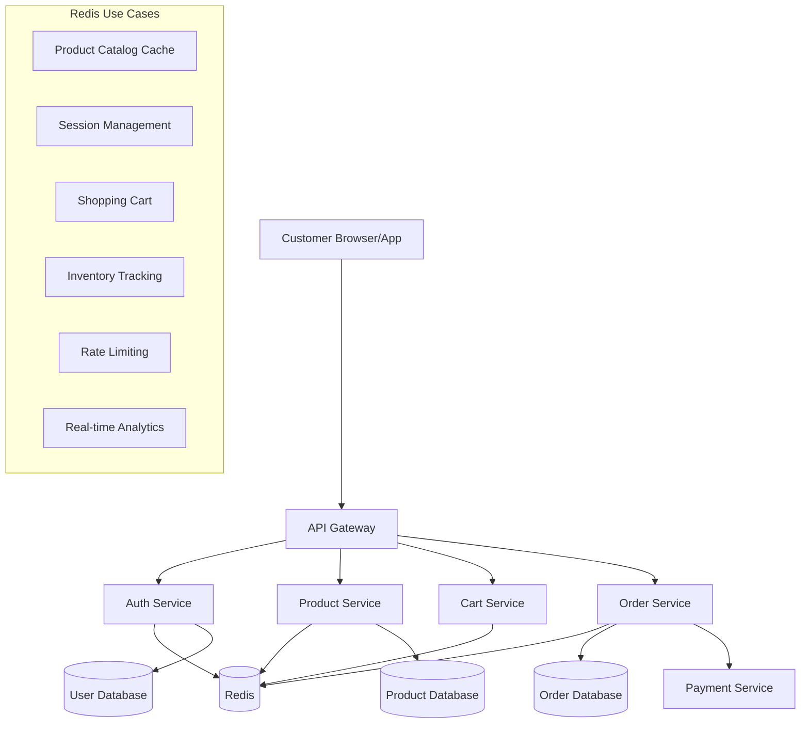

# Redis for E-commerce Applications

## Introduction

E-commerce platforms face unique challenges in delivering fast, reliable, and personalized shopping experiences. These applications must handle high traffic volumes, maintain real-time inventory updates, process transactions securely, and provide personalized recommendations—all while ensuring minimal latency.

Redis, an in-memory data structure store, offers powerful solutions for these e-commerce challenges. Its speed, versatility, and specialized data structures make it an excellent choice for building responsive and scalable online stores.

## Why Redis for E-commerce?

E-commerce applications benefit from Redis in several key areas:

1. **Performance**: Sub-millisecond response times critical for shopping experiences
2. **Scalability**: Ability to handle traffic spikes during sales events
3. **Real-time operations**: Instant updates for inventory, pricing, and user actions
4. **Session management**: Efficient handling of user sessions and cart data
5. **Caching**: Reducing database load for product catalogs and user data

Let's explore these benefits with practical implementations.

## Product Catalog Caching

One of the most common uses of Redis in e-commerce is caching product information to reduce database load and improve response times.

### Basic Product Caching

```javascript
// Store product in Redis
async function cacheProduct(productId, productData) {
  // Set product with expiration of 1 hour (3600 seconds)
  await redis.setex(`product:${productId}`, 3600, JSON.stringify(productData));
}

// Retrieve product from cache or database
async function getProduct(productId) {
  // Try to get from cache first
  const cachedProduct = await redis.get(`product:${productId}`);
  
  if (cachedProduct) {
    console.log('Cache hit: Product retrieved from Redis');
    return JSON.parse(cachedProduct);
  }
  
  // Cache miss - get from database
  console.log('Cache miss: Fetching product from database');
  const product = await database.getProduct(productId);
  
  // Update cache for next time
  if (product) {
    await cacheProduct(productId, product);
  }
  
  return product;
}
```

### Category Listings with Sorted Sets

Redis Sorted Sets are perfect for maintaining product listings by category with various sorting options:

```javascript
// Add product to category with price as score for sorting
async function addProductToCategory(categoryId, productId, price) {
  await redis.zadd(`category:${categoryId}:products:by-price`, price, productId);
}

// Get products in a category sorted by price (lowest first)
async function getProductsByPriceAsc(categoryId, offset = 0, limit = 20) {
  return await redis.zrange(`category:${categoryId}:products:by-price`, offset, offset + limit - 1);
}

// Get products in a category sorted by price (highest first)
async function getProductsByPriceDesc(categoryId, offset = 0, limit = 20) {
  return await redis.zrevrange(`category:${categoryId}:products:by-price`, offset, offset + limit - 1);
}
```

## Shopping Cart Implementation

Shopping carts need to be fast, reliable, and persistent across user sessions. Redis Hashes are an excellent choice for this purpose.

```javascript
// Add item to cart
async function addToCart(userId, productId, quantity) {
  // Increment quantity if product already in cart
  await redis.hincrby(`cart:${userId}`, productId, quantity);
}

// Remove item from cart
async function removeFromCart(userId, productId) {
  await redis.hdel(`cart:${userId}`, productId);
}

// Get full cart contents
async function getCart(userId) {
  const cartItems = await redis.hgetall(`cart:${userId}`);
  
  // Convert string quantities to numbers
  Object.keys(cartItems).forEach(key => {
    cartItems[key] = parseInt(cartItems[key], 10);
  });
  
  return cartItems;
}

// Example usage:
// addToCart('user123', 'product456', 2);
// Output: User's cart now has 2 of product456
```

## Real-time Inventory Management

Keeping track of inventory in real-time is crucial for e-commerce platforms to prevent overselling and provide accurate availability information to customers.

```javascript
// Initialize product stock
async function setInitialStock(productId, quantity) {
  await redis.set(`inventory:${productId}`, quantity);
}

// Decrement stock during checkout (with safeguard against negative stock)
async function decrementStock(productId, quantity) {
  // Using Redis transaction to ensure atomic operation
  const result = await redis.multi()
    .get(`inventory:${productId}`)
    .exec();
  
  const currentStock = parseInt(result[0][1], 10);
  
  if (currentStock < quantity) {
    throw new Error('Insufficient stock');
  }
  
  return await redis.decrby(`inventory:${productId}`, quantity);
}

// Check if product is in stock
async function isInStock(productId, requiredQuantity = 1) {
  const stock = await redis.get(`inventory:${productId}`);
  return parseInt(stock, 10) >= requiredQuantity;
}

// Example:
// setInitialStock('product789', 10);
// decrementStock('product789', 2);
// Output: Stock level is now 8
```

## Session Management

Redis is excellent for handling user sessions in e-commerce applications, providing fast access to user data across multiple services.

```javascript
// Create or update user session
async function setUserSession(sessionId, userData, expiryInSeconds = 3600) {
  await redis.setex(`session:${sessionId}`, expiryInSeconds, JSON.stringify(userData));
}

// Retrieve user session
async function getUserSession(sessionId) {
  const session = await redis.get(`session:${sessionId}`);
  return session ? JSON.parse(session) : null;
}

// Extend session expiry time
async function extendSession(sessionId, expiryInSeconds = 3600) {
  await redis.expire(`session:${sessionId}`, expiryInSeconds);
}

// Example:
// setUserSession('sess_123abc', { userId: 'user456', lastActivity: Date.now() });
// Output: Session created and valid for 1 hour
```

## Product Recommendations

Redis can power personalized product recommendations based on user browsing and purchase history.

### Recently Viewed Products

```javascript
// Add product to user's recently viewed list
async function addToRecentlyViewed(userId, productId, maxItems = 10) {
  // Use LPUSH to add to the beginning and LTRIM to keep only the most recent items
  await redis.lpush(`user:${userId}:recently-viewed`, productId);
  await redis.ltrim(`user:${userId}:recently-viewed`, 0, maxItems - 1);
}

// Get user's recently viewed products
async function getRecentlyViewed(userId, count = 5) {
  return await redis.lrange(`user:${userId}:recently-viewed`, 0, count - 1);
}

// Example:
// User views product123
// addToRecentlyViewed('user456', 'product123');
// Output: product123 added to user's recently viewed list
```

### Product Recommendations with Sets

```javascript
// Store product purchases together to build "frequently bought together" feature
async function recordPurchaseTogether(orderId, productIds) {
  // For each product pair in the order, increment their relationship score
  for (let i = 0; i < productIds.length; i++) {
    for (let j = i + 1; j < productIds.length; j++) {
      // Use sorted set to track relationship strength
      await redis.zincrby(`product:${productIds[i]}:bought-with`, 1, productIds[j]);
      await redis.zincrby(`product:${productIds[j]}:bought-with`, 1, productIds[i]);
    }
  }
}

// Get frequently bought together products
async function getFrequentlyBoughtTogether(productId, count = 5) {
  return await redis.zrevrange(`product:${productId}:bought-with`, 0, count - 1);
}

// Example usage:
// recordPurchaseTogether('order123', ['prod1', 'prod2', 'prod3']);
// Output: Relationship scores updated for product combinations
```

## Rate Limiting for APIs

E-commerce platforms often need to protect their APIs from abuse. Redis provides an elegant solution for rate limiting:

```javascript
// Basic rate limiter implementation
async function isRateLimited(userId, endpoint, maxRequests = 100, windowSeconds = 3600) {
  const key = `ratelimit:${userId}:${endpoint}`;
  const currentCount = await redis.incr(key);
  
  // Set expiry on first request
  if (currentCount === 1) {
    await redis.expire(key, windowSeconds);
  }
  
  return currentCount > maxRequests;
}

// Example usage:
// if (await isRateLimited('user123', 'product-api', 5, 60)) {
//   return '429 Too Many Requests';
// }
// Output: Rate limit check - returns true if user exceeded 5 requests per minute
```

## Flash Sales with Redis

Redis can help manage high-demand flash sales and limited-time offers:

```javascript
// Initialize a flash sale
async function createFlashSale(saleId, productId, totalStock, saleEndTime) {
  const pipeline = redis.pipeline();
  
  // Set available stock
  pipeline.set(`flash-sale:${saleId}:stock`, totalStock);
  
  // Set sale end time
  pipeline.set(`flash-sale:${saleId}:end-time`, saleEndTime);
  
  // Associate with product
  pipeline.set(`flash-sale:${saleId}:product`, productId);
  
  await pipeline.exec();
}

// Attempt to purchase from flash sale
async function purchaseFlashSale(saleId, userId, quantity = 1) {
  // Check if sale is still active
  const currentTime = Date.now();
  const endTime = await redis.get(`flash-sale:${saleId}:end-time`);
  
  if (currentTime > parseInt(endTime, 10)) {
    return { success: false, reason: 'Sale ended' };
  }
  
  // Use transaction to ensure atomicity
  const result = await redis.multi()
    .get(`flash-sale:${saleId}:stock`)
    .decrby(`flash-sale:${saleId}:stock`, quantity)
    .sadd(`flash-sale:${saleId}:purchasers`, userId)
    .exec();
  
  const initialStock = parseInt(result[0][1], 10);
  const remainingStock = parseInt(result[1][1], 10);
  
  // If stock went negative, revert the transaction
  if (remainingStock < 0) {
    await redis.incrby(`flash-sale:${saleId}:stock`, quantity);
    return { success: false, reason: 'Out of stock' };
  }
  
  return { 
    success: true, 
    product: await redis.get(`flash-sale:${saleId}:product`),
    remainingStock
  };
}

// Example:
// createFlashSale('summer-sale', 'limited-sneakers', 100, Date.now() + 3600000);
// Output: Flash sale created with 100 items, lasting for 1 hour
```

## Real-time Analytics

Track key metrics in real-time to understand customer behavior:

```javascript
// Increment page view counter
async function trackPageView(productId) {
  // Increment daily views
  await redis.incr(`stats:product:${productId}:views:${getDateKey()}`);
  
  // Increment total views
  await redis.incr(`stats:product:${productId}:views:total`);
}

// Track conversion (view-to-purchase ratio)
async function trackPurchase(productId, quantity = 1) {
  const dateKey = getDateKey();
  
  // Increment purchase count
  await redis.incrby(`stats:product:${productId}:purchases:${dateKey}`, quantity);
  
  // Increment total purchases
  await redis.incrby(`stats:product:${productId}:purchases:total`, quantity);
}

// Helper function to get current date in YYYYMMDD format
function getDateKey() {
  const date = new Date();
  return `${date.getFullYear()}${String(date.getMonth() + 1).padStart(2, '0')}${String(date.getDate()).padStart(2, '0')}`;
}

// Calculate conversion rate
async function getConversionRate(productId, dateKey = 'total') {
  const views = parseInt(await redis.get(`stats:product:${productId}:views:${dateKey}`) || '0', 10);
  const purchases = parseInt(await redis.get(`stats:product:${productId}:purchases:${dateKey}`) || '0', 10);
  
  if (views === 0) return 0;
  
  return (purchases / views) * 100;
}

// Example:
// trackPageView('product123');
// trackPurchase('product123', 2);
// getConversionRate('product123');
// Output: Conversion metrics updated and calculated
```

## E-commerce System Architecture with Redis

Here's a diagram showing how Redis fits into a typical e-commerce architecture:



## Best Practices for Redis in E-commerce

1. **Set appropriate TTLs (Time-To-Live)**: Use expiration for cached items to ensure data doesn't become stale.

2. **Use Redis data structures appropriately**:
   - Strings: For simple objects and values
   - Hashes: For product details, cart items
   - Lists: For recently viewed items, activity feeds
   - Sets: For category memberships, tags
   - Sorted Sets: For rankings, leaderboards, price-sorted products

3. **Implement cache invalidation strategies**: When products, prices, or inventory change, make sure to update Redis cache accordingly.

4. **Use Redis transactions for atomic operations**: Particularly important for inventory and cart operations.

5. **Consider Redis persistence options**: Configure RDB snapshots and/or AOF logs depending on your tolerance for data loss vs. performance requirements.

6. **Implement proper error handling and fallbacks**: Your application should gracefully handle Redis connection issues by falling back to the primary database.

7. **Use Redis Pub/Sub for real-time updates**: Notify connected clients about price changes, stock updates, or new promotions.

8. **Monitor and scale Redis appropriately**: Watch metrics like memory usage, hit/miss ratio, and response times. Consider Redis Cluster for large-scale deployments.

## Exercise: Building a Basic Redis-backed Shopping Cart

As a practical exercise, try implementing a simple shopping cart system with Redis:

1. Create functions to add items to cart
2. Create functions to update quantities
3. Create functions to remove items
4. Create a function to clear the cart
5. Create a function to retrieve the cart with product details
6. Add expiration to carts (e.g., items stay in cart for 24 hours)

## Summary

Redis provides powerful capabilities for e-commerce applications through its in-memory performance, versatile data structures, and features like expiration and atomic operations. Key use cases include:

- Product catalog caching
- Shopping cart management
- Session handling
- Inventory tracking
- Rate limiting for APIs
- Flash sales management
- Real-time analytics

By leveraging Redis alongside your primary database, you can build e-commerce platforms that deliver exceptional performance, handle high traffic volumes, and provide personalized shopping experiences.

## Additional Resources

- [Redis Official Documentation](https://redis.io/documentation)
- [Redis e-commerce Case Studies](https://redis.com/solutions/use-cases/ecommerce/)
- [Redis University - Free Online Courses](https://university.redis.com/)
- [RedisJSON for storing complex product data](https://redis.io/docs/stack/json/)
- [RedisSearch for powerful product search capabilities](https://redis.io/docs/stack/search/)