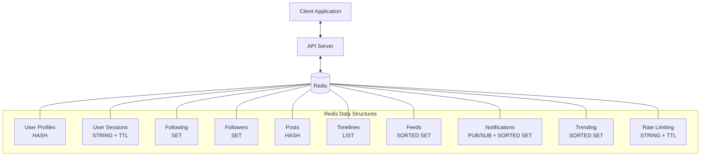

# Redis for Social Media Applications

## Introduction

Social media platforms face unique challenges when it comes to data management. They need to handle millions of users, process vast amounts of data in real-time, and deliver seamless experiences with minimal latency. Traditional databases often struggle with these demands.

Redis, an in-memory data structure store, offers powerful solutions for social media applications. Its speed, versatility, and specialized data structures make it ideal for implementing many core social media features. In this guide, we'll explore how Redis can be used to build and scale social media applications efficiently.

## Why Redis for Social Media?

Redis excels in social media applications for several reasons:

- **Speed**: With in-memory operations, Redis can handle high throughput with sub-millisecond latency
- **Data structures**: Specialized structures like Sets, Sorted Sets, and Lists map perfectly to social features
- **Pub/Sub capabilities**: Enables real-time notifications and updates
- **Time-to-live (TTL)**: Automatic expiration for temporary data like session information
- **Scalability**: Can be clustered to handle growing user bases

## Core Social Media Features with Redis

Let's explore how Redis can implement common social media functionalities:

### 1. User Sessions and Authentication

Redis is perfect for managing user sessions due to its speed and TTL capabilities:

```javascript
// Store a user session with 30-minute expiration
await redis.set(`session:${userId}`, sessionData, 'EX', 1800);

// Retrieve session data
const session = await redis.get(`session:${userId}`);

// Extend session during user activity
await redis.expire(`session:${userId}`, 1800);
```

### 2. User Profiles and Relationships

#### User Profiles

Store user profile information in Redis Hashes:

```javascript
// Create/update a user profile
await redis.hset(
  `user:${userId}`, 
  'username', 'johndoe',
  'name', 'John Doe',
  'bio', 'Software developer and Redis enthusiast',
  'joined', '2023-05-15'
);

// Get specific fields from a profile
const username = await redis.hget(`user:${userId}`, 'username');

// Get entire profile
const profile = await redis.hgetall(`user:${userId}`);
```

#### Following/Followers

Redis Sets are perfect for representing social connections:

```javascript
// User1 follows User2
await redis.sadd(`following:${user1Id}`, user2Id);
await redis.sadd(`followers:${user2Id}`, user1Id);

// Check if User1 follows User2
const isFollowing = await redis.sismember(`following:${user1Id}`, user2Id);

// Get all followers of User2
const followers = await redis.smembers(`followers:${user2Id}`);

// Count followers
const followerCount = await redis.scard(`followers:${user2Id}`);

// Unfollow
await redis.srem(`following:${user1Id}`, user2Id);
await redis.srem(`followers:${user2Id}`, user1Id);
```

### 3. News Feeds and Timelines

Redis Lists work well for basic timelines:

```javascript
// Add a new post to a user's timeline
await redis.lpush(`timeline:${userId}`, postId);

// Limit timeline to 100 most recent posts
await redis.ltrim(`timeline:${userId}`, 0, 99);

// Get recent posts (first 10)
const recentPosts = await redis.lrange(`timeline:${userId}`, 0, 9);
```

For more complex feeds that combine posts from multiple followed users, we can use Redis Sorted Sets:

```javascript
// When a user creates a post, add it to feeds of all followers
async function addPostToFollowerFeeds(userId, postId, timestamp) {
  // Get all followers
  const followers = await redis.smembers(`followers:${userId}`);
  
  // Add post to each follower's feed
  const pipeline = redis.pipeline();
  followers.forEach(followerId => {
    pipeline.zadd(`feed:${followerId}`, timestamp, postId);
    // Limit feed size to prevent unbounded growth
    pipeline.zremrangebyrank(`feed:${followerId}`, 0, -501);
  });
  
  return pipeline.exec();
}

// Get a user's feed (most recent 10 posts)
const feedItems = await redis.zrevrange(`feed:${userId}`, 0, 9);
```

### 4. Real-time Notifications

Redis Pub/Sub is ideal for delivering notifications in real-time:

```javascript
// Server-side: publish a notification when User2 likes User1's post
await redis.publish(`notifications:${user1Id}`, JSON.stringify({
  type: 'like',
  actor: user2Id,
  postId: postId,
  timestamp: Date.now()
}));

// Client-side: subscribe to notifications
const subscriber = redis.duplicate();
await subscriber.subscribe(`notifications:${userId}`);
subscriber.on('message', (channel, message) => {
  const notification = JSON.parse(message);
  displayNotification(notification);
});
```

For persistent notifications, store them in a Sorted Set:

```javascript
// Store notification
await redis.zadd(
  `user:${userId}:notifications`,
  Date.now(),
  JSON.stringify({
    type: 'follow',
    actor: followerUserId,
    read: false
  })
);

// Get recent unread notifications
const notifications = await redis.zrevrange(`user:${userId}:notifications`, 0, 9);

// Mark as read
await redis.zadd(
  `user:${userId}:notifications`,
  Date.now(),
  JSON.stringify({
    ...notification,
    read: true
  })
);
```

### 5. Trending Topics and Content

Redis can track trending topics using Sorted Sets with decay:

```javascript
// Increment hashtag counter
await redis.zincrby('trending_hashtags', 1, '#redis');

// Get top 10 trending hashtags
const trendingHashtags = await redis.zrevrange('trending_hashtags', 0, 9, 'WITHSCORES');

// Implement time decay (run periodically)
async function decayTrends() {
  const hashtags = await redis.zrange('trending_hashtags', 0, -1, 'WITHSCORES');
  const pipeline = redis.pipeline();
  
  for (let i = 0; i < hashtags.length; i += 2) {
    const hashtag = hashtags[i];
    const score = parseFloat(hashtags[i + 1]);
    // Apply 5% decay
    pipeline.zadd('trending_hashtags', score * 0.95, hashtag);
  }
  
  return pipeline.exec();
}
```

### 6. Rate Limiting and API Protection

Protect your API from abuse with Redis rate limiting:

```javascript
async function isRateLimited(userId, endpoint, limit, windowSeconds) {
  const key = `ratelimit:${userId}:${endpoint}`;
  const current = await redis.incr(key);
  
  // Set expiry on first request
  if (current === 1) {
    await redis.expire(key, windowSeconds);
  }
  
  return current > limit;
}

// Usage example
app.post('/api/posts', async (req, res) => {
  const limited = await isRateLimited(req.userId, 'create_post', 5, 60);
  
  if (limited) {
    return res.status(429).json({ error: 'Rate limit exceeded. Try again later.' });
  }
  
  // Handle post creation
});
```

## Real-world Implementation: Building a Twitter-like Timeline

Let's implement a Twitter-like home timeline that combines posts from followed users:

```javascript
// User follows structure
/*
  following:user:1 -> [2, 3, 4]  // User 1 follows users 2, 3, and 4
  posts:user:2 -> [post1, post2]  // Posts by user 2
*/

async function createPost(userId, content) {
  // Generate unique post ID
  const postId = `post:${Date.now()}:${userId}`;
  
  // Store post data
  await redis.hset(
    postId,
    'userId', userId,
    'content', content,
    'timestamp', Date.now(),
    'likes', 0
  );
  
  // Add to user's posts
  await redis.lpush(`posts:user:${userId}`, postId);
  
  // Add to followers' timelines
  const followers = await redis.smembers(`followers:${userId}`);
  const pipeline = redis.pipeline();
  
  followers.forEach(followerId => {
    pipeline.lpush(`timeline:${followerId}`, postId);
    pipeline.ltrim(`timeline:${followerId}`, 0, 999); // Keep 1000 most recent
  });
  
  // Add to user's own timeline
  pipeline.lpush(`timeline:${userId}`, postId);
  pipeline.ltrim(`timeline:${userId}`, 0, 999);
  
  return pipeline.exec();
}

async function getTimeline(userId, page = 0, pageSize = 10) {
  const start = page * pageSize;
  const end = start + pageSize - 1;
  
  // Get post IDs from timeline
  const postIds = await redis.lrange(`timeline:${userId}`, start, end);
  
  if (postIds.length === 0) {
    return [];
  }
  
  // Fetch post details
  const pipeline = redis.pipeline();
  postIds.forEach(postId => {
    pipeline.hgetall(postId);
  });
  
  const results = await pipeline.exec();
  return results.map(result => result[1]);
}
```

## Visualization: Redis Social Media Architecture



## Performance Considerations

When implementing Redis for social media, keep these performance tips in mind:

1. **Use pipelining** for batched operations to reduce network roundtrips
2. **Consider Redis Cluster** for horizontal scaling as your user base grows
3. **Implement cache eviction policies** to manage memory usage
4. **Use Redis Streams** for activity feeds that need strict ordering with consumer groups
5. **Leverage Redis modules** like RedisSearch for advanced search capabilities
6. **Implement fan-out on write carefully** for users with millions of followers

## Common Challenges and Solutions

| Challenge | Solution with Redis |
|-----------|-------------------|
| High-cardinality relationships | Use Redis Sets with careful fan-out strategies |
| Real-time notifications | Combine Pub/Sub with persistent storage in Sorted Sets |
| Feed personalization | Use Sorted Sets with custom scoring algorithms |
| Rate limiting | Implement sliding window counters with TTL |
| Data consistency | Consider using Redis transactions for atomic operations |

## Summary

Redis provides powerful tools for building scalable social media applications with its specialized data structures and real-time capabilities. We've explored how to implement:

- User profiles and authentication
- Social relationships (following/followers)
- Timelines and feeds
- Real-time notifications
- Trending content analysis
- Rate limiting and protection

By leveraging Redis properly, you can create social media applications that handle millions of users while maintaining high performance and real-time interactions.

## Exercises

1. Implement a "like" feature that updates counters and notifications.
2. Create a Redis-based solution for comment threads on posts.
3. Design a system for hashtag tracking and search using Redis.
4. Build a direct messaging feature using Redis Pub/Sub and persistent storage.
5. Implement a content moderation queue using Redis Lists.

## Additional Resources

- [Redis Documentation](https://redis.io/documentation)
- [Redis University](https://university.redis.com/)
- [Redis Streams Documentation](https://redis.io/topics/streams-intro)
- [Redis in Action](http://redisbook.com/) - Practical Redis examples
- [Redis Labs Blog](https://redislabs.com/blog/) - Advanced Redis patterns and use cases