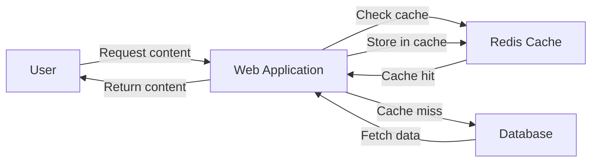

# Redis Content Delivery

## Introduction

Redis (Remote Dictionary Server) is a powerful and versatile in-memory data structure store that can be used for a wide range of purposes. One of its most valuable applications is content delivery - using Redis to serve content to users quickly and efficiently.

In today's fast-paced web environment, delivering content rapidly is crucial for user experience and engagement. When users have to wait for content to load, they often become frustrated and may leave your site. Redis offers a solution to this problem by providing a lightning-fast caching layer that can dramatically reduce content delivery times.

In this guide, we'll explore how Redis can be used for content delivery, why it's an excellent choice for this purpose, and how to implement it in your applications.

## Why Use Redis for Content Delivery?

Before diving into implementation details, let's understand why Redis is particularly well-suited for content delivery:

1. **Speed**: Redis operates in-memory, making it extremely fast compared to disk-based solutions.
2. **Versatility**: Redis supports various data structures like strings, hashes, lists, and more, allowing for flexible content storage.
3. **Time-to-live (TTL)**: Redis allows you to set expiration times for cached content, ensuring your users always get fresh data.
4. **Pub/Sub capabilities**: Redis can notify your application when content changes, enabling real-time updates.
5. **Scalability**: Redis can be scaled horizontally using Redis Cluster to handle large amounts of traffic.

## Basic Redis Content Delivery Concepts

### Caching Content with Redis

At its core, Redis content delivery works by storing frequently accessed content in Redis instead of fetching it from slower sources (like a database or external API). Here's a simplified flow:



### Key Content Delivery Patterns

1. **Simple Caching**: Store content with a unique key for direct retrieval.
2. **Content Invalidation**: Update or remove cached content when the source data changes.
3. **Hierarchical Caching**: Cache different parts of content separately for more granular control.
4. **Content Prefetching**: Proactively cache content before it's requested.

## Implementing Redis Content Delivery

Let's implement a basic Redis content delivery system using Node.js and the `redis` client. First, you'll need to install the necessary packages:

```bash
npm install redis
```

### Basic Content Caching Example

Here's a simple Express.js application that uses Redis to cache article content:

```javascript
const express = require('express');
const redis = require('redis');
const { promisify } = require('util');

const app = express();
const client = redis.createClient();

// Promisify Redis commands
const getAsync = promisify(client.get).bind(client);
const setAsync = promisify(client.set).bind(client);

// Simulated database function (in real life, this would query a database)
async function fetchArticleFromDB(articleId) {
  console.log('Fetching article from database...');
  // Simulate database delay
  await new Promise(resolve => setTimeout(resolve, 1000));
  
  return {
    id: articleId,
    title: `Article ${articleId}`,
    content: `This is the content of article ${articleId}. It contains lots of valuable information.`,
    author: 'John Doe',
    publishedDate: '2023-06-15'
  };
}

app.get('/articles/:id', async (req, res) => {
  const articleId = req.params.id;
  const cacheKey = `article:${articleId}`;
  
  try {
    // Try to get article from Redis cache
    const cachedArticle = await getAsync(cacheKey);
    
    if (cachedArticle) {
      console.log('Cache hit! Returning cached article');
      return res.json(JSON.parse(cachedArticle));
    }
    
    // If not in cache, fetch from database
    console.log('Cache miss! Fetching from database');
    const article = await fetchArticleFromDB(articleId);
    
    // Store in cache for future requests (cache for 1 hour)
    await setAsync(cacheKey, JSON.stringify(article), 'EX', 3600);
    
    return res.json(article);
  } catch (error) {
    console.error('Error fetching article:', error);
    res.status(500).json({ error: 'Failed to fetch article' });
  }
});

app.listen(3000, () => {
  console.log('Server running on port 3000');
});
```

In this example:
1. When a user requests an article, we first check if it's in the Redis cache.
2. If it is (cache hit), we return it immediately.
3. If not (cache miss), we fetch it from the database, store it in Redis for future requests, and then return it.

### Input/Output Example

#### Request:
```
GET /articles/123
```

#### First Request Output (Cache Miss):
```json
// Server logs:
// "Cache miss! Fetching from database"
// "Fetching article from database..."

{
  "id": "123",
  "title": "Article 123",
  "content": "This is the content of article 123. It contains lots of valuable information.",
  "author": "John Doe",
  "publishedDate": "2023-06-15"
}
```

#### Second Request Output (Cache Hit):
```json
// Server logs:
// "Cache hit! Returning cached article"

{
  "id": "123",
  "title": "Article 123",
  "content": "This is the content of article 123. It contains lots of valuable information.",
  "author": "John Doe",
  "publishedDate": "2023-06-15"
}
```

The second request is processed much faster because it's served directly from Redis cache!

## Advanced Content Delivery Techniques

### Content Invalidation

When your content changes, you need to update or invalidate the cached version. Here's how to handle content updates:

```javascript
app.put('/articles/:id', async (req, res) => {
  const articleId = req.params.id;
  const cacheKey = `article:${articleId}`;
  const updatedArticle = req.body;
  
  try {
    // Update the article in the database
    // (Implementation not shown for brevity)
    
    // Update the cache with new content
    await setAsync(cacheKey, JSON.stringify(updatedArticle), 'EX', 3600);
    
    return res.json({ message: 'Article updated successfully' });
  } catch (error) {
    console.error('Error updating article:', error);
    res.status(500).json({ error: 'Failed to update article' });
  }
});

// Alternatively, to delete from cache
app.delete('/articles/:id', async (req, res) => {
  const articleId = req.params.id;
  const cacheKey = `article:${articleId}`;
  
  try {
    // Delete the article from the database
    // (Implementation not shown for brevity)
    
    // Remove from cache
    await promisify(client.del).bind(client)(cacheKey);
    
    return res.json({ message: 'Article deleted successfully' });
  } catch (error) {
    console.error('Error deleting article:', error);
    res.status(500).json({ error: 'Failed to delete article' });
  }
});
```

### Caching with Expiration

Redis allows you to set an expiration time for cached content, which is useful for content that changes frequently:

```javascript
// Cache article for 1 hour
await setAsync(cacheKey, JSON.stringify(article), 'EX', 3600);

// Cache user profile for 15 minutes
await setAsync(`user:${userId}`, JSON.stringify(userProfile), 'EX', 900);

// Cache homepage content for 5 minutes
await setAsync('homepage:content', JSON.stringify(homepageData), 'EX', 300);
```

### Using Redis Hashes for Content Parts

For content with multiple components, Redis hashes are more efficient than storing each part separately:

```javascript
// Store product details using hashes
async function cacheProduct(productId, product) {
  const cacheKey = `product:${productId}`;
  
  // Using hset to store multiple fields
  await promisify(client.hset).bind(client)(
    cacheKey,
    'name', product.name,
    'price', product.price.toString(),
    'description', product.description,
    'imageUrl', product.imageUrl,
    'category', product.category,
    'inStock', product.inStock.toString()
  );
  
  // Set expiration
  await promisify(client.expire).bind(client)(cacheKey, 3600);
}

// Retrieve product
async function getProduct(productId) {
  const cacheKey = `product:${productId}`;
  
  // Get all fields
  const productData = await promisify(client.hgetall).bind(client)(cacheKey);
  
  if (!productData || Object.keys(productData).length === 0) {
    return null; // Cache miss
  }
  
  // Convert numeric strings back to numbers
  return {
    ...productData,
    price: parseFloat(productData.price),
    inStock: productData.inStock === 'true'
  };
}
```

## Real-World Use Cases

### E-commerce Product Catalog

For an e-commerce site, product data can be cached in Redis to speed up browsing:

```javascript
async function getCategoryProducts(categoryId) {
  const cacheKey = `category:${categoryId}:products`;
  
  // Try to get from cache
  const cachedProducts = await getAsync(cacheKey);
  
  if (cachedProducts) {
    return JSON.parse(cachedProducts);
  }
  
  // Fetch from database (slow operation)
  const products = await db.query(
    'SELECT * FROM products WHERE category_id = $1',
    [categoryId]
  );
  
  // Cache for 30 minutes
  await setAsync(cacheKey, JSON.stringify(products), 'EX', 1800);
  
  return products;
}
```

### Content Management System (CMS)

For a CMS, Redis can cache rendered pages or content blocks:

```javascript
async function getPageContent(pageSlug) {
  const cacheKey = `page:${pageSlug}`;
  
  // Try to get from cache
  const cachedPage = await getAsync(cacheKey);
  
  if (cachedPage) {
    return JSON.parse(cachedPage);
  }
  
  // Fetch page content, sections, and components (complex operation)
  const pageContent = await fetchPageContentFromCMS(pageSlug);
  
  // Process and render the page (potentially expensive operation)
  const renderedPage = renderPageContent(pageContent);
  
  // Cache the rendered page for 1 hour
  await setAsync(cacheKey, JSON.stringify(renderedPage), 'EX', 3600);
  
  return renderedPage;
}

// When content is updated in the CMS
function invalidatePageCache(pageSlug) {
  const cacheKey = `page:${pageSlug}`;
  client.del(cacheKey);
}
```

### Social Media Feed

For a social media application, Redis can cache user feeds:

```javascript
async function getUserFeed(userId) {
  const cacheKey = `user:${userId}:feed`;
  
  // Try to get from cache
  const cachedFeed = await getAsync(cacheKey);
  
  if (cachedFeed) {
    return JSON.parse(cachedFeed);
  }
  
  // Complex operation to generate feed based on follows, etc.
  const feed = await generateUserFeed(userId);
  
  // Cache for 5 minutes (feeds update frequently)
  await setAsync(cacheKey, JSON.stringify(feed), 'EX', 300);
  
  return feed;
}
```

## Performance Considerations

### Monitoring Cache Hit Rate

To ensure your Redis content delivery system is effective, monitor your cache hit rate:

```javascript
let requests = 0;
let cacheHits = 0;

app.use((req, res, next) => {
  requests++;
  next();
});

function recordCacheHit() {
  cacheHits++;
}

// Every hour, log cache performance
setInterval(() => {
  const hitRate = (cacheHits / requests) * 100;
  console.log(`Cache hit rate: ${hitRate.toFixed(2)}%`);
  requests = 0;
  cacheHits = 0;
}, 3600000);
```

### Memory Management

Redis stores data in memory, so it's important to monitor memory usage:

```javascript
// Helper function to check Redis memory usage
async function checkRedisMemory() {
  const info = await promisify(client.info).bind(client)('memory');
  const usedMemory = info
    .split('
')
    .find(line => line.startsWith('used_memory_human:'))
    .split(':')[1]
    .trim();
  
  console.log(`Redis memory usage: ${usedMemory}`);
}

// Check memory usage every 10 minutes
setInterval(checkRedisMemory, 600000);
```

## Best Practices for Redis Content Delivery

1. **Use appropriate key names**: Develop a consistent naming convention for your keys, like `content-type:id`.
2. **Set reasonable TTLs**: Set expiration times based on how frequently your content changes.
3. **Implement cache invalidation**: Remove or update cached content when the source data changes.
4. **Use compression for large content**: For large text content, consider compressing before caching.
5. **Monitor cache hit rates**: Track how often your cache is being used effectively.
6. **Use pipelining for batch operations**: When fetching or storing multiple items, use Redis pipelining.
7. **Consider using Redis Cluster for scaling**: For high-traffic applications, Redis Cluster provides horizontal scaling.

## Summary

Redis is an excellent choice for content delivery due to its speed, versatility, and powerful features. By implementing Redis as a caching layer in your application, you can:

- Dramatically reduce load times for your users
- Decrease the load on your primary database
- Handle traffic spikes more effectively
- Create a more responsive user experience

The examples in this guide provide a starting point for implementing Redis content delivery in your applications. From simple article caching to complex e-commerce product catalogs, Redis can significantly improve your content delivery performance.

## Additional Resources and Exercises

### Resources

- Redis official documentation: [redis.io/documentation](https://redis.io/documentation)
- Redis Node.js client: [npm.js/package/redis](https://www.npmjs.com/package/redis)
- Redis University free courses: [university.redis.com](https://university.redis.com/)

### Exercises

1. **Basic Cache Implementation**: Modify the article caching example to include categories and tags.
2. **Cache Invalidation Challenge**: Implement a system that automatically invalidates cached content when the database is updated.
3. **Performance Testing**: Create a benchmark test to compare the performance of your application with and without Redis caching.
4. **Content Prefetching**: Implement a system that predicts what content users might request next and prefetches it into Redis.
5. **Rate Limiting**: Use Redis to implement rate limiting for your content delivery API.

By working through these exercises, you'll gain practical experience with Redis content delivery and be able to implement effective caching strategies in your own applications.