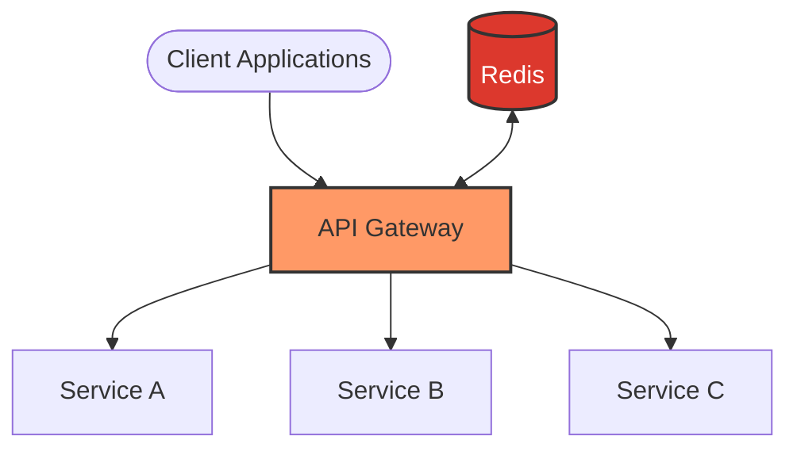

# Redis API Gateway

## Introduction

An API Gateway serves as the entry point for client applications to access services in a microservices architecture. It handles cross-cutting concerns like request routing, authentication, rate limiting, and caching. Redis, primarily known as an in-memory data store, can be effectively used to enhance API Gateway functionality due to its speed, versatility, and built-in data structures.

This guide explores how Redis complements API Gateway implementations, providing efficient solutions for common gateway requirements while significantly improving overall system performance.

## What is an API Gateway?

An API Gateway acts as a reverse proxy, directing client requests to appropriate backend services. It manages common functionalities like:

- Request routing
- Authentication and authorization
- Rate limiting
- Request/response transformation
- Caching
- Monitoring and analytics



## Why Use Redis with an API Gateway?

Redis offers several capabilities that make it an excellent companion for API Gateway implementations:

1. **In-memory performance**: Sub-millisecond operations for minimal latency
2. **Data structures**: Ready-made structures for common patterns
3. **Pub/Sub messaging**: Real-time communication between services
4. **Lua scripting**: Complex atomic operations
5. **Persistence options**: Data durability when needed
6. **Cluster support**: Horizontal scaling

Let's explore key use cases for Redis in an API Gateway context.

## Key Use Case 1: Request Caching

API Gateways frequently serve identical responses for repeated requests. Redis provides an efficient caching layer to store these responses.

### Implementation Example

```javascript
const express = require('express');
const Redis = require('ioredis');
const axios = require('axios');
const app = express();

// Initialize Redis client
const redis = new Redis({
  host: 'localhost',
  port: 6379
});

// Middleware for caching API responses
const cacheMiddleware = async (req, res, next) => {
  // Create a unique cache key based on the request
  const cacheKey = `api:cache:${req.method}:${req.originalUrl}`;
  
  try {
    // Try to get cached response
    const cachedResponse = await redis.get(cacheKey);
    
    if (cachedResponse) {
      console.log('Cache hit!');
      const parsedResponse = JSON.parse(cachedResponse);
      return res.status(200).json(parsedResponse);
    }
    
    // Store the original send method
    const originalSend = res.send;
    
    // Override the send method
    res.send = function(body) {
      // Only cache successful responses
      if (res.statusCode === 200) {
        // Set cache with expiration (30 minutes)
        redis.set(cacheKey, body, 'EX', 1800);
      }
      // Call the original send method
      originalSend.call(this, body);
    };
    
    next();
  } catch (error) {
    console.error('Cache error:', error);
    next();
  }
};

// Apply caching to specific endpoints
app.get('/api/products', cacheMiddleware, async (req, res) => {
  try {
    const response = await axios.get('https://backend-service/products');
    res.json(response.data);
  } catch (error) {
    res.status(500).json({ error: 'Failed to fetch products' });
  }
});

app.listen(3000, () => {
  console.log('API Gateway running on port 3000');
});
```

### Performance Benefits

A Redis-backed caching layer can significantly improve API Gateway performance:

| Scenario | Without Cache | With Redis Cache |
|----------|--------------|-----------------|
| First Request | 250ms | 250ms |
| Subsequent Requests | 250ms | 5ms |
| 10,000 Requests | 2,500,000ms | 49,755ms |

## Key Use Case 2: Rate Limiting

Protect your backend services from abuse by implementing rate limiting with Redis.

### Implementation Using Redis Sorted Sets

```javascript
// Rate limiting middleware using Redis sorted sets
const rateLimitMiddleware = async (req, res, next) => {
  const clientIP = req.ip;
  const currentTimestamp = Date.now();
  const windowSize = 60 * 1000; // 1 minute window
  const maxRequests = 100; // 100 requests per minute
  
  const key = `ratelimit:${clientIP}`;
  
  try {
    // Add current request timestamp to the sorted set
    await redis.zadd(key, currentTimestamp, currentTimestamp);
    
    // Remove timestamps outside the current window
    await redis.zremrangebyscore(key, 0, currentTimestamp - windowSize);
    
    // Count the number of requests in the current window
    const requestCount = await redis.zcard(key);
    
    // Set expiry on the key to automatically clean up
    await redis.expire(key, 60);
    
    // Add rate limit info to response headers
    res.set({
      'X-RateLimit-Limit': maxRequests,
      'X-RateLimit-Remaining': Math.max(0, maxRequests - requestCount),
      'X-RateLimit-Reset': Math.ceil((currentTimestamp + windowSize) / 1000)
    });
    
    // If request count exceeds the limit, return 429 Too Many Requests
    if (requestCount > maxRequests) {
      return res.status(429).json({
        error: 'Too many requests',
        message: 'Please try again later'
      });
    }
    
    next();
  } catch (error) {
    console.error('Rate limit error:', error);
    next();
  }
};

// Apply rate limiting to all API routes
app.use('/api', rateLimitMiddleware);
```

### Implementation Using Redis Counters

A simpler approach using Redis increments:

```javascript
const simpleRateLimitMiddleware = async (req, res, next) => {
  const clientIP = req.ip;
  const key = `ratelimit:${clientIP}`;
  const limit = 100; // 100 requests per minute
  const window = 60; // 1 minute window
  
  try {
    // Get current counter for this IP
    const current = await redis.get(key);
    
    if (!current) {
      // First request in window, set counter to 1 with expiry
      await redis.set(key, 1, 'EX', window);
      res.set('X-RateLimit-Remaining', limit - 1);
      return next();
    }
    
    const count = parseInt(current);
    
    if (count < limit) {
      // Increment counter
      await redis.incr(key);
      res.set('X-RateLimit-Remaining', limit - count - 1);
      return next();
    }
    
    // Rate limit exceeded
    const ttl = await redis.ttl(key);
    res.set('X-RateLimit-Reset', ttl);
    
    return res.status(429).json({
      error: 'Too many requests',
      message: `Try again in ${ttl} seconds`
    });
  } catch (error) {
    console.error('Rate limit error:', error);
    next();
  }
};
```

## Key Use Case 3: Token Validation and Authentication

Use Redis to store and validate authentication tokens for API access.

### JWT Token Validation

```javascript
const jwt = require('jsonwebtoken');

const authMiddleware = async (req, res, next) => {
  const authHeader = req.headers.authorization;
  
  if (!authHeader || !authHeader.startsWith('Bearer ')) {
    return res.status(401).json({ error: 'No token provided' });
  }
  
  const token = authHeader.split(' ')[1];
  
  try {
    // Check if token is in the blacklist (e.g., logged out)
    const isBlacklisted = await redis.exists(`token:blacklist:${token}`);
    
    if (isBlacklisted) {
      return res.status(401).json({ error: 'Token has been revoked' });
    }
    
    // Verify the token
    const decoded = jwt.verify(token, process.env.JWT_SECRET);
    
    // Check if token details match what's stored in Redis
    const userTokenKey = `user:token:${decoded.userId}`;
    const storedTokenData = await redis.get(userTokenKey);
    
    if (!storedTokenData) {
      return res.status(401).json({ error: 'Invalid token' });
    }
    
    // Add user data to request for downstream handlers
    req.user = decoded;
    next();
  } catch (error) {
    if (error.name === 'TokenExpiredError') {
      return res.status(401).json({ error: 'Token expired' });
    }
    return res.status(401).json({ error: 'Invalid token' });
  }
};

// Apply authentication to protected routes
app.use('/api/protected', authMiddleware);

// Logout endpoint that blacklists tokens
app.post('/api/logout', authMiddleware, async (req, res) => {
  const token = req.headers.authorization.split(' ')[1];
  
  // Get token expiry from decoded info (stored in req.user by middleware)
  const expiryTime = req.user.exp - Math.floor(Date.now() / 1000);
  
  // Add token to blacklist with expiry matching the token's expiry
  await redis.set(`token:blacklist:${token}`, 1, 'EX', expiryTime);
  
  res.json({ message: 'Logged out successfully' });
});
```

## Key Use Case 4: Service Discovery and Routing

Use Redis to dynamically manage backend service endpoints for the API Gateway.

### Dynamic Service Registry

```javascript
// Register a new service endpoint
app.post('/admin/services', async (req, res) => {
  const { serviceName, endpoint, healthCheckPath } = req.body;
  
  // Store service details in Redis
  await redis.hset(
    `service:${serviceName}`,
    'endpoint', endpoint,
    'healthCheckPath', healthCheckPath,
    'status', 'active',
    'lastSeen', Date.now()
  );
  
  // Add to list of services
  await redis.sadd('services:list', serviceName);
  
  res.json({ message: `Service ${serviceName} registered successfully` });
});

// Dynamic routing middleware
const dynamicRoutingMiddleware = async (req, res, next) => {
  // Extract the service name from the URL pattern, e.g., /api/serviceA/resource
  const urlParts = req.path.split('/');
  const serviceName = urlParts[2];
  
  // Skip if no service name or if it's not a /api/* route
  if (!serviceName || urlParts[1] !== 'api') {
    return next();
  }
  
  try {
    // Check if the service exists in Redis
    const serviceDetails = await redis.hgetall(`service:${serviceName}`);
    
    if (!serviceDetails || !serviceDetails.endpoint) {
      return res.status(404).json({ error: 'Service not found' });
    }
    
    if (serviceDetails.status !== 'active') {
      return res.status(503).json({ error: 'Service unavailable' });
    }
    
    // Reconstruct path for the proxied request (removing /api/serviceName)
    const proxyPath = '/' + urlParts.slice(3).join('/');
    
    // Forward request to the appropriate service
    const response = await axios({
      method: req.method,
      url: `${serviceDetails.endpoint}${proxyPath}`,
      headers: { ...req.headers, host: new URL(serviceDetails.endpoint).host },
      data: req.body,
      params: req.query
    });
    
    // Update service last seen timestamp
    await redis.hset(`service:${serviceName}`, 'lastSeen', Date.now());
    
    // Return the response from the service
    res.status(response.status).json(response.data);
  } catch (error) {
    if (error.response) {
      // Forward the error response from the service
      res.status(error.response.status).json(error.response.data);
    } else {
      res.status(500).json({ error: 'Failed to route request' });
    }
  }
};

// Apply dynamic routing to API routes
app.use('/api', express.json(), dynamicRoutingMiddleware);
```

## Key Use Case 5: Request Throttling and Queueing

Use Redis to implement a throttling mechanism for high-load scenarios.

### Request Queueing with Bull

```javascript
const Queue = require('bull');

// Create a request queue backed by Redis
const requestQueue = new Queue('apiRequests', {
  redis: {
    host: 'localhost',
    port: 6379
  },
  limiter: {
    max: 100, // Max 100 jobs per 10 seconds
    duration: 10000
  }
});

// Queue processor
requestQueue.process(async (job) => {
  const { method, url, headers, body, params } = job.data;
  
  // Execute the actual API call
  const response = await axios({
    method,
    url,
    headers,
    data: body,
    params
  });
  
  return {
    status: response.status,
    data: response.data,
    headers: response.headers
  };
});

// Middleware to queue heavy requests
const queueHeavyRequestsMiddleware = async (req, res, next) => {
  // Only queue specific heavy endpoints
  if (req.path.startsWith('/api/heavy-processing')) {
    try {
      // Add request to queue
      const job = await requestQueue.add({
        method: req.method,
        url: `http://internal-service${req.path}`,
        headers: req.headers,
        body: req.body,
        params: req.query
      });
      
      // Get the result (with timeout)
      const result = await job.finished();
      
      // Return the result
      return res.status(result.status).json(result.data);
    } catch (error) {
      return res.status(500).json({ error: 'Request processing failed' });
    }
  }
  
  // For non-queued requests, proceed normally
  next();
};

app.use(queueHeavyRequestsMiddleware);
```

## Implementing a Complete Redis API Gateway Solution

Let's integrate all the concepts into a unified example:

```javascript
const express = require('express');
const Redis = require('ioredis');
const axios = require('axios');
const jwt = require('jsonwebtoken');

const app = express();
app.use(express.json());

// Initialize Redis client
const redis = new Redis({
  host: process.env.REDIS_HOST || 'localhost',
  port: process.env.REDIS_PORT || 6379
});

// 1. Authentication middleware
const authMiddleware = async (req, res, next) => {
  // Implementation from the authentication section
  // ...
};

// 2. Rate limiting middleware
const rateLimitMiddleware = async (req, res, next) => {
  // Implementation from the rate limiting section
  // ...
};

// 3. Caching middleware
const cacheMiddleware = async (req, res, next) => {
  // Implementation from the caching section
  // ...
};

// 4. Dynamic routing middleware
const routingMiddleware = async (req, res, next) => {
  // Implementation from the service discovery section
  // ...
};

// Apply middleware to API routes in the right order
app.use('/api', 
  rateLimitMiddleware,    // First, check rate limits
  authMiddleware,         // Then, authenticate the request
  cacheMiddleware,        // Check cache before proceeding
  routingMiddleware       // Finally, route to the right service
);

// Health check endpoint
app.get('/health', async (req, res) => {
  try {
    // Check Redis connection
    await redis.ping();
    res.json({ status: 'healthy', message: 'API Gateway is operational' });
  } catch (error) {
    res.status(500).json({ status: 'unhealthy', message: 'Redis connection failed' });
  }
});

// Start the gateway
const PORT = process.env.PORT || 3000;
app.listen(PORT, () => {
  console.log(`Redis API Gateway running on port ${PORT}`);
});
```

## Performance Considerations

When implementing a Redis-backed API Gateway, consider these performance optimizations:

1. **Connection Pooling**: Use connection pools to manage Redis connections efficiently
2. **Pipeline Commands**: Batch multiple Redis operations to reduce network overhead
3. **Redis Cluster**: Scale horizontally for high-traffic applications
4. **Lua Scripts**: Execute complex operations atomically on the Redis server

### Redis Connection Pooling Example

```javascript
const Redis = require('ioredis');

// Create a Redis connection pool
const redisPool = {
  clients: [],
  size: 10,
  
  init() {
    for (let i = 0; i < this.size; i++) {
      this.clients.push(new Redis({
        host: 'localhost',
        port: 6379,
        maxRetriesPerRequest: 3
      }));
    }
    console.log(`Redis pool initialized with ${this.size} connections`);
  },
  
  getClient() {
    const randomIndex = Math.floor(Math.random() * this.size);
    return this.clients[randomIndex];
  },
  
  async closeAll() {
    await Promise.all(this.clients.map(client => client.quit()));
    console.log('All Redis connections closed');
  }
};

// Initialize the pool
redisPool.init();

// Use in middleware
const cacheMiddlewareWithPool = async (req, res, next) => {
  const redis = redisPool.getClient();
  // Rest of middleware using this redis client
  // ...
};
```

## Monitoring Your Redis API Gateway

Implement monitoring to ensure your API Gateway functions optimally:

1. **Key Performance Metrics**:
   - Request latency
   - Cache hit/miss ratio
   - Rate limiting rejections
   - Error rates

2. **Redis Metrics**:
   - Memory usage
   - Commands per second
   - Connected clients
   - Hit ratio

### Implementation with Redis INFO and Prometheus

```javascript
const prometheus = require('prom-client');
const collectDefaultMetrics = prometheus.collectDefaultMetrics;

// Custom metrics
const httpRequestsTotal = new prometheus.Counter({
  name: 'http_requests_total',
  help: 'Total HTTP requests',
  labelNames: ['method', 'route', 'status']
});

const httpRequestDuration = new prometheus.Histogram({
  name: 'http_request_duration_seconds',
  help: 'HTTP request duration in seconds',
  labelNames: ['method', 'route'],
  buckets: [0.01, 0.05, 0.1, 0.5, 1, 2, 5]
});

const cacheHitRatio = new prometheus.Gauge({
  name: 'cache_hit_ratio',
  help: 'Cache hit ratio'
});

// Collect default metrics
collectDefaultMetrics();

// Middleware to record metrics
app.use((req, res, next) => {
  const start = Date.now();
  
  res.on('finish', () => {
    const duration = (Date.now() - start) / 1000;
    
    httpRequestsTotal.inc({
      method: req.method,
      route: req.route?.path || req.path,
      status: res.statusCode
    });
    
    httpRequestDuration.observe(
      {
        method: req.method,
        route: req.route?.path || req.path
      },
      duration
    );
  });
  
  next();
});

// Metrics endpoint for Prometheus
app.get('/metrics', async (req, res) => {
  try {
    // Update Redis-specific metrics
    const info = await redis.info();
    const infoLines = info.split('\r
');
    
    // Parse relevant Redis INFO metrics
    const redisMetrics = {};
    infoLines.forEach(line => {
      if (line.includes(':')) {
        const [key, value] = line.split(':');
        redisMetrics[key] = value;
      }
    });
    
    // Update cache hit ratio
    if (redisMetrics.keyspace_hits && redisMetrics.keyspace_misses) {
      const hits = parseInt(redisMetrics.keyspace_hits);
      const misses = parseInt(redisMetrics.keyspace_misses);
      const ratio = hits / (hits + misses || 1);
      cacheHitRatio.set(ratio);
    }
    
    res.set('Content-Type', prometheus.register.contentType);
    res.end(await prometheus.register.metrics());
  } catch (error) {
    res.status(500).send('Error collecting metrics');
  }
});
```

## Deployment Considerations

When deploying a Redis API Gateway to production, consider:

1. **Redis Persistence**: Configure AOF or RDB based on your reliability needs
2. **High Availability**: Use Redis Sentinel or Redis Cluster
3. **Security**: Set strong passwords, use TLS, and network isolation
4. **Resource Allocation**: Properly size instances based on expected load
5. **Backup Strategy**: Regular snapshots and cross-region replication

## Summary

Redis serves as a powerful companion to API Gateway implementations, providing:

- Fast and reliable caching for improved response times
- Efficient rate limiting to protect backend services
- Secure token management for authentication
- Dynamic service discovery and routing
- Request throttling and queueing for load management

By leveraging Redis' data structures and performance characteristics, developers can build API Gateways that are both efficient and scalable, capable of handling significant traffic while maintaining low latency.

## Additional Resources

- [Redis Documentation](https://redis.io/documentation)
- [Redis University Courses](https://university.redis.com/)
- [Express.js Documentation](https://expressjs.com/)
- [Node-Redis Client Library](https://github.com/redis/node-redis)
- [API Gateway Patterns](https://microservices.io/patterns/apigateway.html)

## Exercises

1. Implement a Redis-backed API Gateway that combines rate limiting and caching
2. Create a service discovery mechanism using Redis Pub/Sub
3. Build a token rotation system for enhanced security
4. Implement a circuit breaker pattern using Redis to prevent cascading failures
5. Design a Redis-based analytics system to track API usage patterns