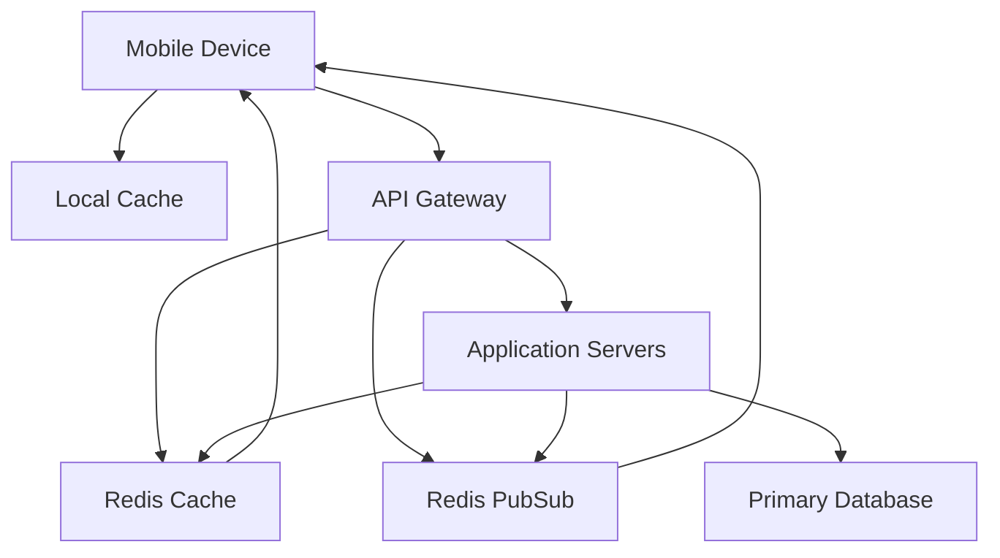

# Redis Mobile Applications

## Introduction

Mobile applications face unique challenges including limited bandwidth, intermittent connectivity, and the need for fast response times to provide a smooth user experience. Redis, an in-memory data structure store, offers powerful solutions for these challenges in mobile development scenarios.

In this guide, we'll explore how Redis can be integrated with mobile applications to improve performance, enable real-time features, and enhance the overall mobile user experience.

## What Makes Redis Suitable for Mobile Applications?

Redis offers several features that make it particularly valuable for mobile app development:

1. **Speed**: Redis operates primarily in-memory, providing sub-millisecond response times
2. **Versatile Data Structures**: Support for strings, hashes, lists, sets, and more
3. **Pub/Sub Capabilities**: Enables real-time updates and notifications
4. **Lightweight**: Minimal resource footprint compared to traditional databases
5. **Persistence Options**: Can persist data to disk when needed

## Common Use Cases for Redis in Mobile Applications

### 1. Client-Side Caching

Mobile apps can use embedded Redis (like Redis Stack) or similar key-value stores to cache data locally on the device.

```javascript
// Example: Simple caching implementation in React Native
import AsyncStorage from '@react-native-async-storage/async-storage';

// Cache data with expiration
const cacheData = async (key, data, ttlInMinutes = 60) => {
  const item = {
    value: data,
    expiry: Date.now() + (ttlInMinutes * 60 * 1000),
  };
  
  try {
    await AsyncStorage.setItem(key, JSON.stringify(item));
  } catch (error) {
    console.error('Error caching data:', error);
  }
};

// Retrieve cached data
const getCachedData = async (key) => {
  try {
    const itemStr = await AsyncStorage.getItem(key);
    
    if (!itemStr) return null;
    
    const item = JSON.parse(itemStr);
    const now = Date.now();
    
    // Check if the item is expired
    if (now > item.expiry) {
      await AsyncStorage.removeItem(key);
      return null;
    }
    
    return item.value;
  } catch (error) {
    console.error('Error retrieving cached data:', error);
    return null;
  }
};
```

### 2. Session Management

Redis excels at managing session data for mobile applications, especially when users switch between devices.

```java
// Example: Session management in Android with Redis (using Jedis client)
// Assume this is part of a SessionManager class

import redis.clients.jedis.Jedis;

public class RedisSessionManager {
    private final Jedis jedis;
    private final int SESSION_EXPIRY = 3600; // 1 hour in seconds
    
    public RedisSessionManager(String host, int port) {
        this.jedis = new Jedis(host, port);
    }
    
    public void saveSession(String userId, String sessionData) {
        // Store the session with expiration
        jedis.setex("session:" + userId, SESSION_EXPIRY, sessionData);
    }
    
    public String getSession(String userId) {
        return jedis.get("session:" + userId);
    }
    
    public void extendSession(String userId) {
        // Reset the expiration time
        String sessionData = getSession(userId);
        if (sessionData != null) {
            saveSession(userId, sessionData);
        }
    }
    
    public void invalidateSession(String userId) {
        jedis.del("session:" + userId);
    }
    
    public void close() {
        jedis.close();
    }
}
```

### 3. Real-Time Features

Redis Pub/Sub functionality enables real-time features like chat, notifications, and live updates.

```swift
// Example: Swift implementation for a chat system using Redis PubSub
import Foundation
import SwiftRedis

class ChatService {
    private let redis: Redis
    private var subscriber: Redis?
    
    init(host: String, port: Int) {
        self.redis = Redis()
        self.redis.connect(host: host, port: Int32(port)) { error in
            if let error = error {
                print("Error connecting to Redis: \(error)")
            }
        }
        
        setupSubscriber(host: host, port: port)
    }
    
    private func setupSubscriber(host: String, port: Int) {
        subscriber = Redis()
        subscriber?.connect(host: host, port: Int32(port)) { error in
            if let error = error {
                print("Error connecting subscriber: \(error)")
                return
            }
            
            print("Subscriber connected successfully")
        }
    }
    
    func subscribeToChannel(channel: String, callback: @escaping (String, String) -> Void) {
        subscriber?.subscribe(to: [channel]) { channel, message in
            callback(channel, message)
        }
    }
    
    func publishMessage(channel: String, message: String) {
        redis.publish(channel: channel, message: message) { (publishCount, error) in
            if let error = error {
                print("Error publishing message: \(error)")
                return
            }
            
            print("Message published to \(publishCount) subscribers")
        }
    }
    
    func disconnect() {
        redis.disconnect()
        subscriber?.disconnect()
    }
}

// Usage:
// let chatService = ChatService(host: "redis-server.example.com", port: 6379)
// chatService.subscribeToChannel(channel: "chat:room1") { channel, message in
//     print("Received message from \(channel): \(message)")
// }
// chatService.publishMessage(channel: "chat:room1", message: "Hello, Redis!")
```

### 4. Offline-First Applications

Redis can help implement offline-first capabilities by storing data locally and syncing when connectivity is restored.

```javascript
// Example: Offline-first sync queue in JavaScript
class OfflineSyncQueue {
  constructor() {
    this.syncQueue = [];
    this.isSyncing = false;
    
    // Load queue from storage on initialization
    this.loadQueueFromStorage();
    
    // Listen for online status changes
    window.addEventListener('online', () => this.processQueue());
  }
  
  addToQueue(operation) {
    // Add timestamp for ordering
    const queueItem = {
      ...operation,
      timestamp: Date.now()
    };
    
    this.syncQueue.push(queueItem);
    this.saveQueueToStorage();
    
    // If we're online, try processing immediately
    if (navigator.onLine) {
      this.processQueue();
    }
  }
  
  async processQueue() {
    if (this.isSyncing || !navigator.onLine || this.syncQueue.length === 0) {
      return;
    }
    
    this.isSyncing = true;
    
    try {
      // Sort queue by timestamp
      this.syncQueue.sort((a, b) => a.timestamp - b.timestamp);
      
      // Process queue items one by one
      while (this.syncQueue.length > 0) {
        const item = this.syncQueue[0];
        
        // Try to process the item
        await this.syncItem(item);
        
        // If we reach here, syncing was successful
        this.syncQueue.shift();
        this.saveQueueToStorage();
      }
    } catch (error) {
      console.error('Error processing sync queue:', error);
    } finally {
      this.isSyncing = false;
    }
  }
  
  async syncItem(item) {
    // Implementation would depend on the type of operation
    // This is a placeholder for the actual sync logic
    switch (item.type) {
      case 'CREATE':
        return this.apiClient.create(item.resource, item.data);
      case 'UPDATE':
        return this.apiClient.update(item.resource, item.id, item.data);
      case 'DELETE':
        return this.apiClient.delete(item.resource, item.id);
      default:
        throw new Error(`Unknown operation type: ${item.type}`);
    }
  }
  
  saveQueueToStorage() {
    try {
      localStorage.setItem('syncQueue', JSON.stringify(this.syncQueue));
    } catch (e) {
      console.error('Failed to save sync queue to storage', e);
    }
  }
  
  loadQueueFromStorage() {
    try {
      const saved = localStorage.getItem('syncQueue');
      this.syncQueue = saved ? JSON.parse(saved) : [];
    } catch (e) {
      console.error('Failed to load sync queue from storage', e);
      this.syncQueue = [];
    }
  }
}

// Usage example:
// const syncQueue = new OfflineSyncQueue();
// syncQueue.addToQueue({
//   type: 'CREATE',
//   resource: 'tasks',
//   data: { title: 'New Task', completed: false }
// });
```

## Architecture Patterns for Redis in Mobile Applications

Redis can be integrated with mobile applications in several ways:



### Client-Side Cache Pattern

In this pattern, the mobile app caches responses from the server locally:

1. App requests data from server
2. Server retrieves data (potentially using Redis as a backend cache)
3. App stores response in local cache with TTL
4. Future requests first check local cache before going to network

### Backend-For-Frontend (BFF) Pattern

Redis serves as a caching and real-time messaging layer between mobile clients and backend services:

1. Mobile clients connect to a dedicated BFF (Backend-For-Frontend) service
2. BFF uses Redis to cache common requests
3. BFF leverages Redis Pub/Sub for real-time updates
4. This approach reduces latency and improves mobile experience

## Implementing Redis with Mobile Applications

### Server-Side Redis Integration

Most mobile applications interact with Redis through a backend server. Here's a simple Node.js example:

```javascript
// Example: Express server with Redis caching for mobile API
const express = require('express');
const redis = require('redis');
const util = require('util');

const app = express();
const port = 3000;

// Connect to Redis
const client = redis.createClient({
  url: 'redis://redis-server:6379'
});

// Promisify Redis commands
const getAsync = util.promisify(client.get).bind(client);
const setexAsync = util.promisify(client.setex).bind(client);

// Connect to Redis
(async () => {
  await client.connect();
})();

client.on('error', (err) => console.log('Redis Client Error', err));

// Cache middleware
const cacheMiddleware = (duration) => {
  return async (req, res, next) => {
    const key = `api:${req.originalUrl || req.url}`;
    
    try {
      const cachedData = await client.get(key);
      
      if (cachedData) {
        // Return cached data
        return res.json(JSON.parse(cachedData));
      } else {
        // Store original send function
        const originalSend = res.send;
        
        // Override send
        res.send = async function(body) {
          // Restore original send
          res.send = originalSend;
          
          try {
            // Cache the response
            await client.setEx(key, duration, body);
          } catch (err) {
            console.error('Error caching response:', err);
          }
          
          // Call original send
          return originalSend.call(this, body);
        };
        
        next();
      }
    } catch (err) {
      console.error('Cache middleware error:', err);
      next();
    }
  };
};

// API endpoint with caching
app.get('/api/products', cacheMiddleware(300), async (req, res) => {
  try {
    // Simulate database query
    const products = await fetchProductsFromDatabase();
    res.json(products);
  } catch (error) {
    res.status(500).json({ error: 'Failed to fetch products' });
  }
});

// Function to simulate database query
async function fetchProductsFromDatabase() {
  // Simulate delay
  await new Promise(resolve => setTimeout(resolve, 1000));
  
  return [
    { id: 1, name: 'Product 1', price: 99.99 },
    { id: 2, name: 'Product 2', price: 149.99 },
    { id: 3, name: 'Product 3', price: 199.99 }
  ];
}

app.listen(port, () => {
  console.log(`Server running on port ${port}`);
});
```

## Performance Considerations

When implementing Redis with mobile applications, consider these performance tips:

1. **Minimize Payload Size**: Only cache essential data to reduce bandwidth usage
2. **Set Appropriate TTL**: Balance freshness with performance
3. **Use Compression**: Compress data before caching to reduce storage needs
4. **Implement Circuit Breakers**: Handle Redis connection failures gracefully
5. **Optimize Network Requests**: Batch operations when possible

## Security Best Practices

Security is crucial when implementing Redis in mobile app architectures:

1. **Never Expose Redis Directly**: Always access Redis through your backend
2. **Implement Authentication**: Use Redis ACLs and strong passwords
3. **Encrypt Data**: Use TLS for Redis connections
4. **Sanitize Client Data**: Never trust input from mobile clients
5. **Implement Rate Limiting**: Protect against abuse using Redis-based rate limiters

## Real-World Example: Building a Location-Based Mobile App

Let's look at how Redis can power a location-based mobile application:

```java
// Example: Android implementation for nearby venue search
public class NearbyVenuesService {
    private static final int VENUES_CACHE_EXPIRY = 300; // 5 minutes
    private static final int RADIUS_METERS = 1000;
    private final Jedis jedis;
    
    public NearbyVenuesService(String redisHost, int redisPort) {
        this.jedis = new Jedis(redisHost, redisPort);
    }
    
    public List<Venue> getNearbyVenues(double latitude, double longitude) throws Exception {
        // Create a cache key based on reduced precision coordinates
        // (rounding to ~100m precision)
        String cacheKey = String.format("venues:nearby:%,.3f:%,.3f", latitude, longitude);
        
        // Try to get from cache first
        String cachedResult = jedis.get(cacheKey);
        if (cachedResult != null) {
            return deserializeVenues(cachedResult);
        }
        
        // Cache miss - fetch from backend API
        List<Venue> venues = fetchVenuesFromApi(latitude, longitude, RADIUS_METERS);
        
        // Cache the result
        jedis.setex(cacheKey, VENUES_CACHE_EXPIRY, serializeVenues(venues));
        
        return venues;
    }
    
    private List<Venue> fetchVenuesFromApi(double latitude, double longitude, int radius) throws Exception {
        // Implementation of API call to fetch venues
        // This is a placeholder for the actual implementation
        URL url = new URL(String.format(
            "https://api.example.com/venues?lat=%f&lng=%f&radius=%d",
            latitude, longitude, radius
        ));
        
        // Make the HTTP request and parse the response
        // ...
        
        // Return a sample list for this example
        List<Venue> results = new ArrayList<>();
        results.add(new Venue("1", "Coffee Shop", 4.5));
        results.add(new Venue("2", "Restaurant", 4.2));
        results.add(new Venue("3", "Bookstore", 4.7));
        
        return results;
    }
    
    private String serializeVenues(List<Venue> venues) {
        // Convert venues list to JSON string
        // This is a simplified example
        StringBuilder sb = new StringBuilder("[");
        for (int i = 0; i < venues.size(); i++) {
            Venue venue = venues.get(i);
            sb.append(String.format(
                "{\"id\":\"%s\",\"name\":\"%s\",\"rating\":%f}",
                venue.getId(), venue.getName(), venue.getRating()
            ));
            
            if (i < venues.size() - 1) {
                sb.append(",");
            }
        }
        sb.append("]");
        
        return sb.toString();
    }
    
    private List<Venue> deserializeVenues(String json) {
        // Parse JSON string to venues list
        // This is a simplified example that would use a proper JSON parser in practice
        List<Venue> venues = new ArrayList<>();
        // Parsing logic here...
        return venues;
    }
    
    public void close() {
        jedis.close();
    }
    
    // Venue class
    static class Venue {
        private final String id;
        private final String name;
        private final double rating;
        
        public Venue(String id, String name, double rating) {
            this.id = id;
            this.name = name;
            this.rating = rating;
        }
        
        public String getId() { return id; }
        public String getName() { return name; }
        public double getRating() { return rating; }
    }
}
```

## Advanced Techniques

### Redis Streams for Mobile Event Sourcing

Redis Streams can be used to implement event sourcing patterns in mobile applications:

```javascript
// Example: Node.js backend using Redis Streams to process mobile events
const redis = require('redis');
const client = redis.createClient();

(async () => {
  await client.connect();
})();

// Function to add a new user event to a stream
async function recordUserEvent(userId, eventType, eventData) {
  const streamKey = `user:${userId}:events`;
  
  // Create event object with timestamp
  const event = {
    type: eventType,
    timestamp: Date.now().toString(),
    ...eventData
  };
  
  // Add to Redis Stream
  const id = await client.xAdd(streamKey, '*', event);
  console.log(`Recorded event with ID: ${id}`);
  
  return id;
}

// Function to process user events in batches
async function processUserEvents(userId) {
  const streamKey = `user:${userId}:events`;
  const consumerGroup = 'analytics-processors';
  const consumer = 'worker-1';
  
  try {
    // Create consumer group if it doesn't exist
    try {
      await client.xGroupCreate(streamKey, consumerGroup, '0', { MKSTREAM: true });
      console.log(`Created consumer group: ${consumerGroup}`);
    } catch (err) {
      // Group may already exist
    }
    
    // Read new messages
    const messages = await client.xReadGroup(
      consumerGroup,
      consumer,
      { key: streamKey, id: '>' },
      { COUNT: 10 }
    );
    
    if (!messages || messages.length === 0) {
      console.log('No new messages');
      return;
    }
    
    // Process each message
    for (const message of messages[0].messages) {
      const { id, message: eventData } = message;
      
      console.log(`Processing event ${id}:`, eventData);
      
      // Process the event (analytics, recommendations, etc.)
      await processEvent(userId, eventData);
      
      // Acknowledge message
      await client.xAck(streamKey, consumerGroup, id);
    }
  } catch (err) {
    console.error('Error processing events:', err);
  }
}

// Example event processing function
async function processEvent(userId, eventData) {
  // This would contain your business logic for event processing
  console.log(`Processed event for user ${userId}: ${eventData.type}`);
}

// Example usage:
// Record a user viewing a product
async function runExample() {
  await recordUserEvent('user123', 'product_view', {
    productId: 'p456',
    category: 'electronics',
    viewDuration: 45
  });
  
  // Process events for this user
  await processUserEvents('user123');
  
  client.quit();
}

runExample().catch(console.error);
```

## Summary

Redis offers powerful capabilities for mobile applications, helping developers overcome common challenges:

1. **Performance**: Reduces latency through caching and in-memory operations
2. **Real-time Features**: Enables live updates and notifications via Pub/Sub
3. **Offline Support**: Facilitates offline-first architecture patterns
4. **Session Management**: Provides fast, reliable session storage

By leveraging Redis in your mobile application architecture, you can create responsive, real-time applications that provide excellent user experiences even in challenging network conditions.

## Further Learning

To continue your Redis mobile development journey:

1. Explore Redis Stack which offers additional data models and capabilities
2. Study the Redis Pub/Sub system for real-time features
3. Learn about Redis Streams for event-driven architectures
4. Practice implementing client-side caching strategies

## Exercises

1. **Basic**: Implement a simple client-side cache in a mobile app using key-value storage
2. **Intermediate**: Create a chat feature using Redis Pub/Sub
3. **Advanced**: Build an offline-first mobile app that syncs with Redis when connectivity is restored
4. **Expert**: Implement a location-based feature using Redis geospatial capabilities

With these patterns and practices, you'll be well-equipped to leverage Redis in your mobile application development journey!