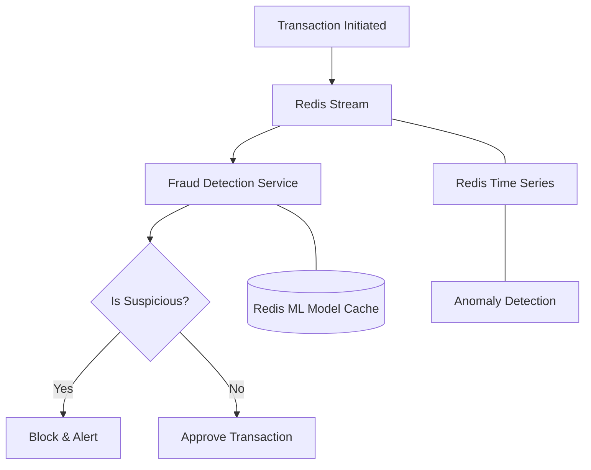
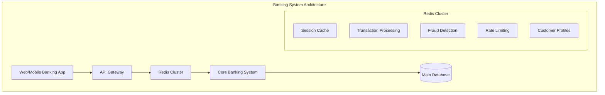

# Redis in Banking and Financial Services

## Introduction

In today's fast-paced financial world, banks and financial institutions need systems that can handle millions of transactions per second with minimal latency. Redis, an in-memory data structure store, has become a powerful tool in the banking sector due to its exceptional performance, reliability, and versatility.

This guide explores how Redis is being used in banking applications, from transaction processing to fraud detection and customer analytics.

## Why Redis for Banking?

Banking systems have several unique requirements that make Redis particularly suitable:

- **Ultra-low latency**: Financial transactions need to be processed in milliseconds
- **High availability**: Financial services cannot afford downtime
- **Data integrity**: Ensures transactions are properly recorded and maintained
- **Scalability**: Handles transaction volume surges during peak times
- **Security**: Provides robust data protection mechanisms

Let's see how Redis addresses these requirements in various banking use cases.

## Key Banking Use Cases for Redis

### 1. Real-time Transaction Processing

Banks process thousands of transactions per second, requiring a system that can handle high throughput with minimal latency.

#### How Redis Helps:

Redis can process over 100,000 operations per second on a single node, making it ideal for high-volume transaction processing. Its in-memory nature eliminates disk I/O bottlenecks, resulting in sub-millisecond response times.

#### Code Example: Processing a Transaction

```javascript
// Connect to Redis
const redis = require('redis');
const client = redis.createClient();

// Process a bank transaction
async function processTransaction(accountId, amount, transactionType) {
  try {
    // Start a transaction (MULTI/EXEC)
    const multi = client.multi();
    
    // Get current balance
    const currentBalance = await client.get(`account:${accountId}:balance`);
    
    // Calculate new balance
    let newBalance;
    if (transactionType === 'deposit') {
      newBalance = parseFloat(currentBalance) + amount;
    } else if (transactionType === 'withdrawal') {
      newBalance = parseFloat(currentBalance) - amount;
    }
    
    // Update balance
    multi.set(`account:${accountId}:balance`, newBalance.toString());
    
    // Record transaction in a list
    const transaction = JSON.stringify({
      amount,
      type: transactionType,
      timestamp: new Date().toISOString()
    });
    multi.lpush(`account:${accountId}:transactions`, transaction);
    
    // Execute all commands atomically
    await multi.exec();
    
    return { success: true, newBalance };
  } catch (error) {
    console.error('Transaction failed:', error);
    return { success: false, error: error.message };
  }
}

// Example usage:
// processTransaction('user123', 500, 'deposit')
// Output: { success: true, newBalance: 1500 }
```

### 2. Fraud Detection Systems

Banks need to analyze transaction patterns in real-time to detect potentially fraudulent activities.

#### How Redis Helps:

Redis Streams and Redis Time Series allow for real-time data analysis, enabling banks to monitor transactions as they occur and apply machine learning models to detect unusual patterns.

#### Solution Architecture:



#### Code Example: Simple Fraud Detection Pattern

```javascript
// Connect to Redis
const redis = require('redis');
const client = redis.createClient();

// Record and analyze a transaction for fraud detection
async function analyzeForFraud(userId, transactionAmount, merchantCategory, location) {
  try {
    // Get user's typical spending pattern
    const userProfile = await client.hGetAll(`user:${userId}:profile`);
    
    // Record transaction in time series
    const timestamp = Math.floor(Date.now() / 1000);
    await client.sendCommand(['TS.ADD', `user:${userId}:transactions`, timestamp, transactionAmount.toString()]);
    
    // Check for suspicious patterns
    let riskScore = 0;
    
    // 1. Check transaction amount against user average
    if (transactionAmount > parseFloat(userProfile.avgTransactionAmount) * 5) {
      riskScore += 30;
    }
    
    // 2. Check location against usual locations
    const userLocations = await client.sMembers(`user:${userId}:locations`);
    if (!userLocations.includes(location)) {
      riskScore += 25;
      // Store new location
      await client.sAdd(`user:${userId}:locations`, location);
    }
    
    // 3. Check transaction velocity
    const recentTransCount = await client.sendCommand([
      'TS.RANGE', 
      `user:${userId}:transactions`, 
      timestamp - 3600, // Last hour
      timestamp
    ]);
    
    if (recentTransCount.length > parseInt(userProfile.hourlyTransactionThreshold)) {
      riskScore += 25;
    }
    
    // Store risk score
    await client.set(`transaction:${userId}:${timestamp}:risk`, riskScore.toString());
    
    return {
      transactionId: `${userId}:${timestamp}`,
      riskScore,
      isFraudulent: riskScore > 70
    };
  } catch (error) {
    console.error('Fraud analysis failed:', error);
    return { error: error.message };
  }
}

// Example usage:
// analyzeForFraud('user123', 999.99, 'electronics', 'New York')
// Output: { transactionId: 'user123:1647352422', riskScore: 55, isFraudulent: false }
```

### 3. Session Management & Authentication

Banks need robust authentication systems that can handle millions of concurrent users while maintaining security.

#### How Redis Helps:

Redis provides fast token storage and validation with automatic expiration capabilities, making it ideal for managing user sessions in online banking platforms.

#### Code Example: Session Management

```javascript
// Connect to Redis
const redis = require('redis');
const client = redis.createClient();
const { v4: uuidv4 } = require('uuid');

// Create a new session when user logs in
async function createSession(userId, deviceInfo) {
  try {
    const sessionId = uuidv4();
    const sessionData = {
      userId,
      deviceInfo,
      loginTime: new Date().toISOString(),
      lastActivity: new Date().toISOString()
    };
    
    // Store session with 30 minute expiry
    await client.set(
      `session:${sessionId}`, 
      JSON.stringify(sessionData), 
      { EX: 1800 }
    );
    
    // Add to user's active sessions set
    await client.sAdd(`user:${userId}:sessions`, sessionId);
    
    return { sessionId, success: true };
  } catch (error) {
    console.error('Session creation failed:', error);
    return { success: false, error: error.message };
  }
}

// Validate session on each banking operation
async function validateSession(sessionId) {
  try {
    const sessionData = await client.get(`session:${sessionId}`);
    
    if (!sessionData) {
      return { valid: false, reason: 'Session expired or invalid' };
    }
    
    const session = JSON.parse(sessionData);
    
    // Update last activity
    session.lastActivity = new Date().toISOString();
    await client.set(`session:${sessionId}`, JSON.stringify(session), { EX: 1800 });
    
    return { valid: true, userId: session.userId };
  } catch (error) {
    console.error('Session validation failed:', error);
    return { valid: false, error: error.message };
  }
}

// Example usage:
// createSession('user123', { browser: 'Chrome', ip: '192.168.1.1' })
// validateSession('a1b2c3d4-e5f6-g7h8-i9j0')
```

### 4. Rate Limiting & Throttling

Banking APIs need protection against abuse, denial of service attacks, and excessive usage.

#### How Redis Helps:

Redis counters and sorted sets can effectively implement rate limiting patterns to control API usage and prevent system overload.

#### Code Example: Implementing Rate Limiting

```javascript
// Connect to Redis
const redis = require('redis');
const client = redis.createClient();

// Check if a request is within rate limits
async function checkRateLimit(userId, endpoint) {
  const key = `ratelimit:${userId}:${endpoint}`;
  const currentTime = Math.floor(Date.now() / 1000);
  
  try {
    // Remove old requests from the sorted set (older than 1 minute)
    await client.zRemRangeByScore(key, 0, currentTime - 60);
    
    // Count recent requests
    const requestCount = await client.zCard(key);
    
    // Get the limit for this endpoint
    let limit;
    switch (endpoint) {
      case 'transferFunds':
        limit = 5;  // 5 transfers per minute
        break;
      case 'checkBalance':
        limit = 20; // 20 balance checks per minute
        break;
      default:
        limit = 30; // Default limit
    }
    
    if (requestCount >= limit) {
      return {
        allowed: false,
        currentCount: requestCount,
        limit,
        resetIn: '60 seconds'
      };
    }
    
    // Record this request
    await client.zAdd(key, { score: currentTime, value: currentTime.toString() });
    // Set expiry on the whole key
    await client.expire(key, 60);
    
    return {
      allowed: true,
      currentCount: requestCount + 1,
      limit,
      remaining: limit - (requestCount + 1)
    };
  } catch (error) {
    console.error('Rate limit check failed:', error);
    // Fail open for user experience, but log the error
    return { allowed: true, error: error.message };
  }
}

// Example usage:
// checkRateLimit('user123', 'transferFunds')
// Output: { allowed: true, currentCount: 1, limit: 5, remaining: 4 }
```

### 5. Customer 360° View

Banks need to aggregate data from multiple systems to provide customer service representatives with a comprehensive view of each customer.

#### How Redis Helps:

Redis Hashes provide a convenient way to store and retrieve customer profiles, while Redis JSON enables storing complex nested data structures for customer information.

#### Code Example: Building a Customer Profile Cache

```javascript
// Connect to Redis
const redis = require('redis');
const client = redis.createClient();

// Build and retrieve a complete customer profile
async function getCustomerProfile(customerId) {
  try {
    // Check if profile is already cached
    const cachedProfile = await client.get(`customer:${customerId}:profile`);
    
    if (cachedProfile) {
      return JSON.parse(cachedProfile);
    }
    
    // If not cached, build profile from various data sources
    // (In production, these would be actual database queries)
    const customerInfo = await getCustomerBasicInfo(customerId);
    const accountsInfo = await getCustomerAccounts(customerId);
    const transactionSummary = await getRecentTransactions(customerId);
    const productSubscriptions = await getProductSubscriptions(customerId);
    
    // Build complete profile
    const completeProfile = {
      customerId,
      personalInfo: customerInfo,
      accounts: accountsInfo,
      recentActivity: transactionSummary,
      products: productSubscriptions,
      lastUpdated: new Date().toISOString()
    };
    
    // Cache in Redis with 15 minute expiry
    await client.set(
      `customer:${customerId}:profile`, 
      JSON.stringify(completeProfile), 
      { EX: 900 }
    );
    
    return completeProfile;
  } catch (error) {
    console.error('Failed to build customer profile:', error);
    return { error: error.message };
  }
}

// Mock functions that would connect to actual data sources
async function getCustomerBasicInfo(customerId) {
  // Would query customer database in real implementation
  return { name: 'Jane Doe', email: 'jane@example.com', status: 'active' };
}

async function getCustomerAccounts(customerId) {
  // Would query accounts database
  return [
    { accountId: 'acc123', type: 'checking', balance: 2450.33 },
    { accountId: 'acc456', type: 'savings', balance: 15720.65 }
  ];
}

async function getRecentTransactions(customerId) {
  // Would query transaction database
  return {
    count: 15,
    lastTransaction: '2023-03-15T10:30:00Z',
    topMerchants: ['Grocery Store', 'Online Retailer']
  };
}

async function getProductSubscriptions(customerId) {
  // Would query product database
  return ['Premium Account', 'Credit Card', 'Investment Portfolio'];
}

// Example usage:
// getCustomerProfile('cust123')
```

## Redis Banking Architecture

A typical Redis banking architecture integrates multiple Redis instances for different functions:



## Redis Banking Best Practices

1. **Use Redis Cluster for High Availability**
   - Implement Redis Cluster to ensure no single point of failure
   - Configure appropriate node distribution across different availability zones

2. **Implement Data Persistence**
   - Configure RDB snapshots and AOF persistence to prevent data loss
   - Example configuration:
   ```
   # In redis.conf
   save 900 1       # Save if at least 1 key changed in 15 minutes
   save 300 10      # Save if at least 10 keys changed in 5 minutes
   save 60 10000    # Save if at least 10000 keys changed in 1 minute
   appendonly yes
   appendfsync everysec
   ```

3. **Secure Your Redis Deployment**
   - Use TLS encryption for all Redis connections
   - Implement strong ACL policies to restrict access
   - Example ACL configuration:
   ```
   # In redis.conf
   user banking_app on +@read +@write +@transaction ~account:* ~session:* >secret_password
   user monitoring_service on +@read ~stats:* +info >monitor_password
   ```

4. **Optimize Memory Usage**
   - Set appropriate TTLs (Time To Live) for ephemeral data
   - Use Redis data structures that minimize memory usage
   - Monitor memory usage and implement eviction policies

5. **Implement Proper Error Handling**
   - Use circuit breakers for Redis operations
   - Implement fallback mechanisms when Redis is unavailable
   - Log and monitor Redis-related errors

## Performance Considerations

Redis can handle thousands of financial transactions per second, but optimizing your implementation is crucial:

1. **Use Pipelining for Batch Operations**
   ```javascript
   const pipeline = client.pipeline();
   for (let i = 0; i < 100; i++) {
     pipeline.hSet(`account:${i}`, 'balance', '1000');
   }
   const results = await pipeline.exec();
   ```

2. **Leverage Redis Transactions for Atomicity**
   ```javascript
   const multi = client.multi();
   multi.decrBy('account:sender:balance', amount);
   multi.incrBy('account:receiver:balance', amount);
   multi.hSet('transaction:logs', txId, JSON.stringify(txDetails));
   await multi.exec();
   ```

3. **Consider Redis Enterprise for Advanced Features**
   - Active-Active Geo-Distribution
   - Redis on Flash for larger datasets
   - Enhanced security features

## Summary

Redis has become a critical component in modern banking architectures due to its exceptional performance, reliability, and versatility. From processing transactions to detecting fraud and managing customer data, Redis enables financial institutions to deliver fast, secure, and reliable services.

Key takeaways:
- Redis's in-memory architecture enables ultra-fast financial transactions
- Redis Streams and Time Series are valuable for real-time fraud detection
- Redis provides robust session management for secure online banking
- Redis Cluster ensures high availability for critical banking operations
- Proper implementation of Redis can significantly reduce backend load

## Exercises

1. Build a simple banking transaction system using Redis that supports deposits, withdrawals, and transfers between accounts.

2. Implement a rate limiting system for a banking API that allows different limits for different types of operations.

3. Create a Redis-based session management system for a banking application that includes login, logout, and session validation.

4. Design a Redis schema for storing customer profiles that includes personal information, account details, and recent transaction history.

5. Implement a simple fraud detection system using Redis Streams that flags transactions based on amount, location, and frequency.

## Further Resources

- [Redis Documentation](https://redis.io/documentation)
- [Redis University](https://university.redis.com/) for free Redis courses
- [RedisJSON Documentation](https://redis.io/docs/stack/json/) for storing complex customer data
- [Redis Streams](https://redis.io/docs/data-types/streams/) for transaction processing
- [Redis Time Series](https://redis.io/docs/stack/timeseries/) for financial data analysis