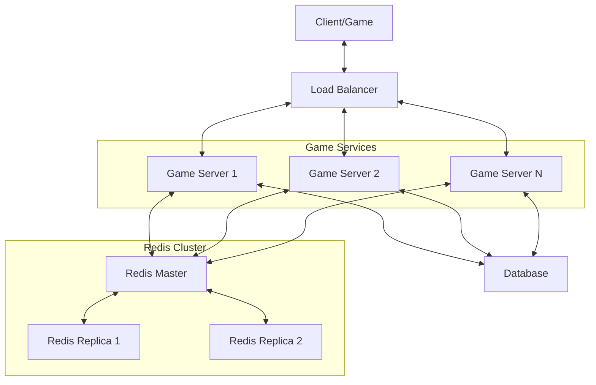

# Redis Gaming

## Introduction

Gaming applications demand speed, scalability, and real-time capabilities. Redis, an in-memory data structure store, excels in these areas, making it an ideal choice for building gaming backends. This guide explores how Redis can power various gaming features, from leaderboards and player sessions to real-time multiplayer functionality.

Redis offers sub-millisecond response times, which is crucial for maintaining a smooth gaming experience. Moreover, its versatile data structures like sorted sets, hashes, and pub/sub messaging make it particularly well-suited for gaming implementations.

## Why Use Redis for Gaming?

- **Speed**: In-memory operations deliver ultra-fast responses
- **Scalability**: Can handle millions of concurrent users
- **Versatility**: Multiple data structures for different gaming features
- **Persistence options**: Balance between performance and data durability
- **Real-time capabilities**: Built-in pub/sub for live updates

## Essential Gaming Features with Redis

### 1. Player Sessions and Authentication

Managing player sessions efficiently is crucial for any game. Redis excels at storing session data with automatic expiration.

```javascript
// Storing a player session
async function createPlayerSession(playerId, userData) {
  const sessionId = generateUniqueId();
  
  // Store session data in a Redis hash
  await redis.hset(
    `session:${sessionId}`,
    {
      playerId,
      username: userData.username,
      lastActive: Date.now(),
      // Additional player data
    }
  );
  
  // Set session to expire after 24 hours (86400 seconds)
  await redis.expire(`session:${sessionId}`, 86400);
  
  return sessionId;
}

// Output: "sess_8f7d56a2c3"
```

When a player logs in, you can create a session and return a session ID to be stored as a cookie or token. To retrieve the session:

```javascript
// Retrieving and validating a session
async function getPlayerSession(sessionId) {
  const session = await redis.hgetall(`session:${sessionId}`);
  
  if (Object.keys(session).length === 0) {
    return null; // Session doesn't exist or has expired
  }
  
  // Update last active timestamp
  await redis.hset(`session:${sessionId}`, "lastActive", Date.now());
  
  // Refresh expiration time
  await redis.expire(`session:${sessionId}`, 86400);
  
  return session;
}

// Output example:
// {
//   playerId: "player123",
//   username: "GameMaster99",
//   lastActive: "1646835402000"
// }
```

### 2. Leaderboards

Leaderboards are a fundamental feature in competitive games. Redis sorted sets are perfect for this use case, allowing efficient ranking operations.

```javascript
// Adding or updating player scores
async function updatePlayerScore(gameId, playerId, score) {
  await redis.zadd(`leaderboard:${gameId}`, score, playerId);
}

// Get top 10 players
async function getTopPlayers(gameId, count = 10) {
  // Get players with highest scores (in descending order)
  const topScores = await redis.zrevrange(
    `leaderboard:${gameId}`, 
    0, 
    count - 1, 
    'WITHSCORES'
  );
  
  // Format the results
  const leaderboard = [];
  for (let i = 0; i < topScores.length; i += 2) {
    leaderboard.push({
      playerId: topScores[i],
      score: parseInt(topScores[i + 1])
    });
  }
  
  return leaderboard;
}

// Output example:
// [
//   { playerId: "player456", score: 9850 },
//   { playerId: "player123", score: 8720 },
//   { playerId: "player789", score: 7600 },
//   ...
// ]
```

To get a player's rank and nearby players (for contextual leaderboards):

```javascript
async function getPlayerRankAndNeighbors(gameId, playerId, range = 2) {
  // Get player's rank (0-based)
  const rank = await redis.zrevrank(`leaderboard:${gameId}`, playerId);
  
  if (rank === null) {
    return { rank: null, neighbors: [] };
  }
  
  // Get player's score
  const score = await redis.zscore(`leaderboard:${gameId}`, playerId);
  
  // Get players around the current player
  const start = Math.max(0, rank - range);
  const end = rank + range;
  
  const neighborScores = await redis.zrevrange(
    `leaderboard:${gameId}`,
    start,
    end,
    'WITHSCORES'
  );
  
  // Format the results
  const neighbors = [];
  for (let i = 0; i < neighborScores.length; i += 2) {
    neighbors.push({
      playerId: neighborScores[i],
      score: parseInt(neighborScores[i + 1]),
      rank: start + i / 2, // Calculate rank based on position
      isCurrentPlayer: neighborScores[i] === playerId
    });
  }
  
  return {
    rank: rank,
    playerScore: parseInt(score),
    neighbors: neighbors
  };
}

// Output example:
// {
//   rank: 5,
//   playerScore: 7500,
//   neighbors: [
//     { playerId: "player111", score: 7550, rank: 4, isCurrentPlayer: false },
//     { playerId: "player123", score: 7500, rank: 5, isCurrentPlayer: true },
//     { playerId: "player222", score: 7480, rank: 6, isCurrentPlayer: false },
//     ...
//   ]
// }
```

### 3. Real-time Multiplayer with Pub/Sub

Redis Pub/Sub enables real-time communication between players in multiplayer games.

```javascript
// Game server code (Node.js with Redis client)
const redis = require('redis');
const publisher = redis.createClient();
const subscriber = redis.createClient();

// Player makes a move
async function handlePlayerMove(gameId, playerId, moveData) {
  // Validate move...
  
  // Update game state in Redis
  await redis.hset(`game:${gameId}`, {
    lastMoveBy: playerId,
    lastMoveTimestamp: Date.now(),
    // Additional game state data
  });
  
  // Publish move to all players in this game
  const message = JSON.stringify({
    type: 'PLAYER_MOVE',
    playerId,
    moveData,
    timestamp: Date.now()
  });
  
  publisher.publish(`game:${gameId}:moves`, message);
  
  return { success: true };
}

// Client-side subscription (conceptual, actual implementation depends on your architecture)
function subscribeToGameMoves(gameId, playerId) {
  subscriber.subscribe(`game:${gameId}:moves`);
  
  subscriber.on('message', (channel, message) => {
    const moveData = JSON.parse(message);
    
    // Ignore own moves (already processed locally)
    if (moveData.playerId === playerId) return;
    
    // Update game UI with the opponent's move
    updateGameUI(moveData);
  });
}

// Output (what clients receive):
// {
//   "type": "PLAYER_MOVE",
//   "playerId": "player456",
//   "moveData": { "x": 5, "y": 3, "action": "place_tile" },
//   "timestamp": 1646835402000
// }
```

### 4. Game State Management

For turn-based games, Redis hashes provide an efficient way to store and retrieve game states.

```javascript
// Creating a new game
async function createGame(creatorId, gameSettings) {
  const gameId = generateUniqueId();
  
  // Initialize game state
  await redis.hset(
    `game:${gameId}`,
    {
      status: 'waiting_for_players',
      createdAt: Date.now(),
      creatorId,
      currentTurn: null,
      board: JSON.stringify(createInitialBoard(gameSettings)),
      settings: JSON.stringify(gameSettings),
      players: JSON.stringify([creatorId])
    }
  );
  
  // Add to active games list
  await redis.sadd('active_games', gameId);
  
  return gameId;
}

// Joining a game
async function joinGame(gameId, playerId) {
  // Get current game data
  const gameData = await redis.hgetall(`game:${gameId}`);
  
  if (!gameData || gameData.status !== 'waiting_for_players') {
    throw new Error('Game not available to join');
  }
  
  const players = JSON.parse(gameData.players);
  
  if (players.includes(playerId)) {
    return { alreadyJoined: true };
  }
  
  players.push(playerId);
  
  // Update game with new player
  const updates = {
    players: JSON.stringify(players)
  };
  
  // If game has reached required player count, start the game
  const settings = JSON.parse(gameData.settings);
  if (players.length >= settings.requiredPlayers) {
    updates.status = 'in_progress';
    updates.currentTurn = players[0]; // First player's turn
    updates.gameStartedAt = Date.now();
  }
  
  await redis.hset(`game:${gameId}`, updates);
  
  // Publish player joined event
  publisher.publish(`game:${gameId}:events`, JSON.stringify({
    type: 'PLAYER_JOINED',
    playerId,
    timestamp: Date.now(),
    gameStatus: updates.status || gameData.status
  }));
  
  return {
    success: true,
    gameStarted: updates.status === 'in_progress'
  };
}

// Output example:
// {
//   "success": true,
//   "gameStarted": true
// }
```

### 5. Match-making

Redis can efficiently handle match-making for games by matching players with similar skill levels.

```javascript
// Add player to matchmaking queue
async function addToMatchmaking(playerId, skillRating) {
  await redis.zadd('matchmaking_queue', skillRating, playerId);
  
  // Add timestamp to track how long they've been waiting
  await redis.hset('matchmaking_timestamps', playerId, Date.now());
  
  // Return the number of players in queue for estimation
  return redis.zcard('matchmaking_queue');
}

// Find match for a player
async function findMatch(playerId, skillRange = 100) {
  // Get player's skill rating
  const playerSkill = await redis.zscore('matchmaking_queue', playerId);
  
  if (playerSkill === null) {
    throw new Error('Player not in matchmaking queue');
  }
  
  // Set skill range based on waiting time
  const waitingTime = Date.now() - await redis.hget('matchmaking_timestamps', playerId);
  const adjustedSkillRange = skillRange + Math.floor(waitingTime / 10000) * 50; // Expand range by 50 every 10 seconds
  
  // Find players with similar skill (excluding self)
  const minSkill = Math.max(0, playerSkill - adjustedSkillRange);
  const maxSkill = playerSkill + adjustedSkillRange;
  
  const potentialMatches = await redis.zrangebyscore(
    'matchmaking_queue',
    minSkill,
    maxSkill
  );
  
  // Filter out self
  const matches = potentialMatches.filter(id => id !== playerId);
  
  if (matches.length === 0) {
    return { matched: false };
  }
  
  // Select a random match from potential matches
  const matchedPlayerId = matches[Math.floor(Math.random() * matches.length)];
  
  // Create a new game for these players
  const gameId = await createGame(playerId, {
    requiredPlayers: 2,
    gameType: 'skill_based',
    timeLimit: 300 // seconds
  });
  
  // Add matched player to the game
  await joinGame(gameId, matchedPlayerId);
  
  // Remove both players from matchmaking
  await redis.zrem('matchmaking_queue', playerId, matchedPlayerId);
  await redis.hdel('matchmaking_timestamps', playerId, matchedPlayerId);
  
  return {
    matched: true,
    gameId,
    opponent: matchedPlayerId
  };
}

// Output example for successful match:
// {
//   "matched": true,
//   "gameId": "game_a1b2c3",
//   "opponent": "player789"
// }
```

### 6. Caching Game Assets and Resources

Redis can cache frequently accessed game data to reduce database load and speed up response times.

```javascript
// Cache game item data
async function cacheGameItems(items) {
  const pipeline = redis.pipeline();
  
  for (const item of items) {
    // Store serialized item data with a key pattern
    pipeline.set(`item:${item.id}`, JSON.stringify(item));
    
    // Add to category sets for easy retrieval
    pipeline.sadd(`items:category:${item.category}`, item.id);
    
    // If the item is rare, add to the rare items set
    if (item.rarity === 'rare') {
      pipeline.sadd('items:rare', item.id);
    }
  }
  
  await pipeline.exec();
}

// Retrieve cached item with fallback to database
async function getGameItem(itemId) {
  // Try to get from Redis first
  const cachedItem = await redis.get(`item:${itemId}`);
  
  if (cachedItem) {
    return JSON.parse(cachedItem);
  }
  
  // Fallback to database
  const item = await fetchItemFromDatabase(itemId);
  
  if (item) {
    // Cache for next time with 1-hour expiry
    await redis.set(`item:${itemId}`, JSON.stringify(item), 'EX', 3600);
    return item;
  }
  
  return null;
}

// Output example:
// {
//   "id": "sword_123",
//   "name": "Excalibur",
//   "category": "weapon",
//   "damage": 50,
//   "rarity": "legendary",
//   "level_req": 20
// }
```

## Real-world Example: Building a Complete Game Feature

Let's build a daily challenge system where players compete on the same procedurally generated level each day:

```javascript
// Generate and store daily challenge
async function generateDailyChallenge() {
  const today = new Date().toISOString().split('T')[0]; // YYYY-MM-DD
  
  // Check if already generated for today
  const exists = await redis.exists(`daily_challenge:${today}`);
  
  if (exists) {
    return { alreadyExists: true };
  }
  
  // Generate challenge data (this would be your game-specific logic)
  const challengeData = {
    seed: Math.floor(Math.random() * 1000000),
    difficulty: ['easy', 'medium', 'hard'][Math.floor(Math.random() * 3)],
    objectives: generateRandomObjectives(),
    createdAt: Date.now(),
    expiresAt: new Date(new Date().setHours(23, 59, 59, 999)).getTime()
  };
  
  // Store challenge data
  await redis.hset(`daily_challenge:${today}`, challengeData);
  
  // Set expiration to a week (for historical reference)
  await redis.expire(`daily_challenge:${today}`, 7 * 24 * 60 * 60);
  
  // Create a fresh leaderboard for this challenge
  await redis.del(`daily_challenge:${today}:leaderboard`);
  
  return { success: true, challenge: challengeData };
}

// Submit a score for the daily challenge
async function submitDailyChallengeScore(playerId, score, details) {
  const today = new Date().toISOString().split('T')[0];
  
  // Verify the challenge exists
  const exists = await redis.exists(`daily_challenge:${today}`);
  
  if (!exists) {
    throw new Error('No active daily challenge');
  }
  
  // Check if player already has a higher score
  const currentScore = await redis.zscore(
    `daily_challenge:${today}:leaderboard`, 
    playerId
  );
  
  if (currentScore !== null && parseInt(currentScore) >= score) {
    return {
      improved: false,
      previousScore: parseInt(currentScore),
      newScore: score
    };
  }
  
  // Store the score in the leaderboard
  await redis.zadd(
    `daily_challenge:${today}:leaderboard`,
    score,
    playerId
  );
  
  // Store detailed play information
  await redis.hset(
    `daily_challenge:${today}:plays:${playerId}`,
    {
      score,
      completionTime: details.completionTime,
      deaths: details.deaths,
      bonusObjectives: JSON.stringify(details.bonusObjectives),
      timestamp: Date.now()
    }
  );
  
  // Get new rank
  const rank = await redis.zrevrank(
    `daily_challenge:${today}:leaderboard`,
    playerId
  );
  
  return {
    improved: true,
    newScore: score,
    previousScore: currentScore !== null ? parseInt(currentScore) : null,
    rank: rank + 1, // Convert to 1-based rank
    isTopScore: rank === 0
  };
}

// Output example:
// {
//   "improved": true,
//   "newScore": 12750,
//   "previousScore": 10500,
//   "rank": 3,
//   "isTopScore": false
// }
```

## System Architecture for Game Services



## Performance Considerations

When using Redis for gaming applications, keep these tips in mind:

1. **Use pipelining** for batching multiple Redis commands to reduce network overhead
2. **Implement caching strategies** to minimize database load
3. **Set appropriate TTLs** for temporary data to avoid memory growth
4. **Consider Redis Cluster** for horizontal scaling of heavy workloads
5. **Use Redis Streams** for event sourcing and game replay functionality
6. **Monitor memory usage** and implement proper eviction policies
7. **Use Redis in a dedicated instance** separate from other services

## Summary

Redis provides a powerful foundation for building responsive and scalable gaming applications. Its in-memory nature, versatile data structures, and real-time capabilities make it ideal for implementing common gaming features like:

- Player authentication and session management
- Leaderboards and player rankings
- Real-time multiplayer communication
- Game state storage and retrieval
- Match-making systems
- Asset and resource caching

By leveraging Redis's strengths, game developers can focus on creating engaging gameplay experiences while relying on a battle-tested database system to handle the demanding performance requirements of modern games.

## Additional Resources

- Practice implementing a simple multiplayer tic-tac-toe game using Redis
- Try creating a global leaderboard system with regional filtering
- Experiment with Redis Streams for game event logging and replay
- Implement a rate limiting system to prevent cheating or API abuse

## Exercise Ideas

1. Build a simple chat system for a multiplayer game using Redis Pub/Sub
2. Create a daily reward system that tracks player logins and consecutive days
3. Implement an inventory system using Redis Hashes to store player items
4. Build a matchmaking system that pairs players based on skill level and waiting time
5. Create a caching layer for game assets using Redis as a front to a slower database