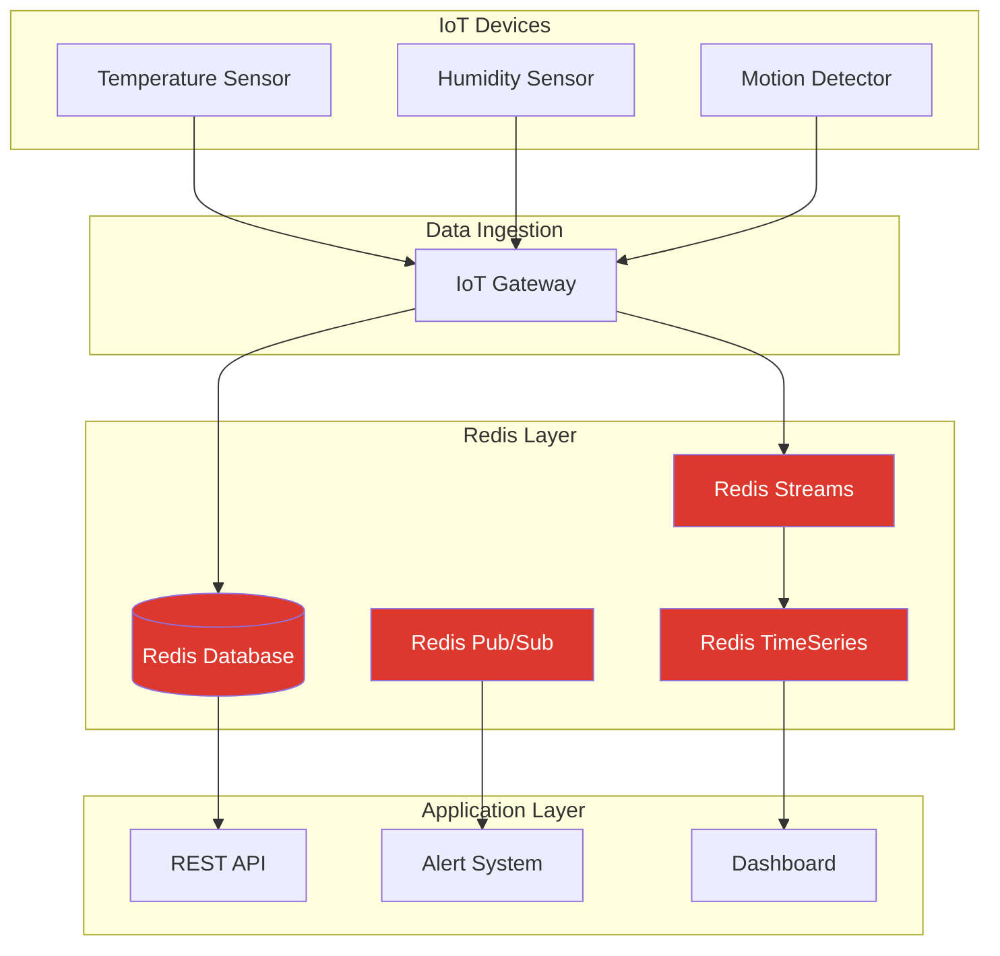

# Redis IoT: Powering Real-Time IoT Applications

## Introduction

The Internet of Things (IoT) refers to the network of physical devices embedded with sensors, software, and connectivity that enables them to collect and exchange data. These devices generate massive amounts of data at high velocity, requiring robust backend systems capable of processing, storing, and analyzing this information efficiently.

Redis, an in-memory data structure store, excels in IoT scenarios due to its blazing-fast performance, versatile data structures, and lightweight footprint. In this guide, we'll explore how Redis serves as an ideal database solution for IoT applications, providing practical examples and code implementations.

## Why Redis for IoT?

Before diving into implementation details, let's understand what makes Redis particularly well-suited for IoT applications:

1. **High-speed data ingestion**: Redis can handle millions of operations per second, perfect for the high-velocity data streams from IoT devices.

2. **Low latency**: With in-memory operations, Redis provides sub-millisecond response times, essential for real-time IoT applications.

3. **Versatile data structures**: Redis offers specialized data structures (Strings, Lists, Sets, Hashes, Sorted Sets, Streams) that efficiently model IoT data patterns.

4. **Pub/Sub messaging**: Built-in publish/subscribe capabilities enable real-time communication between IoT devices and applications.

5. **Time-series support**: Redis modules like RedisTimeSeries are designed specifically for handling time-series data common in IoT.

6. **Small footprint**: Redis has minimal hardware requirements, making it suitable for edge computing scenarios.

## Setting Up Redis for IoT Applications

Let's start by setting up a basic Redis environment for IoT applications:

```bash
# Install Redis (Ubuntu/Debian)
sudo apt-get update
sudo apt-get install redis-server

# Start Redis service
sudo systemctl start redis-server

# Verify Redis is running
redis-cli ping
```

Expected output:
```
PONG
```

## IoT Data Modeling with Redis

### Approach 1: Using Redis Hashes for Device Data

Redis hashes are perfect for storing device metadata and current state information:

```javascript
// Store device information using hashes
redis-cli HSET device:1001 type "thermometer" location "living_room" firmware "v2.3" last_active 1678423267
redis-cli HSET device:1002 type "motion_sensor" location "entrance" firmware "v1.5" last_active 1678423300

// Retrieve device information
redis-cli HGETALL device:1001
```

Output:
```
1) "type"
2) "thermometer"
3) "location"
4) "living_room"
5) "firmware"
6) "v2.3"
7) "last_active"
8) "1678423267"
```

### Approach 2: Using Redis Streams for Sensor Readings

Redis Streams are ideal for time-series data from IoT sensors:

```javascript
// Add temperature readings to a stream (with auto-generated IDs)
redis-cli XADD temperature:device:1001 * value 22.5 battery 75 timestamp 1678423267
redis-cli XADD temperature:device:1001 * value 22.7 battery 74 timestamp 1678423327
redis-cli XADD temperature:device:1001 * value 22.8 battery 74 timestamp 1678423387

// Retrieve the last 2 readings
redis-cli XREVRANGE temperature:device:1001 + - COUNT 2
```

Output:
```
1) 1) "1678423387-0"
   2) 1) "value"
      2) "22.8"
      3) "battery"
      4) "74"
      5) "timestamp"
      6) "1678423387"
2) 1) "1678423327-0"
   2) 1) "value"
      2) "22.7"
      3) "battery"
      4) "74"
      5) "timestamp"
      6) "1678423327"
```

## Implementing IoT Patterns with Redis

### Pattern 1: Device Registry

Maintaining a registry of all IoT devices is essential for device management:

```javascript
// Add devices to a set for easy membership checks
redis-cli SADD devices:active 1001 1002 1003

// Check if a device is registered
redis-cli SISMEMBER devices:active 1001
```

Output:
```
(integer) 1
```

```javascript
// Get all active devices
redis-cli SMEMBERS devices:active
```

Output:
```
1) "1001"
2) "1002"
3) "1003"
```

### Pattern 2: Real-time Alerting with Pub/Sub

Redis Pub/Sub enables real-time notifications when sensors detect anomalies:

```javascript
// In one terminal, subscribe to temperature alerts
redis-cli SUBSCRIBE temperature:alerts

// In another terminal, publish an alert
redis-cli PUBLISH temperature:alerts "High temperature detected: Device 1001, Value: 38.5C"
```

Output (in the subscriber terminal):
```
1) "message"
2) "temperature:alerts"
3) "High temperature detected: Device 1001, Value: 38.5C"
```

### Pattern 3: Time-Series Data with TTL

For IoT applications, recent data is often more valuable than historical data. Redis TTL (Time-To-Live) helps manage data lifecycle:

```javascript
// Store current temperature with 1-hour expiry (3600 seconds)
redis-cli SET current:temp:1001 23.5 EX 3600

// Check remaining TTL
redis-cli TTL current:temp:1001
```

Output:
```
(integer) 3545
```

## Building a Complete IoT Solution with Redis

Let's build a more complete example using Node.js to simulate an IoT temperature monitoring system:

```javascript
const Redis = require('ioredis');
const redis = new Redis();

// Simulate IoT temperature sensor
async function temperatureSensor(deviceId, location) {
  console.log(`Starting temperature sensor ${deviceId} at ${location}`);
  
  // Register device
  await redis.hset(`device:${deviceId}`, {
    type: 'temperature_sensor',
    location: location,
    status: 'active',
    last_active: Date.now()
  });
  
  await redis.sadd('devices:active', deviceId);
  
  // Simulate temperature readings
  setInterval(async () => {
    // Generate random temperature (normal room temp with some variation)
    const temperature = (20 + Math.random() * 5).toFixed(1);
    const timestamp = Date.now();
    
    console.log(`Device ${deviceId}: Temperature reading: ${temperature}°C`);
    
    // Store current reading
    await redis.set(`current:temp:${deviceId}`, temperature, 'EX', 3600);
    
    // Add to time series stream
    await redis.xadd(
      `temperature:device:${deviceId}`,
      '*',  // Auto-generate ID
      'value', temperature,
      'timestamp', timestamp
    );
    
    // Update device last_active timestamp
    await redis.hset(`device:${deviceId}`, 'last_active', timestamp);
    
    // Check for temperature threshold and send alert if needed
    if (parseFloat(temperature) > 24) {
      await redis.publish(
        'temperature:alerts',
        JSON.stringify({
          device_id: deviceId,
          location: location,
          temperature: temperature,
          timestamp: timestamp,
          message: `High temperature detected in ${location}`
        })
      );
    }
  }, 5000); // Every 5 seconds
}

// Start multiple sensors
temperatureSensor('1001', 'living_room');
temperatureSensor('1002', 'bedroom');
temperatureSensor('1003', 'kitchen');

// Create a separate alert monitor
const alertMonitor = new Redis();
alertMonitor.subscribe('temperature:alerts');
alertMonitor.on('message', (channel, message) => {
  const alert = JSON.parse(message);
  console.log(`🚨 ALERT: ${alert.message} (${alert.temperature}°C)`);
  
  // In a real application, this could trigger notifications,
  // update dashboards, etc.
});
```

To run this example:
1. Install required packages: `npm install ioredis`
2. Save the code to a file (e.g., `temperature-monitor.js`)
3. Run with Node.js: `node temperature-monitor.js`

This example demonstrates:
- Device registration using Redis Hashes
- Real-time data collection using Redis Streams
- Alerts using Redis Pub/Sub
- Current state management with TTL

## IoT Data Visualization Architecture

Here's how a complete Redis-based IoT architecture might look:



## Advanced IoT Patterns with Redis

### Pattern 4: Device Command Queue

For sending commands to IoT devices, Redis Lists provide a perfect queue structure:

```javascript
// Queue commands for a specific device
redis-cli LPUSH cmd:device:1001 "set_temperature:22"
redis-cli LPUSH cmd:device:1001 "reboot"

// Device would poll for commands and process the most recent one first (LIFO)
redis-cli RPOP cmd:device:1001
```

Output:
```
"reboot"
```

### Pattern 5: Geo-Spatial IoT Data

Redis has built-in support for geo-spatial data, useful for location-based IoT applications:

```javascript
// Add device locations
redis-cli GEOADD device:locations 13.361389 38.115556 device:1001
redis-cli GEOADD device:locations 15.087269 37.502669 device:1002

// Find devices within a certain radius (e.g., 100km)
redis-cli GEORADIUS device:locations 14.0 38.0 100 km
```

Output:
```
1) "device:1001"
```

### Pattern 6: Rate Limiting for IoT API Endpoints

To protect backend services from overwhelming device traffic, implement rate limiting:

```javascript
// Implement a sliding window rate limiter
// Allow 10 requests per minute per device

redis-cli MULTI
redis-cli INCR ratelimit:device:1001:counter
redis-cli EXPIRE ratelimit:device:1001:counter 60
redis-cli EXEC
```

Output:
```
1) (integer) 1
2) (integer) 1
3) OK
```

## Real-World IoT Use Cases with Redis

### Smart Home Energy Monitoring

A smart home system might use Redis to track and analyze energy consumption:

```javascript
// Store current power readings
redis-cli HSET home:power:current living_room 120 kitchen 85 bedroom 45 total 250

// Add to time-series for daily consumption analysis
redis-cli XADD home:power:readings * timestamp 1678423267 living_room 120 kitchen 85 bedroom 45 total 250

// Track daily consumption totals
redis-cli INCRBY home:power:daily:20230310 250
```

### Industrial Equipment Monitoring

Manufacturing environments can use Redis to monitor equipment health:

```javascript
// Store machine status
redis-cli HSET machine:status:1001 state "running" temperature 65.7 vibration 0.15 last_maintenance 1673452800

// Track maintenance history
redis-cli LPUSH machine:maintenance:1001 "{\"date\":1673452800,\"type\":\"oil_change\",\"technician\":\"John Doe\"}"

// Set alert thresholds
redis-cli HSET machine:thresholds:1001 max_temperature 85 max_vibration 0.4
```

### Smart Agriculture Irrigation System

An automated irrigation system might use Redis to manage water distribution based on soil sensors:

```javascript
// Store current soil moisture readings
redis-cli HSET farm:moisture:current zone1 45 zone2 62 zone3 38

// Trigger irrigation if moisture below threshold
redis-cli EVAL "
  local moisture = tonumber(redis.call('HGET', 'farm:moisture:current', 'zone3'))
  if moisture < 40 then
    redis.call('LPUSH', 'irrigation:commands', 'activate_zone3')
    return 1
  end
  return 0
" 0
```

Output:
```
(integer) 1
```

## Performance Considerations for IoT with Redis

When implementing Redis for IoT solutions, consider these performance tips:

1. **Memory management**: IoT applications can generate vast amounts of data. Use Redis TTL to automatically expire old data or implement Redis with disk persistence for historical data.

2. **Pipeline commands**: When sending multiple commands, use pipelining to reduce network round trips:

```javascript
redis-cli PIPELINE
HSET device:1001 status "active" last_seen 1678423267
XADD temperature:device:1001 * value 22.5 timestamp 1678423267
EXEC
```

3. **Consider Redis Cluster**: For large-scale IoT deployments, Redis Cluster provides horizontal scalability.

4. **Use Redis Streams Consumer Groups**: For processing sensor data across multiple worker services, Consumer Groups allow distributed processing with exactly-once semantics.

## Summary

Redis offers a powerful and flexible foundation for building IoT applications due to its speed, versatility, and lightweight nature. In this guide, we've explored:

- Why Redis is an excellent choice for IoT applications
- Basic and advanced data modeling approaches for IoT data
- Real-time communication using Redis Pub/Sub
- Time-series data management
- Practical implementation patterns for IoT solutions
- Real-world use cases across different IoT domains

By leveraging Redis's capabilities, developers can build efficient, responsive, and scalable IoT systems that handle the unique challenges of IoT data processing.

## Additional Resources

- Explore Redis modules specifically designed for IoT:
  - RedisTimeSeries: Optimized for time-series data storage and analysis
  - RediSearch: For adding advanced search capabilities to IoT data
  - RedisGears: For edge computing and data processing pipelines

- Practice with the following exercises:
  1. Implement a simple weather station using Redis Streams
  2. Create a device management system with Redis Hashes and Sets
  3. Build a real-time dashboard using Redis Pub/Sub
  4. Design a data retention policy for IoT data using Redis TTL

Redis's combination of speed, flexibility, and developer-friendly features makes it an excellent choice for the demanding requirements of modern IoT applications, from smart homes to industrial systems and beyond.