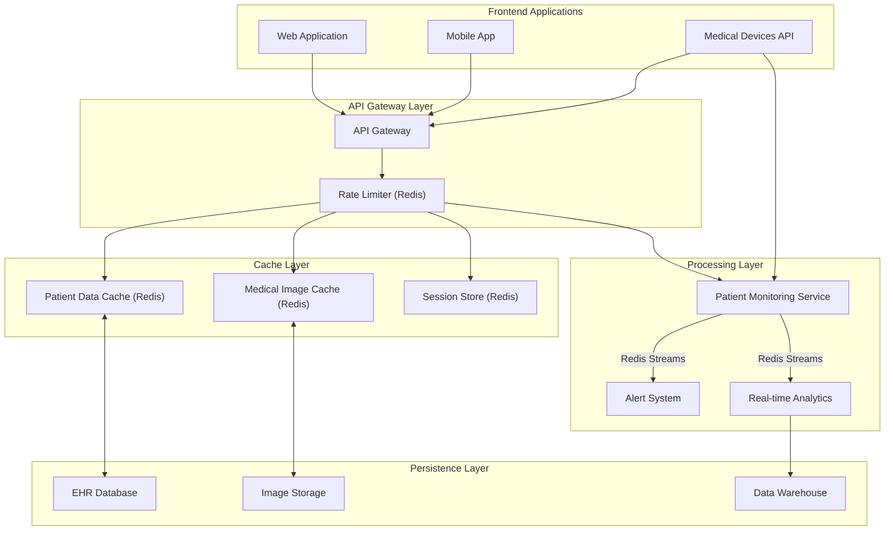

# Redis for Healthcare

## Introduction

Healthcare systems generate and process massive amounts of data every day – from patient records and medical images to real-time monitoring data and research findings. The ability to store, retrieve, and analyze this data efficiently is crucial for providing timely care and making informed decisions. This is where Redis, an in-memory data structure store, comes into the picture.

Redis offers unique capabilities that make it particularly valuable in healthcare environments where speed, reliability, and security are paramount. In this guide, we'll explore how Redis can be implemented in healthcare applications to address various challenges and improve overall system performance.

## What Makes Redis Suitable for Healthcare?

Healthcare applications have specific requirements that Redis is well-positioned to address:

1. **High Performance** - Medical systems often require sub-millisecond response times
2. **Data Security** - Patient data protection is mandated by regulations like HIPAA
3. **High Availability** - Healthcare systems need to operate 24/7 without downtime
4. **Flexible Data Structures** - Various data types are needed for different medical use cases
5. **Real-time Processing** - Critical for patient monitoring and alert systems

## Common Healthcare Use Cases for Redis

### 1. Patient Data Caching

Electronic Health Record (EHR) systems can use Redis to cache frequently accessed patient data, reducing the load on primary databases and improving response times.

```javascript
// Example: Caching patient summary data
async function getPatientSummary(patientId) {
  // Try to get from Redis cache first
  const cachedData = await redisClient.get(`patient:${patientId}:summary`);
  
  if (cachedData) {
    console.log("Cache hit - Returning data from Redis");
    return JSON.parse(cachedData);
  }
  
  // If not in cache, query the primary database
  console.log("Cache miss - Querying database");
  const patientData = await database.getPatientSummary(patientId);
  
  // Store in Redis with a 30-minute expiration
  await redisClient.set(
    `patient:${patientId}:summary`, 
    JSON.stringify(patientData), 
    'EX', 
    1800
  );
  
  return patientData;
}
```

This approach significantly speeds up access to patient information during consultations or emergency situations.

### 2. Real-time Patient Monitoring

Redis Streams can be used to collect, process, and analyze real-time data from patient monitoring devices.

```javascript
// Example: Processing vital signs from monitoring equipment
async function processVitalSigns(deviceId, patientId, readings) {
  // Add readings to a Redis Stream
  await redisClient.xadd(
    `patient:${patientId}:vitals`,
    '*',  // Automatic ID generation
    'deviceId', deviceId,
    'heartRate', readings.heartRate,
    'bloodPressure', readings.bloodPressure,
    'oxygenLevel', readings.oxygenLevel,
    'temperature', readings.temperature,
    'timestamp', Date.now()
  );
  
  // Check for critical values
  if (readings.heartRate > 150 || readings.heartRate < 40) {
    await triggerAlert(patientId, 'heartRate', readings.heartRate);
  }
  
  if (readings.oxygenLevel < 90) {
    await triggerAlert(patientId, 'oxygenLevel', readings.oxygenLevel);
  }
}

async function triggerAlert(patientId, vitalType, value) {
  // Publish alert to a channel monitored by the nursing station
  await redisClient.publish(
    'critical-alerts',
    JSON.stringify({
      patientId,
      vitalType,
      value,
      timestamp: Date.now()
    })
  );
}
```

With Redis Streams, healthcare providers can monitor multiple patients simultaneously and receive instant alerts when values exceed normal ranges.

### 3. Medical Image Caching

Redis can temporarily store frequently accessed medical images, improving the performance of imaging systems:

```javascript
// Example: Caching medical images
async function getMedicalImage(imageId) {
  // Try to get image metadata from Redis
  const cachedImageMetadata = await redisClient.hgetall(`image:${imageId}`);
  
  if (cachedImageMetadata.url) {
    console.log("Image metadata cache hit");
    
    // Check if the actual image binary data is in cache
    const imageData = await redisClient.get(`image:${imageId}:data`);
    if (imageData) {
      console.log("Image data cache hit");
      return {
        metadata: cachedImageMetadata,
        data: imageData
      };
    }
  }
  
  // If not in cache, get from storage
  console.log("Cache miss - Retrieving image from storage");
  const image = await imageStorage.getImage(imageId);
  
  // Cache the metadata
  await redisClient.hset(`image:${imageId}`, {
    patientId: image.patientId,
    type: image.type,
    studyDate: image.studyDate,
    modality: image.modality,
    url: image.url
  });
  
  // Set expiration for metadata (24 hours)
  await redisClient.expire(`image:${imageId}`, 86400);
  
  // Cache the actual image data for smaller images
  if (image.data.length < 5000000) { // Only cache if under ~5MB
    await redisClient.set(`image:${imageId}:data`, image.data);
    await redisClient.expire(`image:${imageId}:data`, 3600); // 1 hour
  }
  
  return image;
}
```

By implementing this caching strategy, radiologists and doctors can access images much faster, especially ones that are frequently reviewed.

### 4. Appointment Scheduling and Management

Redis can power efficient appointment scheduling systems with its sorted sets feature:

```javascript
// Example: Managing doctor's appointments using Redis Sorted Sets
async function scheduleAppointment(doctorId, patientId, timestamp, duration) {
  const appointmentEnd = timestamp + duration;
  
  // Check for conflicts - get all appointments that overlap with the new one
  const conflictingAppointments = await redisClient.zrangebyscore(
    `doctor:${doctorId}:appointments`,
    timestamp,
    appointmentEnd
  );
  
  if (conflictingAppointments.length > 0) {
    return {
      success: false,
      message: "Time slot unavailable, doctor has existing appointments"
    };
  }
  
  // Generate unique appointment ID
  const appointmentId = `appt:${doctorId}:${Date.now()}`;
  
  // Store appointment details
  await redisClient.hset(appointmentId, {
    doctorId,
    patientId,
    timestamp: timestamp.toString(),
    duration: duration.toString(),
    status: 'scheduled'
  });
  
  // Add to doctor's timeline (score = appointment start time)
  await redisClient.zadd(
    `doctor:${doctorId}:appointments`,
    timestamp,
    appointmentId
  );
  
  // Add to patient's appointments
  await redisClient.zadd(
    `patient:${patientId}:appointments`,
    timestamp,
    appointmentId
  );
  
  return {
    success: true,
    appointmentId
  };
}
```

This system allows for efficient checking of time slot availability and quick retrieval of a doctor's schedule.

### 5. Rate Limiting for Healthcare APIs

In healthcare systems with many integrated applications, Redis can help implement rate limiting to protect APIs:

```javascript
// Example: Rate limiting for healthcare API endpoints
async function checkRateLimit(apiKey, endpoint) {
  const key = `ratelimit:${apiKey}:${endpoint}`;
  
  // Get current count
  let count = await redisClient.get(key);
  
  // If key doesn't exist, create it
  if (!count) {
    await redisClient.set(key, 0, 'EX', 60); // 1 minute window
    count = 0;
  }
  
  // Increment count
  count = await redisClient.incr(key);
  
  // Get time to reset
  const ttl = await redisClient.ttl(key);
  
  // Check if limit exceeded (e.g., 100 requests per minute)
  if (count > 100) {
    return {
      allowed: false,
      currentCount: count,
      resetInSeconds: ttl
    };
  }
  
  return {
    allowed: true,
    currentCount: count,
    resetInSeconds: ttl
  };
}
```

Rate limiting protects healthcare systems from being overwhelmed by requests and helps maintain consistent performance for critical functions.

## Building a Healthcare System Architecture with Redis

Here's how Redis might fit into a comprehensive healthcare system architecture:



This architecture shows how Redis can serve multiple functions across different layers of a healthcare application.

## Security Considerations

When implementing Redis in healthcare applications, security is paramount due to sensitive patient data:

1. **Enable Redis Authentication** with strong passwords
2. **Use TLS/SSL** for all Redis communications
3. **Implement Network Security** through firewalls and VPCs
4. **Set Appropriate Data Expiration** to minimize data exposure
5. **Use Redis ACLs** (Access Control Lists) to restrict commands and key access

```javascript
// Example: Connecting to Redis with security best practices
const redis = require('redis');

const client = redis.createClient({
  url: 'rediss://redis-server:6379', // Note 'rediss://' for TLS
  password: process.env.REDIS_PASSWORD,
  tls: {
    rejectUnauthorized: true,
    ca: [fs.readFileSync('path/to/ca.crt')]
  }
});

client.on('error', (err) => {
  console.error('Redis Client Error', err);
});

await client.connect();
```

## Performance Optimization

To get the best performance from Redis in healthcare applications:

1. **Use Pipelining** for batch operations
2. **Implement Appropriate Key Expiration** strategies
3. **Consider Redis Cluster** for large deployments
4. **Monitor Memory Usage** carefully
5. **Use Redis Enterprise** for mission-critical applications requiring high availability

```javascript
// Example: Using Redis pipelining for batch operations
async function updateMultiplePatientRecords(updates) {
  const pipeline = redisClient.pipeline();
  
  for (const update of updates) {
    // Add commands to pipeline (not executed yet)
    pipeline.hset(`patient:${update.id}:record`, update.changes);
    pipeline.expire(`patient:${update.id}:record`, 86400); // 24 hours
    
    // Log the update
    pipeline.xadd('patient:updates', '*', 
      'patientId', update.id,
      'timestamp', Date.now(),
      'changedBy', update.userId
    );
  }
  
  // Execute all commands in a single network round-trip
  return await pipeline.exec();
}
```

## Case Study: Hospital Patient Monitoring System

Let's look at how Redis was used in a real-world hospital setting:

A major hospital needed to monitor vital signs from hundreds of patients simultaneously and alert staff within seconds of detecting abnormal readings. The traditional relational database system was unable to handle the real-time requirements.

The hospital implemented a Redis-based solution with these components:

1. **Redis Streams** for collecting continuous monitoring data
2. **Redis Pub/Sub** for instant alerting to multiple nursing stations
3. **Redis Time Series** for storing and querying historical vital sign data
4. **Redis as a cache** for patient information and medical protocols

The new system reduced alert delivery time from minutes to under a second and enabled real-time dashboards showing the status of all patients on a floor.

## Summary

Redis offers powerful capabilities for healthcare applications, particularly in scenarios requiring:

- **High-speed data access** for patient information
- **Real-time processing** for patient monitoring
- **Efficient caching** of medical images and records
- **Reliable messaging** for alerts and notifications
- **Secure session management** for healthcare portals

By incorporating Redis into healthcare applications, developers can significantly improve performance, reduce load on primary databases, and enable real-time features that can literally save lives.

## Additional Resources

To learn more about implementing Redis in healthcare applications:

- Practice building a simple patient monitoring system using Redis Streams
- Experiment with caching strategies for different types of medical data
- Learn more about Redis security features to ensure HIPAA compliance
- Explore Redis modules like RedisTimeSeries for storing medical time series data

## Practice Exercises

1. Build a simple appointment scheduling system using Redis Sorted Sets
2. Create a patient data caching layer with appropriate expiration policies
3. Implement a rate limiting solution for a medical API
4. Design a real-time alert system for abnormal vital signs using Redis Pub/Sub
5. Create a dashboard showing hospital bed occupancy using Redis data structures