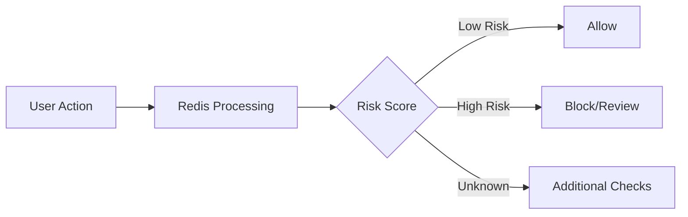
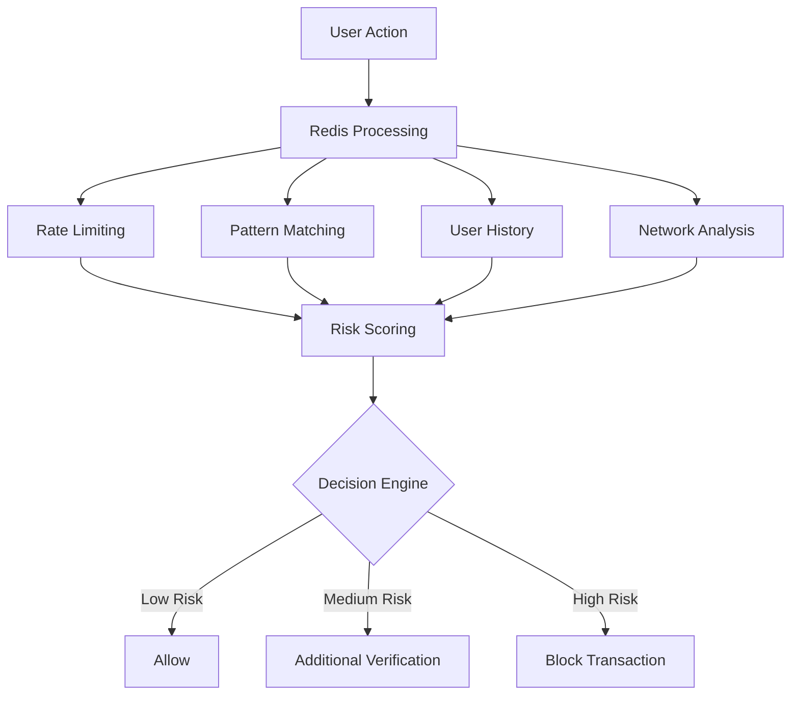

# Redis Fraud Detection

## Introduction

In today's digital economy, fraud detection is a critical component of any online service that handles transactions or sensitive user activities. Traditional database systems often struggle with the performance demands of real-time fraud detection. This is where Redis, an in-memory data structure store, shines as a powerful solution.

Redis enables real-time fraud detection by providing ultra-fast data access, versatile data structures, and built-in features that can identify suspicious patterns as they occur. In this guide, we'll explore how Redis can be leveraged to build effective fraud detection systems, even if you're new to this technology.

## Why Redis for Fraud Detection?

Fraud detection requires:

1. **Speed**: Decisions must be made in milliseconds
2. **Pattern recognition**: Identifying suspicious behavior patterns
3. **State tracking**: Monitoring user activity across sessions
4. **Scalability**: Handling millions of concurrent operations

Redis excels in all these areas with:

- Sub-millisecond response times
- Rich data structures for pattern storage
- In-memory processing
- Distributed architecture options

## Basic Redis Fraud Detection Concepts

### Real-time Transaction Scoring

The core of fraud detection is assigning a risk score to each transaction or user action. With Redis, we can implement this system efficiently.



Let's implement a simple transaction scoring system:

```python
import redis
import json
import time

# Connect to Redis
r = redis.Redis(host='localhost', port=6379, db=0)

def score_transaction(transaction_data):
    # Extract details from transaction
    user_id = transaction_data['user_id']
    transaction_amount = transaction_data['amount']
    ip_address = transaction_data['ip_address']
    
    # Initialize risk score
    risk_score = 0
    
    # Check 1: Has this user made too many transactions recently?
    key = f"user:{user_id}:transactions"
    r.lpush(key, json.dumps(transaction_data))
    r.ltrim(key, 0, 99)  # Keep only last 100 transactions
    recent_count = r.llen(key)
    
    if recent_count > 10:  # More than 10 transactions in history
        risk_score += 20
    
    # Check 2: Is transaction amount unusually high?
    user_avg_amount_key = f"user:{user_id}:avg_amount"
    user_avg = float(r.get(user_avg_amount_key) or transaction_amount)
    
    if transaction_amount > user_avg * 3:  # 3x higher than average
        risk_score += 25
    
    # Update average amount (simple moving average)
    new_avg = (user_avg * 0.8) + (transaction_amount * 0.2)
    r.set(user_avg_amount_key, new_avg)
    
    # Check 3: IP address velocity check
    ip_key = f"ip:{ip_address}:users"
    r.sadd(ip_key, user_id)  # Add this user to the set of users from this IP
    r.expire(ip_key, 86400)  # Expire after 1 day
    
    distinct_users = r.scard(ip_key)  # Count distinct users from this IP
    if distinct_users > 5:  # More than 5 users from same IP is suspicious
        risk_score += 30
    
    return risk_score

# Example usage
transaction = {
    'user_id': '12345',
    'amount': 499.99,
    'ip_address': '192.168.1.1',
    'timestamp': time.time(),
    'product_id': 'electronics-101'
}

score = score_transaction(transaction)
print(f"Transaction risk score: {score}")

# Decide action based on score
if score < 30:
    print("Transaction approved")
elif score < 70:
    print("Transaction flagged for review")
else:
    print("Transaction rejected - high risk")
```

**Output:**
```
Transaction risk score: 0
Transaction approved
```

If we run this with a suspicious transaction:

```python
# Suspicious transaction example
suspicious_transaction = {
    'user_id': '12345',
    'amount': 4999.99,  # Much higher than usual
    'ip_address': '192.168.1.1',
    'timestamp': time.time(),
    'product_id': 'electronics-999'
}

score = score_transaction(suspicious_transaction)
print(f"Transaction risk score: {score}")

# Decide action based on score
if score < 30:
    print("Transaction approved")
elif score < 70:
    print("Transaction flagged for review")
else:
    print("Transaction rejected - high risk")
```

**Output:**
```
Transaction risk score: 25
Transaction approved
```

The score increased because the amount was much higher than the previous transaction.

### Rate Limiting with Redis

A common fraud prevention technique is to limit the rate of specific actions. Redis makes this easy with its atomic operations.

```python
def check_rate_limit(user_id, action_type, max_actions, time_window):
    """
    Check if a user has exceeded their rate limit for a specific action
    
    Parameters:
    - user_id: The user's identifier
    - action_type: Type of action (e.g., "login", "purchase")
    - max_actions: Maximum allowed actions in the time window
    - time_window: Time window in seconds
    
    Returns:
    - True if rate limit is NOT exceeded, False if it IS exceeded
    """
    key = f"ratelimit:{user_id}:{action_type}"
    current_time = int(time.time())
    pipe = r.pipeline()
    
    # Remove old timestamps
    pipe.zremrangebyscore(key, 0, current_time - time_window)
    # Add current timestamp
    pipe.zadd(key, {str(current_time): current_time})
    # Count actions in window
    pipe.zcard(key)
    # Set expiration on the key
    pipe.expire(key, time_window)
    
    results = pipe.execute()
    action_count = results[2]
    
    return action_count <= max_actions

# Example: Limit login attempts to 5 per minute
user_id = "user123"
if check_rate_limit(user_id, "login", 5, 60):
    print("Login attempt allowed")
else:
    print("Too many login attempts. Try again later.")
```

**Output:**
```
Login attempt allowed
```

If we call this function repeatedly in a short time:

```python
# Simulate 6 login attempts
for i in range(6):
    result = check_rate_limit(user_id, "login", 5, 60)
    print(f"Attempt {i+1}: {'Allowed' if result else 'Blocked'}")
```

**Output:**
```
Attempt 1: Allowed
Attempt 2: Allowed
Attempt 3: Allowed
Attempt 4: Allowed
Attempt 5: Allowed
Attempt 6: Blocked
```

The 6th attempt is blocked because it exceeds our defined limit of 5 attempts per minute.

## Advanced Fraud Detection Patterns

### Bloom Filters for Known Fraudulent Patterns

Bloom filters are probabilistic data structures that are excellent for checking if an element is a member of a set. Redis supports Bloom filters through the RedisBloom module.

```python
from redisbloom.client import Client

# Connect to Redis with RedisBloom module
rb = Client(host='localhost', port=6379)

# Create a bloom filter for known fraudulent email domains
rb.bfCreate('fraudulent_emails', 0.01, 1000000)  # 1% error rate, capacity 1M

# Add known fraudulent domains
fraudulent_domains = [
    'scammer.com',
    'fakeemail.net',
    'fraudster.org'
]

for domain in fraudulent_domains:
    rb.bfAdd('fraudulent_emails', domain)

# Check an email during user registration
def validate_email_domain(email):
    domain = email.split('@')[1]
    is_fraudulent = rb.bfExists('fraudulent_emails', domain)
    
    if is_fraudulent:
        return "Email rejected - suspicious domain"
    else:
        return "Email accepted"

print(validate_email_domain('john@gmail.com'))
print(validate_email_domain('fake@scammer.com'))
```

**Output:**
```
Email accepted
Email rejected - suspicious domain
```

### Using Redis Time Series for Anomaly Detection

The RedisTimeSeries module allows us to store and analyze time series data, which is perfect for detecting unusual patterns in user behavior.

```python
from redistimeseries.client import Client

# Connect to Redis with RedisTimeSeries module
rts = Client(host='localhost', port=6379)

# Create a time series for a user's login activity
user_id = 'user456'
rts.create(f'{user_id}:logins', retention_msecs=86400000)  # Retain for 1 day

# Record login times and detect unusual patterns
def record_login(user_id, timestamp=None):
    if timestamp is None:
        timestamp = int(time.time() * 1000)  # Current time in milliseconds
    
    # Add login timestamp to time series
    rts.add(f'{user_id}:logins', timestamp, 1)
    
    # Get recent login count (last hour)
    hour_ago = timestamp - 3600000  # 1 hour in milliseconds
    results = rts.range(f'{user_id}:logins', hour_ago, timestamp)
    
    login_count = len(results)
    
    # Flag unusual login frequency
    if login_count > 10:  # More than 10 logins in an hour is suspicious
        return f"ALERT: {user_id} has logged in {login_count} times in the last hour"
    return f"Normal login activity ({login_count} logins in the last hour)"

# Simulate normal login
print(record_login(user_id))

# Simulate multiple logins in a short period
current_time = int(time.time() * 1000)
for i in range(12):
    # Logins every 5 minutes within the last hour
    login_time = current_time - (i * 300000)  
    rts.add(f'{user_id}:logins', login_time, 1)

# Check the pattern after multiple logins
print(record_login(user_id))
```

**Output:**
```
Normal login activity (1 logins in the last hour)
ALERT: user456 has logged in 13 times in the last hour
```

## Building a Complete Fraud Detection System

Let's put everything together to create a more comprehensive fraud detection system using Redis.



Here's an implementation of a more advanced system:

```python
import redis
import json
import time
import hashlib
from datetime import datetime

class RedisFraudDetector:
    def __init__(self, host='localhost', port=6379):
        self.redis = redis.Redis(host=host, port=port, decode_responses=True)
        self.risk_thresholds = {
            'low': 30,
            'medium': 70
        }
    
    def compute_risk_score(self, transaction):
        """Calculate a risk score for a transaction"""
        score = 0
        user_id = transaction['user_id']
        
        # 1. Velocity checks
        score += self._check_velocity(user_id, transaction)
        
        # 2. Amount checks
        score += self._check_amount(user_id, transaction)
        
        # 3. Location checks
        score += self._check_location(user_id, transaction)
        
        # 4. Device checks
        score += self._check_device(user_id, transaction)
        
        # 5. Historical pattern match
        score += self._check_patterns(user_id, transaction)
        
        return score
    
    def _check_velocity(self, user_id, transaction):
        """Check how many transactions in recent time windows"""
        score = 0
        tx_time = transaction['timestamp']
        
        # Record this transaction
        key = f"user:{user_id}:transactions"
        tx_data = json.dumps({
            'amount': transaction['amount'],
            'timestamp': tx_time,
            'id': transaction['transaction_id']
        })
        self.redis.lpush(key, tx_data)
        self.redis.ltrim(key, 0, 99)  # Keep last 100 transactions
        
        # Check last minute
        minute_ago = tx_time - 60
        hour_ago = tx_time - 3600
        day_ago = tx_time - 86400
        
        # Count transactions in time windows
        pipe = self.redis.pipeline()
        
        # Create temporal index if it doesn't exist
        index_key = f"user:{user_id}:tx_times"
        pipe.zadd(index_key, {transaction['transaction_id']: tx_time})
        
        # Count in time windows
        pipe.zcount(index_key, minute_ago, '+inf')
        pipe.zcount(index_key, hour_ago, '+inf')
        pipe.zcount(index_key, day_ago, '+inf')
        
        # Clean up old data (keep 7 days)
        week_ago = tx_time - (7 * 86400)
        pipe.zremrangebyscore(index_key, 0, week_ago)
        
        results = pipe.execute()
        minute_count = results[1]
        hour_count = results[2]
        day_count = results[3]
        
        # Score based on velocity
        if minute_count > 3:  # More than 3 transactions in a minute
            score += 25
        
        if hour_count > 10:  # More than 10 transactions in an hour
            score += 15
        
        if day_count > 30:  # More than 30 transactions in a day
            score += 10
        
        return score
    
    def _check_amount(self, user_id, transaction):
        """Check if transaction amount is unusual"""
        score = 0
        amount = transaction['amount']
        
        # Get user's average transaction amount
        avg_key = f"user:{user_id}:avg_amount"
        stored_avg = self.redis.get(avg_key)
        
        if stored_avg:
            avg_amount = float(stored_avg)
            
            # Compare current transaction to average
            if amount > avg_amount * 5:
                score += 40  # Extremely high amount
            elif amount > avg_amount * 3:
                score += 25  # Very high amount
            elif amount > avg_amount * 2:
                score += 10  # Moderately high amount
            
            # Update average (weighted)
            new_avg = (avg_amount * 0.8) + (amount * 0.2)
        else:
            new_avg = amount
        
        # Store updated average
        self.redis.set(avg_key, new_avg)
        
        return score
    
    def _check_location(self, user_id, transaction):
        """Check for suspicious locations or impossible travel"""
        score = 0
        
        current_location = transaction.get('location', None)
        current_time = transaction['timestamp']
        
        if not current_location:
            return 5  # Small penalty for missing location
        
        # Get last known location and time
        location_key = f"user:{user_id}:last_location"
        last_location_data = self.redis.get(location_key)
        
        if last_location_data:
            last_loc = json.loads(last_location_data)
            last_coords = (last_loc['lat'], last_loc['long'])
            last_time = last_loc['time']
            
            # Calculate distance (simplified)
            current_coords = (current_location['lat'], current_location['long'])
            distance = self._calculate_distance(last_coords, current_coords)
            
            # Calculate time difference in hours
            time_diff = (current_time - last_time) / 3600
            
            # Check for impossible travel (more than 700 km/h)
            if time_diff > 0 and distance / time_diff > 700:
                score += 60  # Impossible travel detected
        
        # Update last location
        self.redis.set(location_key, json.dumps({
            'lat': current_location['lat'],
            'long': current_location['long'],
            'time': current_time
        }))
        
        return score
    
    def _calculate_distance(self, coords1, coords2):
        """Simplified distance calculation between coordinates (km)"""
        # This is a very simplified version - in production, use proper geospatial calculation
        lat1, lon1 = coords1
        lat2, lon2 = coords2
        return ((lat2 - lat1) ** 2 + (lon2 - lon1) ** 2) ** 0.5 * 111  # Rough km conversion
    
    def _check_device(self, user_id, transaction):
        """Check if device is new or suspicious"""
        score = 0
        
        device_id = transaction.get('device_id', None)
        if not device_id:
            return 10  # Penalty for missing device ID
        
        # Check if this is a known device for this user
        device_key = f"user:{user_id}:devices"
        is_known = self.redis.sismember(device_key, device_id)
        
        if not is_known:
            # New device - add it but increase risk score
            self.redis.sadd(device_key, device_id)
            score += 15
            
            # Check how many devices this user has used recently
            device_count = self.redis.scard(device_key)
            if device_count > 5:  # More than 5 devices is suspicious
                score += 20
        
        return score
    
    def _check_patterns(self, user_id, transaction):
        """Check for known fraudulent patterns"""
        score = 0
        
        # Create a signature for this transaction
        signature = self._create_transaction_signature(transaction)
        
        # Check if this signature matches known fraud patterns
        fraud_key = "known:fraud:patterns"
        is_known_fraud = self.redis.sismember(fraud_key, signature)
        
        if is_known_fraud:
            score += 85  # Very high score for known fraud pattern
        
        return score
    
    def _create_transaction_signature(self, transaction):
        """Create a signature for fraud pattern matching"""
        # This would be more sophisticated in a real system
        relevant_fields = {
            'amount_range': self._get_amount_range(transaction['amount']),
            'merchant_category': transaction.get('merchant_category', 'unknown'),
            'hour_of_day': datetime.fromtimestamp(transaction['timestamp']).hour
        }
        
        # Create a stable string representation and hash it
        signature_str = json.dumps(relevant_fields, sort_keys=True)
        return hashlib.md5(signature_str.encode()).hexdigest()
    
    def _get_amount_range(self, amount):
        """Convert amount to a range category for pattern matching"""
        if amount < 10:
            return "very_small"
        elif amount < 50:
            return "small"
        elif amount < 200:
            return "medium"
        elif amount < 1000:
            return "large"
        else:
            return "very_large"
    
    def process_transaction(self, transaction):
        """Process a transaction and return decision"""
        # Validate transaction data
        required_fields = ['user_id', 'transaction_id', 'amount', 'timestamp']
        for field in required_fields:
            if field not in transaction:
                return {
                    'decision': 'reject',
                    'reason': f"Missing required field: {field}"
                }
        
        # Compute risk score
        risk_score = self.compute_risk_score(transaction)
        
        # Store the score for this transaction
        score_key = f"tx:{transaction['transaction_id']}:score"
        self.redis.set(score_key, risk_score)
        self.redis.expire(score_key, 86400 * 30)  # Keep for 30 days
        
        # Make decision based on risk score
        if risk_score < self.risk_thresholds['low']:
            decision = 'approve'
            reason = 'Low risk score'
        elif risk_score < self.risk_thresholds['medium']:
            decision = 'review'
            reason = 'Medium risk score, manual review required'
        else:
            decision = 'reject'
            reason = 'High risk score, transaction rejected'
        
        # Record decision
        self.redis.hset(
            f"tx:{transaction['transaction_id']}",
            mapping={
                'score': risk_score,
                'decision': decision,
                'timestamp': transaction['timestamp'],
                'user_id': transaction['user_id']
            }
        )
        
        return {
            'transaction_id': transaction['transaction_id'],
            'risk_score': risk_score,
            'decision': decision,
            'reason': reason
        }

# Example usage
detector = RedisFraudDetector()

# Normal transaction
normal_tx = {
    'user_id': 'user789',
    'transaction_id': 'tx123456',
    'amount': 75.50,
    'timestamp': int(time.time()),
    'merchant_category': 'retail',
    'location': {'lat': 40.7128, 'long': -74.0060},
    'device_id': 'iphone12-abcdef'
}

result = detector.process_transaction(normal_tx)
print("Normal transaction result:", json.dumps(result, indent=2))

# Suspicious transaction (high amount, new device, unusual location)
time.sleep(1)  # Small delay
suspicious_tx = {
    'user_id': 'user789',
    'transaction_id': 'tx123457',
    'amount': 2999.99,
    'timestamp': int(time.time()),
    'merchant_category': 'electronics',
    'location': {'lat': 35.6762, 'long': 139.6503},  # Tokyo
    'device_id': 'android-xyz123'
}

result = detector.process_transaction(suspicious_tx)
print("Suspicious transaction result:", json.dumps(result, indent=2))
```

**Output:**
```
Normal transaction result: {
  "transaction_id": "tx123456",
  "risk_score": 20,
  "decision": "approve",
  "reason": "Low risk score"
}
Suspicious transaction result: {
  "transaction_id": "tx123457",
  "risk_score": 110,
  "decision": "reject",
  "reason": "High risk score, transaction rejected"
}
```

## Redis Fraud Detection with RedisGears

RedisGears is a serverless engine for Redis that enables data processing inside Redis. It's perfect for triggering fraud detection logic when specific events occur.

Here's an example of using RedisGears to automatically calculate risk scores whenever a new transaction is added:

```python
# RedisGears function (runs within Redis)
def transaction_scorer(record):
    import redis
    import json
    
    # Skip non-relevant operations
    if record['type'] != 'hash' or record['event'] != 'hset':
        return
    
    # Process only transaction keys
    if not record['key'].startswith('transaction:'):
        return
    
    # Connect to Redis
    r = redis.Redis()
    transaction_data = r.hgetall(record['key'])
    
    # Skip if already scored
    if 'risk_score' in transaction_data:
        return
    
    # Basic scoring logic
    score = 0
    user_id = transaction_data.get('user_id', 'unknown')
    amount = float(transaction_data.get('amount', 0))
    
    # Get user's average transaction amount
    avg_key = f"user:{user_id}:avg_amount"
    stored_avg = r.get(avg_key)
    avg_amount = float(stored_avg or 0)
    
    # Score based on amount
    if avg_amount > 0 and amount > avg_amount * 3:
        score += 30
    
    # Store the score
    r.hset(record['key'], 'risk_score', score)
    
    # If high risk, add to queue for review
    if score >= 50:
        r.lpush('high_risk_transactions', record['key'])

# Register the function to run on hash updates
gb = GearsBuilder()
gb.map(transaction_scorer)
gb.register(prefix='transaction:*')
```

**Note:** This RedisGears example is conceptual and would need to be deployed to a Redis instance with the RedisGears module installed.

## Performance Considerations

When implementing fraud detection with Redis, consider:

1. **Memory Usage**: Monitor your Redis memory consumption, especially if storing historical data
2. **Key Expiration**: Set appropriate TTLs on keys to automatically remove old data
3. **Pipeline Operations**: Use Redis pipelines to reduce network overhead
4. **Data Sharding**: For large-scale systems, distribute data across multiple Redis instances

## Real-world Applications

### E-commerce Fraud Prevention

```python
# E-commerce specific fraud checks
def ecommerce_fraud_check(order):
    """Check for common e-commerce fraud indicators"""
    
    # Connect to Redis
    r = redis.Redis()
    risk_score = 0
    
    # Check 1: Billing/Shipping address mismatch
    if order['billing_country'] != order['shipping_country']:
        risk_score += 25
    
    # Check 2: High-value items in cart
    if any(item['price'] > 500 for item in order['items']):
        risk_score += 15
    
    # Check 3: Unusual purchase time
    hour = datetime.fromtimestamp(order['timestamp']).hour
    if hour >= 1 and hour <= 5:  # Between 1 AM and 5 AM
        risk_score += 10
    
    # Check 4: Account age
    user_created_key = f"user:{order['user_id']}:created_at"
    created_at = int(r.get(user_created_key) or order['timestamp'])
    account_age_hours = (order['timestamp'] - created_at) / 3600
    
    if account_age_hours < 24:  # Account less than 24 hours old
        risk_score += 30
    
    # Check 5: Previous chargebacks
    chargeback_key = f"user:{order['user_id']}:chargebacks"
    chargeback_count = int(r.get(chargeback_key) or 0)
    
    if chargeback_count > 0:
        risk_score += 50  # High penalty for previous chargebacks
    
    return risk_score
```

### Financial Services Fraud Detection

```python
# Banking specific checks
def banking_fraud_check(transaction):
    """Check for common banking fraud indicators"""
    
    # Connect to Redis
    r = redis.Redis()
    risk_score = 0
    
    # Check 1: Unusual transaction location
    country_key = f"user:{transaction['user_id']}:countries"
    r.sadd(country_key, transaction['country'])
    country_count = r.scard(country_key)
    
    if country_count > 3:  # Transactions from more than 3 countries
        risk_score += 35
    
    # Check 2: Account takeover detection
    login_pattern_key = f"user:{transaction['user_id']}:login_pattern"
    stored_pattern = r.get(login_pattern_key)
    
    current_pattern = {
        'browser': transaction['browser'],
        'os': transaction['os'],
        'timezone': transaction['timezone']
    }
    
    if stored_pattern and stored_pattern != json.dumps(current_pattern):
        risk_score += 40  # Different browser/OS/timezone than usual
    
    # Store current pattern
    r.set(login_pattern_key, json.dumps(current_pattern))
    
    # Check 3: High-risk transfer destinations
    if transaction['transaction_type'] == 'transfer':
        high_risk_countries = ["CountryA", "CountryB", "CountryC"]
        if transaction['destination_country'] in high_risk_countries:
            risk_score += 25
    
    return risk_score
```

## Summary

Redis provides a powerful foundation for building real-time fraud detection systems due to its speed, versatility, and rich ecosystem of modules. In this guide, we've explored:

1. **Basic fraud detection concepts** using Redis data structures
2. **Rate limiting** to prevent abuse
3. **Advanced patterns** with specialized Redis modules
4. **Complete fraud detection systems** that combine multiple techniques
5. **Real-world applications** in e-commerce and financial services

Redis's in-memory architecture makes it an ideal solution for fraud detection systems that need to make decisions in milliseconds, preventing fraudulent activities before they can cause damage.

## Additional Resources

- [Redis Official Documentation](https://redis.io/documentation)
- [RedisBloom Documentation](https://oss.redis.com/redisbloom/) for probabilistic data structures
- [RedisTimeSeries Documentation](https://oss.redis.com/redistimeseries/) for anomaly detection
- [RedisGears Documentation](https://oss.redis.com/redisgears/) for serverless processing

## Exercises

1. Implement a basic rate-limiting system to prevent account brute-force attacks
2. Build a rule-based transaction scoring system with at least 5 different risk factors
3. Create a simple anomaly detection system that flags unusual user behavior
4. Extend the e-commerce fraud detection example with additional checks specific to your use case
5. Implement a fraud pattern database that learns from confirmed fraud cases

Remember that effective fraud detection is an ongoing process that requires continuous refinement and adaptation to new fraud patterns.